# 📦 MÓDULO DE EQUIPAMIENTO BOUKII V5 - DOCUMENTACIÓN COMPLETA

## 📋 Índice
1. [Visión General del Módulo](#visión-general-del-módulo)
2. [Arquitectura de Base de Datos](#arquitectura-de-base-de-datos)
3. [Flujos de Negocio](#flujos-de-negocio)
4. [API Endpoints](#api-endpoints)
5. [Frontend Components](#frontend-components)
6. [Integración con Reservas](#integración-con-reservas)
7. [Sistema de Penalizaciones](#sistema-de-penalizaciones)
8. [Testing](#testing)
9. [Plan de Implementación](#plan-de-implementación)

---

## Visión General del Módulo

### Objetivo
El módulo de equipamiento permite a las escuelas deportivas gestionar el inventario de material deportivo y su alquiler tanto de forma independiente como integrado con las reservas de cursos.

### Características Principales
- **Gestión de Inventario**: Control completo del equipamiento disponible
- **Alquiler Independiente**: Clientes pueden alquilar equipos sin reservar cursos
- **Integración con Cursos**: Equipamiento incluido en reservas de clases
- **Control de Stock**: Verificación automática de disponibilidad
- **Check-in/Check-out**: Gestión de entrega y devolución
- **Sistema de Penalizaciones**: Gestión de daños y pérdidas
- **Multi-tenancy**: Aislamiento por escuela y temporada

### Módulos Involucrados
```
Equipment Management System
 ├── Inventory (Inventario)
 ├── Categories (Categorías)
 ├── Rentals (Alquileres)
 ├── Check-in/Check-out (Control)
 ├── Pricing (Precios)
 └── Penalties (Penalizaciones)
```

---

## Arquitectura de Base de Datos

### Tablas Principales

#### v5_equipment_categories
```sql
CREATE TABLE v5_equipment_categories (
    id BIGINT PRIMARY KEY AUTO_INCREMENT,
    school_id BIGINT NOT NULL,
    name VARCHAR(100) NOT NULL,
    slug VARCHAR(100) NOT NULL,
    description TEXT,
    icon VARCHAR(50),
    color VARCHAR(7), -- Hex color code
    sort_order INT DEFAULT 0,
    is_active BOOLEAN DEFAULT TRUE,
    
    created_at TIMESTAMP DEFAULT CURRENT_TIMESTAMP,
    updated_at TIMESTAMP DEFAULT CURRENT_TIMESTAMP ON UPDATE CURRENT_TIMESTAMP,
    
    UNIQUE KEY unique_school_slug (school_id, slug),
    FOREIGN KEY (school_id) REFERENCES schools(id) ON DELETE CASCADE,
    INDEX idx_school_active (school_id, is_active)
);

-- Categorías por defecto
INSERT INTO v5_equipment_categories (school_id, name, slug, icon) VALUES
(?, 'Raquetas', 'raquetas', 'tennis-racket'),
(?, 'Pelotas', 'pelotas', 'ball'),
(?, 'Calzado', 'calzado', 'shoe'),
(?, 'Protecciones', 'protecciones', 'shield'),
(?, 'Accesorios', 'accesorios', 'accessory');
```

#### v5_equipment_items
```sql
CREATE TABLE v5_equipment_items (
    id BIGINT PRIMARY KEY AUTO_INCREMENT,
    school_id BIGINT NOT NULL,
    season_id BIGINT NOT NULL,
    category_id BIGINT NOT NULL,
    
    -- Información básica
    item_code VARCHAR(50) UNIQUE NOT NULL,
    name VARCHAR(200) NOT NULL,
    description TEXT,
    brand VARCHAR(100),
    model VARCHAR(100),
    size VARCHAR(50),
    color VARCHAR(50),
    
    -- Inventario
    total_quantity INT NOT NULL DEFAULT 0,
    available_quantity INT NOT NULL DEFAULT 0,
    reserved_quantity INT NOT NULL DEFAULT 0,
    damaged_quantity INT NOT NULL DEFAULT 0,
    lost_quantity INT NOT NULL DEFAULT 0,
    
    -- Precios
    daily_rate DECIMAL(8,2) NOT NULL DEFAULT 0.00,
    weekly_rate DECIMAL(8,2) NULL,
    deposit_amount DECIMAL(8,2) NOT NULL DEFAULT 0.00,
    replacement_cost DECIMAL(10,2) NOT NULL DEFAULT 0.00,
    
    -- Configuración
    min_rental_days INT DEFAULT 1,
    max_rental_days INT DEFAULT 30,
    requires_deposit BOOLEAN DEFAULT TRUE,
    is_public BOOLEAN DEFAULT TRUE, -- Disponible para reservas públicas
    is_active BOOLEAN DEFAULT TRUE,
    
    -- Metadatos
    purchase_date DATE,
    purchase_price DECIMAL(10,2),
    supplier VARCHAR(200),
    warranty_until DATE,
    
    -- Imágenes y archivos
    image_url VARCHAR(500),
    images_json JSON, -- Array de URLs de imágenes
    manual_url VARCHAR(500),
    
    created_at TIMESTAMP DEFAULT CURRENT_TIMESTAMP,
    updated_at TIMESTAMP DEFAULT CURRENT_TIMESTAMP ON UPDATE CURRENT_TIMESTAMP,
    
    FOREIGN KEY (school_id) REFERENCES schools(id) ON DELETE CASCADE,
    FOREIGN KEY (season_id) REFERENCES seasons(id) ON DELETE CASCADE,
    FOREIGN KEY (category_id) REFERENCES v5_equipment_categories(id) ON DELETE RESTRICT,
    
    INDEX idx_school_season (school_id, season_id),
    INDEX idx_category (category_id),
    INDEX idx_availability (available_quantity, is_active),
    INDEX idx_item_code (item_code),
    
    CONSTRAINT chk_quantities CHECK (
        total_quantity >= (available_quantity + reserved_quantity + damaged_quantity + lost_quantity)
    )
);
```

#### v5_equipment_rentals
```sql
CREATE TABLE v5_equipment_rentals (
    id BIGINT PRIMARY KEY AUTO_INCREMENT,
    rental_code VARCHAR(50) UNIQUE NOT NULL,
    
    -- Contexto
    school_id BIGINT NOT NULL,
    season_id BIGINT NOT NULL,
    client_id BIGINT NOT NULL,
    booking_id BIGINT NULL, -- NULL para alquileres independientes
    
    -- Fechas y duración
    rental_start_date DATE NOT NULL,
    rental_end_date DATE NOT NULL,
    actual_return_date DATE NULL,
    rental_days INT NOT NULL,
    
    -- Precios
    subtotal DECIMAL(10,2) NOT NULL,
    deposit_total DECIMAL(10,2) NOT NULL DEFAULT 0.00,
    penalty_amount DECIMAL(10,2) NOT NULL DEFAULT 0.00,
    refund_amount DECIMAL(10,2) NOT NULL DEFAULT 0.00,
    total_amount DECIMAL(10,2) NOT NULL,
    currency VARCHAR(3) DEFAULT 'EUR',
    
    -- Estado
    status ENUM('pending', 'confirmed', 'active', 'returned', 'overdue', 'completed', 'cancelled') DEFAULT 'pending',
    
    -- Personal involucrado
    checked_out_by BIGINT NULL, -- Usuario que entregó
    checked_in_by BIGINT NULL,  -- Usuario que recibió
    
    -- Notas
    rental_notes TEXT,
    checkout_notes TEXT,
    checkin_notes TEXT,
    admin_notes TEXT,
    
    -- Ubicación
    pickup_location VARCHAR(200),
    return_location VARCHAR(200),
    
    created_at TIMESTAMP DEFAULT CURRENT_TIMESTAMP,
    updated_at TIMESTAMP DEFAULT CURRENT_TIMESTAMP ON UPDATE CURRENT_TIMESTAMP,
    
    FOREIGN KEY (school_id) REFERENCES schools(id) ON DELETE CASCADE,
    FOREIGN KEY (season_id) REFERENCES seasons(id) ON DELETE CASCADE,
    FOREIGN KEY (client_id) REFERENCES clients(id) ON DELETE CASCADE,
    FOREIGN KEY (booking_id) REFERENCES bookings(id) ON DELETE SET NULL,
    FOREIGN KEY (checked_out_by) REFERENCES users(id) ON DELETE SET NULL,
    FOREIGN KEY (checked_in_by) REFERENCES users(id) ON DELETE SET NULL,
    
    INDEX idx_school_season (school_id, season_id),
    INDEX idx_client (client_id),
    INDEX idx_booking (booking_id),
    INDEX idx_dates (rental_start_date, rental_end_date),
    INDEX idx_status (status),
    INDEX idx_overdue (status, rental_end_date)
);
```

#### v5_equipment_rental_items
```sql
CREATE TABLE v5_equipment_rental_items (
    id BIGINT PRIMARY KEY AUTO_INCREMENT,
    rental_id BIGINT NOT NULL,
    equipment_item_id BIGINT NOT NULL,
    
    -- Cantidad y identificación
    quantity INT NOT NULL DEFAULT 1,
    serial_numbers JSON, -- Array de números de serie específicos
    
    -- Precios individuales
    daily_rate DECIMAL(8,2) NOT NULL,
    total_rental_amount DECIMAL(10,2) NOT NULL,
    deposit_amount DECIMAL(8,2) NOT NULL DEFAULT 0.00,
    
    -- Estado del equipo
    condition_at_checkout ENUM('excellent', 'good', 'fair', 'poor') DEFAULT 'good',
    condition_at_checkin ENUM('excellent', 'good', 'fair', 'poor') NULL,
    
    -- Control de daños
    damage_reported BOOLEAN DEFAULT FALSE,
    damage_description TEXT,
    damage_cost DECIMAL(8,2) DEFAULT 0.00,
    
    -- Timestamps de control
    checked_out_at TIMESTAMP NULL,
    checked_in_at TIMESTAMP NULL,
    
    created_at TIMESTAMP DEFAULT CURRENT_TIMESTAMP,
    updated_at TIMESTAMP DEFAULT CURRENT_TIMESTAMP ON UPDATE CURRENT_TIMESTAMP,
    
    FOREIGN KEY (rental_id) REFERENCES v5_equipment_rentals(id) ON DELETE CASCADE,
    FOREIGN KEY (equipment_item_id) REFERENCES v5_equipment_items(id) ON DELETE CASCADE,
    
    INDEX idx_rental (rental_id),
    INDEX idx_equipment (equipment_item_id),
    INDEX idx_checkout_status (checked_out_at, checked_in_at)
);
```

#### v5_equipment_penalties
```sql
CREATE TABLE v5_equipment_penalties (
    id BIGINT PRIMARY KEY AUTO_INCREMENT,
    
    -- Contexto
    school_id BIGINT NOT NULL,
    season_id BIGINT NOT NULL,
    client_id BIGINT NOT NULL,
    rental_id BIGINT NOT NULL,
    rental_item_id BIGINT NOT NULL,
    
    -- Tipo de penalización
    penalty_type ENUM('damage', 'loss', 'late_return', 'cleaning', 'other') NOT NULL,
    severity ENUM('minor', 'moderate', 'major', 'total_loss') NOT NULL,
    
    -- Detalles
    description TEXT NOT NULL,
    penalty_amount DECIMAL(10,2) NOT NULL,
    currency VARCHAR(3) DEFAULT 'EUR',
    
    -- Estado
    status ENUM('pending', 'disputed', 'waived', 'paid', 'written_off') DEFAULT 'pending',
    
    -- Evidencia
    photos_json JSON, -- Array de URLs de fotos
    evidence_notes TEXT,
    
    -- Gestión
    created_by BIGINT NOT NULL,
    approved_by BIGINT NULL,
    waived_by BIGINT NULL,
    waiver_reason TEXT,
    
    -- Fechas importantes
    incident_date DATE NOT NULL,
    due_date DATE NOT NULL,
    paid_date DATE NULL,
    
    created_at TIMESTAMP DEFAULT CURRENT_TIMESTAMP,
    updated_at TIMESTAMP DEFAULT CURRENT_TIMESTAMP ON UPDATE CURRENT_TIMESTAMP,
    
    FOREIGN KEY (school_id) REFERENCES schools(id) ON DELETE CASCADE,
    FOREIGN KEY (season_id) REFERENCES seasons(id) ON DELETE CASCADE,
    FOREIGN KEY (client_id) REFERENCES clients(id) ON DELETE CASCADE,
    FOREIGN KEY (rental_id) REFERENCES v5_equipment_rentals(id) ON DELETE CASCADE,
    FOREIGN KEY (rental_item_id) REFERENCES v5_equipment_rental_items(id) ON DELETE CASCADE,
    FOREIGN KEY (created_by) REFERENCES users(id) ON DELETE RESTRICT,
    
    INDEX idx_client_status (client_id, status),
    INDEX idx_rental (rental_id),
    INDEX idx_penalty_type (penalty_type, severity),
    INDEX idx_due_date (due_date, status)
);
```

---

## Flujos de Negocio

### 1. Flujo de Alquiler Independiente

```mermaid
sequenceDiagram
    participant C as Cliente
    participant F as Frontend
    participant A as API
    participant I as Inventory
    participant P as Payment
    participant N as Notifications

    Note over C,N: ALQUILER INDEPENDIENTE
    C->>F: Busca equipamiento disponible
    F->>A: GET /api/v5/equipment/availability
    A->>I: Verificar stock disponible
    I-->>A: Lista equipos disponibles
    A-->>F: Equipos con precios y disponibilidad
    F->>C: Muestra catálogo

    C->>F: Selecciona equipos y fechas
    F->>A: POST /api/v5/equipment/check-availability
    A->>I: Verificar disponibilidad específica
    I-->>A: Confirmación disponibilidad
    A-->>F: Disponibilidad confirmada

    C->>F: Confirma alquiler
    F->>A: POST /api/v5/equipment/rentals
    A->>A: Crear rental en estado 'pending'
    A->>I: Reservar equipos
    A->>P: Generar enlace de pago
    A-->>F: Rental creado + payment_link
    F->>C: Mostrar resumen y pago

    C->>P: Realiza pago
    P->>A: Webhook payment confirmed
    A->>A: Actualizar rental a 'confirmed'
    A->>N: Enviar email confirmación
    N->>C: Email con detalles pickup
```



### 2. Flujo de Check-out (Entrega)

```mermaid
sequenceDiagram
    participant M as Monitor/Staff
    participant App as Mobile App
    participant A as API
    participant I as Inventory

    Note over M,I: CHECK-OUT PROCESS
    M->>App: Escanea código rental
    App->>A: GET /api/v5/equipment/rentals/{code}
    A-->>App: Detalles del rental

    M->>App: Verifica identidad cliente
    App->>App: Mostrar datos cliente y equipos
    M->>App: Inspecciona equipos
    App->>A: POST /api/v5/equipment/checkout
    Note right of A: Datos: condition, serial_numbers, photos

    A->>I: Actualizar quantities (available--, reserved--)
    A->>A: Crear rental_items records
    A->>A: Actualizar rental status = 'active'
    A-->>App: Checkout completado

    App->>M: Mostrar confirmación + receipt
    A->>N: Enviar SMS/Email al cliente
```



### 3. Flujo de Check-in (Devolución)


### 4. Integración con Reservas de Cursos

```mermaid
sequenceDiagram
    participant C as Cliente
    participant F as Frontend
    participant B as Booking API
    participant E as Equipment API
    participant I as Inventory

    Note over C,I: BOOKING CON EQUIPAMIENTO
    C->>F: Reserva curso + solicita equipos
    F->>B: POST /api/v5/bookings (con equipment_request)
    B->>E: Verificar disponibilidad equipos
    E->>I: Check availability para fechas
    I-->>E: Disponibilidad confirmada
    E-->>B: Equipos disponibles
    
    B->>B: Crear booking principal
    B->>E: Crear rental vinculado al booking
    E->>I: Reservar equipos
    B-->>F: Booking creado con equipment incluido
    
    Note over C,I: DÍA DE LA CLASE
    C->>F: Llega para la clase
    F->>E: Auto-checkout por proximity/QR
    E->>I: Marcar equipos como entregados
    
    Note over C,I: FINAL DE LA CLASE
    F->>E: Auto-checkin al finalizar clase
    E->>I: Marcar equipos como devueltos
    E->>E: Verificar condición (manual si necesario)
```



---

## API Endpoints

### Inventario y Gestión

#### GET /api/v5/equipment/inventory
```http
GET /api/v5/equipment/inventory?category_id=1&search=raqueta&per_page=20
Authorization: Bearer {token}

Response:
{
  "success": true,
  "data": {
    "items": [
      {
        "id": 12,
        "item_code": "RAQ-TEN-001",
        "name": "Raqueta Tenis Wilson Pro Staff",
        "category": {
          "id": 1,
          "name": "Raquetas",
          "slug": "raquetas"
        },
        "brand": "Wilson",
        "model": "Pro Staff 97",
        "size": "Grip 3",
        "total_quantity": 10,
        "available_quantity": 7,
        "reserved_quantity": 2,
        "damaged_quantity": 1,
        "daily_rate": 8.50,
        "deposit_amount": 25.00,
        "replacement_cost": 120.00,
        "image_url": "https://cdn.boukii.com/equipment/raq-ten-001.jpg",
        "is_active": true,
        "condition_distribution": {
          "excellent": 3,
          "good": 4,
          "fair": 2,
          "poor": 1
        }
      }
    ],
    "pagination": {
      "current_page": 1,
      "total_pages": 3,
      "per_page": 20,
      "total_items": 45
    },
    "filters": {
      "categories": [
        {"id": 1, "name": "Raquetas", "count": 15},
        {"id": 2, "name": "Pelotas", "count": 8}
      ],
      "brands": ["Wilson", "Head", "Babolat"],
      "availability": {
        "in_stock": 32,
        "low_stock": 8,
        "out_of_stock": 5
      }
    }
  }
}
```

#### POST /api/v5/equipment/inventory
```http
POST /api/v5/equipment/inventory
Authorization: Bearer {token}
Content-Type: application/json

{
  "category_id": 1,
  "name": "Raqueta Tenis Head Speed",
  "description": "Raqueta profesional para jugadores avanzados",
  "brand": "Head",
  "model": "Speed Pro",
  "size": "Grip 2",
  "color": "Negro/Naranja",
  "total_quantity": 5,
  "daily_rate": 10.00,
  "weekly_rate": 60.00,
  "deposit_amount": 30.00,
  "replacement_cost": 150.00,
  "min_rental_days": 1,
  "max_rental_days": 14,
  "requires_deposit": true,
  "is_public": true,
  "purchase_date": "2025-01-10",
  "purchase_price": 130.00,
  "supplier": "Head Sports Distribution",
  "warranty_until": "2027-01-10"
}

Response:
{
  "success": true,
  "data": {
    "item": {
      "id": 25,
      "item_code": "RAQ-TEN-025", // Generado automáticamente
      "name": "Raqueta Tenis Head Speed",
      // ... resto de campos
      "created_at": "2025-01-15T10:30:00Z"
    }
  },
  "message": "Equipo agregado al inventario exitosamente"
}
```

### Verificación de Disponibilidad

#### POST /api/v5/equipment/check-availability
```http
POST /api/v5/equipment/check-availability
Authorization: Bearer {token}
Content-Type: application/json

{
  "items": [
    {
      "equipment_item_id": 12,
      "quantity": 2,
      "start_date": "2025-01-20",
      "end_date": "2025-01-22"
    },
    {
      "equipment_item_id": 15,
      "quantity": 1,
      "start_date": "2025-01-20",
      "end_date": "2025-01-22"
    }
  ]
}

Response:
{
  "success": true,
  "data": {
    "availability_check": {
      "overall_available": true,
      "rental_period": {
        "start_date": "2025-01-20",
        "end_date": "2025-01-22",
        "rental_days": 3
      },
      "items": [
        {
          "equipment_item_id": 12,
          "requested_quantity": 2,
          "available_quantity": 7,
          "is_available": true,
          "daily_rate": 8.50,
          "total_rental_cost": 51.00, // 2 items × 3 days × 8.50
          "deposit_required": 50.00   // 2 items × 25.00
        },
        {
          "equipment_item_id": 15,
          "requested_quantity": 1,
          "available_quantity": 0,
          "is_available": false,
          "reason": "OUT_OF_STOCK",
          "next_available_date": "2025-01-25",
          "alternatives": [
            {
              "equipment_item_id": 16,
              "name": "Raqueta Tenis Similar",
              "daily_rate": 9.00,
              "available_quantity": 3
            }
          ]
        }
      ],
      "pricing_summary": {
        "subtotal": 51.00,
        "deposit_total": 50.00,
        "total_amount": 101.00,
        "currency": "EUR"
      }
    }
  }
}
```

### Alquileres

#### POST /api/v5/equipment/rentals
```http
POST /api/v5/equipment/rentals
Authorization: Bearer {token}
Content-Type: application/json

{
  "client_id": 45,
  "rental_start_date": "2025-01-20",
  "rental_end_date": "2025-01-22",
  "items": [
    {
      "equipment_item_id": 12,
      "quantity": 2
    }
  ],
  "pickup_location": "Recepción principal",
  "rental_notes": "Cliente principiante, explicar uso básico",
  "payment_method": "online"
}

Response:
{
  "success": true,
  "data": {
    "rental": {
      "id": 789,
      "rental_code": "RNT-2025-001234",
      "status": "pending",
      "client": {
        "id": 45,
        "name": "Juan Pérez",
        "email": "juan@email.com",
        "phone": "+34 600 111 222"
      },
      "rental_period": {
        "start_date": "2025-01-20",
        "end_date": "2025-01-22",
        "rental_days": 3
      },
      "items": [
        {
          "equipment_item_id": 12,
          "name": "Raqueta Tenis Wilson Pro Staff",
          "quantity": 2,
          "daily_rate": 8.50,
          "total_amount": 51.00
        }
      ],
      "pricing": {
        "subtotal": 51.00,
        "deposit_total": 50.00,
        "total_amount": 101.00,
        "currency": "EUR"
      },
      "payment": {
        "payment_url": "https://pay.boukii.com/rental/789",
        "expires_at": "2025-01-15T11:30:00Z"
      },
      "pickup_info": {
        "location": "Recepción principal",
        "instructions": "Presentar DNI y confirmación de pago",
        "contact": "+34 600 123 456"
      }
    }
  },
  "message": "Alquiler creado. Complete el pago para confirmar."
}
```

#### GET /api/v5/equipment/rentals/{id}
```http
GET /api/v5/equipment/rentals/789
Authorization: Bearer {token}

Response:
{
  "success": true,
  "data": {
    "rental": {
      "id": 789,
      "rental_code": "RNT-2025-001234",
      "status": "active",
      "client": {
        "id": 45,
        "name": "Juan Pérez",
        "email": "juan@email.com",
        "phone": "+34 600 111 222"
      },
      "rental_period": {
        "start_date": "2025-01-20",
        "end_date": "2025-01-22",
        "rental_days": 3,
        "days_remaining": 1
      },
      "checkout_info": {
        "checked_out_at": "2025-01-20T09:15:00Z",
        "checked_out_by": {
          "id": 15,
          "name": "Carlos García"
        },
        "checkout_notes": "Equipos entregados en perfecto estado"
      },
      "items": [
        {
          "id": 123,
          "equipment_item": {
            "id": 12,
            "name": "Raqueta Tenis Wilson Pro Staff",
            "item_code": "RAQ-TEN-001"
          },
          "quantity": 2,
          "serial_numbers": ["WIL001", "WIL002"],
          "condition_at_checkout": "good",
          "daily_rate": 8.50,
          "total_amount": 51.00,
          "deposit_amount": 50.00,
          "checked_out_at": "2025-01-20T09:15:00Z",
          "expected_return": "2025-01-22T20:00:00Z"
        }
      ],
      "penalties": [],
      "totals": {
        "subtotal": 51.00,
        "penalties": 0.00,
        "deposit_held": 50.00,
        "refund_due": 0.00
      }
    }
  }
}
```

### Check-out y Check-in

#### POST /api/v5/equipment/rentals/{id}/checkout
```http
POST /api/v5/equipment/rentals/789/checkout
Authorization: Bearer {token}
Content-Type: application/json

{
  "items": [
    {
      "rental_item_id": 123,
      "serial_numbers": ["WIL001", "WIL002"],
      "condition": "good",
      "inspection_notes": "Ambas raquetas en excelente estado",
      "photos": ["https://cdn.boukii.com/inspections/789-checkout-1.jpg"]
    }
  ],
  "client_identity_verified": true,
  "checkout_location": "Recepción principal",
  "checkout_notes": "Cliente informado sobre cuidado y devolución"
}

Response:
{
  "success": true,
  "data": {
    "checkout": {
      "rental_id": 789,
      "checkout_completed_at": "2025-01-20T09:15:00Z",
      "checked_out_by": {
        "id": 15,
        "name": "Carlos García"
      },
      "items_checked_out": 2,
      "expected_return_date": "2025-01-22T20:00:00Z",
      "client_contact": "+34 600 111 222",
      "receipt_number": "CHK-2025-001234"
    }
  },
  "message": "Check-out completado exitosamente"
}
```

#### POST /api/v5/equipment/rentals/{id}/checkin
```http
POST /api/v5/equipment/rentals/789/checkin
Authorization: Bearer {token}
Content-Type: application/json

{
  "items": [
    {
      "rental_item_id": 123,
      "serial_numbers_returned": ["WIL001", "WIL002"],
      "condition": "good",
      "damage_reported": false,
      "cleaning_required": false,
      "inspection_notes": "Devueltas en buen estado",
      "photos": ["https://cdn.boukii.com/inspections/789-checkin-1.jpg"]
    }
  ],
  "return_location": "Recepción principal",
  "checkin_notes": "Devolución sin incidencias",
  "early_return": false
}

Response:
{
  "success": true,
  "data": {
    "checkin": {
      "rental_id": 789,
      "checkin_completed_at": "2025-01-22T18:30:00Z",
      "checked_in_by": {
        "id": 18,
        "name": "María López"
      },
      "items_returned": 2,
      "all_items_returned": true,
      "rental_status": "completed",
      "deposit_refund": {
        "amount": 50.00,
        "currency": "EUR",
        "refund_method": "original_payment_method",
        "processing_time": "2-3 business days"
      },
      "penalties": [],
      "receipt_number": "CHI-2025-001234"
    }
  },
  "message": "Check-in completado. Depósito será reembolsado."
}
```

---

## Frontend Components

### EquipmentInventoryComponent
```typescript
// src/app/v5/modules/equipment/components/inventory/equipment-inventory.component.ts
@Component({
  selector: 'v5-equipment-inventory',
  template: `
    <div class="equipment-inventory">
      <!-- Header con filtros y acciones -->
      <div class="inventory-header">
        <div class="search-filters">
          <mat-form-field>
            <mat-label>Buscar equipos</mat-label>
            <input matInput [(ngModel)]="searchTerm" (ngModelChange)="onSearch()">
            <mat-icon matSuffix>search</mat-icon>
          </mat-form-field>
          
          <mat-form-field>
            <mat-label>Categoría</mat-label>
            <mat-select [(value)]="selectedCategory" (selectionChange)="onFilterChange()">
              <mat-option value="">Todas</mat-option>
              <mat-option *ngFor="let category of categories" [value]="category.id">
                {{category.name}}
              </mat-option>
            </mat-select>
          </mat-form-field>
          
          <mat-form-field>
            <mat-label>Estado</mat-label>
            <mat-select [(value)]="statusFilter" (selectionChange)="onFilterChange()">
              <mat-option value="all">Todos</mat-option>
              <mat-option value="available">Disponible</mat-option>
              <mat-option value="low_stock">Stock bajo</mat-option>
              <mat-option value="out_of_stock">Sin stock</mat-option>
            </mat-select>
          </mat-form-field>
        </div>
        
        <div class="actions">
          <button mat-raised-button color="primary" (click)="openAddItemDialog()">
            <mat-icon>add</mat-icon>
            Agregar Equipo
          </button>
          
          <button mat-stroked-button (click)="exportInventory()">
            <mat-icon>download</mat-icon>
            Exportar
          </button>
        </div>
      </div>
      
      <!-- Tabla de inventario -->
      <div class="inventory-table-container">
        <table mat-table [dataSource]="dataSource" class="inventory-table" matSort>
          <!-- Imagen y código -->
          <ng-container matColumnDef="item">
            <th mat-header-cell *matHeaderCellDef>Equipo</th>
            <td mat-cell *matCellDef="let item">
              <div class="item-cell">
                
                <div class="item-info">
                  <div class="item-name">{{item.name}}</div>
                  <div class="item-code">{{item.item_code}}</div>
                  <div class="item-brand">{{item.brand}} {{item.model}}</div>
                </div>
              </div>
            </td>
          </ng-container>
          
          <!-- Categoría -->
          <ng-container matColumnDef="category">
            <th mat-header-cell *matHeaderCellDef>Categoría</th>
            <td mat-cell *matCellDef="let item">
              <mat-chip [style.background-color]="item.category.color">
                <mat-icon>{{item.category.icon}}</mat-icon>
                {{item.category.name}}
              </mat-chip>
            </td>
          </ng-container>
          
          <!-- Stock -->
          <ng-container matColumnDef="stock">
            <th mat-header-cell *matHeaderCellDef mat-sort-header="available_quantity">Stock</th>
            <td mat-cell *matCellDef="let item">
              <div class="stock-info">
                <div class="stock-main">
                  <span class="available">{{item.available_quantity}}</span>
                  <span class="total">/{{item.total_quantity}}</span>
                </div>
                <div class="stock-breakdown">
                  <span *ngIf="item.reserved_quantity > 0" class="reserved">
                    {{item.reserved_quantity}} reservado
                  </span>
                  <span *ngIf="item.damaged_quantity > 0" class="damaged">
                    {{item.damaged_quantity}} dañado
                  </span>
                </div>
                <mat-progress-bar 
                  [value]="getStockPercentage(item)"
                  [color]="getStockColor(item)">
                </mat-progress-bar>
              </div>
            </td>
          </ng-container>
          
          <!-- Precios -->
          <ng-container matColumnDef="pricing">
            <th mat-header-cell *matHeaderCellDef>Precios</th>
            <td mat-cell *matCellDef="let item">
              <div class="pricing-info">
                <div class="daily-rate">{{item.daily_rate | currency:'EUR':'symbol':'1.2-2'}}/día</div>
                <div class="deposit" *ngIf="item.requires_deposit">
                  Depósito: {{item.deposit_amount | currency:'EUR':'symbol':'1.2-2'}}
                </div>
              </div>
            </td>
          </ng-container>
          
          <!-- Estado -->
          <ng-container matColumnDef="status">
            <th mat-header-cell *matHeaderCellDef>Estado</th>
            <td mat-cell *matCellDef="let item">
              <mat-chip [class]="getStatusClass(item)">
                {{getStatusText(item)}}
              </mat-chip>
            </td>
          </ng-container>
          
          <!-- Acciones -->
          <ng-container matColumnDef="actions">
            <th mat-header-cell *matHeaderCellDef>Acciones</th>
            <td mat-cell *matCellDef="let item">
              <button mat-icon-button [matMenuTriggerFor]="itemMenu">
                <mat-icon>more_vert</mat-icon>
              </button>
              
              <mat-menu #itemMenu="matMenu">
                <button mat-menu-item (click)="viewItemDetails(item)">
                  <mat-icon>visibility</mat-icon>
                  Ver detalles
                </button>
                <button mat-menu-item (click)="editItem(item)">
                  <mat-icon>edit</mat-icon>
                  Editar
                </button>
                <button mat-menu-item (click)="viewRentalHistory(item)">
                  <mat-icon>history</mat-icon>
                  Historial
                </button>
                <mat-divider></mat-divider>
                <button mat-menu-item (click)="adjustStock(item)">
                  <mat-icon>inventory</mat-icon>
                  Ajustar stock
                </button>
                <button mat-menu-item (click)="markDamaged(item)">
                  <mat-icon>report_problem</mat-icon>
                  Reportar daño
                </button>
              </mat-menu>
            </td>
          </ng-container>
          
          <tr mat-header-row *matHeaderRowDef="displayedColumns"></tr>
          <tr mat-row *matRowDef="let row; columns: displayedColumns;"></tr>
        </table>
        
        <mat-paginator 
          [pageSizeOptions]="[10, 25, 50, 100]"
          [pageSize]="25"
          showFirstLastButtons>
        </mat-paginator>
      </div>
    </div>
  `,
  styleUrls: ['./equipment-inventory.component.scss']
})
export class EquipmentInventoryComponent implements OnInit {
  displayedColumns = ['item', 'category', 'stock', 'pricing', 'status', 'actions'];
  dataSource = new MatTableDataSource<EquipmentItem>();
  
  // Filtros
  searchTerm = '';
  selectedCategory: number | null = null;
  statusFilter = 'all';
  
  // Datos
  categories: EquipmentCategory[] = [];
  defaultItemImage = 'assets/images/default-equipment.png';
  
  constructor(
    private equipmentService: EquipmentService,
    private dialog: MatDialog,
    private notificationService: NotificationService
  ) {}
  
  ngOnInit(): void {
    this.loadCategories();
    this.loadInventory();
  }
  
  loadInventory(): void {
    const filters = {
      search: this.searchTerm,
      category_id: this.selectedCategory,
      status: this.statusFilter
    };
    
    this.equipmentService.getInventory(filters).subscribe({
      next: (response) => {
        this.dataSource.data = response.data.items;
      },
      error: (error) => {
        this.notificationService.error('Error al cargar inventario');
      }
    });
  }
  
  loadCategories(): void {
    this.equipmentService.getCategories().subscribe({
      next: (categories) => {
        this.categories = categories;
      }
    });
  }
  
  onSearch(): void {
    // Debounce search
    setTimeout(() => this.loadInventory(), 300);
  }
  
  onFilterChange(): void {
    this.loadInventory();
  }
  
  getStockPercentage(item: EquipmentItem): number {
    return (item.available_quantity / item.total_quantity) * 100;
  }
  
  getStockColor(item: EquipmentItem): string {
    const percentage = this.getStockPercentage(item);
    if (percentage === 0) return 'warn';
    if (percentage < 30) return 'accent';
    return 'primary';
  }
  
  getStatusClass(item: EquipmentItem): string {
    if (item.available_quantity === 0) return 'status-out-of-stock';
    if (item.available_quantity < 3) return 'status-low-stock';
    return 'status-available';
  }
  
  getStatusText(item: EquipmentItem): string {
    if (item.available_quantity === 0) return 'Sin Stock';
    if (item.available_quantity < 3) return 'Stock Bajo';
    return 'Disponible';
  }
  
  openAddItemDialog(): void {
    const dialogRef = this.dialog.open(AddEquipmentItemDialog, {
      width: '800px',
      data: { categories: this.categories }
    });
    
    dialogRef.afterClosed().subscribe(result => {
      if (result) {
        this.loadInventory();
      }
    });
  }
  
  viewItemDetails(item: EquipmentItem): void {
    this.dialog.open(EquipmentItemDetailsDialog, {
      width: '1000px',
      data: { item }
    });
  }
  
  editItem(item: EquipmentItem): void {
    const dialogRef = this.dialog.open(EditEquipmentItemDialog, {
      width: '800px',
      data: { item, categories: this.categories }
    });
    
    dialogRef.afterClosed().subscribe(result => {
      if (result) {
        this.loadInventory();
      }
    });
  }
  
  adjustStock(item: EquipmentItem): void {
    const dialogRef = this.dialog.open(StockAdjustmentDialog, {
      width: '500px',
      data: { item }
    });
    
    dialogRef.afterClosed().subscribe(result => {
      if (result) {
        this.loadInventory();
      }
    });
  }
}
```

### RentalManagementComponent
```typescript
// src/app/v5/modules/equipment/components/rentals/rental-management.component.ts
@Component({
  selector: 'v5-rental-management',
  template: `
    <div class="rental-management">
      <!-- Tabs para diferentes estados -->
      <mat-tab-group [(selectedIndex)]="selectedTab" (selectedTabChange)="onTabChange($event)">
        <mat-tab label="Pendientes">
          <v5-rental-list 
            [status]="'pending'" 
            [rentals]="pendingRentals"
            (action)="handleRentalAction($event)">
          </v5-rental-list>
        </mat-tab>
        
        <mat-tab label="Activos">
          <v5-rental-list 
            [status]="'active'" 
            [rentals]="activeRentals"
            (action)="handleRentalAction($event)">
          </v5-rental-list>
        </mat-tab>
        
        <mat-tab label="Vencidos">
          <v5-rental-list 
            [status]="'overdue'" 
            [rentals]="overdueRentals"
            (action)="handleRentalAction($event)">
          </v5-rental-list>
        </mat-tab>
        
        <mat-tab label="Completados">
          <v5-rental-list 
            [status]="'completed'" 
            [rentals]="completedRentals"
            (action)="handleRentalAction($event)">
          </v5-rental-list>
        </mat-tab>
      </mat-tab-group>
    </div>
  `
})
export class RentalManagementComponent implements OnInit {
  selectedTab = 0;
  
  pendingRentals: Rental[] = [];
  activeRentals: Rental[] = [];
  overdueRentals: Rental[] = [];
  completedRentals: Rental[] = [];
  
  constructor(
    private rentalService: RentalService,
    private dialog: MatDialog
  ) {}
  
  ngOnInit(): void {
    this.loadRentals();
  }
  
  loadRentals(): void {
    // Cargar todos los estados en paralelo
    forkJoin({
      pending: this.rentalService.getRentals({ status: 'pending' }),
      active: this.rentalService.getRentals({ status: 'active' }),
      overdue: this.rentalService.getRentals({ status: 'overdue' }),
      completed: this.rentalService.getRentals({ status: 'completed', limit: 50 })
    }).subscribe({
      next: (results) => {
        this.pendingRentals = results.pending.data.rentals;
        this.activeRentals = results.active.data.rentals;
        this.overdueRentals = results.overdue.data.rentals;
        this.completedRentals = results.completed.data.rentals;
      }
    });
  }
  
  onTabChange(event: MatTabChangeEvent): void {
    this.selectedTab = event.index;
  }
  
  handleRentalAction(event: RentalActionEvent): void {
    switch (event.action) {
      case 'checkout':
        this.openCheckoutDialog(event.rental);
        break;
      case 'checkin':
        this.openCheckinDialog(event.rental);
        break;
      case 'extend':
        this.openExtendRentalDialog(event.rental);
        break;
      case 'cancel':
        this.cancelRental(event.rental);
        break;
      case 'view':
        this.viewRentalDetails(event.rental);
        break;
    }
  }
  
  openCheckoutDialog(rental: Rental): void {
    const dialogRef = this.dialog.open(EquipmentCheckoutDialog, {
      width: '900px',
      data: { rental }
    });
    
    dialogRef.afterClosed().subscribe(result => {
      if (result) {
        this.loadRentals();
      }
    });
  }
  
  openCheckinDialog(rental: Rental): void {
    const dialogRef = this.dialog.open(EquipmentCheckinDialog, {
      width: '900px',
      data: { rental }
    });
    
    dialogRef.afterClosed().subscribe(result => {
      if (result) {
        this.loadRentals();
      }
    });
  }
}
```

---

## Sistema de Penalizaciones

### Tipos y Cálculo de Penalizaciones

```php
// app/V5/Modules/Equipment/Services/PenaltyCalculationService.php
class PenaltyCalculationService
{
    private array $damageRates = [
        'minor' => 0.10,     // 10% del costo de reemplazo
        'moderate' => 0.30,  // 30% del costo de reemplazo
        'major' => 0.70,     // 70% del costo de reemplazo
        'total_loss' => 1.00 // 100% del costo de reemplazo
    ];
    
    private array $lateReturnRates = [
        'daily_penalty' => 0.50, // 50% de la tarifa diaria por día de retraso
        'max_penalty_days' => 7   // Máximo 7 días de penalización
    ];
    
    public function calculateDamagePenalty(
        EquipmentItem $item, 
        string $severity, 
        string $description
    ): float {
        $baseAmount = $item->replacement_cost;
        $rate = $this->damageRates[$severity] ?? 0;
        
        return round($baseAmount * $rate, 2);
    }
    
    public function calculateLateReturnPenalty(
        Rental $rental, 
        Carbon $actualReturnDate
    ): float {
        $expectedReturnDate = Carbon::parse($rental->rental_end_date);
        
        if ($actualReturnDate->lte($expectedReturnDate)) {
            return 0.00; // No hay retraso
        }
        
        $daysLate = $actualReturnDate->diffInDays($expectedReturnDate);
        $penaltyDays = min($daysLate, $this->lateReturnRates['max_penalty_days']);
        
        // Calcular penalización basada en la tarifa diaria promedio
        $avgDailyRate = $rental->rentalItems->avg('daily_rate');
        $dailyPenalty = $avgDailyRate * $this->lateReturnRates['daily_penalty'];
        
        return round($dailyPenalty * $penaltyDays, 2);
    }
    
    public function calculateCleaningPenalty(EquipmentItem $item): float
    {
        // Penalización fija por limpieza
        return min($item->daily_rate * 2, 25.00);
    }
    
    public function createPenalty(
        Rental $rental,
        RentalItem $rentalItem,
        string $type,
        string $severity,
        string $description,
        array $evidence = []
    ): Penalty {
        $amount = match($type) {
            'damage' => $this->calculateDamagePenalty($rentalItem->equipmentItem, $severity, $description),
            'loss' => $rentalItem->equipmentItem->replacement_cost,
            'late_return' => $this->calculateLateReturnPenalty($rental, now()),
            'cleaning' => $this->calculateCleaningPenalty($rentalItem->equipmentItem),
            default => 0.00
        };
        
        return Penalty::create([
            'school_id' => $rental->school_id,
            'season_id' => $rental->season_id,
            'client_id' => $rental->client_id,
            'rental_id' => $rental->id,
            'rental_item_id' => $rentalItem->id,
            'penalty_type' => $type,
            'severity' => $severity,
            'description' => $description,
            'penalty_amount' => $amount,
            'currency' => $rental->currency,
            'photos_json' => json_encode($evidence['photos'] ?? []),
            'evidence_notes' => $evidence['notes'] ?? null,
            'incident_date' => $evidence['incident_date'] ?? now()->toDateString(),
            'due_date' => now()->addDays(7)->toDateString(),
            'created_by' => auth()->id()
        ]);
    }
}
```

### Workflow de Disputa de Penalizaciones

```php
// app/V5/Modules/Equipment/Controllers/PenaltyDisputeController.php
class PenaltyDisputeController extends Controller
{
    public function submitDispute(DisputePenaltyRequest $request, int $penaltyId): JsonResponse
    {
        $penalty = Penalty::findOrFail($penaltyId);
        
        // Verificar que el usuario puede disputar esta penalización
        if (!$this->canDisputePenalty($penalty, $request->user())) {
            return $this->respondWithError('No puede disputar esta penalización', 403);
        }
        
        // Crear disputa
        $dispute = PenaltyDispute::create([
            'penalty_id' => $penalty->id,
            'client_id' => $penalty->client_id,
            'dispute_reason' => $request->input('reason'),
            'client_statement' => $request->input('statement'),
            'evidence_photos' => json_encode($request->input('photos', [])),
            'status' => 'pending_review',
            'submitted_at' => now()
        ]);
        
        // Cambiar estado de la penalización
        $penalty->update(['status' => 'disputed']);
        
        // Notificar al staff
        $this->notifyStaffOfDispute($dispute);
        
        return $this->respondWithData([
            'dispute' => new PenaltyDisputeResource($dispute),
            'message' => 'Disputa enviada exitosamente. Será revisada por nuestro equipo.'
        ]);
    }
    
    public function reviewDispute(ReviewDisputeRequest $request, int $disputeId): JsonResponse
    {
        $dispute = PenaltyDispute::findOrFail($disputeId);
        $decision = $request->input('decision'); // 'approved', 'rejected', 'modified'
        
        DB::transaction(function() use ($dispute, $decision, $request) {
            // Actualizar disputa
            $dispute->update([
                'status' => $decision,
                'admin_response' => $request->input('admin_response'),
                'reviewed_by' => auth()->id(),
                'reviewed_at' => now()
            ]);
            
            // Actualizar penalización según decisión
            $penalty = $dispute->penalty;
            
            switch ($decision) {
                case 'approved':
                    $penalty->update([
                        'status' => 'waived',
                        'waived_by' => auth()->id(),
                        'waiver_reason' => 'Dispute approved: ' . $request->input('admin_response')
                    ]);
                    break;
                    
                case 'rejected':
                    $penalty->update(['status' => 'pending']);
                    break;
                    
                case 'modified':
                    $newAmount = $request->input('modified_amount');
                    $penalty->update([
                        'penalty_amount' => $newAmount,
                        'status' => 'pending',
                        'admin_notes' => 'Amount modified due to dispute: ' . $request->input('admin_response')
                    ]);
                    break;
            }
        });
        
        // Notificar al cliente
        $this->notifyClientOfDisputeDecision($dispute);
        
        return $this->respondWithData([
            'dispute' => new PenaltyDisputeResource($dispute->fresh()),
            'message' => 'Disputa revisada exitosamente'
        ]);
    }
    
    private function canDisputePenalty(Penalty $penalty, User $user): bool
    {
        // Cliente solo puede disputar sus propias penalizaciones
        if ($user->hasRole('client')) {
            return $penalty->client_id === $user->id && 
                   $penalty->status === 'pending' &&
                   $penalty->created_at->diffInDays(now()) <= 30; // Máximo 30 días
        }
        
        return false;
    }
}
```

---

## Testing

### Tests de Inventario

```php
// tests/Feature/V5/Equipment/InventoryTest.php
describe('Equipment Inventory Management', function () {
    beforeEach(function () {
        $this->school = createSchool();
        $this->season = createSeason($this->school);
        $this->admin = createUser(['role' => 'admin']);
        $this->admin->schools()->attach($this->school->id);
        
        $this->category = EquipmentCategory::factory()->create([
            'school_id' => $this->school->id,
            'name' => 'Raquetas'
        ]);
    });
    
    it('can create equipment item', function () {
        $itemData = [
            'category_id' => $this->category->id,
            'name' => 'Raqueta Tenis Wilson',
            'brand' => 'Wilson',
            'model' => 'Pro Staff',
            'total_quantity' => 5,
            'daily_rate' => 10.00,
            'deposit_amount' => 25.00,
            'replacement_cost' => 120.00
        ];
        
        $response = actingAsUser($this->admin, $this->school, $this->season)
            ->postJson('/api/v5/equipment/inventory', $itemData);
            
        $response->assertStatus(201)
                ->assertJsonPath('success', true)
                ->assertJsonPath('data.item.name', 'Raqueta Tenis Wilson');
                
        expect(EquipmentItem::count())->toBe(1);
        
        $item = EquipmentItem::first();
        expect($item->available_quantity)->toBe(5);
        expect($item->item_code)->toStartWith('RAQ-');
    });
    
    it('automatically generates unique item codes', function () {
        EquipmentItem::factory()->count(3)->create([
            'school_id' => $this->school->id,
            'season_id' => $this->season->id,
            'category_id' => $this->category->id
        ]);
        
        $items = EquipmentItem::all();
        $codes = $items->pluck('item_code')->toArray();
        
        expect(count($codes))->toBe(count(array_unique($codes)));
    });
    
    it('validates stock constraints', function () {
        $item = EquipmentItem::factory()->create([
            'school_id' => $this->school->id,
            'season_id' => $this->season->id,
            'category_id' => $this->category->id,
            'total_quantity' => 5
        ]);
        
        // Intentar establecer available_quantity > total_quantity
        expect(function() use ($item) {
            $item->update([
                'available_quantity' => 10,
                'reserved_quantity' => 0,
                'damaged_quantity' => 0
            ]);
        })->toThrow(QueryException::class);
    });
});
```

### Tests de Alquiler

```php
// tests/Feature/V5/Equipment/RentalTest.php
describe('Equipment Rental Flow', function () {
    beforeEach(function () {
        $this->school = createSchool();
        $this->season = createSeason($this->school);
        $this->client = createUser(['role' => 'client']);
        $this->admin = createUser(['role' => 'admin']);
        
        $this->equipmentItem = EquipmentItem::factory()->create([
            'school_id' => $this->school->id,
            'season_id' => $this->season->id,
            'total_quantity' => 5,
            'available_quantity' => 5,
            'daily_rate' => 10.00,
            'deposit_amount' => 25.00
        ]);
    });
    
    it('can create rental with availability check', function () {
        $rentalData = [
            'client_id' => $this->client->id,
            'rental_start_date' => now()->addDays(1)->toDateString(),
            'rental_end_date' => now()->addDays(3)->toDateString(),
            'items' => [
                [
                    'equipment_item_id' => $this->equipmentItem->id,
                    'quantity' => 2
                ]
            ]
        ];
        
        $response = actingAsUser($this->admin, $this->school, $this->season)
            ->postJson('/api/v5/equipment/rentals', $rentalData);
            
        $response->assertStatus(201)
                ->assertJsonPath('success', true);
                
        // Verificar que se actualizó el stock
        $this->equipmentItem->refresh();
        expect($this->equipmentItem->available_quantity)->toBe(3);
        expect($this->equipmentItem->reserved_quantity)->toBe(2);
        
        // Verificar rental creado
        $rental = Rental::first();
        expect($rental->status)->toBe('pending');
        expect($rental->rental_days)->toBe(3);
        expect($rental->total_amount)->toBe(85.00); // (2 * 10 * 3) + (2 * 25)
    });
    
    it('prevents rental when insufficient stock', function () {
        $this->equipmentItem->update(['available_quantity' => 1]);
        
        $rentalData = [
            'client_id' => $this->client->id,
            'rental_start_date' => now()->addDays(1)->toDateString(),
            'rental_end_date' => now()->addDays(3)->toDateString(),
            'items' => [
                [
                    'equipment_item_id' => $this->equipmentItem->id,
                    'quantity' => 2
                ]
            ]
        ];
        
        $response = actingAsUser($this->admin, $this->school, $this->season)
            ->postJson('/api/v5/equipment/rentals', $rentalData);
            
        $response->assertStatus(422)
                ->assertJsonPath('success', false)
                ->assertJsonPath('error.code', 'INSUFFICIENT_STOCK');
    });
    
    it('can complete checkout process', function () {
        $rental = Rental::factory()->create([
            'school_id' => $this->school->id,
            'season_id' => $this->season->id,
            'status' => 'confirmed'
        ]);
        
        $rentalItem = RentalItem::factory()->create([
            'rental_id' => $rental->id,
            'equipment_item_id' => $this->equipmentItem->id,
            'quantity' => 1
        ]);
        
        $checkoutData = [
            'items' => [
                [
                    'rental_item_id' => $rentalItem->id,
                    'serial_numbers' => ['WIL001'],
                    'condition' => 'good',
                    'inspection_notes' => 'In good condition'
                ]
            ],
            'client_identity_verified' => true
        ];
        
        $response = actingAsUser($this->admin, $this->school, $this->season)
            ->postJson("/api/v5/equipment/rentals/{$rental->id}/checkout", $checkoutData);
            
        $response->assertStatus(200)
                ->assertJsonPath('success', true);
                
        $rental->refresh();
        expect($rental->status)->toBe('active');
        
        $rentalItem->refresh();
        expect($rentalItem->checked_out_at)->not->toBeNull();
        expect($rentalItem->serial_numbers)->toBe(['WIL001']);
    });
});
```

### Tests de Penalizaciones

```php
// tests/Feature/V5/Equipment/PenaltyTest.php
describe('Equipment Penalty System', function () {
    beforeEach(function () {
        $this->penaltyService = app(PenaltyCalculationService::class);
        
        $this->equipmentItem = EquipmentItem::factory()->create([
            'replacement_cost' => 100.00,
            'daily_rate' => 10.00
        ]);
        
        $this->rental = Rental::factory()->create([
            'rental_end_date' => now()->subDays(2), // 2 días de retraso
            'currency' => 'EUR'
        ]);
        
        $this->rentalItem = RentalItem::factory()->create([
            'rental_id' => $this->rental->id,
            'equipment_item_id' => $this->equipmentItem->id,
            'daily_rate' => 10.00
        ]);
    });
    
    it('calculates damage penalty correctly', function () {
        $penalty = $this->penaltyService->calculateDamagePenalty(
            $this->equipmentItem,
            'moderate',
            'Scratches on surface'
        );
        
        expect($penalty)->toBe(30.00); // 30% of 100.00
    });
    
    it('calculates late return penalty correctly', function () {
        $penalty = $this->penaltyService->calculateLateReturnPenalty(
            $this->rental,
            now() // Actual return date = now (2 days late)
        );
        
        expect($penalty)->toBe(10.00); // 2 days * (10.00 * 0.5)
    });
    
    it('creates penalty record with correct data', function () {
        $penalty = $this->penaltyService->createPenalty(
            $this->rental,
            $this->rentalItem,
            'damage',
            'minor',
            'Small scratch on handle',
            ['photos' => ['photo1.jpg'], 'notes' => 'Visible damage']
        );
        
        expect($penalty->penalty_type)->toBe('damage');
        expect($penalty->penalty_amount)->toBe(10.00); // 10% of 100.00
        expect($penalty->status)->toBe('pending');
        expect($penalty->photos_json)->toBe('["photo1.jpg"]');
    });
    
    it('allows clients to dispute penalties', function () {
        $penalty = Penalty::factory()->create([
            'client_id' => $this->client->id,
            'status' => 'pending'
        ]);
        
        $disputeData = [
            'reason' => 'damage_existed',
            'statement' => 'The damage was already there when I received the equipment',
            'photos' => ['evidence1.jpg']
        ];
        
        $response = $this->actingAs($this->client)
            ->postJson("/api/v5/equipment/penalties/{$penalty->id}/dispute", $disputeData);
            
        $response->assertStatus(201);
        
        $penalty->refresh();
        expect($penalty->status)->toBe('disputed');
        
        $dispute = PenaltyDispute::first();
        expect($dispute->dispute_reason)->toBe('damage_existed');
    });
});
```

---

## Plan de Implementación

### Fase 1: Infraestructura Base (Semana 1-2)
- [ ] **Database Schema Setup**
  - Crear migraciones para todas las tablas
  - Implementar constraints y relaciones
  - Seeders para categorías por defecto
  
- [ ] **Modelos y Relaciones**
  - Models Eloquent con relaciones
  - Traits para multi-tenancy
  - Scopes para filtrado automático
  
- [ ] **Servicios Core**
  - InventoryService
  - AvailabilityCheckService
  - PenaltyCalculationService

### Fase 2: APIs Básicas (Semana 3-4)
- [ ] **Inventory Management API**
  - CRUD completo de equipos
  - Sistema de categorías
  - Filtros y búsqueda
  
- [ ] **Availability System**
  - Check de disponibilidad
  - Reserva temporal de stock
  - Algoritmo de conflictos

### Fase 3: Rental Flow (Semana 5-6)
- [ ] **Rental Creation**
  - API de creación de alquileres
  - Validaciones de negocio
  - Integración con pagos
  
- [ ] **Check-out/Check-in**
  - Workflow de entrega
  - Workflow de devolución
  - Sistema de inspección

### Fase 4: Frontend Components (Semana 7-8)
- [ ] **Inventory Management**
  - Lista de equipos
  - Formularios de creación/edición
  - Gestión de stock
  
- [ ] **Rental Management**
  - Dashboard de alquileres
  - Flujos de check-out/in
  - Historial y reportes

### Fase 5: Integration & Advanced Features (Semana 9-10)
- [ ] **Booking Integration**
  - Equipos en reservas de cursos
  - Auto check-out/in
  - Pricing integrado
  
- [ ] **Penalty System**
  - Cálculo automático
  - Sistema de disputas
  - Workflow de aprobación

### Fase 6: Testing & Polish (Semana 11-12)
- [ ] **Comprehensive Testing**
  - Unit tests completos
  - Integration tests
  - E2E testing con Cypress
  
- [ ] **Performance & Security**
  - Optimización de queries
  - Rate limiting
  - Security audit

---

**Documento generado**: `boukii-v5-equipment-module.md`  
**Fecha**: 3 de agosto de 2025  
**Versión**: 1.0  
**Estado**: Completo para implementación