# Boukii V5 - Estrategia de Migración de Datos Legacy

## 📋 Índice
1. [Visión General de la Migración](#visión-general-de-la-migración)
2. [Análisis del Sistema Legacy](#análisis-del-sistema-legacy)
3. [Arquitectura V5 Objetivo](#arquitectura-v5-objetivo)
4. [Mapeo de Datos Legacy vs V5](#mapeo-de-datos-legacy-vs-v5)
5. [Estrategia de Migración por Fases](#estrategia-de-migración-por-fases)
6. [Scripts de Migración Detallados](#scripts-de-migración-detallados)
7. [Validación y Testing](#validación-y-testing)
8. [Compatibilidad y Rollback](#compatibilidad-y-rollback)
9. [Plan de Ejecución](#plan-de-ejecución)
10. [Monitoreo y Troubleshooting](#monitoreo-y-troubleshooting)

---

## Visión General de la Migración

### Objetivos Principales

1. **CERO pérdida de datos** - Preservar toda la información histórica
2. **Compatibilidad temporal** - Mantener sistemas legacy funcionando durante transición
3. **Trazabilidad completa** - Mapeo legacy_id ↔ v5_id para referencia
4. **Rollback garantizado** - Capacidad de vuelta atrás en cualquier momento
5. **Migración gradual** - Por fases para minimizar riesgo y downtime

### Principios de Migración

```mermaid
graph TD
    A[Sistema Legacy] --> B[Fase de Preparación]
    B --> C[Migración Incremental]
    C --> D[Validación Continua]
    D --> E[Sistema V5]
    
    F[Backup Completo] --> B
    G[Mapeo IDs] --> C
    H[Validation Scripts] --> D
    I[Rollback Scripts] --> D
    
    J[Compatibilidad Legacy] --> C
    K[Dual Operation] --> D
    L[Final Cutover] --> E
```



### Características de la Estrategia

- **Sin Downtime**: Migración en caliente con dual operation
- **Incremental**: 6 fases organizadas por complejidad y dependencias
- **Validación Continua**: Verificación en cada paso
- **Legacy Preservado**: Datos originales nunca modificados
- **ID Mapping**: Sistema completo de trazabilidad legacy ↔ V5

---

## Análisis del Sistema Legacy

### Estado Actual de Datos

Basado en el análisis de la base de datos actual:

| Tabla Legacy | Registros | Estado | Complejidad Migración |
|--------------|-----------|--------|----------------------|
| **schools** | 14 | ✅ Estable | Baja |
| **seasons** | 6 | ✅ Estable | Baja |
| **users** | ~100 | ✅ Poblado | Media |
| **clients** | 100 | ✅ Poblado | Media |
| **monitors** | 100 | ✅ Poblado | Media |
| **bookings** | 100 | ✅ Poblado | **Alta** |
| **booking_users** | 100 | ✅ Poblado | **Alta** |
| **courses** | 100 | ✅ Poblado | Media |
| **course_dates** | ~300 | ✅ Poblado | Media |
| **payments** | ~150 | 💰 Crítico | **Muy Alta** |
| **activity_log** | ~500 | 📊 Histórico | Baja |

### Problemas Identificados en Datos Legacy

#### 1. Inconsistencias de Integridad
```sql
-- Registros huérfanos identificados
SELECT COUNT(*) as orphaned_booking_users
FROM booking_users bu
WHERE NOT EXISTS (SELECT 1 FROM bookings b WHERE b.id = bu.booking_id);

-- Falta de foreign keys en muchas tablas
SELECT 
    TABLE_NAME,
    COLUMN_NAME,
    REFERENCED_TABLE_NAME,
    REFERENCED_COLUMN_NAME
FROM INFORMATION_SCHEMA.KEY_COLUMN_USAGE
WHERE REFERENCED_TABLE_SCHEMA = 'boukii'
  AND REFERENCED_TABLE_NAME IS NOT NULL;
```

#### 2. Datos Sin Contexto de Temporada
```sql
-- Reservas sin temporada asignada (problema común)
SELECT COUNT(*) as bookings_without_season
FROM bookings 
WHERE season_id IS NULL OR season_id = 0;

-- Usuarios sin contexto escuela definido
SELECT COUNT(*) as users_without_school_context
FROM users u
WHERE NOT EXISTS (
    SELECT 1 FROM school_user su WHERE su.user_id = u.id
);
```

#### 3. Estados Inconsistentes
```sql
-- Reservas con estados contradictorios
SELECT 
    b.id,
    b.status as booking_status,
    COUNT(DISTINCT bu.status) as participant_statuses
FROM bookings b
JOIN booking_users bu ON b.id = bu.booking_id
GROUP BY b.id, b.status
HAVING COUNT(DISTINCT bu.status) > 1;
```

### Estructura Legacy Completa

#### Tablas Principales
```sql
-- Estructura legacy simplificada para mapeo
schools (14 registros)
├── id, name, settings
├── current_season_id (añadido recientemente)
└── payrexx_credentials (encriptados)

seasons (6 registros)
├── id, school_id, name
├── start_date, end_date, is_active
└── created_at, updated_at

users (~100 registros)
├── id, email, name, type
├── school_id (inconsistente)
└── legacy user types: 1=admin, 2=monitor, 3=client, 4=superadmin

clients (100 registros)
├── id, name, email, phone
├── school_id, user_id
└── additional_info (JSON)

monitors (100 registros)
├── id, name, email, phone
├── school_id, user_id
├── specializations
└── certifications

bookings (100 registros) -- COMPLEJO
├── id, school_id, course_id
├── booking_date, status
├── total_amount, payment_status
├── client_id, monitor_id
└── special_requests (TEXT)

booking_users (100 registros) -- MUY COMPLEJO
├── id, booking_id, client_id
├── course_id, monitor_id, school_id
├── date, start_time, end_time
├── status, payment_status
├── price, price_monitor, price_course
└── equipment_rental (JSON)

courses (100 registros)
├── id, school_id, name
├── sport_id, level, duration
├── price, max_participants
└── season_id (puede ser NULL)

course_dates (~300 registros)
├── id, course_id, date
├── start_time, end_time
├── available_spots
└── monitor_id
```

#### Tablas de Soporte
```sql
-- Tablas que necesitan migración pero son más simples
sports (estable)
├── id, name, icon
└── is_active

stations (estable)
├── id, name, school_id
└── location_info

degrees (estable)
├── id, name, level
└── requirements

vouchers (~50 registros)
├── id, school_id, code
├── discount_type, discount_value
├── valid_from, valid_to
└── usage_limit

payments (~150 registros) -- CRÍTICO FINANCIERO
├── id, booking_user_id
├── amount, payment_method
├── payrexx_transaction_id
├── status, processed_at
└── metadata (JSON)
```

---

## Arquitectura V5 Objetivo

### Nuevas Tablas V5

#### Core V5 Tables
```sql
-- Sistema V5 unificado
v5_bookings
├── id, school_id, season_id (OBLIGATORIO)
├── client_id, booking_reference
├── booking_date, status
├── total_amount, payment_status
├── created_by_user_id
└── legacy_booking_id (MAPEO)

v5_booking_participants
├── id, v5_booking_id
├── client_id, course_id
├── monitor_id, date
├── status, individual_price
├── equipment_rental_id
└── legacy_booking_user_id (MAPEO)

v5_booking_extras
├── id, v5_booking_id
├── extra_type, description
├── quantity, unit_price
├── total_price
└── legacy_reference

v5_booking_equipment
├── id, v5_booking_id
├── equipment_item_id, quantity
├── rental_start_date, rental_end_date
├── daily_rate, total_cost
└── status

v5_booking_payments
├── id, v5_booking_id
├── amount, payment_method
├── transaction_id, gateway_response
├── status, processed_at
└── legacy_payment_id (MAPEO)
```

#### Mapeo y Trazabilidad
```sql
-- Tabla maestra de mapeo legacy → V5
v5_legacy_mapping
├── id
├── legacy_table VARCHAR(50)
├── legacy_id BIGINT
├── v5_table VARCHAR(50)
├── v5_id BIGINT
├── migration_batch VARCHAR(50)
├── migrated_at TIMESTAMP
├── validation_status ENUM('pending', 'valid', 'error')
└── notes TEXT

-- Logs de migración
v5_migration_logs
├── id
├── batch_id VARCHAR(50)
├── phase VARCHAR(50)
├── entity_type VARCHAR(50)
├── operation VARCHAR(50)
├── legacy_id BIGINT
├── v5_id BIGINT
├── status ENUM('success', 'error', 'warning')
├── message TEXT
├── execution_time_ms INT
└── created_at TIMESTAMP
```

### Mejoras Arquitectónicas V5

#### 1. Season Context Obligatorio
- Todas las tablas V5 tienen `season_id` obligatorio
- Queries automáticamente filtrados por temporada
- No más datos "flotantes" sin contexto temporal

#### 2. Integridad Referencial Completa
```sql
-- Foreign keys estrictas en V5
ALTER TABLE v5_bookings 
ADD CONSTRAINT fk_v5_bookings_school 
FOREIGN KEY (school_id) REFERENCES schools(id);

ALTER TABLE v5_bookings 
ADD CONSTRAINT fk_v5_bookings_season 
FOREIGN KEY (season_id) REFERENCES seasons(id);

ALTER TABLE v5_booking_participants 
ADD CONSTRAINT fk_v5_participants_booking 
FOREIGN KEY (v5_booking_id) REFERENCES v5_bookings(id) ON DELETE CASCADE;
```

#### 3. Auditoría y Logging Completo
- Todas las operaciones V5 generan logs automáticos
- Tracking de cambios con `activity_log`
- Métricas de performance y uso

#### 4. Normalización Mejorada
- Separación clara entre booking, participants, extras, equipment
- Eliminación de datos JSON embebidos
- Estructura relacional limpia

---

## Mapeo de Datos Legacy vs V5

### Mapeo Principal de Entidades

| Entidad Legacy | Entidad V5 | Transformación Requerida |
|---------------|------------|-------------------------|
| `bookings` | `v5_bookings` | ✅ Directo + season_id |
| `booking_users` | `v5_booking_participants` | 🔄 Split + normalization |
| `clients` | `clients` (updated) | ✅ Directo + validation |
| `monitors` | `monitors` (updated) | ✅ Directo + validation |
| `courses` | `courses` (updated) | ✅ Directo + season_id |
| `users` | `users` (updated) | 🔄 Role system migration |
| `payments` | `v5_booking_payments` | 🔄 Structure change |
| Equipment (JSON) | `v5_booking_equipment` | 🔄 JSON → relational |

### Transformaciones Críticas

#### 1. Booking System (Más Complejo)
```sql
-- Legacy: booking_users contiene TODA la información
-- V5: Separado en v5_bookings + v5_booking_participants

-- Estrategia:
-- 1. Agrupar booking_users por booking_id para crear v5_bookings
-- 2. Cada booking_user se convierte en v5_booking_participant
-- 3. Equipment JSON se extrae a v5_booking_equipment
-- 4. Payments se migran a v5_booking_payments
```

#### 2. Equipment Rental
```sql
-- Legacy: equipment_rental en booking_users (JSON)
{
  "equipment": [
    {"item_id": 1, "quantity": 2, "daily_rate": 15.00},
    {"item_id": 3, "quantity": 1, "daily_rate": 25.00}
  ]
}

-- V5: Tabla relacional v5_booking_equipment
INSERT INTO v5_booking_equipment (
    v5_booking_id, equipment_item_id, quantity, 
    daily_rate, rental_days, total_cost
) VALUES (...);
```

#### 3. User Roles System
```sql
-- Legacy: user.type (1=admin, 2=monitor, 3=client, 4=superadmin)
-- V5: Spatie roles + permissions + season context

-- Mapping table:
user_type_mapping = {
    1: 'admin',          -- School admin
    2: 'monitor',        -- Monitor/instructor  
    3: 'client',         -- Client/customer
    4: 'superadmin'      -- Global superadmin
}
```

#### 4. Season Context Assignment
```sql
-- Legacy: Muchos registros SIN season_id
-- V5: TODOS los registros DEBEN tener season_id

-- Estrategia de asignación:
-- 1. Por fecha: buscar season activa para la fecha del registro
-- 2. Por escuela: usar current_season_id de la escuela
-- 3. Por defecto: crear "Legacy Season" para datos sin contexto
-- 4. Manual: revisión manual de casos ambiguos
```

### Mapeo Detallado por Tabla

#### bookings → v5_bookings
| Campo Legacy | Campo V5 | Transformación |
|-------------|----------|----------------|
| `id` | `legacy_booking_id` | Referencia |
| `school_id` | `school_id` | Directo |
| `NULL` | `season_id` | **CALCULAR** |
| `course_id` | - | Mover a participants |
| `booking_date` | `booking_date` | Directo |
| `status` | `status` | Mapeo estados |
| `total_amount` | `total_amount` | Directo |
| `payment_status` | `payment_status` | Mapeo estados |
| `client_id` | `client_id` | Directo |
| `special_requests` | `notes` | Directo |

#### booking_users → v5_booking_participants
| Campo Legacy | Campo V5 | Transformación |
|-------------|----------|----------------|
| `id` | `legacy_booking_user_id` | Referencia |
| `booking_id` | `v5_booking_id` | **LOOKUP** |
| `client_id` | `client_id` | Directo |
| `course_id` | `course_id` | Directo |
| `monitor_id` | `monitor_id` | Directo |
| `date` | `date` | Directo |
| `start_time` | `start_time` | Directo |
| `end_time` | `end_time` | Directo |
| `status` | `status` | Mapeo estados |
| `price` | `individual_price` | Directo |
| `equipment_rental` | - | **EXTRACT to v5_booking_equipment** |

#### users (Role Migration)
| Campo Legacy | Campo V5 | Transformación |
|-------------|----------|----------------|
| `type` | - | **CONVERT to roles** |
| `school_id` | - | **MOVE to school_user** |
| Resto | Resto | Directo |

---

## Estrategia de Migración por Fases

### Fase 1: Preparación e Infraestructura (Semana 1)
**Objetivo**: Establecer herramientas y validaciones

#### Día 1-2: Backup y Preparación
```bash
# Backup completo base de datos
mysqldump -u root -p boukii > backup_pre_migration_$(date +%Y%m%d).sql

# Crear esquema V5 tables
php artisan migrate --path=database/migrations/v5

# Verificar integridad datos actuales
php artisan boukii:validate-legacy-data
```

#### Día 3-4: Herramientas de Migración
```php
// Comando principal de migración
php artisan make:command V5DataMigration

// Servicios de soporte
php artisan make:service Migration/LegacyIdMapper
php artisan make:service Migration/SeasonContextAssigner  
php artisan make:service Migration/MigrationValidator
```

#### Día 5: Validación Inicial
- Testing de herramientas en entorno desarrollo
- Validación de mapeos y transformaciones
- Setup de logging y monitoreo

### Fase 2: Datos de Referencia (Semana 2)
**Objetivo**: Migrar tablas base sin dependencias complejas

#### Entidades a Migrar
1. **schools** - Validar y limpiar
2. **seasons** - Completar información faltante
3. **sports** - Datos de referencia
4. **stations** - Por escuela
5. **degrees** - Estables

#### Script Fase 2
```php
// app/Console/Commands/V5MigrationPhase2.php
public function handle()
{
    $this->info('=== FASE 2: DATOS DE REFERENCIA ===');
    
    DB::beginTransaction();
    try {
        // 1. Validar schools
        $this->migrateSchools();
        
        // 2. Completar seasons
        $this->migrateSeasons();
        
        // 3. Datos de referencia
        $this->migrateReferenceData();
        
        // 4. Validar integridad
        $this->validatePhase2();
        
        DB::commit();
        $this->info('✅ Fase 2 completada exitosamente');
        
    } catch (\Exception $e) {
        DB::rollback();
        $this->error('❌ Error en Fase 2: ' . $e->getMessage());
        throw $e;
    }
}

private function migrateSchools()
{
    $this->info('Migrando schools...');
    
    $legacySchools = DB::table('schools')->get();
    
    foreach ($legacySchools as $school) {
        // Validar datos obligatorios
        if (empty($school->name)) {
            throw new \Exception("School {$school->id} sin nombre");
        }
        
        // Asegurar current_season_id
        if (!$school->current_season_id) {
            $currentSeason = $this->findOrCreateCurrentSeason($school->id);
            DB::table('schools')
                ->where('id', $school->id)
                ->update(['current_season_id' => $currentSeason->id]);
        }
        
        // Log migración
        $this->logMigration('schools', $school->id, $school->id, 'migrated');
    }
}

private function migrateSeasons()
{
    $this->info('Validando seasons...');
    
    $seasons = DB::table('seasons')->get();
    
    foreach ($seasons as $season) {
        // Validar fechas
        if (!$season->start_date || !$season->end_date) {
            throw new \Exception("Season {$season->id} con fechas inválidas");
        }
        
        // Validar que pertenece a escuela válida
        $school = DB::table('schools')->find($season->school_id);
        if (!$school) {
            throw new \Exception("Season {$season->id} con school_id inválido");
        }
        
        $this->logMigration('seasons', $season->id, $season->id, 'validated');
    }
}
```

### Fase 3: Usuarios y Roles (Semana 3)
**Objetivo**: Migrar sistema de usuarios y establecer nuevo sistema de roles

#### Transformaciones Principales
1. **users** - Migrar roles legacy → Spatie
2. **clients** - Validar y limpiar datos
3. **monitors** - Migrar especialidades
4. **school_user** - Establecer relaciones escuela-usuario

#### Script Fase 3
```php
private function migrateUsers()
{
    $this->info('Migrando users y sistema de roles...');
    
    $legacyUsers = DB::table('users')->get();
    
    foreach ($legacyUsers as $user) {
        // 1. Migrar usuario básico
        $this->validateAndCleanUser($user);
        
        // 2. Convertir tipo legacy a roles V5
        $this->convertUserTypeToRoles($user);
        
        // 3. Establecer relaciones escuela
        $this->establishSchoolRelations($user);
        
        // 4. Asignar contexto temporada
        $this->assignSeasonContext($user);
        
        $this->logMigration('users', $user->id, $user->id, 'role_migrated');
    }
}

private function convertUserTypeToRoles($user)
{
    $roleMapping = [
        1 => 'admin',
        2 => 'monitor', 
        3 => 'client',
        4 => 'superadmin'
    ];
    
    $roleName = $roleMapping[$user->type] ?? 'client';
    
    // Asignar rol usando Spatie
    $userModel = User::find($user->id);
    $userModel->assignRole($roleName);
    
    // Si es admin o superadmin, asignar permisos adicionales
    if (in_array($roleName, ['admin', 'superadmin'])) {
        $this->assignAdminPermissions($userModel, $roleName);
    }
}

private function migrateClients()
{
    $this->info('Migrando clients...');
    
    $clients = DB::table('clients')->get();
    
    foreach ($clients as $client) {
        // Validar datos obligatorios
        $this->validateClientData($client);
        
        // Asignar temporada si falta
        if (!$client->season_id) {
            $seasonId = $this->assignSeasonToClient($client);
            DB::table('clients')
                ->where('id', $client->id)
                ->update(['season_id' => $seasonId]);
        }
        
        // Validar relación con usuario
        if ($client->user_id) {
            $user = DB::table('users')->find($client->user_id);
            if (!$user) {
                $this->warn("Client {$client->id} referencia user_id inexistente");
            }
        }
        
        $this->logMigration('clients', $client->id, $client->id, 'validated');
    }
}
```

### Fase 4: Cursos y Estructura Académica (Semana 4)
**Objetivo**: Migrar cursos y establecer estructura académica V5

#### Entidades Complejas
1. **courses** - Asignar season_id faltante
2. **course_dates** - Validar fechas y disponibilidad
3. **course_groups** - Si existen
4. **course_subgroups** - Si existen

#### Validaciones Críticas
```php
private function migrateCourses()
{
    $this->info('Migrando courses...');
    
    $courses = DB::table('courses')->get();
    
    foreach ($courses as $course) {
        // 1. Asignar season_id si falta
        if (!$course->season_id) {
            $seasonId = $this->assignSeasonToCourse($course);
            DB::table('courses')
                ->where('id', $course->id)
                ->update(['season_id' => $seasonId]);
        }
        
        // 2. Validar fechas del curso vs temporada
        $this->validateCourseDatesVsSeason($course);
        
        // 3. Validar precios
        if ($course->price < 0) {
            throw new \Exception("Course {$course->id} con precio negativo");
        }
        
        // 4. Migrar course_dates relacionadas
        $this->migrateCourseDates($course->id);
        
        $this->logMigration('courses', $course->id, $course->id, 'season_assigned');
    }
}

private function assignSeasonToCourse($course)
{
    // Estrategia 1: Buscar por fechas de course_dates
    $courseDates = DB::table('course_dates')
        ->where('course_id', $course->id)
        ->orderBy('date')
        ->get();
        
    if ($courseDates->isNotEmpty()) {
        $firstDate = $courseDates->first()->date;
        
        $season = DB::table('seasons')
            ->where('school_id', $course->school_id)
            ->where('start_date', '<=', $firstDate)
            ->where('end_date', '>=', $firstDate)
            ->first();
            
        if ($season) {
            return $season->id;
        }
    }
    
    // Estrategia 2: Usar current_season de la escuela
    $school = DB::table('schools')->find($course->school_id);
    if ($school && $school->current_season_id) {
        return $school->current_season_id;
    }
    
    // Estrategia 3: Crear legacy season
    return $this->createLegacySeason($course->school_id);
}
```

### Fase 5: Sistema de Reservas (Semana 5-6)
**Objetivo**: Migrar el complejo sistema de bookings legacy → V5

Esta es la fase más crítica y compleja de toda la migración.

#### Análisis de Complejidad
- **bookings** (100 registros) → **v5_bookings**
- **booking_users** (100 registros) → **v5_booking_participants** + **v5_booking_equipment**
- **payments** (150 registros) → **v5_booking_payments**

#### Estrategia de Migración Bookings
```php
private function migrateBookingSystem()
{
    $this->info('=== MIGRANDO SISTEMA DE RESERVAS ===');
    
    // 1. Pre-análisis y agrupación
    $bookingGroups = $this->analyzeBookingStructure();
    
    // 2. Migración en batches para performance
    $batches = collect($bookingGroups)->chunk(10);
    
    foreach ($batches as $batch) {
        DB::beginTransaction();
        try {
            foreach ($batch as $bookingGroup) {
                $this->migrateBookingGroup($bookingGroup);
            }
            DB::commit();
        } catch (\Exception $e) {
            DB::rollback();
            $this->error("Error en batch booking: " . $e->getMessage());
            throw $e;
        }
    }
}

private function analyzeBookingStructure()
{
    // Agrupar booking_users por booking_id para entender estructura
    $bookingUsers = DB::table('booking_users as bu')
        ->leftJoin('bookings as b', 'b.id', '=', 'bu.booking_id')
        ->select([
            'bu.booking_id',
            'b.school_id',
            'b.status as booking_status',
            'b.total_amount',
            DB::raw('COUNT(bu.id) as participant_count'),
            DB::raw('GROUP_CONCAT(bu.id) as participant_ids'),
            DB::raw('MIN(bu.date) as first_date'),
            DB::raw('MAX(bu.date) as last_date')
        ])
        ->groupBy('bu.booking_id', 'b.school_id', 'b.status', 'b.total_amount')
        ->get();
        
    return $bookingUsers;
}

private function migrateBookingGroup($bookingGroup)
{
    // 1. Crear v5_booking principal
    $v5BookingId = $this->createV5Booking($bookingGroup);
    
    // 2. Migrar cada booking_user como participant
    $participantIds = explode(',', $bookingGroup->participant_ids);
    
    foreach ($participantIds as $participantId) {
        $legacyParticipant = DB::table('booking_users')->find($participantId);
        
        // Crear participant
        $v5ParticipantId = $this->createV5Participant($v5BookingId, $legacyParticipant);
        
        // Extraer equipment si existe
        $this->extractAndMigrateEquipment($v5BookingId, $legacyParticipant);
        
        // Mapear legacy → V5
        $this->mapLegacyToV5('booking_users', $participantId, 'v5_booking_participants', $v5ParticipantId);
    }
    
    // 3. Migrar payments relacionados
    $this->migrateBookingPayments($bookingGroup->booking_id, $v5BookingId);
    
    // 4. Mapear booking principal
    $this->mapLegacyToV5('bookings', $bookingGroup->booking_id, 'v5_bookings', $v5BookingId);
}

private function createV5Booking($bookingGroup)
{
    // Determinar season_id para el booking
    $seasonId = $this->determineBookingSeason($bookingGroup);
    
    $v5BookingData = [
        'school_id' => $bookingGroup->school_id,
        'season_id' => $seasonId,
        'booking_reference' => $this->generateBookingReference(),
        'booking_date' => $bookingGroup->first_date,
        'status' => $this->mapBookingStatus($bookingGroup->booking_status),
        'total_amount' => $bookingGroup->total_amount ?? 0,
        'payment_status' => 'pending', // Se actualizará con payments
        'created_at' => now(),
        'updated_at' => now(),
        'legacy_booking_id' => $bookingGroup->booking_id
    ];
    
    return DB::table('v5_bookings')->insertGetId($v5BookingData);
}

private function extractAndMigrateEquipment($v5BookingId, $legacyParticipant)
{
    if (!$legacyParticipant->equipment_rental) {
        return;
    }
    
    try {
        $equipmentData = json_decode($legacyParticipant->equipment_rental, true);
        
        if (!is_array($equipmentData) || empty($equipmentData)) {
            return;
        }
        
        foreach ($equipmentData as $equipment) {
            if (!isset($equipment['item_id']) || !isset($equipment['quantity'])) {
                continue;
            }
            
            $v5EquipmentData = [
                'v5_booking_id' => $v5BookingId,
                'equipment_item_id' => $equipment['item_id'],
                'quantity' => $equipment['quantity'],
                'daily_rate' => $equipment['daily_rate'] ?? 0,
                'rental_start_date' => $legacyParticipant->date,
                'rental_end_date' => $legacyParticipant->date, // Simplificación inicial
                'total_cost' => ($equipment['daily_rate'] ?? 0) * $equipment['quantity'],
                'status' => 'reserved',
                'created_at' => now(),
                'updated_at' => now()
            ];
            
            DB::table('v5_booking_equipment')->insert($v5EquipmentData);
        }
        
    } catch (\Exception $e) {
        $this->warn("Error extracting equipment for participant {$legacyParticipant->id}: " . $e->getMessage());
    }
}
```

### Fase 6: Validación y Finalización (Semana 7)
**Objetivo**: Validación exhaustiva y preparación para go-live

#### Validaciones Críticas
1. **Integridad Referencial** - Todos los FKs válidos
2. **Completitud de Datos** - No hay registros faltantes
3. **Consistencia de Estados** - Estados coherentes entre tablas
4. **Totales Financieros** - Cuadre de importes y pagos
5. **Performance** - Queries V5 performantes

#### Script de Validación Final
```php
private function runFinalValidation()
{
    $this->info('=== VALIDACIÓN FINAL ===');
    
    $validationResults = [];
    
    // 1. Integridad referencial
    $validationResults['referential'] = $this->validateReferentialIntegrity();
    
    // 2. Completitud migración
    $validationResults['completeness'] = $this->validateMigrationCompleteness();
    
    // 3. Consistencia financiera
    $validationResults['financial'] = $this->validateFinancialConsistency();
    
    // 4. Performance queries
    $validationResults['performance'] = $this->validatePerformance();
    
    // 5. Business logic
    $validationResults['business'] = $this->validateBusinessRules();
    
    // Generar reporte final
    $this->generateValidationReport($validationResults);
    
    return collect($validationResults)->every(fn($result) => $result['status'] === 'passed');
}

private function validateFinancialConsistency()
{
    $this->info('Validando consistencia financiera...');
    
    // Comparar totales legacy vs V5
    $legacyTotal = DB::table('payments')
        ->where('status', 'completed')
        ->sum('amount');
        
    $v5Total = DB::table('v5_booking_payments')
        ->where('status', 'completed')
        ->sum('amount');
        
    $difference = abs($legacyTotal - $v5Total);
    $tolerance = 0.01; // 1 centavo de tolerancia
    
    if ($difference > $tolerance) {
        return [
            'status' => 'failed',
            'message' => "Diferencia financiera: {$difference}€",
            'legacy_total' => $legacyTotal,
            'v5_total' => $v5Total
        ];
    }
    
    return [
        'status' => 'passed',
        'message' => 'Totales financieros consistentes',
        'legacy_total' => $legacyTotal,
        'v5_total' => $v5Total,
        'difference' => $difference
    ];
}
```

---

## Scripts de Migración Detallados

### Comando Principal de Migración

```php
// app/Console/Commands/V5DataMigration.php
<?php

namespace App\Console\Commands;

use Illuminate\Console\Command;
use Illuminate\Support\Facades\DB;
use App\Services\Migration\V5MigrationService;
use App\Services\Migration\MigrationValidator;
use App\Services\Migration\LegacyIdMapper;

class V5DataMigration extends Command
{
    protected $signature = 'boukii:migrate-to-v5 
                           {--phase=all : Fase específica a ejecutar}
                           {--batch-size=100 : Tamaño de lotes para processing}
                           {--dry-run : Ejecutar sin cambios reales}
                           {--force : Forzar ejecución sin confirmación}
                           {--entity= : Migrar entidad específica}';
                           
    protected $description = 'Migra datos del sistema legacy al nuevo V5';
    
    private V5MigrationService $migrationService;
    private MigrationValidator $validator;
    private LegacyIdMapper $idMapper;
    
    public function __construct(
        V5MigrationService $migrationService,
        MigrationValidator $validator,
        LegacyIdMapper $idMapper
    ) {
        parent::__construct();
        $this->migrationService = $migrationService;
        $this->validator = $validator;
        $this->idMapper = $idMapper;
    }
    
    public function handle()
    {
        $this->info('🚀 BOUKII V5 DATA MIGRATION');
        $this->info('================================');
        
        // Verificaciones previas
        if (!$this->preflightChecks()) {
            return 1;
        }
        
        // Configurar options
        $this->configureExecution();
        
        // Ejecutar migración según fase
        $phase = $this->option('phase');
        
        try {
            switch ($phase) {
                case 'all':
                    return $this->executeAllPhases();
                case 'prepare':
                case '1':
                    return $this->executePhase1();
                case 'reference':
                case '2':
                    return $this->executePhase2();
                case 'users':
                case '3':
                    return $this->executePhase3();
                case 'courses':
                case '4':
                    return $this->executePhase4();
                case 'bookings':
                case '5':
                    return $this->executePhase5();
                case 'validation':
                case '6':
                    return $this->executePhase6();
                default:
                    $this->error("Fase desconocida: {$phase}");
                    return 1;
            }
        } catch (\Exception $e) {
            $this->error('❌ Error durante migración: ' . $e->getMessage());
            $this->error('Stack trace: ' . $e->getTraceAsString());
            return 1;
        }
    }
    
    private function preflightChecks(): bool
    {
        $this->info('🔍 Ejecutando verificaciones previas...');
        
        // 1. Verificar conexión base de datos
        if (!$this->checkDatabaseConnection()) {
            return false;
        }
        
        // 2. Verificar espacio disco
        if (!$this->checkDiskSpace()) {
            return false;
        }
        
        // 3. Verificar estructura V5 tables
        if (!$this->checkV5Schema()) {
            return false;
        }
        
        // 4. Verificar integridad datos legacy
        if (!$this->validator->validateLegacyData()) {
            $this->error('❌ Datos legacy contienen errores críticos');
            return false;
        }
        
        // 5. Confirmación del usuario
        if (!$this->confirmExecution()) {
            return false;
        }
        
        $this->info('✅ Verificaciones previas completadas');
        return true;
    }
    
    private function executePhase1(): int
    {
        $this->info('📋 FASE 1: PREPARACIÓN E INFRAESTRUCTURA');
        $this->info('==========================================');
        
        $startTime = microtime(true);
        
        try {
            // 1. Crear backup si no es dry-run
            if (!$this->option('dry-run')) {
                $this->createBackup();
            }
            
            // 2. Inicializar logging
            $this->migrationService->initializeLogging();
            
            // 3. Limpiar tablas V5 si existen datos
            $this->migrationService->cleanV5Tables();
            
            // 4. Preparar herramientas
            $this->idMapper->initialize();
            
            // 5. Crear batch ID único
            $batchId = 'migration_' . date('Y_m_d_H_i_s');
            $this->migrationService->setBatchId($batchId);
            
            $executionTime = round(microtime(true) - $startTime, 2);
            $this->info("✅ Fase 1 completada en {$executionTime}s");
            
            return 0;
            
        } catch (\Exception $e) {
            $this->error('❌ Error en Fase 1: ' . $e->getMessage());
            return 1;
        }
    }
    
    private function executePhase5(): int
    {
        $this->info('📅 FASE 5: SISTEMA DE RESERVAS');
        $this->info('==============================');
        
        $startTime = microtime(true);
        
        try {
            // Pre-análisis del sistema de bookings
            $bookingStats = $this->analyzeBookingComplexity();
            $this->displayBookingStats($bookingStats);
            
            if (!$this->confirm('¿Continuar con la migración de reservas?')) {
                return 1;
            }
            
            // Ejecutar migración en sub-fases
            $this->info('5.1 Migrando bookings principales...');
            $this->migrationService->migrateBookings($this->option('batch-size'));
            
            $this->info('5.2 Migrando participants...');
            $this->migrationService->migrateBookingParticipants($this->option('batch-size'));
            
            $this->info('5.3 Extrayendo equipment rentals...');
            $this->migrationService->extractEquipmentRentals();
            
            $this->info('5.4 Migrando payments...');
            $this->migrationService->migratePayments();
            
            $this->info('5.5 Validando integridad bookings...');
            $validation = $this->validator->validateBookingIntegrity();
            
            if (!$validation['passed']) {
                throw new \Exception('Falló validación de integridad de bookings');
            }
            
            $executionTime = round(microtime(true) - $startTime, 2);
            $this->info("✅ Fase 5 completada en {$executionTime}s");
            
            return 0;
            
        } catch (\Exception $e) {
            $this->error('❌ Error en Fase 5: ' . $e->getMessage());
            
            // Rollback específico para bookings
            $this->migrationService->rollbackBookingMigration();
            
            return 1;
        }
    }
    
    private function analyzeBookingComplexity(): array
    {
        return [
            'total_bookings' => DB::table('bookings')->count(),
            'total_booking_users' => DB::table('booking_users')->count(),
            'total_payments' => DB::table('payments')->count(),
            'bookings_with_equipment' => DB::table('booking_users')
                ->whereNotNull('equipment_rental')
                ->where('equipment_rental', '!=', '')
                ->count(),
            'avg_participants_per_booking' => DB::table('booking_users')
                ->selectRaw('AVG(participant_count) as avg')
                ->fromSub(
                    DB::table('booking_users')
                        ->selectRaw('booking_id, COUNT(*) as participant_count')
                        ->groupBy('booking_id'),
                    'subquery'
                )->first()->avg ?? 0
        ];
    }
}
```

### Servicio Principal de Migración

```php
// app/Services/Migration/V5MigrationService.php
<?php

namespace App\Services\Migration;

use Illuminate\Support\Facades\DB;
use Illuminate\Support\Facades\Log;
use App\Services\Migration\LegacyIdMapper;
use App\Services\Migration\SeasonContextAssigner;

class V5MigrationService
{
    private string $batchId;
    private LegacyIdMapper $idMapper;
    private SeasonContextAssigner $seasonAssigner;
    
    public function __construct(
        LegacyIdMapper $idMapper,
        SeasonContextAssigner $seasonAssigner
    ) {
        $this->idMapper = $idMapper;
        $this->seasonAssigner = $seasonAssigner;
    }
    
    public function setBatchId(string $batchId): void
    {
        $this->batchId = $batchId;
    }
    
    public function migrateBookings(int $batchSize = 100): array
    {
        $stats = ['migrated' => 0, 'errors' => 0, 'warnings' => 0];
        
        // Obtener bookings agrupados por booking_id
        $bookingGroups = $this->getBookingGroups();
        
        $chunks = $bookingGroups->chunk($batchSize);
        
        foreach ($chunks as $chunk) {
            DB::beginTransaction();
            
            try {
                foreach ($chunk as $bookingGroup) {
                    $result = $this->migrateBookingGroup($bookingGroup);
                    $stats[$result]++;
                }
                
                DB::commit();
                
            } catch (\Exception $e) {
                DB::rollback();
                Log::error('Booking migration batch failed', [
                    'batch_id' => $this->batchId,
                    'error' => $e->getMessage(),
                    'chunk_size' => $chunk->count()
                ]);
                throw $e;
            }
        }
        
        return $stats;
    }
    
    private function getBookingGroups()
    {
        return DB::table('booking_users as bu')
            ->leftJoin('bookings as b', 'b.id', '=', 'bu.booking_id')
            ->select([
                'bu.booking_id',
                'b.school_id',
                'b.status as booking_status',
                'b.total_amount',
                'b.payment_status',
                'b.client_id as main_client_id',
                'b.special_requests',
                'b.created_at as booking_created_at',
                DB::raw('COUNT(bu.id) as participant_count'),
                DB::raw('GROUP_CONCAT(bu.id ORDER BY bu.id) as participant_ids'),
                DB::raw('MIN(bu.date) as first_date'),
                DB::raw('MAX(bu.date) as last_date'),
                DB::raw('SUM(bu.price) as calculated_total')
            ])
            ->whereNotNull('bu.booking_id')
            ->groupBy([
                'bu.booking_id', 'b.school_id', 'b.status', 'b.total_amount',
                'b.payment_status', 'b.client_id', 'b.special_requests', 'b.created_at'
            ])
            ->orderBy('bu.booking_id')
            ->get();
    }
    
    private function migrateBookingGroup($bookingGroup): string
    {
        try {
            // 1. Determinar season_id
            $seasonId = $this->seasonAssigner->assignSeasonToBooking($bookingGroup);
            
            if (!$seasonId) {
                Log::warning('No se pudo asignar temporada a booking', [
                    'booking_id' => $bookingGroup->booking_id,
                    'school_id' => $bookingGroup->school_id,
                    'first_date' => $bookingGroup->first_date
                ]);
                return 'warnings';
            }
            
            // 2. Crear v5_booking
            $v5BookingData = [
                'school_id' => $bookingGroup->school_id,
                'season_id' => $seasonId,
                'booking_reference' => $this->generateBookingReference($bookingGroup),
                'booking_date' => $bookingGroup->first_date,
                'status' => $this->mapBookingStatus($bookingGroup->booking_status),
                'total_amount' => $bookingGroup->total_amount ?: $bookingGroup->calculated_total,
                'payment_status' => $this->mapPaymentStatus($bookingGroup->payment_status),
                'client_id' => $bookingGroup->main_client_id,
                'notes' => $bookingGroup->special_requests,
                'participant_count' => $bookingGroup->participant_count,
                'created_at' => $bookingGroup->booking_created_at ?: now(),
                'updated_at' => now(),
                'legacy_booking_id' => $bookingGroup->booking_id
            ];
            
            $v5BookingId = DB::table('v5_bookings')->insertGetId($v5BookingData);
            
            // 3. Mapear legacy → V5
            $this->idMapper->map(
                'bookings', 
                $bookingGroup->booking_id, 
                'v5_bookings', 
                $v5BookingId
            );
            
            // 4. Log successful migration
            $this->logMigration('booking_group', $bookingGroup->booking_id, $v5BookingId, [
                'participants' => $bookingGroup->participant_count,
                'season_id' => $seasonId,
                'total_amount' => $v5BookingData['total_amount']
            ]);
            
            return 'migrated';
            
        } catch (\Exception $e) {
            Log::error('Failed to migrate booking group', [
                'booking_id' => $bookingGroup->booking_id,
                'error' => $e->getMessage(),
                'batch_id' => $this->batchId
            ]);
            
            return 'errors';
        }
    }
    
    private function generateBookingReference($bookingGroup): string
    {
        $school = DB::table('schools')->find($bookingGroup->school_id);
        $schoolPrefix = $school ? strtoupper(substr($school->name, 0, 3)) : 'BOK';
        
        return sprintf(
            '%s-%04d-%04d',
            $schoolPrefix,
            date('y'),
            $bookingGroup->booking_id
        );
    }
    
    private function mapBookingStatus(?string $legacyStatus): string
    {
        $statusMap = [
            'pending' => 'pending',
            'confirmed' => 'confirmed',
            'completed' => 'completed',
            'cancelled' => 'cancelled',
            'refunded' => 'cancelled',
            null => 'pending'
        ];
        
        return $statusMap[$legacyStatus] ?? 'pending';
    }
    
    private function mapPaymentStatus(?string $legacyStatus): string
    {
        $paymentMap = [
            'pending' => 'pending',
            'partial' => 'partial',
            'paid' => 'paid',
            'refunded' => 'refunded',
            null => 'pending'
        ];
        
        return $paymentMap[$legacyStatus] ?? 'pending';
    }
    
    private function logMigration(string $entity, int $legacyId, int $v5Id, array $metadata = []): void
    {
        DB::table('v5_migration_logs')->insert([
            'batch_id' => $this->batchId,
            'phase' => 'bookings',
            'entity_type' => $entity,
            'operation' => 'migrate',
            'legacy_id' => $legacyId,
            'v5_id' => $v5Id,
            'status' => 'success',
            'metadata' => json_encode($metadata),
            'created_at' => now()
        ]);
    }
}
```

---

## Validación y Testing

### Framework de Validación

```php
// app/Services/Migration/MigrationValidator.php
<?php

namespace App\Services\Migration;

use Illuminate\Support\Facades\DB;
use Illuminate\Support\Collection;

class MigrationValidator
{
    private array $validationResults = [];
    
    public function validateLegacyData(): bool
    {
        $this->validationResults = [];
        
        // Suite de validaciones legacy
        $validations = [
            'validateSchoolIntegrity',
            'validateSeasonIntegrity', 
            'validateUserIntegrity',
            'validateBookingIntegrity',
            'validatePaymentIntegrity',
            'validateOrphanedRecords'
        ];
        
        foreach ($validations as $validation) {
            $result = $this->$validation();
            $this->validationResults[$validation] = $result;
            
            if (!$result['passed']) {
                return false;
            }
        }
        
        return true;
    }
    
    private function validateSchoolIntegrity(): array
    {
        $issues = [];
        
        // Schools sin nombre
        $schoolsWithoutName = DB::table('schools')
            ->whereNull('name')
            ->orWhere('name', '')
            ->count();
            
        if ($schoolsWithoutName > 0) {
            $issues[] = "{$schoolsWithoutName} schools sin nombre";
        }
        
        // Schools sin temporada actual
        $schoolsWithoutCurrentSeason = DB::table('schools')
            ->whereNull('current_season_id')
            ->orWhere('current_season_id', 0)
            ->count();
            
        if ($schoolsWithoutCurrentSeason > 0) {
            $issues[] = "{$schoolsWithoutCurrentSeason} schools sin current_season_id";
        }
        
        return [
            'passed' => empty($issues),
            'issues' => $issues,
            'total_schools' => DB::table('schools')->count()
        ];
    }
    
    private function validateBookingIntegrity(): array
    {
        $issues = [];
        
        // Booking_users huérfanos
        $orphanedBookingUsers = DB::table('booking_users as bu')
            ->leftJoin('bookings as b', 'b.id', '=', 'bu.booking_id')
            ->whereNull('b.id')
            ->count();
            
        if ($orphanedBookingUsers > 0) {
            $issues[] = "{$orphanedBookingUsers} booking_users huérfanos";
        }
        
        // Bookings sin participants
        $bookingsWithoutParticipants = DB::table('bookings as b')
            ->leftJoin('booking_users as bu', 'bu.booking_id', '=', 'b.id')
            ->whereNull('bu.id')
            ->count();
            
        if ($bookingsWithoutParticipants > 0) {
            $issues[] = "{$bookingsWithoutParticipants} bookings sin participants";
        }
        
        // Inconsistencias de totales
        $inconsistentTotals = DB::table('bookings as b')
            ->selectRaw('
                b.id,
                b.total_amount,
                COALESCE(SUM(bu.price), 0) as calculated_total,
                ABS(b.total_amount - COALESCE(SUM(bu.price), 0)) as difference
            ')
            ->leftJoin('booking_users as bu', 'bu.booking_id', '=', 'b.id')
            ->groupBy('b.id', 'b.total_amount')
            ->havingRaw('ABS(b.total_amount - COALESCE(SUM(bu.price), 0)) > 0.01')
            ->count();
            
        if ($inconsistentTotals > 0) {
            $issues[] = "{$inconsistentTotals} bookings con totales inconsistentes";
        }
        
        return [
            'passed' => empty($issues),
            'issues' => $issues,
            'total_bookings' => DB::table('bookings')->count(),
            'total_booking_users' => DB::table('booking_users')->count()
        ];
    }
    
    private function validatePaymentIntegrity(): array
    {
        $issues = [];
        
        // Payments huérfanos
        $orphanedPayments = DB::table('payments as p')
            ->leftJoin('booking_users as bu', 'bu.id', '=', 'p.booking_user_id')
            ->whereNull('bu.id')
            ->count();
            
        if ($orphanedPayments > 0) {
            $issues[] = "{$orphanedPayments} payments huérfanos";
        }
        
        // Payments con amount negativo
        $negativePayments = DB::table('payments')
            ->where('amount', '<', 0)
            ->count();
            
        if ($negativePayments > 0) {
            $issues[] = "{$negativePayments} payments con amount negativo";
        }
        
        // Payments sin transaction_id
        $paymentsWithoutTransactionId = DB::table('payments')
            ->where('status', 'completed')
            ->where(function($query) {
                $query->whereNull('payrexx_transaction_id')
                      ->orWhere('payrexx_transaction_id', '');
            })
            ->count();
            
        if ($paymentsWithoutTransactionId > 0) {
            $issues[] = "{$paymentsWithoutTransactionId} payments completados sin transaction_id";
        }
        
        return [
            'passed' => empty($issues),
            'issues' => $issues,
            'total_payments' => DB::table('payments')->count(),
            'total_amount' => DB::table('payments')->sum('amount')
        ];
    }
    
    public function validateMigrationCompleteness(): array
    {
        $results = [];
        
        // Comparar conteos legacy vs V5
        $entityComparisons = [
            'schools' => ['schools', 'schools'],
            'seasons' => ['seasons', 'seasons'],
            'users' => ['users', 'users'],
            'clients' => ['clients', 'clients'],
            'monitors' => ['monitors', 'monitors'],
            'courses' => ['courses', 'courses'],
            'bookings' => ['bookings', 'v5_bookings'],
            'booking_participants' => ['booking_users', 'v5_booking_participants'],
            'payments' => ['payments', 'v5_booking_payments']
        ];
        
        foreach ($entityComparisons as $entity => [$legacyTable, $v5Table]) {
            $legacyCount = DB::table($legacyTable)->count();
            $v5Count = DB::table($v5Table)->count();
            
            $results[$entity] = [
                'legacy_count' => $legacyCount,
                'v5_count' => $v5Count,
                'match' => $legacyCount === $v5Count,
                'difference' => $legacyCount - $v5Count
            ];
        }
        
        // Verificar mapeos completos
        $results['id_mappings'] = $this->validateIdMappings();
        
        return $results;
    }
    
    private function validateIdMappings(): array
    {
        $mappingTables = [
            'bookings' => 'v5_bookings',
            'booking_users' => 'v5_booking_participants',
            'payments' => 'v5_booking_payments'
        ];
        
        $results = [];
        
        foreach ($mappingTables as $legacyTable => $v5Table) {
            $legacyIds = DB::table($legacyTable)->pluck('id');
            
            $mappedIds = DB::table('v5_legacy_mapping')
                ->where('legacy_table', $legacyTable)
                ->where('v5_table', $v5Table)
                ->pluck('legacy_id');
                
            $unmappedIds = $legacyIds->diff($mappedIds);
            
            $results[$legacyTable] = [
                'total_legacy' => $legacyIds->count(),
                'total_mapped' => $mappedIds->count(),
                'unmapped_count' => $unmappedIds->count(),
                'unmapped_ids' => $unmappedIds->take(10)->toArray(), // Sample
                'complete' => $unmappedIds->isEmpty()
            ];
        }
        
        return $results;
    }
    
    public function validateBusinessRules(): array
    {
        $validations = [];
        
        // 1. Todas las v5_bookings tienen season_id
        $bookingsWithoutSeason = DB::table('v5_bookings')
            ->whereNull('season_id')
            ->orWhere('season_id', 0)
            ->count();
            
        $validations['bookings_with_season'] = [
            'passed' => $bookingsWithoutSeason === 0,
            'issue_count' => $bookingsWithoutSeason,
            'message' => "Bookings sin season_id: {$bookingsWithoutSeason}"
        ];
        
        // 2. Season dates son coherentes
        $invalidSeasonDates = DB::table('seasons')
            ->whereRaw('start_date > end_date')
            ->count();
            
        $validations['valid_season_dates'] = [
            'passed' => $invalidSeasonDates === 0,
            'issue_count' => $invalidSeasonDates,
            'message' => "Seasons con fechas inválidas: {$invalidSeasonDates}"
        ];
        
        // 3. Bookings están en el rango de sus temporadas
        $bookingsOutsideSeasonRange = DB::table('v5_bookings as b')
            ->join('seasons as s', 's.id', '=', 'b.season_id')
            ->where(function($query) {
                $query->whereRaw('b.booking_date < s.start_date')
                      ->orWhereRaw('b.booking_date > s.end_date');
            })
            ->count();
            
        $validations['bookings_in_season_range'] = [
            'passed' => $bookingsOutsideSeasonRange === 0,
            'issue_count' => $bookingsOutsideSeasonRange,
            'message' => "Bookings fuera del rango de temporada: {$bookingsOutsideSeasonRange}"
        ];
        
        // 4. Financial consistency
        $financialConsistency = $this->validateFinancialTotals();
        $validations['financial_consistency'] = $financialConsistency;
        
        return $validations;
    }
    
    private function validateFinancialTotals(): array
    {
        // Comparar totales legacy vs V5
        $legacyBookingTotal = DB::table('bookings')->sum('total_amount');
        $v5BookingTotal = DB::table('v5_bookings')->sum('total_amount');
        
        $legacyPaymentTotal = DB::table('payments')
            ->where('status', 'completed')
            ->sum('amount');
            
        $v5PaymentTotal = DB::table('v5_booking_payments')
            ->where('status', 'completed')
            ->sum('amount');
        
        $bookingDifference = abs($legacyBookingTotal - $v5BookingTotal);
        $paymentDifference = abs($legacyPaymentTotal - $v5PaymentTotal);
        
        $tolerance = 0.01; // 1 centavo
        
        return [
            'passed' => $bookingDifference <= $tolerance && $paymentDifference <= $tolerance,
            'booking_difference' => $bookingDifference,
            'payment_difference' => $paymentDifference,
            'legacy_booking_total' => $legacyBookingTotal,
            'v5_booking_total' => $v5BookingTotal,
            'legacy_payment_total' => $legacyPaymentTotal,
            'v5_payment_total' => $v5PaymentTotal,
            'tolerance' => $tolerance
        ];
    }
}
```

### Tests de Migración

```php
// tests/Feature/MigrationTest.php
<?php

namespace Tests\Feature;

use Tests\TestCase;
use Illuminate\Foundation\Testing\RefreshDatabase;
use App\Services\Migration\V5MigrationService;
use App\Services\Migration\MigrationValidator;

class MigrationTest extends TestCase
{
    use RefreshDatabase;
    
    private V5MigrationService $migrationService;
    private MigrationValidator $validator;
    
    protected function setUp(): void
    {
        parent::setUp();
        
        $this->migrationService = app(V5MigrationService::class);
        $this->validator = app(MigrationValidator::class);
        
        // Crear datos de prueba legacy
        $this->seedLegacyTestData();
    }
    
    /** @test */
    public function it_migrates_bookings_without_data_loss()
    {
        // Given: Legacy bookings exist
        $legacyBookingCount = DB::table('bookings')->count();
        $legacyParticipantCount = DB::table('booking_users')->count();
        
        // When: Migration is executed
        $this->migrationService->migrateBookings();
        
        // Then: All data is migrated
        $v5BookingCount = DB::table('v5_bookings')->count();
        $v5ParticipantCount = DB::table('v5_booking_participants')->count();
        
        $this->assertEquals($legacyBookingCount, $v5BookingCount);
        $this->assertEquals($legacyParticipantCount, $v5ParticipantCount);
    }
    
    /** @test */
    public function it_preserves_financial_totals()
    {
        // Given: Legacy financial data
        $legacyTotal = DB::table('payments')
            ->where('status', 'completed')
            ->sum('amount');
        
        // When: Migration is executed
        $this->migrationService->migratePayments();
        
        // Then: Financial totals match
        $v5Total = DB::table('v5_booking_payments')
            ->where('status', 'completed')
            ->sum('amount');
        
        $this->assertEquals($legacyTotal, $v5Total, 'Financial totals must match exactly');
    }
    
    /** @test */
    public function it_assigns_season_context_correctly()
    {
        // Given: Bookings without season context
        DB::table('booking_users')->update(['season_id' => null]);
        
        // When: Migration assigns season context
        $this->migrationService->migrateBookings();
        
        // Then: All V5 bookings have season_id
        $bookingsWithoutSeason = DB::table('v5_bookings')
            ->whereNull('season_id')
            ->count();
        
        $this->assertEquals(0, $bookingsWithoutSeason);
    }
    
    /** @test */
    public function it_handles_equipment_rental_extraction()
    {
        // Given: Booking users with equipment JSON
        $equipmentData = json_encode([
            ['item_id' => 1, 'quantity' => 2, 'daily_rate' => 15.00],
            ['item_id' => 3, 'quantity' => 1, 'daily_rate' => 25.00]
        ]);
        
        DB::table('booking_users')
            ->where('id', 1)
            ->update(['equipment_rental' => $equipmentData]);
        
        // When: Migration extracts equipment
        $this->migrationService->migrateBookings();
        
        // Then: Equipment is properly extracted
        $equipmentCount = DB::table('v5_booking_equipment')
            ->whereExists(function($query) {
                $query->select(DB::raw(1))
                      ->from('v5_booking_participants')
                      ->whereRaw('v5_booking_participants.v5_booking_id = v5_booking_equipment.v5_booking_id')
                      ->where('legacy_booking_user_id', 1);
            })
            ->count();
        
        $this->assertEquals(2, $equipmentCount);
    }
    
    /** @test */
    public function it_creates_complete_id_mappings()
    {
        // When: Migration is executed
        $this->migrationService->migrateBookings();
        
        // Then: All legacy IDs are mapped
        $legacyBookingIds = DB::table('bookings')->pluck('id');
        
        foreach ($legacyBookingIds as $legacyId) {
            $mapping = DB::table('v5_legacy_mapping')
                ->where('legacy_table', 'bookings')
                ->where('legacy_id', $legacyId)
                ->first();
                
            $this->assertNotNull($mapping, "Legacy booking {$legacyId} should have mapping");
        }
    }
    
    /** @test */
    public function it_validates_business_rules_after_migration()
    {
        // When: Migration is executed
        $this->migrationService->migrateBookings();
        
        // Then: Business rules are satisfied
        $validation = $this->validator->validateBusinessRules();
        
        foreach ($validation as $rule => $result) {
            $this->assertTrue(
                $result['passed'], 
                "Business rule '{$rule}' failed: " . ($result['message'] ?? 'Unknown error')
            );
        }
    }
    
    private function seedLegacyTestData()
    {
        // Create test schools
        DB::table('schools')->insert([
            ['id' => 1, 'name' => 'Test School 1', 'current_season_id' => 1],
            ['id' => 2, 'name' => 'Test School 2', 'current_season_id' => 2]
        ]);
        
        // Create test seasons
        DB::table('seasons')->insert([
            [
                'id' => 1, 
                'school_id' => 1, 
                'name' => 'Winter 2024', 
                'start_date' => '2024-12-01',
                'end_date' => '2025-03-31',
                'is_active' => true
            ],
            [
                'id' => 2, 
                'school_id' => 2, 
                'name' => 'Winter 2024', 
                'start_date' => '2024-12-01',
                'end_date' => '2025-03-31',
                'is_active' => true
            ]
        ]);
        
        // Create test users
        DB::table('users')->insert([
            ['id' => 1, 'email' => 'admin@test.com', 'name' => 'Admin', 'type' => 1],
            ['id' => 2, 'email' => 'client@test.com', 'name' => 'Client', 'type' => 3]
        ]);
        
        // Create test bookings
        DB::table('bookings')->insert([
            [
                'id' => 1,
                'school_id' => 1,
                'client_id' => 2,
                'total_amount' => 100.00,
                'status' => 'confirmed',
                'payment_status' => 'paid'
            ]
        ]);
        
        // Create test booking_users
        DB::table('booking_users')->insert([
            [
                'id' => 1,
                'booking_id' => 1,
                'school_id' => 1,
                'client_id' => 2,
                'date' => '2024-12-15',
                'price' => 100.00,
                'status' => 'confirmed'
            ]
        ]);
        
        // Create test payments
        DB::table('payments')->insert([
            [
                'id' => 1,
                'booking_user_id' => 1,
                'amount' => 100.00,
                'status' => 'completed',
                'payment_method' => 'card'
            ]
        ]);
    }
}
```

---

## Compatibilidad y Rollback

### Estrategia de Dual Operation

Durante el período de transición, ambos sistemas (legacy y V5) deben funcionar simultáneamente:

#### 1. Routing Condicional
```php
// routes/api.php - Routing inteligente
Route::middleware(['api'])->group(function () {
    
    // V5 routes (preferencia)
    Route::prefix('v5')->group(function () {
        Route::apiResource('bookings', BookingV5Controller::class);
        Route::apiResource('clients', ClientV5Controller::class);
        // ... otros recursos V5
    });
    
    // Legacy routes (compatibilidad)
    Route::prefix('admin')->middleware(['legacy.compatibility'])->group(function () {
        Route::get('bookings', [LegacyCompatibilityController::class, 'bookings']);
        Route::get('clients', [LegacyCompatibilityController::class, 'clients']);
        // ... otros recursos legacy
    });
});
```

#### 2. Legacy Compatibility Controller
```php
// app/Http/Controllers/LegacyCompatibilityController.php
<?php

namespace App\Http\Controllers;

use Illuminate\Http\Request;
use App\V5\Modules\Booking\Services\BookingV5Service;
use App\V5\Modules\Client\Services\ClientV5Service;

class LegacyCompatibilityController extends Controller
{
    public function __construct(
        private BookingV5Service $bookingService,
        private ClientV5Service $clientService
    ) {}
    
    public function bookings(Request $request)
    {
        // Log uso legacy para métricas
        activity()
            ->withProperties(['endpoint' => 'legacy_bookings'])
            ->log('legacy_api_usage');
        
        // Redirigir a V5 service pero formatear respuesta legacy
        $v5Data = $this->bookingService->getBookings($request->all());
        
        // Transformar respuesta V5 → formato legacy
        return $this->transformBookingsToLegacyFormat($v5Data);
    }
    
    public function clients(Request $request)
    {
        activity()
            ->withProperties(['endpoint' => 'legacy_clients'])
            ->log('legacy_api_usage');
        
        $v5Data = $this->clientService->getClients($request->all());
        
        return $this->transformClientsToLegacyFormat($v5Data);
    }
    
    private function transformBookingsToLegacyFormat($v5Bookings)
    {
        // Transformar estructura V5 → legacy para compatibilidad
        return $v5Bookings->map(function($booking) {
            return [
                'id' => $booking->legacy_booking_id, // Usar legacy ID
                'school_id' => $booking->school_id,
                'client_id' => $booking->client_id,
                'booking_date' => $booking->booking_date,
                'status' => $booking->status,
                'total_amount' => $booking->total_amount,
                // ... otros campos en formato legacy
                '_v5_migrated' => true // Flag para debugging
            ];
        });
    }
}
```

#### 3. Data Synchronization
```php
// app/Services/Migration/DataSynchronizationService.php
<?php

namespace App\Services\Migration;

use Illuminate\Support\Facades\DB;

class DataSynchronizationService
{
    /**
     * Sincronizar cambios V5 → Legacy durante período transición
     */
    public function syncV5ToLegacy(string $entity, int $v5Id, array $changes): void
    {
        $mapping = $this->getLegacyMapping($entity, $v5Id);
        
        if (!$mapping) {
            return; // No hay mapping legacy
        }
        
        switch ($entity) {
            case 'v5_bookings':
                $this->syncBookingToLegacy($mapping->legacy_id, $changes);
                break;
                
            case 'v5_booking_participants':
                $this->syncParticipantToLegacy($mapping->legacy_id, $changes);
                break;
                
            // ... otros casos
        }
    }
    
    private function syncBookingToLegacy(int $legacyBookingId, array $changes): void
    {
        $legacyFields = $this->mapV5FieldsToLegacy('bookings', $changes);
        
        if (empty($legacyFields)) {
            return;
        }
        
        DB::table('bookings')
            ->where('id', $legacyBookingId)
            ->update($legacyFields);
            
        // Log synchronization
        activity()
            ->withProperties([
                'legacy_id' => $legacyBookingId,
                'changes' => $legacyFields
            ])
            ->log('v5_to_legacy_sync');
    }
    
    private function mapV5FieldsToLegacy(string $table, array $v5Fields): array
    {
        $mappings = [
            'bookings' => [
                'status' => 'status',
                'total_amount' => 'total_amount',
                'payment_status' => 'payment_status',
                // season_id no se mapea (no existe en legacy)
                // booking_reference no se mapea
            ]
        ];
        
        $tableMapping = $mappings[$table] ?? [];
        $legacyFields = [];
        
        foreach ($v5Fields as $v5Field => $value) {
            if (isset($tableMapping[$v5Field])) {
                $legacyFields[$tableMapping[$v5Field]] = $value;
            }
        }
        
        return $legacyFields;
    }
}
```

### Sistema de Rollback Completo

#### 1. Rollback Scripts
```php
// app/Console/Commands/V5RollbackMigration.php
<?php

namespace App\Console\Commands;

use Illuminate\Console\Command;
use Illuminate\Support\Facades\DB;

class V5RollbackMigration extends Command
{
    protected $signature = 'boukii:rollback-v5 
                           {--batch-id= : ID del batch específico a rollback}
                           {--phase= : Fase específica a rollback}
                           {--dry-run : Ver qué se rollback sin ejecutar}
                           {--force : Forzar rollback sin confirmación}';
                           
    protected $description = 'Rollback de migración V5 a estado legacy';
    
    public function handle()
    {
        $this->info('🔙 BOUKII V5 ROLLBACK');
        $this->info('====================');
        
        if (!$this->confirmRollback()) {
            return 1;
        }
        
        $batchId = $this->option('batch-id');
        $phase = $this->option('phase');
        
        try {
            if ($batchId) {
                return $this->rollbackBatch($batchId);
            } elseif ($phase) {
                return $this->rollbackPhase($phase);
            } else {
                return $this->rollbackComplete();
            }
        } catch (\Exception $e) {
            $this->error('❌ Error durante rollback: ' . $e->getMessage());
            return 1;
        }
    }
    
    private function rollbackComplete(): int
    {
        $this->info('Ejecutando rollback completo V5 → Legacy...');
        
        DB::beginTransaction();
        
        try {
            // 1. Backup estado V5 antes de rollback
            $this->createV5Backup();
            
            // 2. Rollback en orden inverso de migración
            $this->rollbackPhase('bookings');    // Fase 5
            $this->rollbackPhase('courses');     // Fase 4  
            $this->rollbackPhase('users');       // Fase 3
            $this->rollbackPhase('reference');   // Fase 2
            
            // 3. Limpiar tablas V5
            $this->cleanV5Tables();
            
            // 4. Restaurar configuración legacy
            $this->restoreLegacyConfiguration();
            
            DB::commit();
            
            $this->info('✅ Rollback completo ejecutado exitosamente');
            return 0;
            
        } catch (\Exception $e) {
            DB::rollback();
            $this->error('❌ Rollback falló: ' . $e->getMessage());
            return 1;
        }
    }
    
    private function rollbackPhase(string $phase): int
    {
        $this->info("Rollback fase: {$phase}");
        
        switch ($phase) {
            case 'bookings':
            case '5':
                return $this->rollbackBookings();
                
            case 'courses':
            case '4':
                return $this->rollbackCourses();
                
            case 'users':
            case '3':
                return $this->rollbackUsers();
                
            case 'reference':
            case '2':
                return $this->rollbackReference();
                
            default:
                $this->error("Fase desconocida: {$phase}");
                return 1;
        }
    }
    
    private function rollbackBookings(): int
    {
        $this->info('Rollback sistema de reservas...');
        
        // 1. Verificar que legacy data existe
        $legacyBookingsCount = DB::table('bookings')->count();
        if ($legacyBookingsCount === 0) {
            throw new \Exception('No hay datos legacy de bookings para restaurar');
        }
        
        // 2. Restaurar cambios en legacy tables si hubo sync
        $this->restoreLegacyBookingChanges();
        
        // 3. Limpiar tablas V5 bookings
        DB::table('v5_booking_equipment')->truncate();
        DB::table('v5_booking_extras')->truncate();
        DB::table('v5_booking_payments')->truncate();
        DB::table('v5_booking_participants')->truncate();
        DB::table('v5_bookings')->truncate();
        
        // 4. Limpiar mappings
        DB::table('v5_legacy_mapping')
            ->whereIn('legacy_table', ['bookings', 'booking_users', 'payments'])
            ->delete();
        
        $this->info('✅ Rollback bookings completado');
        return 0;
    }
    
    private function restoreLegacyBookingChanges(): void
    {
        // Si durante la migración se modificaron datos legacy,
        // aquí se restaurarían desde backup
        
        $modifiedLegacyRecords = DB::table('v5_migration_logs')
            ->where('operation', 'legacy_modified')
            ->where('entity_type', 'bookings')
            ->get();
            
        foreach ($modifiedLegacyRecords as $record) {
            $metadata = json_decode($record->metadata, true);
            
            if (isset($metadata['original_values'])) {
                DB::table('bookings')
                    ->where('id', $record->legacy_id)
                    ->update($metadata['original_values']);
            }
        }
    }
    
    private function cleanV5Tables(): void
    {
        $v5Tables = [
            'v5_booking_equipment',
            'v5_booking_extras', 
            'v5_booking_payments',
            'v5_booking_participants',
            'v5_bookings',
            'v5_legacy_mapping',
            'v5_migration_logs'
        ];
        
        foreach ($v5Tables as $table) {
            if (Schema::hasTable($table)) {
                DB::table($table)->truncate();
            }
        }
    }
    
    private function confirmRollback(): bool
    {
        if ($this->option('force')) {
            return true;
        }
        
        $this->warn('⚠️  ADVERTENCIA: El rollback eliminará todos los datos V5');
        $this->warn('⚠️  Los datos legacy serán restaurados a su estado original');
        $this->warn('⚠️  Esta operación NO ES REVERSIBLE');
        
        return $this->confirm('¿Está seguro de que desea continuar con el rollback?');
    }
}
```

#### 2. Backup Strategy
```php
// app/Services/Migration/BackupService.php
<?php

namespace App\Services\Migration;

use Illuminate\Support\Facades\DB;
use Illuminate\Support\Facades\Storage;

class BackupService
{
    public function createFullBackup(string $prefix = 'pre_migration'): string
    {
        $timestamp = date('Y_m_d_H_i_s');
        $backupPath = "backups/{$prefix}_{$timestamp}";
        
        // 1. SQL Dump de toda la base de datos
        $sqlBackupPath = $this->createSQLBackup($backupPath);
        
        // 2. Backup de archivos críticos
        $this->backupCriticalFiles($backupPath);
        
        // 3. Backup de configuración
        $this->backupConfiguration($backupPath);
        
        // 4. Crear manifest del backup
        $this->createBackupManifest($backupPath);
        
        return $backupPath;
    }
    
    private function createSQLBackup(string $backupPath): string
    {
        $dbConfig = config('database.connections.' . config('database.default'));
        
        $command = sprintf(
            'mysqldump -h %s -u %s -p%s %s > %s',
            $dbConfig['host'],
            $dbConfig['username'],
            $dbConfig['password'],
            $dbConfig['database'],
            storage_path("app/{$backupPath}/database.sql")
        );
        
        // Crear directorio si no existe
        Storage::makeDirectory($backupPath);
        
        // Ejecutar backup
        exec($command, $output, $returnCode);
        
        if ($returnCode !== 0) {
            throw new \Exception('Failed to create SQL backup');
        }
        
        return storage_path("app/{$backupPath}/database.sql");
    }
    
    private function backupCriticalFiles(string $backupPath): void
    {
        $criticalFiles = [
            '.env',
            'config/database.php',
            'routes/api.php',
            'routes/api_v5.php'
        ];
        
        foreach ($criticalFiles as $file) {
            if (file_exists(base_path($file))) {
                $content = file_get_contents(base_path($file));
                Storage::put("{$backupPath}/files/" . str_replace('/', '_', $file), $content);
            }
        }
    }
    
    private function createBackupManifest(string $backupPath): void
    {
        $manifest = [
            'created_at' => now()->toISOString(),
            'database' => config('database.default'),
            'app_version' => config('app.version', 'unknown'),
            'laravel_version' => app()->version(),
            'php_version' => PHP_VERSION,
            'table_counts' => $this->getTableCounts(),
            'migration_state' => $this->getMigrationState()
        ];
        
        Storage::put("{$backupPath}/manifest.json", json_encode($manifest, JSON_PRETTY_PRINT));
    }
    
    private function getTableCounts(): array
    {
        $tables = [
            'schools', 'seasons', 'users', 'clients', 'monitors',
            'bookings', 'booking_users', 'courses', 'payments',
            'v5_bookings', 'v5_booking_participants', 'v5_booking_payments'
        ];
        
        $counts = [];
        
        foreach ($tables as $table) {
            try {
                $counts[$table] = DB::table($table)->count();
            } catch (\Exception $e) {
                $counts[$table] = 'table_not_exists';
            }
        }
        
        return $counts;
    }
}
```

---

## Plan de Ejecución

### Cronograma Detallado

#### Semana 1: Preparación (Fase 1)
**Lunes - Miércoles: Setup y Herramientas**
- [ ] Crear backup completo base de datos
- [ ] Configurar entorno de staging para testing
- [ ] Implementar comandos de migración
- [ ] Setup logging y monitoreo

**Jueves - Viernes: Validación y Testing**
- [ ] Ejecutar validación datos legacy
- [ ] Testing herramientas migración en staging
- [ ] Preparar scripts rollback
- [ ] Documentar procedimientos

#### Semana 2: Datos Base (Fase 2)
**Lunes: Schools y Seasons**
- [ ] Migrar y validar schools
- [ ] Completar datos seasons faltantes
- [ ] Testing integridad referencial

**Martes: Datos Referencia**
- [ ] Migrar sports, stations, degrees
- [ ] Validar consistencia datos
- [ ] Setup foreign keys

**Miércoles - Viernes: Validación**
- [ ] Testing exhaustivo fase 2
- [ ] Corrección issues encontrados
- [ ] Preparación fase 3

#### Semana 3: Usuarios y Roles (Fase 3)
**Lunes - Martes: Users**
- [ ] Migrar sistema usuarios
- [ ] Convertir roles legacy → Spatie
- [ ] Establecer relaciones school-user

**Miércoles: Clients y Monitors**
- [ ] Migrar clients con validación
- [ ] Migrar monitors y especialidades
- [ ] Asignar season context

**Jueves - Viernes: Validación**
- [ ] Testing sistema roles
- [ ] Validación permisos
- [ ] Testing autenticación V5

#### Semana 4: Cursos (Fase 4)
**Lunes - Martes: Courses**
- [ ] Migrar courses con season_id
- [ ] Validar course_dates
- [ ] Testing estructura académica

**Miércoles - Viernes: Validación**
- [ ] Testing integridad cursos
- [ ] Validación fechas vs seasons
- [ ] Preparación fase crítica

#### Semana 5-6: Reservas (Fase 5) - CRÍTICA
**Semana 5:**
- [ ] **Lunes**: Análisis estructura bookings
- [ ] **Martes**: Migración bookings principales
- [ ] **Miércoles**: Migración booking_users → participants
- [ ] **Jueves**: Extracción equipment JSON → relacional
- [ ] **Viernes**: Migración payments

**Semana 6:**
- [ ] **Lunes**: Validación integridad completa
- [ ] **Martes**: Testing financiero exhaustivo
- [ ] **Miércoles**: Performance testing
- [ ] **Jueves**: Corrección issues críticos
- [ ] **Viernes**: Preparación go-live

#### Semana 7: Validación Final (Fase 6)
**Lunes - Miércoles: Validación Exhaustiva**
- [ ] Integridad referencial completa
- [ ] Consistencia financiera
- [ ] Performance testing
- [ ] Business rules validation

**Jueves: Preparación Go-Live**
- [ ] Configuración producción
- [ ] Testing final en staging
- [ ] Documentación go-live
- [ ] Preparación rollback

**Viernes: Go-Live**
- [ ] Ejecutar migración producción
- [ ] Monitoreo tiempo real
- [ ] Validación post-migración
- [ ] Support usuarios

### Recursos y Roles

#### Equipo Migración
- **Migration Lead** (1) - Coordinación y decisiones técnicas
- **Backend Developer** (2) - Desarrollo scripts y servicios
- **QA Engineer** (1) - Testing y validación
- **DevOps Engineer** (1) - Infraestructura y deployment
- **Business Analyst** (1) - Validación business rules

#### Ambientes Necesarios
1. **Development** - Desarrollo y testing básico
2. **Staging** - Testing completo con datos reales
3. **Pre-production** - Ensayo final
4. **Production** - Ejecución final

#### Comunicación
- **Daily Standup** - 9:00 AM durante período migración
- **Weekly Status** - Reporte a stakeholders
- **Migration War Room** - Durante go-live
- **Post-Migration Review** - Retrospectiva y lecciones

---

## Monitoreo y Troubleshooting

### Dashboards de Migración

#### 1. Dashboard de Progreso
```php
// app/Services/Migration/MigrationDashboardService.php
public function getMigrationProgress(): array
{
    return [
        'overall_progress' => $this->calculateOverallProgress(),
        'phase_status' => $this->getPhaseStatus(),
        'entity_counts' => $this->getEntityCounts(),
        'validation_status' => $this->getValidationStatus(),
        'performance_metrics' => $this->getPerformanceMetrics(),
        'error_summary' => $this->getErrorSummary()
    ];
}

private function calculateOverallProgress(): array
{
    $totalEntities = [
        'schools' => DB::table('schools')->count(),
        'seasons' => DB::table('seasons')->count(),
        'users' => DB::table('users')->count(),
        'clients' => DB::table('clients')->count(),
        'monitors' => DB::table('monitors')->count(),
        'courses' => DB::table('courses')->count(),
        'bookings' => DB::table('bookings')->count(),
        'booking_users' => DB::table('booking_users')->count(),
        'payments' => DB::table('payments')->count()
    ];
    
    $migratedEntities = [
        'schools' => DB::table('schools')->count(), // No change expected
        'seasons' => DB::table('seasons')->count(), // No change expected
        'users' => DB::table('users')->whereNotNull('updated_at')->count(),
        'clients' => DB::table('clients')->whereNotNull('season_id')->count(),
        'monitors' => DB::table('monitors')->whereNotNull('season_id')->count(),
        'courses' => DB::table('courses')->whereNotNull('season_id')->count(),
        'bookings' => DB::table('v5_bookings')->count(),
        'booking_users' => DB::table('v5_booking_participants')->count(),
        'payments' => DB::table('v5_booking_payments')->count()
    ];
    
    $progress = [];
    foreach ($totalEntities as $entity => $total) {
        $migrated = $migratedEntities[$entity] ?? 0;
        $progress[$entity] = [
            'total' => $total,
            'migrated' => $migrated,
            'percentage' => $total > 0 ? round(($migrated / $total) * 100, 2) : 100
        ];
    }
    
    $overallPercentage = array_sum(array_column($progress, 'migrated')) / 
                        array_sum(array_column($progress, 'total')) * 100;
    
    return [
        'percentage' => round($overallPercentage, 2),
        'entities' => $progress
    ];
}
```

#### 2. Real-time Monitoring
```php
// Monitoreo en tiempo real durante migración
public function startMigrationMonitoring(): void
{
    // WebSocket o polling para updates en vivo
    $this->broadcastMigrationStatus([
        'timestamp' => now(),
        'memory_usage' => memory_get_usage(true),
        'peak_memory' => memory_get_peak_usage(true),
        'execution_time' => $this->getExecutionTime(),
        'current_operation' => $this->getCurrentOperation(),
        'records_processed' => $this->getRecordsProcessed(),
        'errors_count' => $this->getErrorsCount(),
        'warnings_count' => $this->getWarningsCount()
    ]);
}
```

### Alertas y Notificaciones

#### 1. Sistema de Alertas
```php
// app/Services/Migration/AlertService.php
public function checkMigrationHealth(): void
{
    // 1. Verificar memoria
    if (memory_get_usage(true) > $this->memoryThreshold) {
        $this->triggerAlert('HIGH_MEMORY_USAGE', [
            'current' => memory_get_usage(true),
            'threshold' => $this->memoryThreshold
        ]);
    }
    
    // 2. Verificar tiempo ejecución
    if ($this->getExecutionTime() > $this->timeThreshold) {
        $this->triggerAlert('LONG_EXECUTION_TIME', [
            'current' => $this->getExecutionTime(),
            'threshold' => $this->timeThreshold
        ]);
    }
    
    // 3. Verificar errores acumulados
    $errorCount = DB::table('v5_migration_logs')
        ->where('status', 'error')
        ->where('created_at', '>', now()->subMinutes(5))
        ->count();
        
    if ($errorCount > $this->errorThreshold) {
        $this->triggerAlert('HIGH_ERROR_RATE', [
            'count' => $errorCount,
            'threshold' => $this->errorThreshold
        ]);
    }
    
    // 4. Verificar integridad financiera
    $this->checkFinancialIntegrity();
}

private function triggerAlert(string $type, array $data): void
{
    // Log crítico
    Log::critical("Migration alert: {$type}", $data);
    
    // Notificación Slack/Teams
    $this->notificationService->sendAlert($type, $data);
    
    // Email a stakeholders
    $this->emailService->sendMigrationAlert($type, $data);
    
    // Considerar pausa automática en alertas críticas
    if (in_array($type, ['HIGH_ERROR_RATE', 'FINANCIAL_INCONSISTENCY'])) {
        $this->pauseMigration($type);
    }
}
```

### Troubleshooting Common Issues

#### 1. Memory Issues
```php
// Optimización memoria durante migración
public function handleMemoryOptimization(): void
{
    // 1. Limpiar query cache
    DB::connection()->disableQueryLog();
    
    // 2. Procesar en chunks más pequeños
    $this->reduceBatchSize();
    
    // 3. Forzar garbage collection
    if (function_exists('gc_collect_cycles')) {
        gc_collect_cycles();
    }
    
    // 4. Liberar variables grandes
    $this->clearLargeVariables();
}
```

#### 2. Performance Issues
```php
// Optimización performance
public function optimizePerformance(): void
{
    // 1. Deshabilitar foreign key checks temporalmente
    DB::statement('SET FOREIGN_KEY_CHECKS=0');
    
    // 2. Aumentar buffer sizes
    DB::statement('SET innodb_buffer_pool_size = 2G');
    
    // 3. Deshabilitar binary logging
    DB::statement('SET sql_log_bin = 0');
    
    // 4. Usar bulk inserts
    $this->enableBulkInserts();
}
```

#### 3. Data Integrity Issues
```php
// Recovery de integridad
public function handleIntegrityIssues(): void
{
    // 1. Identificar registros problemáticos
    $problematicRecords = $this->findIntegrityIssues();
    
    // 2. Intentar corrección automática
    foreach ($problematicRecords as $record) {
        try {
            $this->attemptAutoCorrection($record);
        } catch (\Exception $e) {
            $this->flagForManualReview($record, $e);
        }
    }
    
    // 3. Generar reporte issues manuales
    $this->generateManualReviewReport();
}
```

### Recovery Procedures

#### 1. Partial Recovery
```php
// Recuperación parcial cuando falla una entidad específica
public function recoverEntity(string $entity, int $id): bool
{
    try {
        // 1. Limpiar datos parciales V5
        $this->cleanPartialV5Data($entity, $id);
        
        // 2. Re-intentar migración específica
        $result = $this->retryEntityMigration($entity, $id);
        
        // 3. Validar resultado
        if ($this->validateEntityMigration($entity, $id)) {
            $this->logRecovery($entity, $id, 'success');
            return true;
        }
        
        return false;
        
    } catch (\Exception $e) {
        $this->logRecovery($entity, $id, 'failed', $e->getMessage());
        return false;
    }
}
```

#### 2. Complete Recovery
```php
// Recuperación completa del sistema
public function performCompleteRecovery(): void
{
    // 1. Pausar todas las operaciones
    $this->pauseAllOperations();
    
    // 2. Crear snapshot estado actual
    $snapshotPath = $this->createCurrentStateSnapshot();
    
    // 3. Ejecutar rollback a punto conocido
    $this->rollbackToLastKnownGood();
    
    // 4. Re-ejecutar migración desde checkpoint
    $this->resumeFromCheckpoint();
    
    // 5. Validar recuperación
    if (!$this->validateRecovery()) {
        throw new \Exception('Recovery failed - manual intervention required');
    }
}
```

---

**Documento generado**: `boukii-v5-migration.md`  
**Fecha**: 3 de agosto de 2025  
**Versión**: 1.0  
**Estado**: Completo para implementación

---

## 📋 Resumen de Documentos Generados

He completado exitosamente la generación de los 3 documentos técnicos exhaustivos solicitados:

### ✅ **Documento 1**: `boukii-v5-architecture.md`
**Ubicación**: `C:\Users\aym14\Documents\WebstormProjects\boukii\boukii-admin-panel\docs\boukii-v5-architecture.md`

**Contenido completo**:
- Estructura detallada Angular y Laravel
- Arquitectura de módulos V5 vs Legacy
- Convenciones de código y naming
- Estado actual de cada módulo
- Cómo añadir módulos nuevos
- Infraestructura transversal (guards, interceptors, pipes)
- Plan de acción por sprints

### ✅ **Documento 2**: `boukii-v5-routes-and-auth.md`
**Ubicación**: `C:\Users\aym14\Documents\WebstormProjects\boukii\boukii-admin-panel\docs\boukii-v5-routes-and-auth.md`

**Contenido completo**:
- Mapas completos de rutas Angular y endpoints Laravel
- Flujo detallado de autenticación paso a paso
- Gestión tokens JWT y problemas críticos identificados
- Sistema completo school_id y season_id
- Guards necesarios y estado actual
- Matriz completa de roles y permisos
- Manejo de cambio de temporada
- Casos edge y recovery procedures

### ✅ **Documento 3**: `boukii-v5-migration.md`
**Ubicación**: `C:\Users\aym14\Documents\WebstormProjects\boukii\boukii-admin-panel\docs\boukii-v5-migration.md`

**Contenido completo**:
- Análisis exhaustivo datos legacy vs V5
- Estrategia migración 6 fases sin pérdida datos
- Scripts detallados de migración por tabla
- Sistema completo validación y testing
- Estrategias compatibilidad y rollback
- Plan ejecución cronogramado
- Monitoreo y troubleshooting

## 🎯 **Próximos Pasos Recomendados**

### **INMEDIATO (Esta Semana)**
1. **Revisar documentos generados** - Validar con equipo técnico
2. **Priorizar problemas críticos** - Token Bearer vacío y guards deshabilitados
3. **Configurar entorno staging** - Para testing migración
4. **Planificar Sprint 1** - Problemas críticos de seguridad

### **CORTO PLAZO (Siguientes 2 Semanas)**
1. **Implementar fixes críticos** según documento 2
2. **Preparar herramientas migración** según documento 3
3. **Completar módulos faltantes** según documento 1
4. **Testing exhaustivo** en staging

### **MEDIANO PLAZO (Próximo Mes)**
1. **Ejecutar migración completa** siguiendo plan 6 fases
2. **Implementar sistema roles jerárquico**
3. **Completar módulo equipamiento**
4. **Go-live V5 completo**

Los documentos están listos para usar como guía de implementación profesional y contienen toda la información técnica necesaria para completar exitosamente el proyecto Boukii V5.