# Boukii V5 - Rutas y Autenticación

## 📋 Índice
1. [Visión General del Sistema de Autenticación](#visión-general-del-sistema-de-autenticación)
2. [Mapa de Rutas Angular](#mapa-de-rutas-angular)
3. [Mapa de Endpoints Laravel](#mapa-de-endpoints-laravel)
4. [Flujo de Autenticación](#flujo-de-autenticación)
5. [Gestión de Tokens JWT](#gestión-de-tokens-jwt)
6. [Contexto School y Season](#contexto-school-y-season)
7. [Guards de Seguridad](#guards-de-seguridad)
8. [Sistema de Roles y Permisos](#sistema-de-roles-y-permisos)
9. [Cambio de Temporada](#cambio-de-temporada)
10. [Manejo de Errores y Casos Edge](#manejo-de-errores-y-casos-edge)
11. [Plan de Implementación](#plan-de-implementación)

---

## Visión General del Sistema de Autenticación

Boukii V5 implementa un sistema de autenticación **multi-tenant** que gestiona el acceso basado en:

- **Usuario**: Identidad y credenciales
- **Escuela (School)**: Contexto organizacional (tenant)
- **Temporada (Season)**: Contexto temporal dentro de la escuela
- **Roles**: Nivel de acceso jerárquico
- **Permisos**: Acciones específicas permitidas

### Arquitectura de Seguridad

```mermaid
graph TD
    A[Usuario] --> B[Autenticación JWT]
    B --> C[Validación Token]
    C --> D[Contexto Escuela]
    D --> E[Contexto Temporada]
    E --> F[Validación Permisos]
    F --> G[Acceso Autorizado]
    
    C --> H[Token Inválido]
    D --> I[Sin Acceso Escuela]
    E --> J[Temporada Inválida]
    F --> K[Permisos Insuficientes]
    
    H --> L[Redirect Login]
    I --> L
    J --> M[Selector Temporada]
    K --> N[Acceso Denegado]
```



### Principios de Seguridad

1. **Zero Trust**: Validar en cada request
2. **Multi-layer**: Guards, interceptors, middleware
3. **Context-Aware**: School y season en cada operación
4. **Role-Based**: Permisos jerárquicos
5. **Session Integrity**: Validación continua de contexto

---

## Mapa de Rutas Angular

### Estructura de Rutas Principal

```typescript
// app-routing.module.ts - Rutas raíz
const routes: Routes = [
  // Redirecciones principales
  { path: '', redirectTo: '/v5', pathMatch: 'full' },
  { path: 'home', redirectTo: '/v5', pathMatch: 'full' },
  
  // Autenticación (sin guards)
  {
    path: 'login',
    loadChildren: () => import('./v5/features/auth/auth.module').then(m => m.AuthModule)
  },
  
  // Aplicación principal V5
  {
    path: 'v5',
    loadChildren: () => import('./v5/v5.module').then(m => m.V5Module),
    canActivate: [AuthV5Guard]
  },
  
  // Legacy routes (deprecar progresivamente)
  {
    path: 'legacy',
    loadChildren: () => import('./pages/pages.module').then(m => m.PagesModule),
    canActivate: [AuthGuard], // Guard legacy
    data: { deprecated: true }
  },
  
  // Páginas especiales
  { path: 'unauthorized', component: UnauthorizedComponent },
  { path: 'season-required', component: SeasonRequiredComponent },
  { path: '**', component: NotFoundComponent }
];
```

### Rutas V5 Detalladas

```typescript
// v5-routing.module.ts - Rutas V5 principales
const routes: Routes = [
  {
    path: '',
    component: V5LayoutComponent,
    canActivate: [AuthV5Guard],
    children: [
      // Dashboard principal
      {
        path: '',
        component: WelcomeComponent,
        canActivate: [SeasonContextGuard],
        data: {
          title: 'Dashboard',
          requiredPermission: 'view dashboard',
          breadcrumb: 'Inicio'
        }
      },
      
      // Gestión de temporadas (crítico)
      {
        path: 'seasons',
        loadChildren: () => import('./features/seasons/seasons.module').then(m => m.SeasonsModule),
        canActivate: [SeasonContextGuard],
        data: {
          requiredPermission: 'view seasons',
          requiredRole: 'admin'
        }
      },
      
      // Selector de temporada (especial)
      {
        path: 'season-selector',
        component: SeasonSelectorComponent,
        canActivate: [AuthV5Guard], // Sin SeasonContextGuard
        data: {
          title: 'Seleccionar Temporada',
          skipSeasonValidation: true
        }
      }
    ]
  }
];
```

### Mapa Completo de Rutas por Módulo

| Ruta Base | Módulo | Guards | Permisos Requeridos | Estado |
|-----------|--------|--------|-------------------|--------|
| `/v5` | Dashboard | `AuthV5Guard`, `SeasonContextGuard` | `view dashboard` | ✅ Operacional |
| `/v5/auth/login` | Autenticación | - | - | ✅ Operacional |
| `/v5/seasons` | Temporadas | `AuthV5Guard`, `SeasonContextGuard`, `RoleGuard` | `view seasons`, `admin` | ✅ Operacional |
| `/v5/seasons/:id/select` | Cambio Temporada | `AuthV5Guard` | - | ✅ Operacional |
| `/v5/schools` | Escuelas | `AuthV5Guard`, `SeasonContextGuard`, `RoleGuard` | `view schools`, `admin` | ✅ Operacional |
| `/v5/bookings` | Reservas | `AuthV5Guard`, `SeasonContextGuard`, `ModuleAccessGuard` | `view bookings` | 🟡 Parcial |
| `/v5/bookings/create` | Nueva Reserva | `AuthV5Guard`, `SeasonContextGuard`, `ModuleAccessGuard` | `create bookings` | 🟡 Parcial |
| `/v5/bookings/:id` | Detalle Reserva | `AuthV5Guard`, `SeasonContextGuard` | `view bookings` | 🟡 Parcial |
| `/v5/bookings/:id/edit` | Editar Reserva | `AuthV5Guard`, `SeasonContextGuard` | `update bookings` | 🟡 Parcial |
| `/v5/clients` | Clientes | `AuthV5Guard`, `SeasonContextGuard`, `ModuleAccessGuard` | `view clients` | ❌ Backend Faltante |
| `/v5/clients/create` | Nuevo Cliente | `AuthV5Guard`, `SeasonContextGuard` | `create clients` | ❌ Backend Faltante |
| `/v5/clients/:id` | Detalle Cliente | `AuthV5Guard`, `SeasonContextGuard` | `view clients` | ❌ Backend Faltante |
| `/v5/courses` | Cursos | `AuthV5Guard`, `SeasonContextGuard`, `ModuleAccessGuard` | `view courses` | ❌ Backend Faltante |
| `/v5/courses/create` | Nuevo Curso | `AuthV5Guard`, `SeasonContextGuard` | `create courses` | ❌ Backend Faltante |
| `/v5/monitors` | Monitores | `AuthV5Guard`, `SeasonContextGuard`, `ModuleAccessGuard` | `view monitors` | ❌ Backend Faltante |
| `/v5/equipment` | Equipamiento | `AuthV5Guard`, `SeasonContextGuard`, `ModuleAccessGuard` | `view equipment` | ❌ Módulo Faltante |
| `/v5/equipment/inventory` | Inventario | `AuthV5Guard`, `SeasonContextGuard` | `view equipment`, `manage inventory` | ❌ Módulo Faltante |
| `/v5/equipment/rentals` | Alquileres | `AuthV5Guard`, `SeasonContextGuard` | `view equipment`, `manage rentals` | ❌ Módulo Faltante |
| `/v5/analytics` | Analíticas | `AuthV5Guard`, `SeasonContextGuard`, `AnalyticsPermissionGuard` | `view analytics` | 🟡 Mixto Legacy/V5 |
| `/v5/reports` | Reportes | `AuthV5Guard`, `SeasonContextGuard` | `view reports` | ❌ Legacy Only |
| `/v5/payments` | Pagos | `AuthV5Guard`, `SeasonContextGuard`, `ModuleAccessGuard` | `view payments` | 🟡 Básico |
| `/v5/communications` | Comunicaciones | `AuthV5Guard`, `SeasonContextGuard`, `ModuleAccessGuard` | `view communications` | ❌ Backend Faltante |
| `/v5/settings` | Configuración | `AuthV5Guard`, `SeasonContextGuard`, `RoleGuard` | `view settings`, `admin` | 🟡 Básico |
| `/v5/settings/modules` | Gestión Módulos | `AuthV5Guard`, `RoleGuard` | `manage modules`, `superadmin` | ❌ Faltante |
| `/v5/settings/schools` | Gestión Escuelas | `AuthV5Guard`, `RoleGuard` | `manage schools`, `superadmin` | ❌ Faltante |

### Rutas Especiales de Gestión

```typescript
// Rutas específicas para superadmin
{
  path: 'admin',
  canActivate: [AuthV5Guard, RoleHierarchyGuard],
  data: { requiredRole: 'superadmin' },
  children: [
    {
      path: 'schools',
      component: SchoolManagementComponent,
      data: {
        title: 'Gestión de Escuelas',
        requiredPermission: 'manage schools'
      }
    },
    {
      path: 'schools/create',
      component: SchoolFormComponent,
      data: {
        title: 'Crear Escuela',
        requiredPermission: 'create schools'
      }
    },
    {
      path: 'global-config',
      component: GlobalConfigComponent,
      data: {
        title: 'Configuración Global',
        requiredPermission: 'manage global config'
      }
    },
    {
      path: 'modules',
      component: ModuleManagementComponent,
      data: {
        title: 'Gestión de Módulos',
        requiredPermission: 'manage modules'
      }
    }
  ]
}

// Rutas de selección de contexto
{
  path: 'context',
  canActivate: [AuthV5Guard],
  children: [
    {
      path: 'school-selector',
      component: SchoolSelectorComponent,
      data: {
        title: 'Seleccionar Escuela',
        skipSchoolValidation: true
      }
    },
    {
      path: 'season-selector',
      component: SeasonSelectorComponent,
      data: {
        title: 'Seleccionar Temporada',
        skipSeasonValidation: true
      }
    }
  ]
}
```

---

## Mapa de Endpoints Laravel

### Estructura de APIs

```php
// routes/api_v5.php - API V5 principal
Route::prefix('v5')->group(function () {
    
    // Autenticación (sin middleware auth)
    Route::prefix('auth')->group(function () {
        Route::post('login', [AuthV5Controller::class, 'login']);
        Route::post('register', [AuthV5Controller::class, 'register']);
        Route::post('forgot-password', [AuthV5Controller::class, 'forgotPassword']);
        Route::post('reset-password', [AuthV5Controller::class, 'resetPassword']);
    });
    
    // Health check público
    Route::get('health-check', [HealthCheckController::class, 'check']);
    
    // Rutas autenticadas
    Route::middleware(['auth:sanctum', 'v5.logging'])->group(function () {
        
        // Auth autenticada
        Route::prefix('auth')->group(function () {
            Route::post('logout', [AuthV5Controller::class, 'logout']);
            Route::get('me', [AuthV5Controller::class, 'me']);
            Route::get('permissions', [AuthV5Controller::class, 'permissions']);
            Route::post('refresh', [AuthV5Controller::class, 'refresh']);
        });
        
        // Gestión de temporadas (contexto)
        Route::middleware(['season.context', 'season.permission'])->group(function () {
            
            // Dashboard principal
            Route::prefix('dashboard')->group(function () {
                Route::get('stats', [DashboardController::class, 'stats']);
                Route::get('recent-activity', [DashboardController::class, 'recentActivity']);
                Route::get('alerts', [DashboardController::class, 'alerts']);
                Route::get('quick-actions', [DashboardController::class, 'quickActions']);
            });
            
            // CRUD recursos principales
            Route::apiResource('seasons', SeasonV5Controller::class);
            Route::apiResource('schools', SchoolV5Controller::class);
            Route::apiResource('bookings', BookingV5Controller::class);
            
        });
    });
});
```

### Endpoints por Módulo Detallados

#### Autenticación

| Método | Endpoint | Middleware | Descripción | Estado |
|--------|----------|------------|-------------|--------|
| `POST` | `/api/v5/auth/login` | - | Login con email/password | ✅ Operacional |
| `POST` | `/api/v5/auth/logout` | `auth:sanctum` | Logout y revoke token | ✅ Operacional |
| `GET` | `/api/v5/auth/me` | `auth:sanctum` | Info usuario actual | ✅ Operacional |
| `GET` | `/api/v5/auth/permissions` | `auth:sanctum` | Permisos usuario | ✅ Operacional |
| `POST` | `/api/v5/auth/refresh` | `auth:sanctum` | Refresh token | ❌ Faltante |
| `POST` | `/api/v5/auth/forgot-password` | - | Solicitar reset password | 🟡 Básico |
| `POST` | `/api/v5/auth/reset-password` | - | Reset password con token | 🟡 Básico |

#### Dashboard

| Método | Endpoint | Middleware | Descripción | Estado |
|--------|----------|------------|-------------|--------|
| `GET` | `/api/v5/dashboard/stats` | `auth:sanctum`, `season.context` | Estadísticas generales | ✅ Operacional |
| `GET` | `/api/v5/dashboard/recent-activity` | `auth:sanctum`, `season.context` | Actividad reciente | ✅ Operacional |
| `GET` | `/api/v5/dashboard/alerts` | `auth:sanctum`, `season.context` | Alertas sistema | ✅ Operacional |
| `GET` | `/api/v5/dashboard/quick-actions` | `auth:sanctum`, `season.context` | Acciones rápidas | ✅ Operacional |

#### Temporadas

| Método | Endpoint | Middleware | Descripción | Estado |
|--------|----------|------------|-------------|--------|
| `GET` | `/api/v5/seasons` | `auth:sanctum` | Lista temporadas | ✅ Operacional |
| `POST` | `/api/v5/seasons` | `auth:sanctum`, `permission:create seasons` | Crear temporada | ✅ Operacional |
| `GET` | `/api/v5/seasons/{id}` | `auth:sanctum` | Detalle temporada | ✅ Operacional |
| `PUT` | `/api/v5/seasons/{id}` | `auth:sanctum`, `permission:update seasons` | Actualizar temporada | ✅ Operacional |
| `DELETE` | `/api/v5/seasons/{id}` | `auth:sanctum`, `permission:delete seasons` | Eliminar temporada | ✅ Operacional |
| `GET` | `/api/v5/seasons/current` | `auth:sanctum` | Temporada actual | ✅ Operacional |
| `POST` | `/api/v5/seasons/{id}/select` | `auth:sanctum` | Seleccionar temporada | ✅ Operacional |
| `POST` | `/api/v5/seasons/{id}/close` | `auth:sanctum`, `permission:manage seasons` | Cerrar temporada | ✅ Operacional |

#### Reservas (Bookings)

| Método | Endpoint | Middleware | Descripción | Estado |
|--------|----------|------------|-------------|--------|
| `GET` | `/api/v5/bookings` | `auth:sanctum`, `season.context`, `permission:view bookings` | Lista reservas | 🟡 Parcial |
| `POST` | `/api/v5/bookings` | `auth:sanctum`, `season.context`, `permission:create bookings` | Crear reserva | 🟡 Parcial |
| `GET` | `/api/v5/bookings/{id}` | `auth:sanctum`, `season.context`, `permission:view bookings` | Detalle reserva | 🟡 Parcial |
| `PUT` | `/api/v5/bookings/{id}` | `auth:sanctum`, `season.context`, `permission:update bookings` | Actualizar reserva | 🟡 Parcial |
| `DELETE` | `/api/v5/bookings/{id}` | `auth:sanctum`, `season.context`, `permission:delete bookings` | Cancelar reserva | 🟡 Parcial |
| `POST` | `/api/v5/bookings/{id}/confirm` | `auth:sanctum`, `season.context`, `permission:manage bookings` | Confirmar reserva | ❌ Faltante |
| `POST` | `/api/v5/bookings/{id}/checkin` | `auth:sanctum`, `season.context`, `permission:manage bookings` | Check-in reserva | ❌ Faltante |
| `GET` | `/api/v5/bookings/{id}/participants` | `auth:sanctum`, `season.context`, `permission:view bookings` | Participantes | 🟡 Parcial |

#### Escuelas (Solo Superadmin)

| Método | Endpoint | Middleware | Descripción | Estado |
|--------|----------|------------|-------------|--------|
| `GET` | `/api/v5/schools` | `auth:sanctum`, `role:superadmin` | Lista todas escuelas | ✅ Operacional |
| `POST` | `/api/v5/schools` | `auth:sanctum`, `role:superadmin`, `permission:create schools` | Crear escuela | ✅ Operacional |
| `GET` | `/api/v5/schools/{id}` | `auth:sanctum`, `school.access` | Detalle escuela | ✅ Operacional |
| `PUT` | `/api/v5/schools/{id}` | `auth:sanctum`, `school.access`, `permission:update schools` | Actualizar escuela | ✅ Operacional |
| `POST` | `/api/v5/schools/{id}/modules` | `auth:sanctum`, `role:superadmin` | Configurar módulos | ❌ Faltante |
| `GET` | `/api/v5/schools/{id}/config` | `auth:sanctum`, `school.access` | Configuración escuela | 🟡 Básico |

#### Clientes (Pendiente V5)

| Método | Endpoint | Middleware | Descripción | Estado |
|--------|----------|------------|-------------|--------|
| `GET` | `/api/v5/clients` | `auth:sanctum`, `season.context`, `permission:view clients` | Lista clientes | ❌ Solo Legacy |
| `POST` | `/api/v5/clients` | `auth:sanctum`, `season.context`, `permission:create clients` | Crear cliente | ❌ Solo Legacy |
| `GET` | `/api/v5/clients/{id}` | `auth:sanctum`, `season.context`, `permission:view clients` | Detalle cliente | ❌ Solo Legacy |
| `PUT` | `/api/v5/clients/{id}` | `auth:sanctum`, `season.context`, `permission:update clients` | Actualizar cliente | ❌ Solo Legacy |
| `DELETE` | `/api/v5/clients/{id}` | `auth:sanctum`, `season.context`, `permission:delete clients` | Eliminar cliente | ❌ Solo Legacy |

#### Equipamiento (Crítico Faltante)

| Método | Endpoint | Middleware | Descripción | Estado |
|--------|----------|------------|-------------|--------|
| `GET` | `/api/v5/equipment/inventory` | `auth:sanctum`, `season.context`, `permission:view equipment` | Inventario equipos | ❌ Faltante |
| `POST` | `/api/v5/equipment/inventory` | `auth:sanctum`, `season.context`, `permission:manage inventory` | Añadir equipo | ❌ Faltante |
| `GET` | `/api/v5/equipment/categories` | `auth:sanctum`, `season.context`, `permission:view equipment` | Categorías equipo | ❌ Faltante |
| `POST` | `/api/v5/equipment/check-availability` | `auth:sanctum`, `season.context`, `permission:view equipment` | Verificar disponibilidad | ❌ Faltante |
| `GET` | `/api/v5/equipment/rentals` | `auth:sanctum`, `season.context`, `permission:view rentals` | Lista alquileres | ❌ Faltante |
| `POST` | `/api/v5/equipment/rentals` | `auth:sanctum`, `season.context`, `permission:create rentals` | Crear alquiler | ❌ Faltante |
| `POST` | `/api/v5/equipment/rentals/{id}/checkin` | `auth:sanctum`, `season.context`, `permission:manage rentals` | Check-in equipo | ❌ Faltante |
| `POST` | `/api/v5/equipment/rentals/{id}/checkout` | `auth:sanctum`, `season.context`, `permission:manage rentals` | Check-out equipo | ❌ Faltante |

#### Endpoints Legacy (Deprecar Progresivamente)

| Endpoint Legacy | Replacement V5 | Estado Migración |
|----------------|---------------|------------------|
| `/api/admin/clients` | `/api/v5/clients` | ❌ Pendiente |
| `/api/admin/courses` | `/api/v5/courses` | ❌ Pendiente |
| `/api/admin/monitors` | `/api/v5/monitors` | ❌ Pendiente |
| `/api/admin/bookings` | `/api/v5/bookings` | 🟡 En Proceso |
| `/api/admin/analytics` | `/api/v5/analytics` | 🟡 Parcial |
| `/api/admin/reports` | `/api/v5/reports` | ❌ Pendiente |

---

## Flujo de Autenticación

### Diagrama de Flujo Completo

```mermaid
sequenceDiagram
    participant U as Usuario
    participant F as Frontend
    participant G as Guards
    participant A as AuthV5Service
    participant I as Interceptors
    participant B as Backend API
    participant DB as Database

    Note over U,DB: 1. LOGIN INICIAL
    U->>F: Accede a /v5
    F->>G: AuthV5Guard.canActivate()
    G->>A: isAuthenticated()
    A-->>G: false (no token)
    G->>F: redirect('/login')
    F->>U: Muestra formulario login

    U->>F: Envía credenciales
    F->>B: POST /api/v5/auth/login
    B->>DB: Verificar credenciales
    DB-->>B: Usuario válido
    B-->>F: {token, user, schools, active_season}
    F->>A: storeToken(token)
    F->>A: storeUser(user)

    Note over U,DB: 2. NAVEGACIÓN CON CONTEXTO
    F->>G: AuthV5Guard.canActivate()
    G->>A: isAuthenticated()
    A-->>G: true
    G->>G: SeasonContextGuard.canActivate()
    G->>A: getCurrentSeason()
    A-->>G: Season válida
    G-->>F: Acceso permitido

    F->>I: HTTP Request
    I->>A: getToken()
    A-->>I: Bearer token
    I->>A: getCurrentSeason()
    A-->>I: season_id
    I->>B: Request con headers
    Note right of I: Authorization: Bearer xxx<br/>X-Season-Id: 123
    B->>B: Middleware auth:sanctum
    B->>B: Middleware season.context
    B->>DB: Query con season filter
    DB-->>B: Data filtrada
    B-->>F: Response

    Note over U,DB: 3. CAMBIO DE TEMPORADA
    U->>F: Selecciona nueva temporada
    F->>B: POST /api/v5/seasons/{id}/select
    B->>DB: Validar acceso temporada
    DB-->>B: Acceso confirmado
    B-->>F: Temporada cambiada
    F->>A: updateCurrentSeason(newSeason)
    F->>F: Refresh componentes
```



### Flujo de Login Detallado

#### Paso 1: Validación Inicial
```typescript
// AuthV5Guard verifica estado autenticación
@Injectable()
export class AuthV5Guard implements CanActivate {
  canActivate(route: ActivatedRouteSnapshot, state: RouterStateSnapshot): boolean {
    // 1. Verificar token existe y no está expirado
    if (!this.authService.hasValidToken()) {
      this.router.navigate(['/login'], { 
        queryParams: { returnUrl: state.url } 
      });
      return false;
    }
    
    // 2. Verificar usuario cargado
    if (!this.authService.getCurrentUser()) {
      // Token existe pero falta info usuario -> recuperar
      this.authService.loadCurrentUser().subscribe({
        next: () => this.router.navigate([state.url]),
        error: () => this.router.navigate(['/login'])
      });
      return false;
    }
    
    return true;
  }
}
```

#### Paso 2: Login Request
```typescript
// AuthV5Service.login()
login(credentials: LoginCredentials): Observable<LoginResponse> {
  return this.apiService.post<LoginResponse>('/v5/auth/login', {
    email: credentials.email,
    password: credentials.password,
    device_name: this.getDeviceName(), // Para Sanctum
    remember_me: credentials.rememberMe
  }).pipe(
    tap(response => {
      // Almacenar token y usuario
      this.storeAuthData(response);
      
      // Configurar contexto inicial
      this.setupInitialContext(response);
    }),
    catchError(error => {
      this.handleLoginError(error);
      return throwError(error);
    })
  );
}

private storeAuthData(response: LoginResponse): void {
  // Almacenar token limpio (sin comillas)
  localStorage.setItem('boukiiUserToken', response.access_token);
  
  // Almacenar info usuario
  localStorage.setItem('boukiiUser', JSON.stringify(response.user));
  
  // Almacenar escuelas disponibles
  localStorage.setItem('boukiiUserSchools', JSON.stringify(response.schools));
  
  // Emitir evento login exitoso
  this.loginSuccess$.next(response.user);
}
```

#### Paso 3: Backend Login Processing
```php
// AuthV5Controller.login()
public function login(LoginRequest $request): JsonResponse
{
    try {
        // 1. Validar credenciales
        $credentials = $request->only('email', 'password');
        
        if (!Auth::attempt($credentials)) {
            return $this->respondWithError('Credenciales inválidas', 401);
        }
        
        // 2. Obtener usuario
        $user = Auth::user();
        
        // 3. Verificar usuario activo
        if (!$user->is_active) {
            return $this->respondWithError('Usuario inactivo', 403);
        }
        
        // 4. Crear token Sanctum
        $token = $user->createToken(
            $request->input('device_name', 'web-client'),
            ['*'], // Abilities - puede ser más específico
            now()->addDays(30) // Expiración token
        );
        
        // 5. Obtener contexto usuario
        $schools = $user->schools()->with('currentSeason')->get();
        $activeSeason = $this->determineActiveSeason($user, $schools);
        
        // 6. Log login exitoso
        $this->logUserActivity($user, 'login', [
            'ip' => $request->ip(),
            'user_agent' => $request->userAgent()
        ]);
        
        return $this->respondWithData([
            'access_token' => $token->plainTextToken,
            'token_type' => 'Bearer',
            'expires_at' => $token->accessToken->expires_at,
            'user' => new UserResource($user),
            'schools' => SchoolResource::collection($schools),
            'active_season' => $activeSeason ? new SeasonResource($activeSeason) : null,
            'permissions' => $user->getAllPermissions()->pluck('name'),
            'roles' => $user->getRoleNames()
        ]);
        
    } catch (\Exception $e) {
        Log::error('Login error', [
            'email' => $request->input('email'),
            'error' => $e->getMessage(),
            'trace' => $e->getTraceAsString()
        ]);
        
        return $this->respondWithError('Error interno del servidor', 500);
    }
}

private function determineActiveSeason(User $user, Collection $schools): ?Season
{
    // 1. Buscar temporada activa en preferencias usuario
    $userPreference = $user->seasonPreferences()
        ->whereHas('season', function($query) {
            $query->where('is_active', true);
        })
        ->first();
        
    if ($userPreference) {
        return $userPreference->season;
    }
    
    // 2. Buscar temporada activa en escuelas del usuario
    foreach ($schools as $school) {
        if ($school->currentSeason && $school->currentSeason->is_active) {
            return $school->currentSeason;
        }
    }
    
    // 3. Buscar temporada por fecha actual
    $currentSeason = Season::whereIn('school_id', $schools->pluck('id'))
        ->where('start_date', '<=', now())
        ->where('end_date', '>=', now())
        ->where('is_active', true)
        ->first();
        
    return $currentSeason;
}
```

---

## Gestión de Tokens JWT

### Almacenamiento de Tokens

#### Problema Actual (CRÍTICO)
```typescript
// ❌ PROBLEMA en src/service/api.service.ts
getHeaders(): HttpHeaders {
  const token = JSON.parse(localStorage.getItem('boukiiUserToken') || '');
  // Esto crea "Bearer " cuando token está vacío!
  headers = headers.set('Authorization', 'Bearer ' + token);
  return headers;
}
```

#### Solución Implementar
```typescript
// ✅ SOLUCIÓN en ApiV5Service
private getAuthHeaders(): HttpHeaders {
  let headers = new HttpHeaders({
    'Content-Type': 'application/json',
    'Accept': 'application/json'
  });
  
  const rawToken = localStorage.getItem('boukiiUserToken');
  
  if (rawToken) {
    let token: string;
    
    try {
      // Manejar tokens con/sin comillas
      token = rawToken.startsWith('"') ? JSON.parse(rawToken) : rawToken;
    } catch {
      token = rawToken;
    }
    
    // Solo añadir si token válido
    if (token && token.trim() !== '') {
      headers = headers.set('Authorization', `Bearer ${token.trim()}`);
    }
  }
  
  return headers;
}
```

### Gestión de Expiración

```typescript
// TokenService para gestión avanzada
@Injectable({
  providedIn: 'root'
})
export class TokenService {
  private readonly TOKEN_KEY = 'boukiiUserToken';
  private readonly TOKEN_EXPIRY_KEY = 'boukiiTokenExpiry';
  
  storeToken(token: string, expiresAt?: string): void {
    localStorage.setItem(this.TOKEN_KEY, token);
    
    if (expiresAt) {
      localStorage.setItem(this.TOKEN_EXPIRY_KEY, expiresAt);
    }
  }
  
  getToken(): string | null {
    const token = localStorage.getItem(this.TOKEN_KEY);
    
    if (!token) {
      return null;
    }
    
    // Verificar expiración
    if (this.isTokenExpired()) {
      this.clearToken();
      return null;
    }
    
    return this.cleanToken(token);
  }
  
  isTokenExpired(): boolean {
    const expiryStr = localStorage.getItem(this.TOKEN_EXPIRY_KEY);
    
    if (!expiryStr) {
      return false; // Sin expiración configurada
    }
    
    const expiry = new Date(expiryStr);
    return new Date() >= expiry;
  }
  
  isTokenExpiringSoon(minutesThreshold = 10): boolean {
    const expiryStr = localStorage.getItem(this.TOKEN_EXPIRY_KEY);
    
    if (!expiryStr) {
      return false;
    }
    
    const expiry = new Date(expiryStr);
    const threshold = new Date();
    threshold.setMinutes(threshold.getMinutes() + minutesThreshold);
    
    return threshold >= expiry;
  }
  
  clearToken(): void {
    localStorage.removeItem(this.TOKEN_KEY);
    localStorage.removeItem(this.TOKEN_EXPIRY_KEY);
  }
  
  private cleanToken(token: string): string {
    // Limpiar comillas si existen
    return token.replace(/^["']|["']$/g, '').trim();
  }
}
```

### Auto-refresh de Tokens

```typescript
// Interceptor para auto-refresh
@Injectable()
export class TokenRefreshInterceptor implements HttpInterceptor {
  private isRefreshing = false;
  private refreshTokenSubject = new BehaviorSubject<string | null>(null);
  
  intercept(req: HttpRequest<any>, next: HttpHandler): Observable<HttpEvent<any>> {
    // Verificar si token expira pronto
    if (this.tokenService.isTokenExpiringSoon() && !this.isRefreshing) {
      this.refreshToken();
    }
    
    return next.handle(req).pipe(
      catchError(error => {
        if (error.status === 401 && !req.url.includes('/auth/')) {
          return this.handle401Error(req, next);
        }
        
        return throwError(error);
      })
    );
  }
  
  private handle401Error(req: HttpRequest<any>, next: HttpHandler): Observable<HttpEvent<any>> {
    if (!this.isRefreshing) {
      this.isRefreshing = true;
      this.refreshTokenSubject.next(null);
      
      return this.authService.refreshToken().pipe(
        switchMap(token => {
          this.isRefreshing = false;
          this.refreshTokenSubject.next(token);
          
          // Reintentar request original con nuevo token
          const newReq = this.addTokenToRequest(req, token);
          return next.handle(newReq);
        }),
        catchError(error => {
          this.isRefreshing = false;
          this.authService.logout();
          return throwError(error);
        })
      );
    }
    
    // Si ya está refrescando, esperar
    return this.refreshTokenSubject.pipe(
      filter(token => token !== null),
      take(1),
      switchMap(token => {
        const newReq = this.addTokenToRequest(req, token);
        return next.handle(newReq);
      })
    );
  }
}
```

---

## Contexto School y Season

### Gestión de Contexto Multi-tenant

#### SeasonContextService (Resolver Dependencia Circular)

```typescript
// ✅ SOLUCIÓN: Separar responsabilidades
@Injectable({
  providedIn: 'root'
})
export class SeasonStateService {
  private currentSeason$ = new BehaviorSubject<Season | null>(null);
  private availableSeasons$ = new BehaviorSubject<Season[]>([]);
  
  getCurrentSeason(): Season | null {
    return this.currentSeason$.value;
  }
  
  getCurrentSeason$(): Observable<Season | null> {
    return this.currentSeason$.asObservable();
  }
  
  setCurrentSeason(season: Season | null): void {
    this.currentSeason$.next(season);
    
    if (season) {
      localStorage.setItem('boukiiCurrentSeason', JSON.stringify(season));
    } else {
      localStorage.removeItem('boukiiCurrentSeason');
    }
  }
  
  getAvailableSeasons(): Season[] {
    return this.availableSeasons$.value;
  }
  
  setAvailableSeasons(seasons: Season[]): void {
    this.availableSeasons$.next(seasons);
  }
}

@Injectable({
  providedIn: 'root'
})
export class SeasonApiService {
  constructor(private apiService: ApiV5Service) {}
  
  loadSeasons(): Observable<Season[]> {
    return this.apiService.get<Season[]>('/v5/seasons');
  }
  
  selectSeason(seasonId: number): Observable<Season> {
    return this.apiService.post<Season>(`/v5/seasons/${seasonId}/select`, {});
  }
  
  getCurrentSeasonFromServer(): Observable<Season> {
    return this.apiService.get<Season>('/v5/seasons/current');
  }
}

@Injectable({
  providedIn: 'root'
})
export class SeasonContextService {
  constructor(
    private seasonState: SeasonStateService,
    private seasonApi: SeasonApiService,
    private authService: AuthV5Service
  ) {
    this.initializeFromStorage();
  }
  
  getCurrentSeason(): Season | null {
    return this.seasonState.getCurrentSeason();
  }
  
  getCurrentSeason$(): Observable<Season | null> {
    return this.seasonState.getCurrentSeason$();
  }
  
  loadAvailableSeasons(): Observable<Season[]> {
    return this.seasonApi.loadSeasons().pipe(
      tap(seasons => this.seasonState.setAvailableSeasons(seasons))
    );
  }
  
  selectSeason(seasonId: number): Observable<Season> {
    return this.seasonApi.selectSeason(seasonId).pipe(
      tap(season => {
        this.seasonState.setCurrentSeason(season);
        this.notifySeasonChange(season);
      })
    );
  }
  
  private initializeFromStorage(): void {
    const stored = localStorage.getItem('boukiiCurrentSeason');
    if (stored) {
      try {
        const season = JSON.parse(stored);
        this.seasonState.setCurrentSeason(season);
      } catch {
        localStorage.removeItem('boukiiCurrentSeason');
      }
    }
  }
  
  private notifySeasonChange(season: Season): void {
    // Notificar a componentes del cambio
    window.dispatchEvent(new CustomEvent('seasonChanged', { 
      detail: { season } 
    }));
  }
}
```

#### Inyección Automática de Contexto

```typescript
// AuthV5Interceptor mejorado
@Injectable()
export class AuthV5Interceptor implements HttpInterceptor {
  constructor(
    private tokenService: TokenService,
    private seasonState: SeasonStateService,
    private authService: AuthV5Service
  ) {}
  
  intercept(req: HttpRequest<any>, next: HttpHandler): Observable<HttpEvent<any>> {
    // Skip para requests de auth
    if (req.url.includes('/auth/') && !req.url.includes('/auth/me')) {
      return next.handle(req);
    }
    
    let headers = req.headers;
    
    // 1. Añadir token autenticación
    const token = this.tokenService.getToken();
    if (token) {
      headers = headers.set('Authorization', `Bearer ${token}`);
    }
    
    // 2. Añadir contexto escuela
    const user = this.authService.getCurrentUser();
    if (user?.school_id) {
      headers = headers.set('X-School-Id', user.school_id.toString());
    }
    
    // 3. Añadir contexto temporada
    const season = this.seasonState.getCurrentSeason();
    if (season?.id) {
      headers = headers.set('X-Season-Id', season.id.toString());
    }
    
    // 4. Headers adicionales
    headers = headers.set('Accept', 'application/json');
    headers = headers.set('Content-Type', 'application/json');
    
    const newReq = req.clone({ headers });
    
    return next.handle(newReq).pipe(
      catchError(error => {
        if (error.status === 422 && error.error?.message?.includes('season')) {
          // Error relacionado con temporada - redirigir a selector
          this.handleSeasonError(error);
        }
        
        return throwError(error);
      })
    );
  }
  
  private handleSeasonError(error: any): void {
    // Limpiar temporada inválida
    this.seasonState.setCurrentSeason(null);
    
    // Redirigir a selector temporada
    window.dispatchEvent(new CustomEvent('seasonRequired'));
  }
}
```

#### Backend Season Context Middleware

```php
// app/V5/Middleware/SeasonContextMiddleware.php
<?php

namespace App\V5\Middleware;

use Closure;
use Illuminate\Http\Request;
use Illuminate\Http\JsonResponse;
use App\Models\Season;

class SeasonContextMiddleware
{
    public function handle(Request $request, Closure $next)
    {
        // Skip para ciertos endpoints
        if ($this->shouldSkipValidation($request)) {
            return $next($request);
        }
        
        $seasonId = $this->extractSeasonId($request);
        
        if (!$seasonId) {
            return $this->respondSeasonRequired();
        }
        
        $season = $this->validateSeason($seasonId, $request->user());
        
        if (!$season) {
            return $this->respondInvalidSeason();
        }
        
        // Inyectar contexto en request
        $request->attributes->set('season', $season);
        $request->attributes->set('season_id', $season->id);
        $request->attributes->set('school_id', $season->school_id);
        
        return $next($request);
    }
    
    private function extractSeasonId(Request $request): ?int
    {
        // 1. Header X-Season-Id (preferido)
        if ($request->hasHeader('X-Season-Id')) {
            return (int) $request->header('X-Season-Id');
        }
        
        // 2. Query parameter
        if ($request->has('season_id')) {
            return (int) $request->get('season_id');
        }
        
        // 3. Request body
        if ($request->has('season_id')) {
            return (int) $request->input('season_id');
        }
        
        return null;
    }
    
    private function validateSeason(int $seasonId, $user): ?Season
    {
        $season = Season::find($seasonId);
        
        if (!$season) {
            return null;
        }
        
        // Verificar acceso usuario a la escuela de la temporada
        if (!$user->hasAccessToSchool($season->school_id)) {
            return null;
        }
        
        // Verificar temporada activa (opcional - depende del caso uso)
        if (!$season->is_active) {
            // Log warning pero permitir acceso a temporadas cerradas para consultas
            \Log::warning('Access to inactive season', [
                'user_id' => $user->id,
                'season_id' => $seasonId,
                'season_name' => $season->name
            ]);
        }
        
        return $season;
    }
    
    private function shouldSkipValidation(Request $request): bool
    {
        $skipRoutes = [
            'v5/auth/*',
            'v5/seasons',
            'v5/seasons/current',
            'v5/seasons/*/select',
            'v5/health-check'
        ];
        
        foreach ($skipRoutes as $route) {
            if ($request->is($route)) {
                return true;
            }
        }
        
        return false;
    }
    
    private function respondSeasonRequired(): JsonResponse
    {
        return response()->json([
            'error' => 'Season context required',
            'message' => 'Debe seleccionar una temporada para continuar',
            'code' => 'SEASON_REQUIRED'
        ], 422);
    }
    
    private function respondInvalidSeason(): JsonResponse
    {
        return response()->json([
            'error' => 'Invalid season',
            'message' => 'La temporada seleccionada no es válida o no tiene acceso',
            'code' => 'INVALID_SEASON'
        ], 422);
    }
}
```

---

## Guards de Seguridad

### Guards Actuales y Estado

| Guard | Archivo | Propósito | Estado Actual | Acción Requerida |
|-------|---------|-----------|---------------|------------------|
| **AuthGuard** | `src/app/auth.guard.ts` | Auth legacy | ✅ Activo | ⚠️ Deprecar gradualmente |
| **AuthV5Guard** | `src/app/v5/core/guards/auth-v5.guard.ts` | Auth V5 | ❌ Deshabilitado | 🚨 **HABILITAR INMEDIATAMENTE** |
| **SeasonContextGuard** | `src/app/v5/core/guards/season-context.guard.ts` | Contexto temporada | ❌ Deshabilitado | 🚨 **HABILITAR INMEDIATAMENTE** |
| **AnalyticsPermissionGuard** | `src/app/analytics-permission.guard.ts` | Permisos analytics | ✅ Activo | ✅ Mantener |

### Guards Faltantes Críticos

#### RoleHierarchyGuard
```typescript
// src/app/v5/core/guards/role-hierarchy.guard.ts
@Injectable({
  providedIn: 'root'
})
export class RoleHierarchyGuard implements CanActivate {
  constructor(
    private authService: AuthV5Service,
    private router: Router,
    private notificationService: NotificationService
  ) {}
  
  canActivate(
    route: ActivatedRouteSnapshot,
    state: RouterStateSnapshot
  ): boolean | Observable<boolean> {
    const requiredRole = route.data['requiredRole'];
    const requiredPermission = route.data['requiredPermission'];
    const scope = route.data['scope'] || 'school';
    
    // Verificar rol si es requerido
    if (requiredRole && !this.authService.hasRole(requiredRole)) {
      this.handleAccessDenied('Rol insuficiente para acceder a esta página');
      return false;
    }
    
    // Verificar permiso si es requerido
    if (requiredPermission) {
      const hasPermission = scope === 'global' 
        ? this.authService.hasGlobalPermission(requiredPermission)
        : this.authService.hasSchoolPermission(requiredPermission);
        
      if (!hasPermission) {
        this.handleAccessDenied('No tiene permisos para acceder a esta página');
        return false;
      }
    }
    
    return true;
  }
  
  private handleAccessDenied(message: string): void {
    this.notificationService.error(message);
    this.router.navigate(['/unauthorized']);
  }
}
```

#### ModuleAccessGuard
```typescript
// src/app/v5/core/guards/module-access.guard.ts
@Injectable({
  providedIn: 'root'
})
export class ModuleAccessGuard implements CanActivate {
  constructor(
    private moduleService: ModuleManagementService,
    private router: Router,
    private notificationService: NotificationService
  ) {}
  
  canActivate(route: ActivatedRouteSnapshot): boolean {
    const requiredModule = route.data['requiredModule'];
    
    if (!requiredModule) {
      return true; // No requiere módulo específico
    }
    
    const isModuleActive = this.moduleService.isModuleActiveForCurrentSchool(requiredModule);
    
    if (!isModuleActive) {
      this.notificationService.warning(
        `El módulo ${requiredModule} no está activo para esta escuela`
      );
      this.router.navigate(['/v5']);
      return false;
    }
    
    return true;
  }
}
```

#### SchoolAccessGuard
```typescript
// src/app/v5/core/guards/school-access.guard.ts
@Injectable({
  providedIn: 'root'
})
export class SchoolAccessGuard implements CanActivate {
  constructor(
    private authService: AuthV5Service,
    private router: Router
  ) {}
  
  canActivate(route: ActivatedRouteSnapshot): boolean {
    const schoolId = parseInt(route.params['schoolId']);
    
    if (!schoolId) {
      return true; // No aplica si no hay schoolId en ruta
    }
    
    // Superadmin puede acceder a cualquier escuela
    if (this.authService.isSuperadmin()) {
      return true;
    }
    
    // Verificar acceso específico a la escuela
    if (!this.authService.canAccessSchool(schoolId)) {
      this.router.navigate(['/unauthorized']);
      return false;
    }
    
    return true;
  }
}
```

### Guards Actuales a Habilitar

#### AuthV5Guard (CRÍTICO - Actualmente Deshabilitado)
```typescript
// Estado actual PELIGROSO:
canActivate(): boolean {
  // Temporalmente permitir acceso para desarrollo - cambiar en producción
  return true; // ❌ PROBLEMA CRÍTICO
}

// ✅ IMPLEMENTACIÓN CORRECTA:
canActivate(
  route: ActivatedRouteSnapshot,
  state: RouterStateSnapshot
): boolean | Observable<boolean> {
  // 1. Verificar token válido
  if (!this.authService.hasValidToken()) {
    this.router.navigate(['/login'], { 
      queryParams: { returnUrl: state.url } 
    });
    return false;
  }
  
  // 2. Verificar usuario cargado
  const user = this.authService.getCurrentUser();
  if (!user) {
    // Token existe pero falta usuario - intentar recuperar
    return this.authService.loadCurrentUser().pipe(
      map(loadedUser => {
        if (loadedUser) {
          return true;
        } else {
          this.router.navigate(['/login']);
          return false;
        }
      }),
      catchError(() => {
        this.router.navigate(['/login']);
        return of(false);
      })
    );
  }
  
  return true;
}
```

#### SeasonContextGuard (CRÍTICO - Actualmente Deshabilitado)
```typescript
// Estado actual PELIGROSO:
canActivate(): boolean {
  // Temporalmente permitir acceso para desarrollo
  return true; // ❌ PROBLEMA CRÍTICO
}

// ✅ IMPLEMENTACIÓN CORRECTA:
canActivate(
  route: ActivatedRouteSnapshot,
  state: RouterStateSnapshot
): boolean | Observable<boolean> {
  // Skip validación si ruta lo permite
  if (route.data['skipSeasonValidation']) {
    return true;
  }
  
  const currentSeason = this.seasonContext.getCurrentSeason();
  
  if (!currentSeason) {
    // No hay temporada seleccionada - redirigir a selector
    this.router.navigate(['/v5/season-selector'], {
      queryParams: { returnUrl: state.url }
    });
    return false;
  }
  
  // Verificar temporada válida
  return this.validateSeasonAccess(currentSeason, state.url);
}

private validateSeasonAccess(season: Season, returnUrl: string): boolean {
  // Verificar que usuario tiene acceso a la temporada
  if (!this.authService.canAccessSeason(season.id)) {
    this.notificationService.error('No tiene acceso a esta temporada');
    this.router.navigate(['/v5/season-selector'], {
      queryParams: { returnUrl }
    });
    return false;
  }
  
  return true;
}
```

---

## Sistema de Roles y Permisos

### Jerarquía de Roles

```mermaid
graph TD
    A[SUPERADMIN] --> B[SCHOOL_ADMIN]
    B --> C[MONITOR]
    C --> D[CLIENT]
    
    A1[Gestión Global] --> A
    A2[Crear Escuelas] --> A
    A3[Configurar Módulos] --> A
    A4[Pasarelas Pago] --> A
    
    B1[Gestión Escuela] --> B
    B2[Configurar Temporadas] --> B
    B3[Gestionar Usuarios] --> B
    B4[Ver Analíticas] --> B
    
    C1[Ver Clases Asignadas] --> C
    C2[Marcar Asistencia] --> C
    C3[Gestionar Equipos] --> C
    
    D1[Ver Reservas Propias] --> D
    D2[Realizar Reservas] --> D
```



### Matriz de Permisos Detallada

| Recurso/Acción | Superadmin | School Admin | Monitor | Client |
|----------------|------------|--------------|---------|--------|
| **GESTIÓN GLOBAL** |
| Crear escuelas | ✅ | ❌ | ❌ | ❌ |
| Configurar módulos globales | ✅ | ❌ | ❌ | ❌ |
| Configurar pasarelas pago | ✅ | ❌ | ❌ | ❌ |
| Ver todas las escuelas | ✅ | ❌ | ❌ | ❌ |
| Analíticas globales | ✅ | ❌ | ❌ | ❌ |
| **GESTIÓN ESCUELA** |
| Ver configuración escuela | ✅ | ✅ | ❌ | ❌ |
| Editar configuración escuela | ✅ | ✅ | ❌ | ❌ |
| Crear temporadas | ✅ | ✅ | ❌ | ❌ |
| Gestionar temporadas | ✅ | ✅ | ❌ | ❌ |
| Activar/desactivar módulos | ✅ | 🟡 (limitado) | ❌ | ❌ |
| **USUARIOS** |
| Crear school admins | ✅ | ❌ | ❌ | ❌ |
| Gestionar monitores | ✅ | ✅ | ❌ | ❌ |
| Gestionar clientes | ✅ | ✅ | 🟡 (ver solo) | ❌ |
| Asignar roles | ✅ | 🟡 (monitor/client) | ❌ | ❌ |
| **CURSOS Y RESERVAS** |
| Crear cursos | ✅ | ✅ | ❌ | ❌ |
| Editar cursos | ✅ | ✅ | 🟡 (asignados) | ❌ |
| Ver todas las reservas | ✅ | ✅ | 🟡 (asignadas) | 🟡 (propias) |
| Crear reservas | ✅ | ✅ | ✅ | ✅ |
| Cancelar reservas | ✅ | ✅ | 🟡 (asignadas) | 🟡 (propias) |
| Gestionar participantes | ✅ | ✅ | 🟡 (asignadas) | ❌ |
| **EQUIPAMIENTO** |
| Gestionar inventario | ✅ | ✅ | ❌ | ❌ |
| Ver disponibilidad | ✅ | ✅ | ✅ | ✅ |
| Crear alquileres | ✅ | ✅ | ✅ | ✅ |
| Check-in/out equipos | ✅ | ✅ | ✅ | ❌ |
| **FINANCIERO** |
| Ver todos los pagos | ✅ | ✅ | ❌ | 🟡 (propios) |
| Procesar reembolsos | ✅ | ✅ | ❌ | ❌ |
| Configurar precios | ✅ | ✅ | ❌ | ❌ |
| Reportes financieros | ✅ | ✅ | ❌ | ❌ |
| **ANALÍTICAS** |
| Dashboard escuela | ✅ | ✅ | ❌ | ❌ |
| Reportes avanzados | ✅ | ✅ | ❌ | ❌ |
| Exportar datos | ✅ | ✅ | ❌ | ❌ |

### Implementación de Permisos

#### Frontend Permission Service
```typescript
// src/app/v5/core/services/permission.service.ts
@Injectable({
  providedIn: 'root'
})
export class PermissionService {
  private userPermissions: string[] = [];
  private userRoles: string[] = [];
  private userSchools: School[] = [];
  
  constructor(private authService: AuthV5Service) {
    this.authService.user$.subscribe(user => {
      if (user) {
        this.userPermissions = user.permissions || [];
        this.userRoles = user.roles || [];
        this.userSchools = user.schools || [];
      }
    });
  }
  
  hasRole(role: string): boolean {
    return this.userRoles.includes(role);
  }
  
  hasPermission(permission: string, scope: 'global' | 'school' = 'school'): boolean {
    // Superadmin tiene todos los permisos
    if (this.hasRole('superadmin')) {
      return true;
    }
    
    // Verificar permiso directo
    if (this.userPermissions.includes(permission)) {
      return true;
    }
    
    // Verificar permisos heredados por jerarquía
    return this.checkInheritedPermission(permission, scope);
  }
  
  hasGlobalPermission(permission: string): boolean {
    return this.hasPermission(permission, 'global');
  }
  
  hasSchoolPermission(permission: string, schoolId?: number): boolean {
    if (!schoolId) {
      return this.hasPermission(permission, 'school');
    }
    
    // Verificar acceso específico a la escuela
    const hasSchoolAccess = this.userSchools.some(school => school.id === schoolId);
    return hasSchoolAccess && this.hasPermission(permission, 'school');
  }
  
  canAccessSchool(schoolId: number): boolean {
    if (this.hasRole('superadmin')) {
      return true;
    }
    
    return this.userSchools.some(school => school.id === schoolId);
  }
  
  isSuperadmin(): boolean {
    return this.hasRole('superadmin');
  }
  
  isSchoolAdmin(): boolean {
    return this.hasRole('admin') || this.hasRole('school_admin');
  }
  
  private checkInheritedPermission(permission: string, scope: string): boolean {
    // Lógica de herencia de permisos por jerarquía de roles
    const roleHierarchy = {
      'superadmin': ['admin', 'monitor', 'client'],
      'admin': ['monitor', 'client'],
      'monitor': ['client'],
      'client': []
    };
    
    for (const role of this.userRoles) {
      const inheritedRoles = roleHierarchy[role] || [];
      // Verificar si algún rol heredado tiene el permiso
      // (implementar lógica específica según necesidades)
    }
    
    return false;
  }
}
```

#### Backend Permission System
```php
// app/V5/Services/PermissionService.php
<?php

namespace App\V5\Services;

use App\Models\User;
use App\Models\School;
use Illuminate\Support\Collection;

class PermissionService
{
    private array $roleHierarchy = [
        'superadmin' => ['admin', 'monitor', 'client'],
        'admin' => ['monitor', 'client'],
        'monitor' => ['client'],
        'client' => []
    ];
    
    public function checkHierarchicalPermission(User $user, string $permission, ?int $schoolId = null): bool
    {
        // Superadmin tiene todos los permisos
        if ($user->hasRole('superadmin')) {
            return true;
        }
        
        // Verificar permiso directo
        if ($user->hasPermissionTo($permission)) {
            return $this->checkSchoolAccess($user, $schoolId);
        }
        
        // Verificar permisos heredados
        return $this->checkInheritedPermission($user, $permission, $schoolId);
    }
    
    public function checkSchoolAccess(User $user, ?int $schoolId): bool
    {
        if (!$schoolId) {
            return true; // No hay restricción de escuela
        }
        
        if ($user->hasRole('superadmin')) {
            return true; // Superadmin accede a todo
        }
        
        // Verificar que usuario tiene acceso a la escuela
        return $user->schools()->where('school_id', $schoolId)->exists();
    }
    
    public function getAccessibleSchools(User $user): Collection
    {
        if ($user->hasRole('superadmin')) {
            return School::all();
        }
        
        return $user->schools;
    }
    
    public function canManageUser(User $manager, User $target): bool
    {
        // Superadmin puede gestionar cualquier usuario
        if ($manager->hasRole('superadmin')) {
            return true;
        }
        
        // School admin puede gestionar monitores y clientes de su escuela
        if ($manager->hasRole('admin')) {
            $managerSchools = $manager->schools->pluck('id');
            $targetSchools = $target->schools->pluck('id');
            
            // Debe compartir al menos una escuela
            if ($managerSchools->intersect($targetSchools)->isEmpty()) {
                return false;
            }
            
            // Solo puede gestionar roles inferiores
            if ($target->hasRole('superadmin') || $target->hasRole('admin')) {
                return false;
            }
            
            return true;
        }
        
        return false;
    }
    
    private function checkInheritedPermission(User $user, string $permission, ?int $schoolId): bool
    {
        $userRoles = $user->getRoleNames();
        
        foreach ($userRoles as $role) {
            $inheritedRoles = $this->roleHierarchy[$role] ?? [];
            
            foreach ($inheritedRoles as $inheritedRole) {
                $tempUser = clone $user;
                $tempUser->assignRole($inheritedRole);
                
                if ($tempUser->hasPermissionTo($permission)) {
                    return $this->checkSchoolAccess($user, $schoolId);
                }
            }
        }
        
        return false;
    }
}
```

---

## Cambio de Temporada

### Flujo de Cambio de Temporada


### Implementación del Cambio de Temporada

#### Frontend Season Selector Component
```typescript
// src/app/v5/shared/components/season-selector/season-selector.component.ts
@Component({
  selector: 'v5-season-selector',
  template: `
    <mat-select 
      [value]="currentSeason?.id" 
      (selectionChange)="onSeasonChange($event)"
      [disabled]="loading">
      
      <mat-option 
        *ngFor="let season of availableSeasons" 
        [value]="season.id">
        {{ season.name }}
        <span class="season-status" [class]="getSeasonStatusClass(season)">
          {{ getSeasonStatusText(season) }}
        </span>
      </mat-option>
    </mat-select>
    
    <mat-progress-bar 
      mode="indeterminate" 
      *ngIf="loading">
    </mat-progress-bar>
  `,
  styleUrls: ['./season-selector.component.scss']
})
export class SeasonSelectorComponent implements OnInit, OnDestroy {
  currentSeason: Season | null = null;
  availableSeasons: Season[] = [];
  loading = false;
  
  private destroy$ = new Subject<void>();
  
  constructor(
    private seasonContext: SeasonContextService,
    private notificationService: NotificationService
  ) {}
  
  ngOnInit(): void {
    this.loadCurrentSeason();
    this.loadAvailableSeasons();
  }
  
  ngOnDestroy(): void {
    this.destroy$.next();
    this.destroy$.complete();
  }
  
  private loadCurrentSeason(): void {
    this.seasonContext.getCurrentSeason$()
      .pipe(takeUntil(this.destroy$))
      .subscribe(season => {
        this.currentSeason = season;
      });
  }
  
  private loadAvailableSeasons(): void {
    this.loading = true;
    this.seasonContext.loadAvailableSeasons()
      .pipe(takeUntil(this.destroy$))
      .subscribe({
        next: (seasons) => {
          this.availableSeasons = seasons;
          this.loading = false;
        },
        error: (error) => {
          this.notificationService.error('Error al cargar temporadas');
          this.loading = false;
        }
      });
  }
  
  onSeasonChange(event: MatSelectChange): void {
    const seasonId = event.value;
    
    if (seasonId === this.currentSeason?.id) {
      return; // Sin cambio
    }
    
    this.changeSeason(seasonId);
  }
  
  private changeSeason(seasonId: number): void {
    this.loading = true;
    
    this.seasonContext.selectSeason(seasonId)
      .pipe(takeUntil(this.destroy$))
      .subscribe({
        next: (season) => {
          this.notificationService.success(
            `Temporada cambiada a: ${season.name}`
          );
          this.loading = false;
          
          // Opcional: recargar página para refresh completo
          // window.location.reload();
        },
        error: (error) => {
          this.notificationService.error(
            error.error?.message || 'Error al cambiar temporada'
          );
          this.loading = false;
          
          // Revertir selección en UI
          this.currentSeason = this.seasonContext.getCurrentSeason();
        }
      });
  }
  
  getSeasonStatusClass(season: Season): string {
    if (season.is_active) {
      return 'active';
    } else if (this.isSeasonCurrent(season)) {
      return 'current';
    } else {
      return 'inactive';
    }
  }
  
  getSeasonStatusText(season: Season): string {
    if (season.is_active) {
      return '(Activa)';
    } else if (this.isSeasonCurrent(season)) {
      return '(Actual)';
    } else {
      return '(Cerrada)';
    }
  }
  
  private isSeasonCurrent(season: Season): boolean {
    const now = new Date();
    const start = new Date(season.start_date);
    const end = new Date(season.end_date);
    
    return now >= start && now <= end;
  }
}
```

#### Backend Season Selection
```php
// app/V5/Modules/Season/Controllers/SeasonV5Controller.php
public function select(Request $request, int $seasonId): JsonResponse
{
    try {
        $user = $request->user();
        
        // 1. Verificar que la temporada existe
        $season = Season::find($seasonId);
        if (!$season) {
            return $this->respondWithError('Temporada no encontrada', 404);
        }
        
        // 2. Verificar acceso del usuario a la escuela de la temporada
        if (!$user->hasAccessToSchool($season->school_id)) {
            return $this->respondWithError(
                'No tiene acceso a esta temporada', 
                403
            );
        }
        
        // 3. Actualizar preferencia de temporada del usuario
        $this->updateUserSeasonPreference($user, $season);
        
        // 4. Log del cambio
        $this->logSeasonChange($user, $season);
        
        // 5. Respuesta con información de la temporada
        return $this->respondWithData([
            'season' => new SeasonResource($season),
            'message' => "Temporada cambiada a: {$season->name}",
            'context' => [
                'school_id' => $season->school_id,
                'season_id' => $season->id,
                'permissions' => $this->getUserSeasonPermissions($user, $season)
            ]
        ]);
        
    } catch (\Exception $e) {
        Log::error('Season selection error', [
            'user_id' => $request->user()->id,
            'season_id' => $seasonId,
            'error' => $e->getMessage()
        ]);
        
        return $this->respondWithError(
            'Error al cambiar temporada', 
            500
        );
    }
}

private function updateUserSeasonPreference(User $user, Season $season): void
{
    // Actualizar o crear preferencia de temporada
    \DB::table('user_season_preferences')->updateOrInsert(
        [
            'user_id' => $user->id,
            'school_id' => $season->school_id
        ],
        [
            'preferred_season_id' => $season->id,
            'updated_at' => now()
        ]
    );
}

private function logSeasonChange(User $user, Season $season): void
{
    activity()
        ->performedOn($season)
        ->causedBy($user)
        ->withProperties([
            'season_name' => $season->name,
            'school_id' => $season->school_id,
            'previous_season' => $user->getCurrentSeasonId()
        ])
        ->log('season_changed');
}

private function getUserSeasonPermissions(User $user, Season $season): array
{
    // Obtener permisos específicos para esta temporada/escuela
    return $user->getPermissionsViaRoles()
        ->where('pivot.school_id', $season->school_id)
        ->pluck('name')
        ->toArray();
}
```

### Manejo de Componentes con Cambio de Temporada

```typescript
// src/app/v5/shared/mixins/season-aware.mixin.ts
export function SeasonAware<T extends Constructor>(Base: T) {
  return class extends Base implements OnInit, OnDestroy {
    protected seasonContext = inject(SeasonContextService);
    protected destroy$ = new Subject<void>();
    
    ngOnInit(): void {
      // Llamar ngOnInit del componente base si existe
      if (super.ngOnInit) {
        super.ngOnInit();
      }
      
      // Escuchar cambios de temporada
      this.seasonContext.getCurrentSeason$()
        .pipe(
          distinctUntilChanged((prev, curr) => prev?.id === curr?.id),
          takeUntil(this.destroy$)
        )
        .subscribe(season => {
          if (season) {
            this.onSeasonChange(season);
          }
        });
    }
    
    ngOnDestroy(): void {
      this.destroy$.next();
      this.destroy$.complete();
      
      if (super.ngOnDestroy) {
        super.ngOnDestroy();
      }
    }
    
    // Método que deben implementar los componentes
    protected onSeasonChange(season: Season): void {
      // Override en componentes que lo necesiten
    }
  };
}

// Uso en componentes:
@Component({...})
export class BookingListComponent extends SeasonAware(BaseComponent) {
  bookings: Booking[] = [];
  
  protected onSeasonChange(season: Season): void {
    // Recargar reservas para la nueva temporada
    this.loadBookingsForSeason(season.id);
  }
  
  private loadBookingsForSeason(seasonId: number): void {
    this.bookingService.getBookingsBySeason(seasonId)
      .subscribe(bookings => {
        this.bookings = bookings;
      });
  }
}
```

---

## Manejo de Errores y Casos Edge

### Casos Edge Identificados

#### 1. Token Expirado Durante Sesión
```typescript
// src/app/v5/core/interceptors/error.interceptor.ts
@Injectable()
export class ErrorInterceptor implements HttpInterceptor {
  intercept(req: HttpRequest<any>, next: HttpHandler): Observable<HttpEvent<any>> {
    return next.handle(req).pipe(
      catchError((error: HttpErrorResponse) => {
        switch (error.status) {
          case 401:
            return this.handle401Error(error, req);
          case 422:
            return this.handle422Error(error);
          case 403:
            return this.handle403Error(error);
          case 500:
            return this.handle500Error(error);
          default:
            return this.handleGenericError(error);
        }
      })
    );
  }
  
  private handle401Error(error: HttpErrorResponse, req: HttpRequest<any>): Observable<never> {
    // Token expirado o inválido
    this.authService.logout();
    this.router.navigate(['/login'], {
      queryParams: { message: 'Sesión expirada' }
    });
    
    return throwError(() => error);
  }
  
  private handle422Error(error: HttpErrorResponse): Observable<never> {
    if (error.error?.code === 'SEASON_REQUIRED') {
      // Temporada requerida pero no seleccionada
      this.router.navigate(['/v5/season-selector']);
      return throwError(() => error);
    }
    
    if (error.error?.code === 'INVALID_SEASON') {
      // Temporada inválida - limpiar y redirigir
      this.seasonContext.setCurrentSeason(null);
      this.router.navigate(['/v5/season-selector']);
      return throwError(() => error);
    }
    
    // Otros errores de validación
    this.showValidationErrors(error);
    return throwError(() => error);
  }
  
  private handle403Error(error: HttpErrorResponse): Observable<never> {
    if (error.error?.code === 'INSUFFICIENT_PERMISSIONS') {
      this.router.navigate(['/unauthorized']);
    } else if (error.error?.code === 'SCHOOL_ACCESS_DENIED') {
      this.router.navigate(['/v5/school-selector']);
    }
    
    return throwError(() => error);
  }
}
```

#### 2. Temporada Inválida o Cerrada
```typescript
// src/app/v5/core/services/season-validation.service.ts
@Injectable({
  providedIn: 'root'
})
export class SeasonValidationService {
  constructor(
    private seasonContext: SeasonContextService,
    private notificationService: NotificationService,
    private router: Router
  ) {}
  
  async validateCurrentSeason(): Promise<boolean> {
    const currentSeason = this.seasonContext.getCurrentSeason();
    
    if (!currentSeason) {
      return this.handleMissingSeason();
    }
    
    // Verificar que la temporada sigue siendo válida
    try {
      const serverSeason = await this.seasonContext.validateSeasonOnServer(currentSeason.id);
      
      if (!serverSeason) {
        return this.handleInvalidSeason();
      }
      
      // Actualizar datos si han cambiado
      if (this.hasSeasonChanged(currentSeason, serverSeason)) {
        this.seasonContext.setCurrentSeason(serverSeason);
      }
      
      return true;
      
    } catch (error) {
      return this.handleSeasonValidationError(error);
    }
  }
  
  private handleMissingSeason(): boolean {
    this.notificationService.warning('Debe seleccionar una temporada');
    this.router.navigate(['/v5/season-selector']);
    return false;
  }
  
  private handleInvalidSeason(): boolean {
    this.seasonContext.setCurrentSeason(null);
    this.notificationService.error('La temporada seleccionada ya no es válida');
    this.router.navigate(['/v5/season-selector']);
    return false;
  }
  
  private handleSeasonValidationError(error: any): boolean {
    console.error('Season validation error:', error);
    
    if (error.status === 403) {
      this.notificationService.error('Ya no tiene acceso a esta temporada');
      this.seasonContext.setCurrentSeason(null);
      this.router.navigate(['/v5/season-selector']);
      return false;
    }
    
    // Para otros errores, permitir continuar pero mostrar warning
    this.notificationService.warning('No se pudo validar la temporada actual');
    return true;
  }
  
  private hasSeasonChanged(current: Season, server: Season): boolean {
    return current.name !== server.name || 
           current.is_active !== server.is_active ||
           current.start_date !== server.start_date ||
           current.end_date !== server.end_date;
  }
}
```

#### 3. Pérdida de Conexión de Red
```typescript
// src/app/v5/core/services/network.service.ts
@Injectable({
  providedIn: 'root'
})
export class NetworkService {
  private isOnline$ = new BehaviorSubject<boolean>(navigator.onLine);
  private reconnectAttempts = 0;
  private readonly maxReconnectAttempts = 5;
  
  constructor() {
    window.addEventListener('online', () => this.updateOnlineStatus(true));
    window.addEventListener('offline', () => this.updateOnlineStatus(false));
  }
  
  isOnline(): Observable<boolean> {
    return this.isOnline$.asObservable();
  }
  
  getCurrentStatus(): boolean {
    return this.isOnline$.value;
  }
  
  private updateOnlineStatus(isOnline: boolean): void {
    if (isOnline && !this.isOnline$.value) {
      // Reconectado - intentar sincronizar
      this.handleReconnection();
    }
    
    this.isOnline$.next(isOnline);
  }
  
  private handleReconnection(): void {
    // Verificar que el usuario sigue autenticado
    this.authService.verifyToken().subscribe({
      next: () => {
        this.notificationService.success('Conexión restablecida');
        this.reconnectAttempts = 0;
        
        // Recargar datos críticos
        this.refreshCriticalData();
      },
      error: () => {
        this.handleReconnectionFailure();
      }
    });
  }
  
  private handleReconnectionFailure(): void {
    this.reconnectAttempts++;
    
    if (this.reconnectAttempts >= this.maxReconnectAttempts) {
      this.authService.logout();
      this.notificationService.error('Error de conexión. Debe iniciar sesión nuevamente');
    } else {
      // Intentar reconectar en unos segundos
      setTimeout(() => {
        this.handleReconnection();
      }, 2000 * this.reconnectAttempts);
    }
  }
}
```

#### 4. Múltiples Sesiones/Dispositivos
```typescript
// src/app/v5/core/services/session-management.service.ts
@Injectable({
  providedIn: 'root'
})
export class SessionManagementService {
  private readonly STORAGE_KEY = 'boukii_session_id';
  private sessionId: string;
  private heartbeatInterval: any;
  
  constructor(
    private authService: AuthV5Service,
    private notificationService: NotificationService
  ) {
    this.sessionId = this.generateSessionId();
    this.initializeSessionTracking();
  }
  
  private initializeSessionTracking(): void {
    // Generar ID único para esta sesión
    localStorage.setItem(this.STORAGE_KEY, this.sessionId);
    
    // Heartbeat cada 30 segundos
    this.heartbeatInterval = setInterval(() => {
      this.sendHeartbeat();
    }, 30000);
    
    // Escuchar cambios en otras pestañas
    window.addEventListener('storage', (event) => {
      this.handleStorageChange(event);
    });
    
    // Cleanup al cerrar
    window.addEventListener('beforeunload', () => {
      this.cleanup();
    });
  }
  
  private sendHeartbeat(): void {
    if (this.authService.isAuthenticated()) {
      this.authService.heartbeat(this.sessionId).subscribe({
        error: (error) => {
          if (error.status === 409) {
            // Conflicto de sesión
            this.handleSessionConflict();
          }
        }
      });
    }
  }
  
  private handleSessionConflict(): void {
    this.notificationService.warning(
      'Se ha detectado otra sesión activa. Su sesión actual será cerrada.'
    );
    
    setTimeout(() => {
      this.authService.logout();
    }, 3000);
  }
  
  private handleStorageChange(event: StorageEvent): void {
    if (event.key === this.STORAGE_KEY && event.newValue !== this.sessionId) {
      // Otra pestaña ha tomado control
      this.notificationService.info(
        'La sesión está activa en otra pestaña'
      );
    }
  }
  
  private generateSessionId(): string {
    return `${Date.now()}-${Math.random().toString(36).substr(2, 9)}`;
  }
  
  private cleanup(): void {
    if (this.heartbeatInterval) {
      clearInterval(this.heartbeatInterval);
    }
  }
}
```

### Estrategias de Recuperación

#### Fallback a Datos Cached
```typescript
// src/app/v5/core/services/cache-fallback.service.ts
@Injectable({
  providedIn: 'root'
})
export class CacheFallbackService {
  private cache = new Map<string, { data: any; timestamp: number; ttl: number }>();
  
  getWithFallback<T>(
    key: string, 
    fetchFn: () => Observable<T>, 
    ttl = 300000
  ): Observable<T> {
    // Intentar obtener datos frescos
    return fetchFn().pipe(
      tap(data => {
        // Guardar en cache si la operación es exitosa
        this.cache.set(key, {
          data,
          timestamp: Date.now(),
          ttl
        });
      }),
      catchError(error => {
        // Si falla, intentar usar datos cached
        const cached = this.cache.get(key);
        
        if (cached) {
          console.warn(`Using cached data for ${key} due to error:`, error);
          return of(cached.data);
        }
        
        // No hay datos cached, propagar error
        return throwError(() => error);
      })
    );
  }
  
  clearCache(pattern?: string): void {
    if (pattern) {
      for (const key of this.cache.keys()) {
        if (key.includes(pattern)) {
          this.cache.delete(key);
        }
      }
    } else {
      this.cache.clear();
    }
  }
}
```

---

## Plan de Implementación

### Sprint 1: Problemas Críticos de Seguridad (Semana 1)
**🚨 PRIORIDAD MÁXIMA**

**Día 1-2: Token Bearer y AuthGuards**
- [ ] **Arreglar token Bearer vacío** - `src/service/api.service.ts`
  - Implementar validación token antes de añadir header
  - Manejar tokens con/sin comillas correctamente
  - Testing exhaustivo del flujo de autenticación

- [ ] **Habilitar AuthV5Guard** - `src/app/v5/core/guards/auth-v5.guard.ts`
  - Eliminar `return true` hardcodeado
  - Implementar validación token + usuario
  - Manejar redirecciones apropiadas

**Día 3-4: SeasonContextGuard y Dependencias**
- [ ] **Habilitar SeasonContextGuard** - `src/app/v5/core/guards/season-context.guard.ts`
  - Eliminar bypass temporal
  - Implementar validación temporada
  - Configurar rutas que no requieren temporada

- [ ] **Resolver dependencia circular** - SeasonContextService ↔ ApiV5Service
  - Separar en SeasonStateService + SeasonApiService
  - Refactorizar SeasonContextService como orchestrator
  - Testing de inicialización y cambio temporada

**Día 5: Validación y Testing**
- [ ] **Testing completo del flujo auth**
  - Login → token → guards → temporada
  - Casos edge: token expirado, temporada inválida
  - Validación en múltiples navegadores

**Criterios de Éxito Sprint 1:**
- ✅ No más tokens Bearer vacíos
- ✅ Guards V5 activos y funcionales
- ✅ Dependencia circular resuelta
- ✅ Flujo autenticación completo operacional

### Sprint 2: Guards y Permisos Avanzados (Semana 2)
**🔧 INFRAESTRUCTURA DE SEGURIDAD**

**Día 1-2: Guards Faltantes**
- [ ] **Implementar RoleHierarchyGuard**
  - Validación roles jerárquicos
  - Validación permisos por scope (global/school)
  - Integration con rutas existentes

- [ ] **Implementar ModuleAccessGuard**
  - Verificación módulos activos por escuela
  - Integration con sistema configuración
  - Manejo de módulos deshabilitados

**Día 3-4: Permission Service Completo**
- [ ] **Frontend PermissionService**
  - Métodos hasRole, hasPermission, hasGlobalPermission
  - Cache de permisos y roles
  - Herencia de permisos por jerarquía

- [ ] **Backend PermissionService**
  - Middleware para validación permisos
  - Scoping por escuela y temporada
  - API endpoints para gestión roles

**Día 5: Integration y Testing**
- [ ] **Testing sistema permisos**
  - Casos de uso por rol
  - Validación multi-tenant
  - Performance con múltiples permisos

### Sprint 3: Endpoints V5 Críticos (Semana 3-4)
**📡 COMPLETAR APIs FALTANTES**

**Semana 3: Módulos Principales**
- [ ] **Clients V5 Module**
  - Migrar ClientController → ClientV5Controller
  - Implementar CRUD completo con season context
  - Frontend components actualización

- [ ] **Courses V5 Module**
  - Migrar CourseController → CourseV5Controller
  - Integration con booking system V5
  - Gestión horarios y disponibilidad

- [ ] **Monitors V5 Module**
  - Migrar MonitorController → MonitorV5Controller
  - Integration con mobile app endpoints
  - Gestión asignaciones y especialidades

**Semana 4: Equipment Module (Crítico)**
- [ ] **Equipment Inventory Management**
  - Database schema complete (v5_rental_items, etc.)
  - Inventory CRUD operations
  - Availability calculation engine

- [ ] **Rental System**
  - Independent rental workflow
  - Integration con booking system
  - Check-in/check-out processes

### Sprint 4: Sistema de Roles Jerárquico (Semana 5)
**👑 SUPERADMIN VS SCHOOL ADMIN**

- [ ] **Database Schema Roles**
  - role_hierarchies table
  - permission_scopes table
  - school_configurations table
  - global_configurations table

- [ ] **Superadmin Interfaces**
  - School management interface
  - Global configuration panel
  - Module activation/deactivation
  - User role assignment

- [ ] **School Admin Restrictions**
  - Limited configuration access
  - School-scoped operations only
  - Module usage within limits

### Sprint 5: Migration y Testing (Semana 6-7)
**🔄 LEGACY TO V5 MIGRATION**

- [ ] **Data Migration Scripts**
  - User roles migration
  - Legacy data preservation
  - Season context assignment
  - Validation and rollback procedures

- [ ] **Testing Comprehensive**
  - Unit tests all modules
  - Integration tests auth flow
  - E2E tests critical paths
  - Performance testing

### Sprint 6: Production Ready (Semana 8)
**🚀 DEPLOYMENT PREPARATION**

- [ ] **Security Hardening**
  - Token expiration policies
  - Rate limiting configuration
  - CORS policies review
  - Security headers implementation

- [ ] **Monitoring and Logging**
  - Error tracking setup
  - Performance monitoring
  - Audit logging implementation
  - Health check endpoints

- [ ] **Documentation**
  - API documentation complete
  - Deployment procedures
  - Troubleshooting guides
  - User training materials

---

**Documento generado**: `boukii-v5-routes-and-auth.md`  
**Fecha**: 3 de agosto de 2025  
**Versión**: 1.0  
**Estado**: Completo para implementación

**Próximo documento**: `boukii-v5-migration.md`