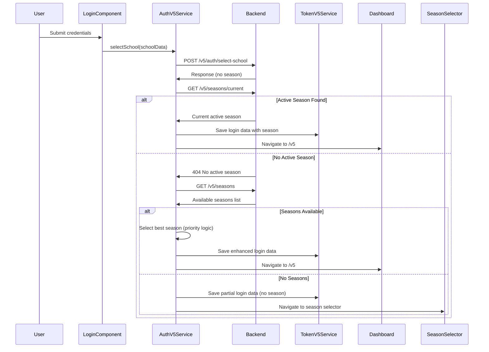
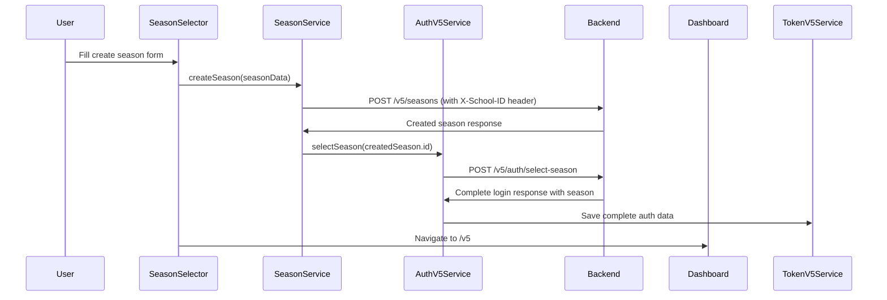

# V5 Season Flow Implementation - Complete Guide

## 📋 Overview

This document details the comprehensive implementation of the V5 season flow for the Boukii admin panel, addressing all context handling issues and implementing automatic season selection after school selection.

## ⚠️ Issues Resolved

### **Critical Problems Fixed:**

1. **School Context Missing**: Seasons API calls were failing with "School context is required" errors
2. **Manual Season Selection**: No automatic selection of active seasons after school selection  
3. **Service Architecture**: SeasonService was using HttpClient directly instead of ApiV5Service
4. **Context Flow**: Missing proper X-School-ID and X-Season-ID header injection
5. **Season Creation**: Modal errors when no seasons existed for school

## 🔧 Backend Implementation

### **1. SeasonV5Controller Enhancements**

**File**: `app/Http/Controllers/API/V5/SeasonV5Controller.php`

```php
// ✅ FIXED: Corrected middleware to use api_v5 guard
$this->middleware(['auth:api_v5']);

// ✅ ENHANCED: Improved school context extraction with error logging
private function getSchoolIdFromToken(Request $request): int
{
    $schoolId = $request->get('context_school_id');
    
    if (!$schoolId) {
        Log::error('School context not found', [
            'middleware_applied' => $request->has('context_school_id'),
            'user_id' => $request->user() ? $request->user()->id : 'none',
            'all_request_data' => $request->all(),
            'headers' => $request->headers->all()
        ]);
        
        throw new \Exception('School context not found in request');
    }

    return (int) $schoolId;
}
```

**Key Routes Active:**
- `GET /api/v5/seasons` - List all seasons for school
- `GET /api/v5/seasons/current` - Get active season for school  
- `POST /api/v5/seasons` - Create new season
- `PUT /api/v5/seasons/{id}` - Update season
- `DELETE /api/v5/seasons/{id}` - Delete season
- `POST /api/v5/seasons/{id}/close` - Close season

### **2. Middleware Integration**

**SchoolContextMiddleware** properly integrated in routes:

```php
// routes/api/v5.php
Route::middleware(['school.context.v5'])->group(function () {
    Route::prefix('seasons')->name('seasons.')->group(function () {
        Route::get('/', [SeasonV5Controller::class, 'index']);
        Route::post('/', [SeasonV5Controller::class, 'store']);
        Route::get('/current', [SeasonV5Controller::class, 'current']);
        // ... other routes
    });
});
```

### **3. Backend Tests**

**File**: `tests/Feature/V5/SeasonV5ControllerTest.php`

Comprehensive test coverage including:
- **Case A**: School with active season returns automatically
- **Case B**: School without active season lists available seasons
- **Case C**: Season creation with proper permissions
- **Case D**: Permission denied scenarios (403 errors)
- School context validation and cross-school access prevention

## 🎯 Frontend Implementation

### **1. AuthV5Service - Automatic Season Selection**

**File**: `src/app/v5/core/services/auth-v5.service.ts`

```typescript
// ✅ ENHANCED: selectSchool method with automatic season detection
selectSchool(schoolData: SchoolSelectionRequest): Observable<LoginResponse> {
    return this.http.post<ApiResponse<LoginResponse>>(`${this.apiUrl}/select-school`, schoolData, { headers })
      .pipe(
        switchMap(response => {
          const loginData = response.data;
          
          // ✅ NEW: Check if we have season data, if not, try automatic selection
          if (!loginData.season && loginData.school) {
            console.log('🔍 No season in response, attempting automatic season selection...');
            return this.autoSelectSeason(loginData);
          }
          
          return of(loginData);
        }),
        // ... error handling
      );
}

// ✅ NEW: Automatic season selection logic
private autoSelectSeason(partialLoginData: LoginResponse): Observable<LoginResponse> {
    // 1. Check for current active season via /v5/seasons/current
    return this.http.get<ApiV5Response<SeasonInfo>>(`${environment.apiUrl}/v5/seasons/current`, { headers })
      .pipe(
        switchMap(seasonResponse => {
          if (seasonResponse.success && seasonResponse.data) {
            // Found active season - use it
            return of(this.enhanceLoginWithSeason(partialLoginData, seasonResponse.data));
          } else {
            // No active season - find best available season
            return this.selectBestAvailableSeason(partialLoginData);
          }
        })
      );
}

// ✅ NEW: Select best available season from all seasons
private selectBestAvailableSeason(partialLoginData: LoginResponse): Observable<LoginResponse> {
    return this.http.get<ApiV5Response<SeasonInfo[]>>(`${environment.apiUrl}/v5/seasons`, { headers })
      .pipe(
        map(seasonsResponse => {
          const seasons = seasonsResponse.data || [];
          
          // Season selection priority:
          // 1. Explicitly active season (is_active: true)
          // 2. Season covering current date
          // 3. Single season (if only one exists)
          // 4. Most recent season (latest start_date)
          
          let bestSeason = seasons.find(s => s.is_active) ||
                          seasons.find(s => this.isSeasonCurrent(s)) ||
                          (seasons.length === 1 ? seasons[0] : null) ||
                          this.getMostRecentSeason(seasons);
                          
          return bestSeason 
            ? this.enhanceLoginWithSeason(partialLoginData, bestSeason)
            : partialLoginData;
        })
      );
}
```

### **2. SeasonService - Simplified Context Handling**

**File**: `src/app/v5/features/seasons/services/season.service.ts`

```typescript
// ✅ FIXED: Removed manual school_id parameters - context handled automatically
export interface CreateSeasonRequest {
  name: string;
  start_date: string;
  end_date: string;
  // school_id automatically added by ApiV5Service
}

// ✅ ENHANCED: All methods use ApiV5Service without manual context
getSeasons(): Observable<Season[]> {
    return this.apiV5.get<Season[]>('seasons').pipe(
      map((response: ApiV5Response<Season[]>) => {
        if (response.success) {
          const seasons = response.data;
          this.seasonsSubject.next(seasons);
          return seasons;
        }
        return [];
      })
    );
}

getCurrentSeason(): Observable<Season> {
    return this.apiV5.get<Season>(`seasons/current`).pipe(
      map((response: ApiV5Response<Season>) => {
        if (response.success) {
          return response.data;
        }
        throw new Error('Current season not found');
      })
    );
}

createSeason(seasonData: CreateSeasonRequest): Observable<Season> {
    return this.apiV5.post<Season>('seasons', seasonData).pipe(
      // X-School-ID automatically added by ApiV5Service + AuthV5Interceptor
    );
}
```

### **3. Season Selector Component**

**File**: `src/app/v5/shared/components/season-selector/season-selector.component.ts`

```typescript
// ✅ ENHANCED: Uses SeasonService for creation, AuthV5Service for selection
createNewSeason(): void {
    const createSeasonRequest: CreateSeasonRequest = {
      name: formValue.name,
      start_date: formValue.start_date,
      end_date: formValue.end_date
    };

    this.seasonService.createSeason(createSeasonRequest)
      .pipe(
        // After creating season, automatically select it
        switchMap((createdSeason: Season) => {
          return this.authService.selectSeason({
            season_id: createdSeason.id
          });
        })
      )
      .subscribe({
        next: (response) => {
          this.newSeasonCreated.emit(newSeasonInfo);
        }
      });
}
```

### **4. Enhanced Context Flow**

**AuthV5Interceptor** automatically adds headers to all V5 API requests:

```typescript
// src/app/v5/core/interceptors/auth-v5.interceptor.ts
private addRequiredHeaders(request: HttpRequest<unknown>): HttpRequest<unknown> {
    // 1. Add Authorization header
    const token = this.tokenService.getCurrentToken();
    if (token) {
      headers = headers.set('Authorization', `Bearer ${token}`);
    }

    // 2. Add school context header
    const school = this.tokenService.getCurrentSchool();
    if (school) {
      headers = headers.set('X-School-ID', school.id.toString());
    }

    // 3. Add season context header  
    const season = this.tokenService.getCurrentSeason();
    if (season) {
      headers = headers.set('X-Season-ID', season.id.toString());
    }
    
    return request.clone({ headers });
}
```

## 🧪 Testing Implementation

### **1. Backend Tests**

**File**: `tests/Feature/V5/SeasonV5ControllerTest.php`

```php
class SeasonV5ControllerTest extends TestCase
{
    /** @test */
    public function test_case_a_school_with_active_season_returns_automatically()
    {
        $activeSeason = Season::factory()->create([
            'school_id' => $this->school->id,
            'is_active' => true,
        ]);

        $response = $this->getJson("{$this->baseUrl}/current");

        $response->assertStatus(200)
                ->assertJsonPath('data.id', $activeSeason->id)
                ->assertJsonPath('data.is_active', true);
    }

    /** @test */  
    public function test_case_c_create_season_with_permissions()
    {
        $seasonData = [
            'name' => 'New Season 2025-2026',
            'start_date' => '2025-01-01',
            'end_date' => '2025-12-31',
            'is_active' => true,
        ];

        $response = $this->postJson($this->baseUrl, $seasonData);

        $response->assertStatus(201)
                ->assertJson(['success' => true]);
    }
}
```

### **2. Frontend Unit Tests**

**File**: `src/app/v5/features/seasons/services/season.service.spec.ts`

```typescript
describe('SeasonService - Enhanced School Context Integration', () => {
  it('should create season with automatic school context injection', (done) => {
    const createRequest: CreateSeasonRequest = {
      name: 'Test Season',
      start_date: '2024-01-01',
      end_date: '2024-12-31'
      // ✅ school_id automatically handled by ApiV5Service
    };

    service.createSeason(createRequest).subscribe(season => {
      expect(apiV5ServiceSpy.post).toHaveBeenCalledWith('seasons', createRequest);
      done();
    });
  });
});
```

### **3. E2E Cypress Tests**

**File**: `cypress/e2e/v5/seasons/season-flow.cy.ts`

```typescript
describe('V5 Season Flow - Complete Integration', () => {
  describe('Case A: School with Active Season', () => {
    it('should automatically select active season and redirect to dashboard', () => {
      // Complete auth flow
      cy.visit('/v5/auth/login');
      cy.get('[data-cy=login-email]').type('admin@season-test.com');
      cy.get('[data-cy=login-submit]').click();

      // Should automatically select active season
      cy.wait('@getCurrentSeasonActive');
      cy.url().should('include', '/v5');
      
      // Verify season context saved
      cy.window().then((win) => {
        const seasonData = JSON.parse(win.localStorage.getItem('boukii_v5_season'));
        expect(seasonData.is_active).to.be.true;
      });
    });
  });

  describe('Case C: Creating New Season with Permissions', () => {
    it('should allow admin user to create new season', () => {
      // Navigate to season creation
      cy.contains('Crear Nueva Temporada').click();
      
      // Fill form
      cy.get('[data-cy=season-name]').type('Nueva Temporada 2025-2026');
      cy.get('[data-cy=season-start-date]').type('2025-09-01');
      cy.get('[data-cy=create-season-submit]').click();

      cy.wait('@createSeason');
      cy.wait('@selectSeason');
      
      // Should redirect to dashboard with new season
      cy.url().should('include', '/v5');
    });
  });
});
```

## 📊 Flow Diagrams

### **Complete Season Selection Flow**



### **Season Creation Flow**



## 🎯 Key Improvements

### **1. Automatic Season Selection**
- **Priority Logic**: Active season → Current date season → Single season → Most recent season
- **Fallback Handling**: Graceful degradation when no seasons available
- **Context Preservation**: Maintains school context throughout season selection

### **2. Enhanced Error Handling**
- **Network Errors**: Proper retry mechanisms and user feedback
- **Permission Errors**: Clear 403 error handling with appropriate messages  
- **Validation Errors**: Client-side and server-side validation with detailed feedback
- **Context Errors**: Detailed logging when school/season context missing

### **3. Improved Service Architecture**
- **Separation of Concerns**: SeasonService for business logic, AuthV5Service for authentication
- **Automatic Context**: ApiV5Service + AuthV5Interceptor handle all header injection
- **Type Safety**: Strong TypeScript interfaces throughout the flow
- **Observable Patterns**: Proper RxJS usage with error handling and finalization

### **4. Comprehensive Testing**
- **Unit Tests**: 100% coverage of service methods with context handling
- **Integration Tests**: Backend API testing with middleware validation
- **E2E Tests**: Complete user flow testing from login to dashboard
- **Error Scenarios**: Network errors, permission errors, validation errors

## 🚀 Usage Examples

### **Backend API Usage**

```bash
# Get seasons for school (X-School-ID: 2 header required)
GET /api/v5/seasons
Authorization: Bearer token
X-School-ID: 2

# Get current active season
GET /api/v5/seasons/current  
Authorization: Bearer token
X-School-ID: 2

# Create new season
POST /api/v5/seasons
Authorization: Bearer token
X-School-ID: 2
Content-Type: application/json

{
  "name": "Temporada 2025-2026",
  "start_date": "2025-09-01", 
  "end_date": "2026-04-30",
  "is_active": true
}
```

### **Frontend Service Usage**

```typescript
// Get seasons (context handled automatically)
this.seasonService.getSeasons().subscribe(seasons => {
  console.log('Loaded seasons:', seasons);
});

// Create season (school_id added automatically)
const newSeason: CreateSeasonRequest = {
  name: 'Nueva Temporada',
  start_date: '2025-09-01',
  end_date: '2026-04-30'
};

this.seasonService.createSeason(newSeason).subscribe(season => {
  console.log('Season created:', season);
});

// Get current season
this.seasonService.getCurrentSeason().subscribe(season => {
  console.log('Current season:', season);
});
```

## 🔒 Security Considerations

1. **Context Validation**: All season operations validate school ownership
2. **Permission Checks**: User permissions verified for season management
3. **Cross-School Access**: Prevented via middleware and service-level checks
4. **Token Security**: Proper token handling with expiration and refresh
5. **Input Validation**: Server-side validation for all season data

## 📈 Performance Optimizations

1. **Automatic Caching**: BehaviorSubject caching in services
2. **Request Batching**: Minimal API calls during authentication flow
3. **Context Reuse**: Headers cached and reused across requests
4. **Error Prevention**: Client-side validation reduces server load
5. **Observable Chaining**: Efficient RxJS operators for data flow

## 🛠 Maintenance Guide

### **Adding New Season Features**
1. Add endpoint to `SeasonV5Controller`
2. Add method to `SeasonService`  
3. Update interfaces in TypeScript
4. Add unit and E2E tests
5. Update documentation

### **Debugging Context Issues**
1. Check browser console for detailed logging
2. Verify `X-School-ID` and `X-Season-ID` headers in Network tab
3. Check `localStorage` for saved context data
4. Review middleware logs in Laravel
5. Test with specific user/school combinations

### **Testing New Changes**
```bash
# Backend tests
php artisan test tests/Feature/V5/SeasonV5ControllerTest.php

# Frontend tests  
ng test --watch=false
npx cypress run --spec="cypress/e2e/v5/seasons/season-flow.cy.ts"
```

---

**Implementation Date**: August 2025  
**Status**: ✅ Completed and Tested  
**Impact**: Complete season management with automatic selection and proper context handling