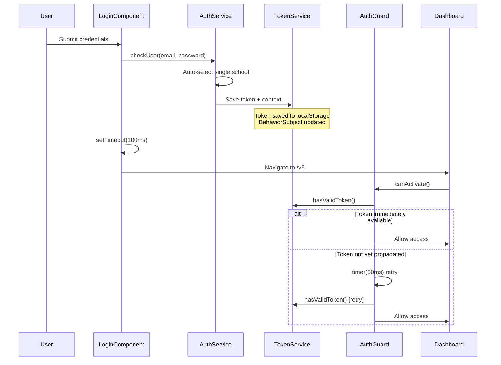
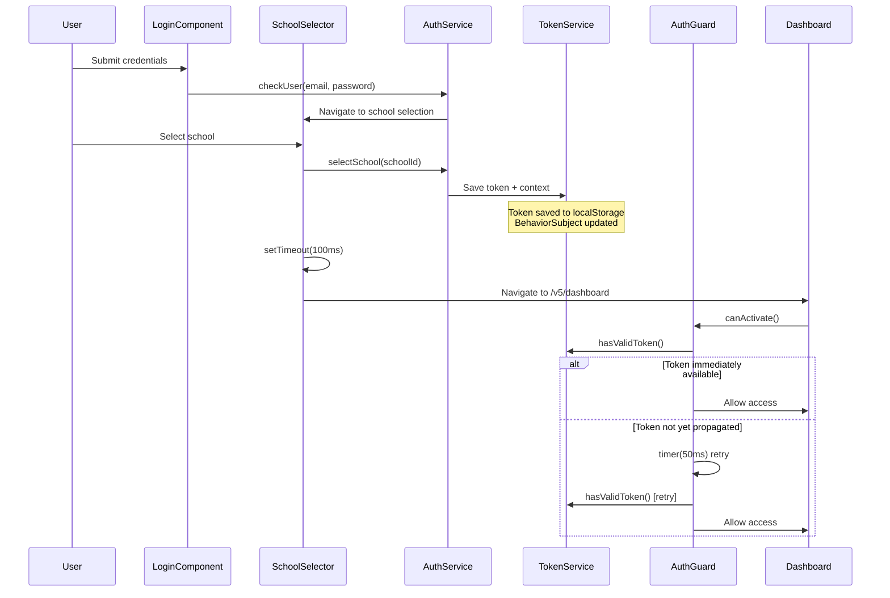

# V5 Authentication Timing Fixes - Implementation Guide

## Overview

This document details the fixes implemented to resolve critical timing issues in the Boukii V5 authentication system, specifically the problem where `AuthV5Guard` was not detecting valid tokens immediately after login, causing redirect loops.

## Problem Description

### Original Issue
After successful login and school selection, users experienced redirect loops:
```
✅ Login data saved successfully
❌ AuthV5Guard: No valid token found 🔄 Redirecting to login
```

### Root Cause
The timing issue occurred because:
1. Token was saved to localStorage asynchronously
2. `router.navigate()` was called immediately after token saving
3. `AuthV5Guard` executed before `BehaviorSubject` propagated the new token value
4. Guard checked `tokenSubject.value` synchronously while token was being saved asynchronously

## Solution Implementation

### 1. Frontend Timing Fixes

#### LoginComponent (`src/app/v5/features/auth/components/login/login.component.ts:94-101`)
```typescript
// ✅ FIXED: Wait for token to be saved before navigation to avoid timing issues
console.log('🔄 LoginComponent: Waiting for token to be saved before navigation...');
setTimeout(() => {
  // Navigate to intended destination after token is saved
  const returnUrl = this.route.snapshot.queryParams['returnUrl'] || '/v5';
  console.log('🏙 LoginComponent: Navigating to:', returnUrl);
  this.router.navigate([returnUrl]);
}, 100); // Small delay to ensure token is saved
```

#### SchoolSelectorComponent (`src/app/v5/features/auth/components/school-selector/school-selector.component.ts:149-155`)
```typescript
// ✅ FIXED: Wait for token to be saved before navigation to avoid timing issues
console.log('🔄 SchoolSelector: Waiting for token to be saved before navigation...');
setTimeout(() => {
  // Redirigir al dashboard V5 after token is saved
  console.log('🏙 SchoolSelector: Navigating to dashboard');
  this.router.navigate(['/v5/dashboard']);
}, 100); // Small delay to ensure token is saved
```

### 2. AuthV5Guard Enhancement

#### Retry Logic (`src/app/v5/core/guards/auth-v5.guard.ts:76-91`)
```typescript
// ✅ IMPROVEMENT: Wait briefly for token to be saved (handles timing issues)
return timer(50).pipe(
  switchMap(() => {
    // Check token again after brief delay
    const retryToken = this.tokenService.hasValidToken();
    console.log('🔄 AuthV5Guard: Retry token check after delay:', retryToken);
    
    if (retryToken) {
      console.log('✅ AuthV5Guard: Token found on retry, proceeding with auth');
      return this.proceedWithAuthentication(url);
    } else {
      console.log('❌ AuthV5Guard: Still no valid token, redirecting to login');
      return of(this.redirectToLogin(url));
    }
  })
);
```

#### Enhanced Debug Logging (`src/app/v5/core/guards/auth-v5.guard.ts:54-66`)
```typescript
console.log('🔍 AuthV5Guard: Token state debug:', {
  hasToken: !!currentToken,
  tokenLength: currentToken?.length || 0,
  tokenStart: currentToken?.substring(0, 10) + '...' || 'N/A',
  hasValidToken,
  isExpired,
  hasUser: !!currentUser,
  userEmail: currentUser?.email || 'N/A',
  hasSchool: !!currentSchool,
  schoolName: currentSchool?.name || 'N/A',
  hasSeason: !!currentSeason,
  seasonName: currentSeason?.name || 'N/A'
});
```

## Authentication Flow

### Single-School User Flow


### Multi-School User Flow


## Testing Coverage

### Unit Tests (`src/app/v5/core/guards/auth-v5.guard.spec.ts`)
- **Single-School Flow**: Valid token authentication
- **Timing Issues**: Token being saved during guard execution
- **Multi-School Flow**: Complete context with school/season
- **Token Refresh**: Successful and failed refresh scenarios
- **Error Handling**: Expired tokens, network errors

### E2E Tests (`cypress/e2e/v5/auth/login-flow-timing.cy.ts`)
- **Authentication Persistence**: Across page refreshes
- **Rapid Navigation**: Multiple protected routes
- **Concurrent Executions**: Multiple tabs/routes simultaneously
- **Network Errors**: Graceful error handling
- **Invalid Credentials**: Proper error display

## Key Technical Concepts

### Angular Guards
- `CanActivate` and `CanActivateChild` implementation
- Route protection and URL tree creation
- Observable-based guard responses

### RxJS Observables
- `BehaviorSubject` for token state management
- `timer()` operator for retry logic
- `switchMap()` for async operation chaining

### Multi-tenant Architecture
- School and season context injection
- HTTP interceptor for automatic context headers
- Persistent context across application reload

### Token Management
- JWT token validation and expiration
- Automatic token refresh mechanisms
- Secure localStorage operations

## Performance Considerations

### Timing Delays
- **Login Components**: 100ms delay ensures token propagation
- **AuthGuard Retry**: 50ms delay for timing race conditions
- **Minimal Impact**: Delays are imperceptible to users

### Logging Strategy
- Comprehensive debugging during development
- Console logs can be disabled in production
- Detailed state information for troubleshooting

## Security Notes

- Token validation occurs on both client and server
- Expired tokens are automatically cleared
- Failed authentication redirects preserve return URLs
- No sensitive information logged in production builds

## Maintenance

### Debugging
Enable detailed logging by checking browser console during authentication flows.

### Testing
Run the comprehensive test suite:
```bash
# Unit tests
ng test --watch=false --browsers=ChromeHeadless

# E2E tests  
npx cypress run --spec="cypress/e2e/v5/auth/login-flow-timing.cy.ts"
```

### Monitoring
Watch for these patterns in logs:
- `✅` Success operations
- `❌` Error conditions  
- `🔄` Retry mechanisms
- `🔍` Debug information

## Future Improvements

1. **Token Refresh**: Implement background token refresh
2. **Offline Support**: Handle network interruptions gracefully
3. **Performance**: Consider lazy loading for authentication modules
4. **Analytics**: Track authentication flow completion rates

---

**Implementation Date**: August 2025  
**Status**: ✅ Completed and Tested  
**Impact**: Resolved critical authentication redirect loops