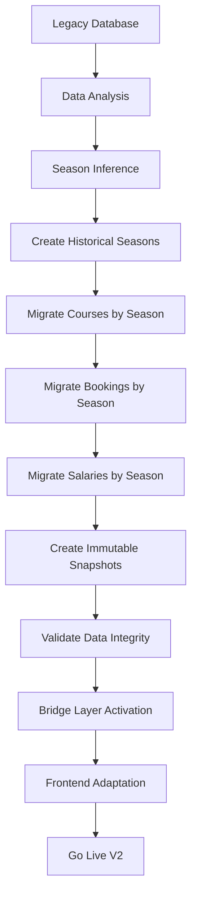

# 🏗️ BOUKII V5: DOCUMENTACIÓN COMPLETA Y PLANIFICACIÓN TÉCNICA

**Fecha de Análisis:** 31 Julio 2025  
**Estado:** Documentación completa post-análisis exhaustivo  
**Objetivo:** Roadmap técnico completo para finalizar Boukii V5

---

## 📋 ÍNDICE

1. [RESUMEN EJECUTIVO](#resumen-ejecutivo)
2. [ESTADO ACTUAL DEL PROYECTO](#estado-actual-del-proyecto)
3. [ESTRUCTURA DEL SISTEMA](#estructura-del-sistema)
4. [LISTADO COMPLETO DE TAREAS](#listado-completo-de-tareas)
5. [PROMPTS DETALLADOS POR TAREA](#prompts-detallados-por-tarea)
6. [PLAN DE TESTING](#plan-de-testing)
7. [PLAN DE MIGRACIÓN](#plan-de-migración)
8. [BUENAS PRÁCTICAS](#buenas-prácticas)
9. [FASES Y CRONOGRAMA](#fases-y-cronograma)

---

## 🎯 RESUMEN EJECUTIVO

### **¿Qué es Boukii V5?**

Boukii V5 es una **reescritura completa del panel de administración** para escuelas de deportes acuáticos, diseñada como una **Single Page Application (SPA)** moderna con Angular 16 y una API REST robusta con Laravel 10.

### **Mejoras Respecto al Legacy**

| Aspecto | Legacy | V5 |
|---------|--------|-----|
| **Arquitectura** | Monolítica | Modular con lazy loading |
| **UI/UX** | Básica | Material Design + Design System |
| **Estado** | Sin gestión | NgRx state management |
| **API** | REST básico | API versionada v5 + interceptors |
| **Testing** | Limitado | Cobertura >80% (unit + E2E) |
| **Performance** | Básica | OnPush, virtual scrolling, PWA |
| **Temporadas** | Limitado | Contexto de temporada completo |
| **Responsive** | Parcial | Mobile-first responsive |

### **Estructura Técnica General**

```
Frontend (Angular 16)           Backend (Laravel 10)
├── v5/                        ├── app/V5/                    [🔴 PENDIENTE]
│   ├── core/                  │   ├── Controllers/
│   ├── features/ (14)         │   ├── Services/
│   ├── shared/                │   ├── Repositories/
│   └── layout/                │   └── FormRequests/
├── interceptors (4)           ├── routes/api-v5.php          [🔴 PENDIENTE]
├── guards (2)                 ├── middleware/
└── state (NgRx)               └── database/migrations/
```
---

## 📊 ESTADO ACTUAL DEL PROYECTO

### **Análisis Cuantitativo**

| Componente | Completado | En Progreso | Pendiente | Total |
|------------|------------|-------------|-----------|-------|
| **Frontend Core** | 90% | 10% | 0% | 100% |
| **Frontend Features** | 35% | 40% | 25% | 100% |
| **Backend V5** | 0% | 0% | 100% | 100% |
| **API Endpoints V5** | 0% | 0% | 100% | 100% |
| **Testing** | 10% | 0% | 90% | 100% |
| **Documentation** | 60% | 40% | 0% | 100% |

### **✅ COMPLETADO (90-100%)**

#### **Core Architecture Frontend**
```typescript
// Estructura base completamente funcional
src/app/v5/
├── core/ (13 servicios implementados)
│   ├── services/ - AuthV5Service, SeasonContextService, ApiV5Service
│   ├── guards/ - AuthV5Guard, SeasonContextGuard (deshabilitados temporalmente)
│   ├── interceptors/ - Auth, Loading, Cache, Error
│   └── models/ (9 interfaces) - Season, Client, Booking, Course, Monitor
├── shared/ (90% completo)
│   ├── components/ - 6 componentes reutilizables
│   ├── design-system/ - Tokens, mixins, components
│   └── forms/ - FormFieldComponent, validators
└── layout/ - V5LayoutComponent + navbar + sidebar funcionales
```

#### **Módulos Frontend Completos**
1. **Schools Module** (100%)
   - `src/app/v5/features/schools/` - 4 páginas + 3 componentes + 2 servicios
   - CRUD completo con configuración por temporada
   - Material Design integrado

2. **Seasons Module** (95%)
   - `src/app/v5/features/seasons/` - 3 componentes + NgRx store
   - Gestión completa de temporadas con effects

### **🟡 PARCIALMENTE COMPLETADO (60-80%)**

#### **Módulos con Implementación Avanzada**

1. **Bookings Module** (75%)
   ```typescript
   // src/app/v5/features/bookings/
   ✅ BookingListSeasonComponent (724 líneas)
   ✅ Modal wizard completo (5 pasos)
   ✅ 4 servicios especializados
   ❌ Integración real con backend V5
   ❌ Validaciones server-side
   ```

2. **Clients Module** (70%)
   ```typescript
   // src/app/v5/features/clients/
   ✅ ClientListSeasonComponent (537 líneas)
   ✅ Búsqueda y filtros avanzados
   ✅ 2 servicios especializados
   ❌ Formularios CRUD completos
   ❌ Gestión de avatares/archivos
   ```

3. **Monitors Module** (65%)
   ```typescript
   // src/app/v5/features/monitors/
   ✅ Monitor availability matrix component
   ✅ 3 servicios de gestión
   ❌ Planificación de horarios completa
   ❌ Integración con calendario
   ```

### **🔴 PENDIENTES CRÍTICOS (20-40%)**

#### **Backend V5 (0% implementado)**
```php
// CRÍTICO: No existe implementación V5 en backend
❌ app/V5/ - Directorio no existe
❌ /api/v5/* - Rutas no implementadas
❌ V5 Controllers, Services, Repositories
❌ Authentication V5-specific
❌ Season context endpoints
```

#### **Módulos Frontend Básicos**
- **Analytics** (30%) - Dashboard básico sin métricas reales
- **Courses** (30%) - Servicios sin componentes UI
- **Equipment** (10%) - Solo stub
- **Payments** (10%) - Solo stub
- **Communications** (10%) - Solo stub
- **Reports** (10%) - Solo stub
12. #testing-e2e-y-staging
13. #migración-frontend-equivalencias
14. #modelos-y-base-de-datos
15. #servicios-y-controladores
16. #proceso-de-migración
17. #apis-y-frontend
18. #testing-y-validación
19. #timeline-y-recursos

  ---
🎯 INTRODUCCIÓN Y OBJETIVOS

Situación Problemática Actual

- Datos no separados por temporadas: Cursos y precios fijos todo el año
- Salarios sin versionado: Cambios mid-season afectan retroactivamente
- Sin cierre de temporadas: No hay datos históricos inmutables
- Arquitectura monolítica: Funcionalidades acopladas sin flexibilidad
- Falta módulo alquiler: Oportunidad de negocio no explotada

Objetivos de la Reestructuración

✅ Desacoplamiento total por temporadas
✅ Sistema de módulos activables/desactivables
✅ Nuevo módulo de alquiler de material
✅ Datos históricos inmutables
✅ Arquitectura escalable y mantenible
✅ Migración segura de datos legacy

  ---
📊 ANÁLISIS SITUACIÓN ACTUAL

Problemas Identificados

🔴 Temporadas

// PROBLEMA ACTUAL
Course::create([
'name' => 'Esquí Principiantes',
'price' => 50.00, // ← FIJO TODO EL AÑO
'date_start' => '2024-12-01', // ← FECHAS RÍGIDAS
'date_end' => '2024-03-31',
]);

// No se puede:
// - Tener precios diferentes invierno/verano
// - Desactivar cursos por temporada
// - Cerrar temporadas con datos immutables

🔴 Salarios

// PROBLEMA ACTUAL
SchoolSalaryLevel::find(1)->update(['pay' => 28.50]);
// ← AFECTA RETROACTIVAMENTE todos los cálculos históricos

🔴 Arquitectura Monolítica

- Todo acoplado en un solo sistema
- No se puede desactivar funcionalidades por cliente
- Falta módulo de alquiler de material

  ---
🏛️ NUEVA ARQUITECTURA PROPUESTA

Estructura del Proyecto

api-boukii-v2/
├── app/
│   ├── Core/                    # ← Sistema base
│   │   ├── Models/             # Modelos compartidos
│   │   ├── Services/           # Servicios base
│   │   └── Traits/             # Utilidades comunes
│   │
│   ├── Modules/                # ← SISTEMA MODULAR
│   │   ├── Seasons/            # Gestión temporadas
│   │   ├── Courses/            # Gestión cursos
│   │   ├── Bookings/           # Sistema reservas
│   │   ├── Rental/             # NUEVO: Alquiler material
│   │   ├── Finance/            # Finanzas y analytics
│   │   ├── Monitors/           # Gestión instructores
│   │   ├── Clients/            # Gestión clientes
│   │   └── Schools/            # Multi-tenancy
│   │
│   ├── Bridge/                 # ← Compatibilidad legacy
│   │   ├── LegacyModels/       # Solo lectura datos viejos
│   │   ├── MigrationServices/  # Servicios migración
│   │   └── CompatibilityLayer/ # Adaptadores
│   │
│   └── Shared/                 # ← Componentes compartidos
│       ├── Database/           # Conexiones BD
│       ├── Auth/               # Autenticación
│       ├── Cache/              # Sistema caché
│       └── Events/             # Sistema eventos
│
├── database/
│   ├── migrations/
│   │   ├── core/               # Migraciones base
│   │   ├── modules/            # Migraciones por módulo
│   │   └── legacy/             # Datos históricos
│   │
│   └── seeders/
│       ├── core/               # Seeders base
│       └── modules/            # Seeders por módulo
│
└── tests/
├── Unit/                   # Tests unitarios
├── Feature/                # Tests funcionales
├── Integration/            # Tests integración
└── Migration/              # Tests migración

  ---
🧩 SISTEMA DE MÓDULOS

Arquitectura Modular

1. Configuración de Módulos por Escuela

// Modelo: SchoolModule
class SchoolModule extends Model
{
protected $fillable = [
'school_id',
'module_name',
'is_active',
'configuration', // JSON con config específica
'activated_at',
'deactivated_at',
'billing_plan', // basic, premium, enterprise
];

      protected $casts = [
          'configuration' => 'array',
          'is_active' => 'boolean',
          'activated_at' => 'datetime',
          'deactivated_at' => 'datetime',
      ];
}

2. Módulos Disponibles

// Enum: AvailableModules
enum ModuleType: string
{
case SEASONS = 'seasons';
case COURSES = 'courses';
case BOOKINGS = 'bookings';
case RENTAL = 'rental';        // ← NUEVO
case FINANCE = 'finance';
case MONITORS = 'monitors';
case CLIENTS = 'clients';
case ANALYTICS = 'analytics';
case WEATHER = 'weather';
case NOTIFICATIONS = 'notifications';
}

// Configuración por módulo
const MODULE_DEPENDENCIES = [
'bookings' => ['courses', 'clients', 'seasons'],
'rental' => ['clients', 'seasons'],      // ← NUEVO
'finance' => ['bookings', 'rental'],
'analytics' => ['finance', 'bookings'],
];

3. Sistema de Activación Módulos

// Service: ModuleManagerService
class ModuleManagerService
{
public function activateModule(int $schoolId, ModuleType $module, array $config = []): bool
{
// 1. Verificar dependencias
$this->validateDependencies($schoolId, $module);

          // 2. Verificar plan de facturación
          $this->validateBillingPlan($schoolId, $module);

          // 3. Ejecutar migraciones específicas del módulo
          Artisan::call("module:migrate {$module->value} --school={$schoolId}");

          // 4. Activar módulo
          SchoolModule::updateOrCreate(
              ['school_id' => $schoolId, 'module_name' => $module->value],
              [
                  'is_active' => true,
                  'configuration' => $config,
                  'activated_at' => now(),
              ]
          );

          // 5. Disparar evento
          event(new ModuleActivated($schoolId, $module));

          return true;
      }

      public function isModuleActive(int $schoolId, ModuleType $module): bool
      {
          return SchoolModule::where('school_id', $schoolId)
              ->where('module_name', $module->value)
              ->where('is_active', true)
              ->exists();
      }
}

  ---
## 5. CHECKLIST MIGRACIÓN MÓDULOS

### 📊 Tabla de Migración por Módulo

| Módulo | Estado Actual | Acción en V5.0 | Dependencias | Prioridad | Complejidad |
|--------|---------------|----------------|--------------|-----------|-------------|
| **Core/Auth** | Legacy estable | Refactorizar con seasons | - | 🔴 Crítica | Alta |
| **Seasons** | No existe | ✨ **NUEVO** - Crear completo | Core | 🔴 Crítica | Alta |
| **Schools** | Legacy funcional | Migrar + season context | Core, Seasons | 🔴 Crítica | Media |
| **Cursos** | Legacy complejo | 🔄 **REDISEÑAR COMPLETO** | Seasons, Schools | 🔴 Crítica | Alta |
| **Bookings** | Legacy funcional | 🔄 Refactorizar con seasons | Cursos, Seasons | 🔴 Crítica | Alta |
| **Clients** | Legacy estable | 🔄 Adaptar multi-season | Schools | 🟡 Media | Baja |
| **Monitors** | Legacy básico | 🔄 Migrar + disponibilidad | Schools, Seasons | 🟡 Media | Media |
| **Salarios** | No existe | ✨ **NUEVO** - Crear completo | Monitors, Bookings | 🟢 Baja | Media |
| **Rental** | No existe | ✨ **NUEVO** - Módulo independiente | Seasons, Clients | 🟡 Media | Alta |
| **Finance** | Legacy separado | 🔄 Integrar por temporada | Bookings, Rental | 🟡 Media | Media |
| **Analytics** | Legacy básico | 🔄 Rediseñar dashboards | Finance, Bookings | 🟢 Baja | Media |
| **Extras** | Legacy separado | 🔄 Integrar por temporada | Cursos | 🟢 Baja | Baja |
| **Vouchers** | Legacy funcional | 🔄 Adaptar seasons | Bookings | 🟢 Baja | Baja |
| **Notifications** | Básico | 🔄 Expandir sistema | - | 🟢 Baja | Baja |
| **Weather** | Legacy funcional | ↔️ Mantener | - | 🟢 Baja | Baja |

### 🏷️ Leyenda de Acciones
- ✨ **NUEVO**: Módulo creado desde cero
- 🔄 **REDISEÑAR**: Refactorización completa 
- 🔄 **REFACTORIZAR**: Adaptación a nueva arquitectura
- ↔️ **MANTENER**: Sin cambios significativos
- 🗑️ **ELIMINAR**: Deprecar funcionalidad

### 📈 Estadísticas de Migración
- **Módulos Nuevos**: 3 (Seasons, Salarios, Rental)
- **Rediseño Completo**: 2 (Cursos, Analytics)
- **Refactorización**: 8 módulos
- **Sin Cambios**: 1 (Weather)
- **Total Módulos**: 14

  ---
## 6. DEPENDENCIAS ENTRE MÓDULOS

### 🔗 Diagrama de Dependencias

```
Season (Core) 
├── Schools → Clients
├── Courses → Bookings → Finance
├── Monitors → Salarios
├── Rental → Finance
└── Analytics (depende de todos)
```

### 📋 Orden de Implementación Recomendado

#### **Fase 1: Fundamentos (Semanas 1-3)**
1. **Season** → Base del sistema
2. **Schools** → Context multi-tenant 
3. **Auth/Users** → Permisos por season

#### **Fase 2: Core Business (Semanas 4-7)**
4. **Courses** → Gestión de cursos por season
5. **Clients** → Adaptación multi-season
6. **Bookings** → Reservas con season context

#### **Fase 3: Módulos Avanzados (Semanas 8-10)**
7. **Monitors** → Gestión instructores
8. **Salarios** → Sistema remuneraciones
9. **Rental** → Alquiler material

#### **Fase 4: Soporte y Analytics (Semanas 11-12)**
10. **Finance** → Integración financiera
11. **Analytics** → Dashboards y reportes
12. **Notifications** → Sistema notificaciones

### ⚠️ Dependencias Críticas
- `Seasons` debe estar 100% funcional antes de cualquier otro módulo
- `Courses` no puede migrarse sin `Seasons` completo
- `Finance` depende de `Bookings` Y `Rental` funcionando
- `Analytics` es el último módulo (depende de todos los datos)

  ---
## 7. ESPECIFICACIONES BACKEND VS FRONTEND

### 🔧 Backend Expectations (Laravel API)

#### **Nuevo Backend V5.0**
```php
// Estructura esperada
app/
├── Http/
│   ├── Controllers/V3/      // Nuevas APIs v3
│   ├── Middleware/
│   │   ├── SeasonContext.php    // Context automático
│   │   └── ModuleGuard.php      // Guard módulos activos
│   └── Requests/V3/             // Validaciones v3
├── Services/
│   ├── Season/
│   │   ├── SeasonService.php
│   │   ├── SeasonFinanceService.php  // Ya existe, adaptar
│   │   └── SeasonMigrationService.php
│   ├── Rental/                   // NUEVO módulo completo
│   └── Module/
│       └── ModuleManagerService.php
├── Models/
│   ├── Season.php               // NUEVO
│   ├── RentalItem.php          // NUEVO  
│   └── SchoolModule.php        // NUEVO
└── Traits/
    ├── HasSeasonContext.php    // NUEVO
    └── ModuleAware.php         // NUEVO
```

#### **APIs Backend Requeridas**
- ✅ **Multi-tenant automático**: Filtrado por `school_id` + `season_id`
- ✅ **Context helpers**: `SeasonContext::current()`, `SchoolContext::current()`
- ✅ **Module guards**: Verificación automática módulos activos
- ✅ **Legacy adapters**: Compatibilidad con APIs v1/v2 existentes

### 🎨 Frontend Expectations (Angular)

#### **Nuevo Frontend V5.0**
```typescript
// Estructura esperada
src/
├── app/
│   ├── core/
│   │   ├── services/
│   │   │   ├── season-context.service.ts    // NUEVO
│   │   │   ├── module-manager.service.ts    // NUEVO
│   │   │   └── legacy-adapter.service.ts    // NUEVO
│   │   └── guards/
│   │       └── module-active.guard.ts       // NUEVO
│   ├── modules/                             // Arquitectura modular
│   │   ├── seasons/                         // NUEVO módulo
│   │   ├── courses/                         // REDISEÑADO
│   │   ├── rental/                          // NUEVO módulo
│   │   └── finance/                         // REFACTORIZADO
│   └── shared/
│       ├── components/
│       │   └── season-selector/             // NUEVO
│       └── services/
│           └── base-api.service.ts          // Context automático
```

#### **Frontend Requerimientos**
- ✅ **Season Context Global**: Estado compartido temporada activa
- ✅ **Module Dynamic Loading**: Carga condicional módulos activos
- ✅ **Legacy Compatibility**: Soporte transición gradual
- ✅ **Modern Angular**: Standalone components, Signals, SSR ready

### 🔄 Convivencia Legacy Durante Migración

#### **Estrategia de Transición**
```typescript
// Ejemplo: Servicio híbrido
@Injectable()
export class HybridBookingService {
  
  constructor(
    private legacyService: BookingService,      // Servicio actual
    private newService: BookingV3Service,       // Nuevo servicio
    private moduleManager: ModuleManagerService
  ) {}

  async getBookings(filters: any) {
    // Detectar si season module está activo
    if (await this.moduleManager.isActive('seasons')) {
      return this.newService.getBookingsWithSeason(filters);
    }
    
    // Fallback a legacy
    return this.legacyService.listBookings(filters);
  }
}
```

#### **Feature Flags por Módulo**
- 🚩 `ENABLE_SEASONS`: Activa funcionalidades season
- 🚩 `ENABLE_RENTAL`: Activa módulo alquiler
- 🚩 `ENABLE_NEW_FINANCE`: Nueva analytics
- 🚩 `LEGACY_MODE`: Mantiene compatibilidad

  ---
## 8. MAPEO RUTAS APIS

### 📍 Rutas Actuales → Nuevas APIs

#### **Auth & Schools**
| Legacy | Nueva V3 | Cambios |
|--------|----------|---------|
| `GET /api/admin/user` | `GET /api/v3/auth/profile` | + season context |
| `GET /api/admin/schools` | `GET /api/v3/schools` | + modules info |
| `POST /api/admin/login` | `POST /api/v3/auth/login` | + season selection |

#### **Core Business**
| Legacy | Nueva V3 | Cambios |
|--------|----------|---------|
| `GET /api/admin/courses` | `GET /api/v3/seasons/{id}/courses` | Season scoped |
| `POST /api/admin/courses` | `POST /api/v3/seasons/{id}/courses` | Season required |
| `GET /api/admin/bookings` | `GET /api/v3/seasons/{id}/bookings` | Season scoped |
| `GET /api/admin/clients` | `GET /api/v3/schools/{id}/clients` | Multi-season |
| `GET /api/admin/monitors` | `GET /api/v3/seasons/{id}/monitors` | + disponibilidad |

#### **Nuevos Endpoints V3**
```php
// Seasons Management
GET    /api/v3/schools/{school}/seasons
POST   /api/v3/schools/{school}/seasons
PUT    /api/v3/seasons/{season}
DELETE /api/v3/seasons/{season}

// Season Context
GET    /api/v3/seasons/{season}/dashboard
GET    /api/v3/seasons/{season}/analytics
POST   /api/v3/seasons/{season}/switch    // Cambiar season activa

// Rental Module (NUEVO)
GET    /api/v3/seasons/{season}/rental/items
POST   /api/v3/seasons/{season}/rental/items
GET    /api/v3/seasons/{season}/rental/bookings
POST   /api/v3/seasons/{season}/rental/bookings

// Salarios Module (NUEVO)  
GET    /api/v3/seasons/{season}/monitors/{monitor}/salary
POST   /api/v3/seasons/{season}/salary/calculate
GET    /api/v3/seasons/{season}/salary/reports

// Module Management
GET    /api/v3/schools/{school}/modules
POST   /api/v3/schools/{school}/modules/{module}/activate
DELETE /api/v3/schools/{school}/modules/{module}/deactivate
```

#### **Compatibility Layer**
```php
// Middleware para mantener compatibilidad
class LegacyApiCompatibility {
    public function handle($request, $next) {
        // Redirigir automáticamente rutas legacy a v3
        if (str_starts_with($request->path(), 'api/admin/')) {
            // Inyectar season_id automáticamente desde context
            $request->merge(['season_id' => SeasonContext::current()]);
        }
        
        return $next($request);
    }
}
```

  ---
## 9. COMPATIBILIDAD ENTRE VERSIONES

### 🔄 Mapeo de Datos V1 → V3

#### **Estrategia de Migración de Datos**

```php
// Servicio de migración con mapeo automático
class DataMigrationService 
{
    /**
     * Mapea datos legacy a nueva estructura
     */
    public function migrateToV3(string $entity, array $legacyData): array 
    {
        return match($entity) {
            'course' => $this->migrateCourse($legacyData),
            'booking' => $this->migrateBooking($legacyData),
            'client' => $this->migrateClient($legacyData),
            default => throw new InvalidArgumentException("Entity {$entity} not supported")
        };
    }
    
    private function migrateCourse(array $legacy): array 
    {
        return [
            // Campos que se mantienen
            'id' => $legacy['id'],
            'name' => $legacy['name'],
            'price' => $legacy['price'],
            'school_id' => $legacy['school_id'],
            
            // Nuevos campos requeridos
            'season_id' => $this->inferSeasonFromDate($legacy['date_start']),
            'pricing_model' => $legacy['is_flexible'] ? 'flexible' : 'fixed',
            
            // Campos transformados
            'settings' => $this->transformCourseSettings($legacy),
            'availability' => $this->calculateAvailability($legacy),
            
            // Campos deprecados (mantener para compatibilidad)
            '_legacy_data' => json_encode($legacy),
        ];
    }
}
```

#### **📊 Tabla de Mapeo por Entidad**

| **Courses** | Legacy V1 | Nueva V3 | Transformación |
|-------------|-----------|----------|----------------|
| `is_flexible` | boolean | `pricing_model` | `flexible`/`fixed` |
| `settings` | JSON string | JSON object | Parse + validation |
| - | - | `season_id` | Infer from `date_start` |
| `course_dates` | Array | `availability` | Transform structure |

| **Bookings** | Legacy V1 | Nueva V3 | Transformación |
|--------------|-----------|----------|----------------|
| `booking_users` | Flat array | `participants` | Group by booking |
| `price_total` | Float | `pricing_details` | Structured object |
| - | - | `season_id` | From course relation |
| `status` | Integer | `status` | Enum mapping |

| **Clients** | Legacy V1 | Nueva V3 | Transformación |
|-------------|-----------|----------|----------------|
| Single school | `school_id` | `schools` | Array relation |
| - | - | `season_preferences` | New field |
| `utilizers` | JSON | `family_members` | Structured relation |

#### **🔧 Convivencia de Estructuras**

```php
// Adapter Pattern para convivencia temporal
class LegacyDataAdapter 
{
    public function __construct(
        private DataMigrationService $migrationService,
        private CacheManager $cache
    ) {}
    
    /**
     * Retorna datos en formato V3, migrando automáticamente si es legacy
     */
    public function getCourse(int $id): array 
    {
        $course = Course::find($id);
        
        // Si ya está en V3, retornar directamente
        if ($course->hasSeasonId()) {
            return $course->toArray();
        }
        
        // Si es legacy, migrar on-the-fly y cachear
        $cacheKey = "migrated_course_{$id}";
        
        return $this->cache->remember($cacheKey, 3600, function() use ($course) {
            return $this->migrationService->migrateToV3('course', $course->toArray());
        });
    }
}
```

### 📅 Timeline de Convivencia

| Fase | Duración | V1 Legacy | V3 Nueva | Estrategia |
|------|----------|-----------|----------|------------|
| **Preparación** | Semanas 1-2 | ✅ Activa | 🚧 Desarrollo | Setup infra V3 |
| **Migración Soft** | Semanas 3-6 | ✅ Activa | 🔄 Coexistencia | Adapter pattern |
| **Migración Hard** | Semanas 7-10 | 🔄 Read-only | ✅ Principal | Data migration |
| **Deprecación** | Semanas 11-12 | 🗑️ Desactivada | ✅ Única | Cleanup legacy |

  ---
## 10. CONTROL DE ACCESO Y ROLES

### 🔐 Nueva Arquitectura de Permisos

#### **Sistema de Roles Jerárquico**

```php
// Enum de roles base
enum SystemRole: string 
{
    case SUPERADMIN = 'superadmin';    // Acceso global
    case SCHOOL_OWNER = 'school_owner'; // Owner de escuela
    case SCHOOL_ADMIN = 'school_admin'; // Admin de escuela
    case SEASON_MANAGER = 'season_manager'; // Gestor temporada
    case MONITOR = 'monitor';          // Instructor
    case CLIENT = 'client';            // Cliente final
}

// Modelo de permisos por season
class SeasonPermission extends Model 
{
    protected $fillable = [
        'user_id',
        'season_id', 
        'school_id',
        'role',
        'permissions',      // JSON con permisos específicos
        'module_access',    // Módulos permitidos
        'expires_at',       // Permisos temporales
    ];
    
    protected $casts = [
        'permissions' => 'array',
        'module_access' => 'array',
        'expires_at' => 'datetime',
    ];
}
```

#### **🎯 Policies Centralizadas**

```php
// Policy base para season context
abstract class SeasonAwarePolicy 
{
    protected function canAccessSeason(User $user, Season $season): bool 
    {
        return $user->seasonPermissions()
            ->where('season_id', $season->id)
            ->where('school_id', $season->school_id)
            ->exists();
    }
    
    protected function hasModuleAccess(User $user, Season $season, string $module): bool 
    {
        $permission = $user->seasonPermissions()
            ->where('season_id', $season->id)
            ->first();
            
        return $permission?->module_access 
            ? in_array($module, $permission->module_access)
            : false;
    }
}

// Policy específica para cursos
class CoursePolicy extends SeasonAwarePolicy 
{
    public function view(User $user, Course $course): bool 
    {
        return $this->canAccessSeason($user, $course->season) &&
               $this->hasModuleAccess($user, $course->season, 'courses');
    }
    
    public function create(User $user, Season $season): bool 
    {
        return $user->hasRole(['school_admin', 'season_manager']) &&
               $this->canAccessSeason($user, $season) &&
               $this->hasModuleAccess($user, $season, 'courses');
    }
}
```

#### **🛡️ Middleware de Validación**

```php
class SeasonAccessMiddleware 
{
    public function handle(Request $request, Closure $next) 
    {
        $seasonId = $request->route('season') ?? $request->input('season_id');
        
        if (!$seasonId) {
            return response()->json(['error' => 'Season context required'], 400);
        }
        
        $season = Season::findOrFail($seasonId);
        
        // Verificar acceso del usuario a la temporada
        if (!Auth::user()->canAccessSeason($season)) {
            return response()->json(['error' => 'Season access denied'], 403);
        }
        
        // Inyectar season al request
        $request->merge(['current_season' => $season]);
        
        return $next($request);
    }
}
```

### 📋 Matriz de Permisos por Rol

| Módulo | SuperAdmin | School Owner | School Admin | Season Manager | Monitor | Client |
|--------|------------|--------------|--------------|----------------|---------|--------|
| **Seasons** | ✅ CRUD | ✅ CRUD | ✅ View | ✅ Current | ❌ | ❌ |
| **Courses** | ✅ CRUD | ✅ CRUD | ✅ CRUD | ✅ CRUD | 👁️ View | 👁️ View |
| **Bookings** | ✅ CRUD | ✅ CRUD | ✅ CRUD | ✅ CRUD | 👁️ Assigned | ✅ Own |
| **Rental** | ✅ CRUD | ✅ CRUD | ✅ CRUD | ✅ CRUD | ❌ | ✅ Own |
| **Salaries** | ✅ CRUD | ✅ CRUD | ✅ CRUD | 👁️ View | 👁️ Own | ❌ |
| **Analytics** | ✅ All | ✅ School | ✅ School | ✅ Season | 👁️ Own | ❌ |

  ---
## 11. ESPECIFICACIÓN DETALLADA DE ENDPOINTS

### 🔗 Endpoints por Módulo

#### **Monitors Module**
```php
// Gestión de monitores por temporada
GET    /api/v3/seasons/{season}/monitors
POST   /api/v3/seasons/{season}/monitors
PUT    /api/v3/monitors/{monitor}
DELETE /api/v3/monitors/{monitor}

// Disponibilidad
GET    /api/v3/monitors/{monitor}/availability?season_id=1&date=2024-01-15
POST   /api/v3/monitors/{monitor}/availability
PUT    /api/v3/monitors/{monitor}/availability/{date}

// Asignaciones
GET    /api/v3/seasons/{season}/monitors/{monitor}/assignments
POST   /api/v3/seasons/{season}/monitors/{monitor}/assign-course
DELETE /api/v3/monitors/{monitor}/assignments/{assignment}

// Especialidades y certificaciones
GET    /api/v3/monitors/{monitor}/specializations
POST   /api/v3/monitors/{monitor}/specializations
```

#### **Salaries Module**
```php
// Cálculo de salarios
GET    /api/v3/seasons/{season}/salary/overview
GET    /api/v3/seasons/{season}/monitors/{monitor}/salary
POST   /api/v3/seasons/{season}/salary/calculate
PUT    /api/v3/seasons/{season}/salary/{monitor}/adjust

// Períodos de pago
GET    /api/v3/seasons/{season}/salary/periods
POST   /api/v3/seasons/{season}/salary/periods
PUT    /api/v3/salary/periods/{period}/close

// Reportes
GET    /api/v3/seasons/{season}/salary/reports?format=pdf&month=2024-01
GET    /api/v3/seasons/{season}/salary/export?type=excel
```

#### **Weather Module**
```php
// Pronósticos por estación
GET    /api/v3/seasons/{season}/weather/forecast?days=7
GET    /api/v3/seasons/{season}/weather/current
GET    /api/v3/stations/{station}/weather

// Historial y alertas
GET    /api/v3/seasons/{season}/weather/history?from=2024-01-01&to=2024-01-31
POST   /api/v3/seasons/{season}/weather/alerts
GET    /api/v3/seasons/{season}/weather/alerts/active
```

#### **Analytics Module**
```php
// Dashboards
GET    /api/v3/seasons/{season}/analytics/dashboard
GET    /api/v3/seasons/{season}/analytics/kpis
GET    /api/v3/seasons/{season}/analytics/revenue

// Reportes avanzados
GET    /api/v3/seasons/{season}/analytics/bookings-trend?period=monthly
GET    /api/v3/seasons/{season}/analytics/monitors-performance
GET    /api/v3/seasons/{season}/analytics/course-popularity

// Comparativas
GET    /api/v3/analytics/seasons/compare?seasons[]=1&seasons[]=2
GET    /api/v3/analytics/schools/{school}/seasons-comparison
```

### 📊 Especificación GraphQL (Alternativa)

```graphql
# Schema para consultas complejas
type Query {
  season(id: ID!): Season
  seasons(schoolId: ID!, active: Boolean): [Season!]!
  
  # Consulta unificada con relaciones
  seasonOverview(seasonId: ID!): SeasonOverview
}

type SeasonOverview {
  season: Season!
  courses: [Course!]!
  bookings: BookingStats!
  monitors: [MonitorAvailability!]!
  revenue: RevenueStats!
  weather: WeatherForecast
}

type Mutation {
  createSeason(input: CreateSeasonInput!): Season!
  assignMonitorToCourse(monitorId: ID!, courseId: ID!): Assignment!
  calculateSalary(seasonId: ID!, monitorId: ID!): SalaryCalculation!
}
```

  ---
## 12. TESTING E2E Y STAGING

### 🧪 Estrategia de Testing

#### **Entornos de Validación**
```yaml
# docker-compose.staging.yml
version: '3.8'
services:
  app-staging:
    build: .
    environment:
      - APP_ENV=staging
      - DB_DATABASE=boukii_staging
      - ENABLE_SEASONS=true
      - ENABLE_RENTAL=true
      - LEGACY_MODE=true
    volumes:
      - ./tests/fixtures:/app/fixtures

  app-legacy:
    build: 
      context: .
      dockerfile: Dockerfile.legacy
    environment:
      - APP_ENV=legacy
      - DB_DATABASE=boukii_legacy
```

#### **📋 Test Matrix por Fase**

| Fase | Legacy V1 | Staging V3 | Tests E2E | Data Sync |
|------|-----------|------------|-----------|-----------|
| **1-2** | ✅ Active | 🧪 Testing | Migration tests | Manual |
| **3-6** | ✅ Active | 🔄 Parallel | Compatibility tests | Bidirectional |
| **7-10** | 👁️ Read-only | ✅ Primary | Regression tests | One-way |
| **11-12** | ❌ Disabled | ✅ Production | Smoke tests | - |

#### **🔧 Pipeline CI/CD**

```yaml
# .github/workflows/migration-validation.yml
name: Migration Validation

on:
  push:
    branches: [migration/v5.0]

jobs:
  test-compatibility:
    runs-on: ubuntu-latest
    strategy:
      matrix:
        version: [legacy, v3-staging]
    
    steps:
      - uses: actions/checkout@v3
      
      - name: Setup Environment
        run: |
          cp .env.${{ matrix.version }} .env
          docker-compose -f docker-compose.${{ matrix.version }}.yml up -d
      
      - name: Run Migration Tests
        run: |
          php artisan test --testsuite=Migration
          php artisan test --testsuite=Compatibility
          
      - name: Data Integrity Check
        run: |
          php artisan migration:validate-data
          php artisan migration:check-consistency
```

#### **🎯 Tests Críticos**

```php
// Test de migración de datos
class DataMigrationTest extends TestCase 
{
    public function test_course_migration_preserves_bookings()
    {
        // Arrange: Crear curso legacy con bookings
        $legacyCourse = Course::factory()->legacy()->create();
        $booking = Booking::factory()->for($legacyCourse)->create();
        
        // Act: Migrar a V3
        $migratedCourse = $this->migrationService->migrateCourse($legacyCourse);
        
        // Assert: Verificar consistencia
        $this->assertEquals($legacyCourse->bookings->count(), 
                           $migratedCourse->bookings->count());
        $this->assertNotNull($migratedCourse->season_id);
    }
    
    public function test_api_compatibility_layer()
    {
        // Test que endpoints legacy siguen funcionando
        $response = $this->get('/api/admin/courses');
        $this->assertEquals(200, $response->status());
        
        // Y que redirigen internamente a V3
        $this->assertDatabaseHas('api_logs', [
            'original_endpoint' => '/api/admin/courses',
            'redirected_to' => '/api/v3/seasons/1/courses'
        ]);
    }
}
```

  ---
## 13. MIGRACIÓN FRONTEND - EQUIVALENCIAS

### 🎨 Tabla de Equivalencias

#### **📁 Componentes**

| Legacy Component | Nueva V3 | Cambios Principales | Status |
|------------------|----------|---------------------|--------|
| `CourseListComponent` | `SeasonCoursesComponent` | + Season context, + filters | 🔄 Rediseñar |
| `BookingFormComponent` | `BookingWizardComponent` | + Multi-step, + rental | 🔄 Rediseñar |
| `ClientProfileComponent` | `ClientDashboardComponent` | + Multi-season view | 🔄 Refactorizar |
| `MonitorCalendarComponent` | `MonitorAvailabilityComponent` | + Season scoped | 🔄 Refactorizar |
| `DashboardComponent` | `SeasonDashboardComponent` | + Season analytics | 🔄 Rediseñar |
| `LoginComponent` | `AuthComponent` | + Season selection | 🔄 Refactorizar |
| - | `SeasonSelectorComponent` | Season switcher | ✨ Nuevo |
| - | `RentalManagerComponent` | Rental module | ✨ Nuevo |
| - | `SalaryCalculatorComponent` | Salary module | ✨ Nuevo |

#### **🔧 Servicios**

| Legacy Service | Nueva V3 | Transformación | Estado Compartido |
|----------------|----------|----------------|-------------------|
| `BookingService` | `BookingV3Service` | + Season context, + async | Signals |
| `CoursesService` | `SeasonCoursesService` | + Season scoped | Signals |
| `ClientService` | `ClientV3Service` | + Multi-season | NgRx Store |
| `AuthService` | `AuthV3Service` | + Season selection | LocalStorage |
| `DashboardService` | `AnalyticsService` | + Real-time data | Signals |
| - | `SeasonContextService` | Global season state | Signals |
| - | `ModuleManagerService` | Dynamic modules | NgRx Store |
| - | `RentalService` | Rental management | Signals |
| - | `LegacyAdapterService` | Compatibility layer | - |

#### **🗂️ Estado Compartido (State Management)**

```typescript
// Estrategia: Angular Signals + NgRx para casos complejos

// 1. Season Context (Signals - Estado simple)
@Injectable({providedIn: 'root'})
export class SeasonContextService {
  private _currentSeason = signal<Season | null>(null);
  private _availableSeasons = signal<Season[]>([]);
  
  readonly currentSeason = this._currentSeason.asReadonly();
  readonly availableSeasons = this._availableSeasons.asReadonly();
  
  // Computed signals
  readonly isSeasonActive = computed(() => 
    this._currentSeason()?.status === 'active'
  );
}

// 2. Module State (NgRx - Estado complejo)
interface ModuleState {
  activeModules: string[];
  moduleConfigs: Record<string, any>;
  loading: boolean;
}

// 3. Legacy Adapter (Service)
@Injectable({providedIn: 'root'})
export class LegacyAdapterService {
  constructor(
    private legacyBooking: BookingService,
    private newBooking: BookingV3Service,
    private moduleManager: ModuleManagerService
  ) {}
  
  async getBookings(filters: any) {
    const hasSeasons = await this.moduleManager.isActive('seasons');
    return hasSeasons 
      ? this.newBooking.getWithSeason(filters)
      : this.legacyBooking.listBookings(filters);
  }
}
```

#### **🚀 Migración por Fases**

| Fase | Componente | Estrategia | Herramientas |
|------|------------|------------|--------------|
| **1** | Login/Auth | Wrapper híbrido | Legacy + V3 API |
| **2** | Dashboard | Signals refactor | Angular 17+ |
| **3** | Courses | Standalone components | Signals + HTTP |
| **4** | Bookings | Complete rewrite | Wizard pattern |
| **5** | Clients | Multi-season adaptation | NgRx + Signals |
| **6** | New modules | From scratch | Modern Angular |

### 📦 Arquitectura de Módulos

```typescript
// Estructura modular con lazy loading
const routes: Routes = [
  {
    path: 'seasons',
    loadComponent: () => import('./modules/seasons/seasons.component'),
    canActivate: [ModuleActiveGuard],
    data: { module: 'seasons' }
  },
  {
    path: 'rental',
    loadChildren: () => import('./modules/rental/rental.routes'),
    canActivate: [ModuleActiveGuard],
    data: { module: 'rental' }
  }
];

// Guard para módulos activos
@Injectable()
export class ModuleActiveGuard implements CanActivate {
  constructor(private moduleManager: ModuleManagerService) {}
  
  async canActivate(route: ActivatedRouteSnapshot): Promise<boolean> {
    const requiredModule = route.data?.['module'];
    return await this.moduleManager.isActive(requiredModule);
  }
}
```

  ---
🗄️ MODELOS Y BASE DE DATOS

Core Models (Sistema Base)

1. Season (Temporadas) - REFACTORIZADO

class Season extends Model
{
use HasFactory, SoftDeletes, LogsActivity;

      protected $fillable = [
          'school_id',
          'name',
          'slug',
          'start_date',
          'end_date',
          'hour_start',
          'hour_end',
          'is_active',
          'is_closed',
          'closed_at',
          'closed_by',
          'vacation_days',
          'configuration', // JSON config específica
      ];

      protected $casts = [
          'start_date' => 'date',
          'end_date' => 'date',
          'is_active' => 'boolean',
          'is_closed' => 'boolean',
          'closed_at' => 'datetime',
          'vacation_days' => 'array',
          'configuration' => 'array',
      ];

      // Relaciones
      public function school(): BelongsTo
      {
          return $this->belongsTo(School::class);
      }

      public function seasonCourses(): HasMany
      {
          return $this->hasMany(SeasonCourse::class);
      }

      public function seasonBookings(): HasMany
      {
          return $this->hasMany(SeasonBooking::class);
      }

      public function seasonRentals(): HasMany
      {
          return $this->hasMany(SeasonRental::class);
      }

      public function seasonSnapshots(): HasMany
      {
          return $this->hasMany(SeasonSnapshot::class);
      }

      public function salaryLevels(): HasMany
      {
          return $this->hasMany(SeasonSalaryLevel::class);
      }

      // Scopes
      public function scopeActive($query)
      {
          return $query->where('is_active', true);
      }

      public function scopeClosed($query)
      {
          return $query->where('is_closed', true);
      }

      public function scopeForSchool($query, int $schoolId)
      {
          return $query->where('school_id', $schoolId);
      }

      // Métodos
      public function canBeClosed(): bool
      {
          return $this->is_active && !$this->is_closed;
      }

      public function getActiveBookingsCount(): int
      {
          return $this->seasonBookings()
              ->where('status', '!=', 'cancelled')
              ->count();
      }
}

2. Course (Refactorizado para Temporadas)

class Course extends Model
{
use HasFactory, SoftDeletes, LogsActivity;

      protected $fillable = [
          'school_id',
          'sport_id',
          'station_id',
          'course_type', // 1=group, 2=private, 3=activity
          'name',
          'slug',
          'short_description',
          'description',
          'base_price', // Precio base (se override por temporada)
          'currency',
          'max_participants',
          'min_participants',
          'duration',
          'age_min',
          'age_max',
          'difficulty_level',
          'equipment_included',
          'is_template', // ← Para reutilizar entre temporadas
          'active',
          'configuration',
      ];

      protected $casts = [
          'course_type' => 'integer',
          'base_price' => 'decimal:2',
          'max_participants' => 'integer',
          'min_participants' => 'integer',
          'duration' => 'integer',
          'age_min' => 'integer',
          'age_max' => 'integer',
          'difficulty_level' => 'integer',
          'equipment_included' => 'boolean',
          'is_template' => 'boolean',
          'active' => 'boolean',
          'configuration' => 'array',
      ];

      // Relaciones
      public function seasonCourses(): HasMany
      {
          return $this->hasMany(SeasonCourse::class);
      }

      public function activeSeasonCourses(): HasMany
      {
          return $this->seasonCourses()->whereHas('season', function($q) {
              $q->where('is_active', true);
          });
      }

      public function getCurrentSeasonPrice(int $seasonId): ?float
      {
          $seasonCourse = $this->seasonCourses()
              ->where('season_id', $seasonId)
              ->first();

          return $seasonCourse?->price_override ?? $this->base_price;
      }
}

3. SeasonCourse (Cursos por Temporada)

class SeasonCourse extends Model
{
use HasFactory, LogsActivity;

      protected $fillable = [
          'season_id',
          'course_id',
          'is_active',
          'price_override',
          'max_participants_override',
          'min_participants_override',
          'date_start',
          'date_end',
          'date_start_res', // Inicio reservas
          'date_end_res',   // Fin reservas
          'booking_limit_days',
          'configuration',
      ];

      protected $casts = [
          'is_active' => 'boolean',
          'price_override' => 'decimal:2',
          'max_participants_override' => 'integer',
          'min_participants_override' => 'integer',
          'date_start' => 'date',
          'date_end' => 'date',
          'date_start_res' => 'date',
          'date_end_res' => 'date',
          'booking_limit_days' => 'integer',
          'configuration' => 'array',
      ];

      // Relaciones
      public function season(): BelongsTo
      {
          return $this->belongsTo(Season::class);
      }

      public function course(): BelongsTo
      {
          return $this->belongsTo(Course::class);
      }

      public function courseDates(): HasMany
      {
          return $this->hasMany(SeasonCourseDate::class);
      }

      public function extras(): HasMany
      {
          return $this->hasMany(SeasonCourseExtra::class);
      }

      // Métodos
      public function getEffectivePrice(): float
      {
          return $this->price_override ?? $this->course->base_price;
      }

      public function getEffectiveMaxParticipants(): int
      {
          return $this->max_participants_override ?? $this->course->max_participants;
      }

      public function isBookingOpen(): bool
      {
          $now = now()->toDateString();

          if ($this->date_start_res && $now < $this->date_start_res) {
              return false;
          }

          if ($this->date_end_res && $now > $this->date_end_res) {
              return false;
          }

          return $this->is_active;
      }
}

Módulo RENTAL (NUEVO)

4. RentalCategory (Categorías de Material)

class RentalCategory extends Model
{
use HasFactory, SoftDeletes, LogsActivity;

      protected $fillable = [
          'school_id',
          'name',
          'slug',
          'description',
          'icon',
          'color',
          'sort_order',
          'is_active',
          'requires_size',
          'requires_skill_level',
          'configuration',
      ];

      protected $casts = [
          'sort_order' => 'integer',
          'is_active' => 'boolean',
          'requires_size' => 'boolean',
          'requires_skill_level' => 'boolean',
          'configuration' => 'array',
      ];

      public function items(): HasMany
      {
          return $this->hasMany(RentalItem::class, 'category_id');
      }

      public function activeItems(): HasMany
      {
          return $this->items()->where('is_active', true);
      }
}

5. RentalItem (Items de Alquiler)

class RentalItem extends Model
{
use HasFactory, SoftDeletes, LogsActivity;

      protected $fillable = [
          'school_id',
          'category_id',
          'brand_id',
          'name',
          'slug',
          'description',
          'model',
          'size',
          'skill_level', // beginner, intermediate, advanced, expert
          'condition', // new, good, fair, poor
          'purchase_date',
          'purchase_price',
          'current_value',
          'barcode',
          'qr_code',
          'location',
          'is_active',
          'is_rentable',
          'maintenance_status',
          'last_maintenance',
          'next_maintenance',
          'rental_count',
          'images',
          'configuration',
      ];

      protected $casts = [
          'purchase_date' => 'date',
          'purchase_price' => 'decimal:2',
          'current_value' => 'decimal:2',
          'is_active' => 'boolean',
          'is_rentable' => 'boolean',
          'last_maintenance' => 'date',
          'next_maintenance' => 'date',
          'rental_count' => 'integer',
          'images' => 'array',
          'configuration' => 'array',
      ];

      // Relaciones
      public function category(): BelongsTo
      {
          return $this->belongsTo(RentalCategory::class, 'category_id');
      }

      public function brand(): BelongsTo
      {
          return $this->belongsTo(RentalBrand::class, 'brand_id');
      }

      public function seasonPricing(): HasMany
      {
          return $this->hasMany(SeasonRentalPricing::class, 'item_id');
      }

      public function rentals(): HasMany
      {
          return $this->hasMany(RentalBooking::class, 'item_id');
      }

      // Métodos
      public function isAvailableForPeriod(Carbon $startDate, Carbon $endDate): bool
      {
          return $this->is_rentable &&
                 $this->maintenance_status !== 'in_maintenance' &&
                 !$this->hasConflictingRentals($startDate, $endDate);
      }

      public function getCurrentSeasonPrice(int $seasonId): ?float
      {
          return $this->seasonPricing()
              ->where('season_id', $seasonId)
              ->where('is_active', true)
              ->value('daily_price');
      }

      private function hasConflictingRentals(Carbon $startDate, Carbon $endDate): bool
      {
          return $this->rentals()
              ->where('status', '!=', 'cancelled')
              ->where(function($q) use ($startDate, $endDate) {
                  $q->whereBetween('start_date', [$startDate, $endDate])
                    ->orWhereBetween('end_date', [$startDate, $endDate])
                    ->orWhere(function($q2) use ($startDate, $endDate) {
                        $q2->where('start_date', '<=', $startDate)
                           ->where('end_date', '>=', $endDate);
                    });
              })
              ->exists();
      }
}

6. SeasonRentalPricing (Precios por Temporada)

class SeasonRentalPricing extends Model
{
use HasFactory, LogsActivity;

      protected $fillable = [
          'season_id',
          'item_id',
          'daily_price',
          'weekly_price',
          'deposit_amount',
          'insurance_price',
          'min_rental_days',
          'max_rental_days',
          'discount_percentage',
          'is_active',
          'valid_from',
          'valid_to',
      ];

      protected $casts = [
          'daily_price' => 'decimal:2',
          'weekly_price' => 'decimal:2',
          'deposit_amount' => 'decimal:2',
          'insurance_price' => 'decimal:2',
          'min_rental_days' => 'integer',
          'max_rental_days' => 'integer',
          'discount_percentage' => 'decimal:2',
          'is_active' => 'boolean',
          'valid_from' => 'date',
          'valid_to' => 'date',
      ];

      public function season(): BelongsTo
      {
          return $this->belongsTo(Season::class);
      }

      public function item(): BelongsTo
      {
          return $this->belongsTo(RentalItem::class, 'item_id');
      }

      public function calculatePrice(int $days): float
      {
          if ($days >= 7 && $this->weekly_price) {
              $weeks = floor($days / 7);
              $extraDays = $days % 7;
              return ($weeks * $this->weekly_price) + ($extraDays * $this->daily_price);
          }

          $basePrice = $days * $this->daily_price;

          if ($this->discount_percentage && $days >= $this->min_rental_days) {
              $basePrice *= (1 - $this->discount_percentage / 100);
          }

          return round($basePrice, 2);
      }
}

7. RentalBooking (Reservas de Alquiler)

class RentalBooking extends Model
{
use HasFactory, SoftDeletes, LogsActivity;

      protected $fillable = [
          'season_id',
          'school_id',
          'client_id',
          'booking_id', // NULL si es standalone, o ID si es addon
          'item_id',
          'start_date',
          'end_date',
          'pickup_time',
          'return_time',
          'days_count',
          'daily_price',
          'total_price',
          'deposit_amount',
          'insurance_price',
          'status', // pending, confirmed, picked_up, returned, cancelled
          'pickup_status', // pending, ready, completed
          'return_status', // pending, completed, overdue
          'notes',
          'pickup_notes',
          'return_notes',
          'damage_report',
          'late_fee',
          'created_by',
          'confirmed_by',
          'picked_up_by',
          'returned_by',
      ];

      protected $casts = [
          'start_date' => 'date',
          'end_date' => 'date',
          'pickup_time' => 'datetime',
          'return_time' => 'datetime',
          'days_count' => 'integer',
          'daily_price' => 'decimal:2',
          'total_price' => 'decimal:2',
          'deposit_amount' => 'decimal:2',
          'insurance_price' => 'decimal:2',
          'late_fee' => 'decimal:2',
      ];

      // Relaciones
      public function season(): BelongsTo
      {
          return $this->belongsTo(Season::class);
      }

      public function item(): BelongsTo
      {
          return $this->belongsTo(RentalItem::class, 'item_id');
      }

      public function client(): BelongsTo
      {
          return $this->belongsTo(Client::class);
      }

      public function courseBooking(): BelongsTo
      {
          return $this->belongsTo(Booking::class, 'booking_id');
      }

      public function payments(): HasMany
      {
          return $this->hasMany(RentalPayment::class, 'rental_booking_id');
      }

      // Métodos
      public function isOverdue(): bool
      {
          return $this->status === 'picked_up' &&
                 now() > $this->end_date->endOfDay();
      }

      public function calculateLateFee(): float
      {
          if (!$this->isOverdue()) {
              return 0;
          }

          $daysLate = now()->diffInDays($this->end_date);
          $dailyLateFee = $this->daily_price * 0.5; // 50% del precio diario

          return round($daysLate * $dailyLateFee, 2);
      }

      public function getTotalAmount(): float
      {
          return $this->total_price +
                 $this->deposit_amount +
                 $this->insurance_price +
                 $this->late_fee;
      }
}

Sistema de Salarios Versionado

8. SeasonSalaryLevel (Salarios por Temporada)

class SeasonSalaryLevel extends Model
{
use HasFactory, LogsActivity;

      protected $fillable = [
          'season_id',
          'salary_level_id', // Referencia a SchoolSalaryLevel
          'monitor_id',
          'hourly_rate',
          'daily_rate',
          'currency',
          'valid_from',
          'valid_to',
          'is_active',
          'change_reason',
          'previous_rate',
          'created_by',
      ];

      protected $casts = [
          'hourly_rate' => 'decimal:2',
          'daily_rate' => 'decimal:2',
          'valid_from' => 'date',
          'valid_to' => 'date',
          'is_active' => 'boolean',
          'previous_rate' => 'decimal:2',
      ];

      public function season(): BelongsTo
      {
          return $this->belongsTo(Season::class);
      }

      public function salaryLevel(): BelongsTo
      {
          return $this->belongsTo(SchoolSalaryLevel::class, 'salary_level_id');
      }

      public function monitor(): BelongsTo
      {
          return $this->belongsTo(Monitor::class);
      }

      public function isValidForDate(Carbon $date): bool
      {
          return $this->valid_from <= $date &&
                 ($this->valid_to === null || $this->valid_to >= $date);
      }
}

9. SeasonSnapshot (Estados Inmutables)

class SeasonSnapshot extends Model
{
use HasFactory;

      protected $fillable = [
          'season_id',
          'snapshot_type', // mid_season_change, season_closure, backup
          'snapshot_data',
          'snapshot_date',
          'is_immutable',
          'created_by',
          'description',
          'checksum', // Para verificar integridad
      ];

      protected $casts = [
          'snapshot_data' => 'array',
          'snapshot_date' => 'datetime',
          'is_immutable' => 'boolean',
      ];

      public function season(): BelongsTo
      {
          return $this->belongsTo(Season::class);
      }

      public function verifyIntegrity(): bool
      {
          $currentChecksum = hash('sha256', json_encode($this->snapshot_data));
          return $currentChecksum === $this->checksum;
      }

      protected static function boot()
      {
          parent::boot();

          static::creating(function ($model) {
              $model->checksum = hash('sha256', json_encode($model->snapshot_data));
          });

          // Prevenir modificación de snapshots immutables
          static::updating(function ($model) {
              if ($model->is_immutable && $model->isDirty()) {
                  throw new \Exception('Immutable snapshots cannot be modified');
              }
          });
      }
}

Booking System Refactorizado

10. SeasonBooking (Reservas por Temporada)

class SeasonBooking extends Model
{
use HasFactory, SoftDeletes, LogsActivity;

      protected $fillable = [
          'season_id',
          'school_id',
          'client_id',
          'course_booking_id', // Referencia al booking original
          'booking_code',
          'status', // pending, confirmed, cancelled, completed
          'total_amount',
          'currency',
          'booking_date',
          'has_rental_items',
          'rental_total',
          'notes',
          'created_by',
          'confirmed_by',
      ];

      protected $casts = [
          'total_amount' => 'decimal:2',
          'rental_total' => 'decimal:2',
          'booking_date' => 'datetime',
          'has_rental_items' => 'boolean',
      ];

      public function season(): BelongsTo
      {
          return $this->belongsTo(Season::class);
      }

      public function originalBooking(): BelongsTo
      {
          return $this->belongsTo(Booking::class, 'course_booking_id');
      }

      public function rentalBookings(): HasMany
      {
          return $this->hasMany(RentalBooking::class, 'booking_id', 'course_booking_id');
      }
}

  ---
🛠️ SERVICIOS Y CONTROLADORES

Core Services

1. SeasonManagementService

class SeasonManagementService
{
public function createSeason(array $data): Season
{
return DB::transaction(function () use ($data) {
// 1. Crear temporada
$season = Season::create($data);

              // 2. Copiar configuración de temporada anterior si existe
              if ($data['copy_from_season_id'] ?? null) {
                  $this->copySeasonConfiguration($data['copy_from_season_id'], $season->id);
              }

              // 3. Crear snapshot inicial
              $this->createInitialSnapshot($season);

              return $season;
          });
      }

      public function closeSeason(int $seasonId, int $userId): SeasonSnapshot
      {
          return DB::transaction(function () use ($seasonId, $userId) {
              $season = Season::findOrFail($seasonId);

              if (!$season->canBeClosed()) {
                  throw new \Exception('Season cannot be closed');
              }

              // 1. Crear snapshot final inmutable
              $snapshot = SeasonSnapshot::create([
                  'season_id' => $seasonId,
                  'snapshot_type' => 'season_closure',
                  'snapshot_data' => $this->captureCompleteSeasonState($season),
                  'snapshot_date' => now(),
                  'is_immutable' => true,
                  'created_by' => $userId,
                  'description' => "Season closure snapshot for {$season->name}",
              ]);

              // 2. Cerrar temporada
              $season->update([
                  'is_active' => false,
                  'is_closed' => true,
                  'closed_at' => now(),
                  'closed_by' => $userId,
              ]);

              // 3. Generar reportes finales
              $this->generateFinalReports($season, $snapshot);

              return $snapshot;
          });
      }

      private function captureCompleteSeasonState(Season $season): array
      {
          return [
              'season_info' => $season->toArray(),
              'courses' => $this->captureSeasonCourses($season),
              'bookings' => $this->captureSeasonBookings($season),
              'rentals' => $this->captureSeasonRentals($season),
              'salaries' => $this->captureSeasonSalaries($season),
              'financial_summary' => $this->captureFinancialSummary($season),
              'statistics' => $this->captureSeasonStatistics($season),
          ];
      }
}

2. RentalManagementService

class RentalManagementService
{
public function createRentalBooking(array $data): RentalBooking
{
return DB::transaction(function () use ($data) {
// 1. Verificar disponibilidad
$this->validateItemAvailability($data['item_id'], $data['start_date'], $data['end_date']);

              // 2. Calcular precios
              $pricing = $this->calculateRentalPricing($data);

              // 3. Crear reserva
              $rental = RentalBooking::create(array_merge($data, $pricing));

              // 4. Si es addon a curso, vincular
              if ($data['booking_id'] ?? null) {
                  $this->linkToBooking($rental, $data['booking_id']);
              }

              // 5. Reservar item
              $this->reserveItem($rental);

              return $rental;
          });
      }

      public function processReturn(int $rentalId, array $returnData): RentalBooking
      {
          return DB::transaction(function () use ($rentalId, $returnData) {
              $rental = RentalBooking::findOrFail($rentalId);

              // 1. Verificar estado
              if ($rental->status !== 'picked_up') {
                  throw new \Exception('Item not picked up yet');
              }

              // 2. Calcular late fee si aplica
              $lateFee = $rental->calculateLateFee();

              // 3. Procesar daños si hay
              $damageFee = $this->processDamageReport($returnData['damage_report'] ?? null);

              // 4. Actualizar rental
              $rental->update([
                  'status' => 'returned',
                  'return_time' => now(),
                  'return_notes' => $returnData['notes'] ?? null,
                  'damage_report' => $returnData['damage_report'] ?? null,
                  'late_fee' => $lateFee,
                  'returned_by' => $returnData['returned_by'],
              ]);

              // 5. Liberar item
              $this->releaseItem($rental->item);

              // 6. Procesar deposit refund
              $this->processDepositRefund($rental, $damageFee);

              return $rental;
          });
      }

      private function calculateRentalPricing(array $data): array
      {
          $item = RentalItem::findOrFail($data['item_id']);
          $season = Season::findOrFail($data['season_id']);

          $startDate = Carbon::parse($data['start_date']);
          $endDate = Carbon::parse($data['end_date']);
          $days = $startDate->diffInDays($endDate) + 1;

          $pricing = $item->seasonPricing()
              ->where('season_id', $season->id)
              ->where('is_active', true)
              ->first();

          if (!$pricing) {
              throw new \Exception('No pricing found for this season');
          }

          return [
              'days_count' => $days,
              'daily_price' => $pricing->daily_price,
              'total_price' => $pricing->calculatePrice($days),
              'deposit_amount' => $pricing->deposit_amount,
              'insurance_price' => $pricing->insurance_price,
          ];
      }
}

3. ModularFinanceService

class ModularFinanceService
{
private ModuleManagerService $moduleManager;

      public function generateSeasonDashboard(int $schoolId, int $seasonId): array
      {
          $dashboard = [
              'season_info' => $this->getSeasonInfo($seasonId),
              'modules' => []
          ];

          // Solo incluir datos de módulos activos
          if ($this->moduleManager->isModuleActive($schoolId, ModuleType::COURSES)) {
              $dashboard['modules']['courses'] = $this->getCourseFinancials($schoolId, $seasonId);
          }

          if ($this->moduleManager->isModuleActive($schoolId, ModuleType::RENTAL)) {
              $dashboard['modules']['rental'] = $this->getRentalFinancials($schoolId, $seasonId);
          }

          if ($this->moduleManager->isModuleActive($schoolId, ModuleType::ANALYTICS)) {
              $dashboard['modules']['analytics'] = $this->getAdvancedAnalytics($schoolId, $seasonId);
          }

          return $dashboard;
      }

      private function getRentalFinancials(int $schoolId, int $seasonId): array
      {
          $rentals = RentalBooking::where('school_id', $schoolId)
              ->where('season_id', $seasonId)
              ->with(['item', 'payments'])
              ->get();

          return [
              'total_rentals' => $rentals->count(),
              'total_revenue' => $rentals->sum('total_price'),
              'total_deposits' => $rentals->sum('deposit_amount'),
              'active_rentals' => $rentals->where('status', 'picked_up')->count(),
              'overdue_rentals' => $rentals->filter->isOverdue()->count(),
              'late_fees_collected' => $rentals->sum('late_fee'),
              'top_categories' => $this->getTopRentalCategories($rentals),
              'utilization_rate' => $this->calculateUtilizationRate($schoolId, $seasonId),
          ];
      }
}

Controllers

4. SeasonController

class SeasonController extends Controller
{
private SeasonManagementService $seasonService;

      public function index(Request $request)
      {
          $seasons = Season::forSchool($request->school_id)
              ->with(['seasonCourses', 'seasonBookings', 'seasonRentals'])
              ->orderBy('start_date', 'desc')
              ->paginate(15);

          return response()->json($seasons);
      }

      public function store(Request $request)
      {
          $request->validate([
              'school_id' => 'required|exists:schools,id',
              'name' => 'required|string|max:255',
              'start_date' => 'required|date',
              'end_date' => 'required|date|after:start_date',
              'copy_from_season_id' => 'nullable|exists:seasons,id',
          ]);

          $season = $this->seasonService->createSeason($request->all());

          return response()->json($season, 201);
      }

      public function close(Request $request, int $seasonId)
      {
          $request->validate([
              'confirmation' => 'required|in:CLOSE_SEASON',
              'final_notes' => 'nullable|string',
          ]);

          $snapshot = $this->seasonService->closeSeason($seasonId, $request->user()->id);

          return response()->json([
              'message' => 'Season closed successfully',
              'snapshot_id' => $snapshot->id,
          ]);
      }

      public function reopen(Request $request, int $seasonId)
      {
          // Solo permitir reabrir temporadas cerradas recientemente
          // con validaciones estrictas
          $season = Season::findOrFail($seasonId);

          if (!$season->is_closed) {
              return response()->json(['error' => 'Season is not closed'], 400);
          }

          $hoursSinceClosure = $season->closed_at->diffInHours(now());
          if ($hoursSinceClosure > 24) {
              return response()->json(['error' => 'Cannot reopen season after 24 hours'], 400);
          }

          // Reabrir temporada y crear snapshot del cambio
          $this->seasonService->reopenSeason($seasonId, $request->user()->id);

          return response()->json(['message' => 'Season reopened successfully']);
      }
}

5. RentalController

class RentalController extends Controller
{
private RentalManagementService $rentalService;

      public function index(Request $request)
      {
          $this->validateModuleAccess($request->school_id, ModuleType::RENTAL);

          $rentals = RentalBooking::where('school_id', $request->school_id)
              ->with(['item.category', 'client', 'season'])
              ->when($request->season_id, fn($q) => $q->where('season_id', $request->season_id))
              ->when($request->status, fn($q) => $q->where('status', $request->status))
              ->orderBy('start_date', 'desc')
              ->paginate(20);

          return response()->json($rentals);
      }

      public function store(Request $request)
      {
          $this->validateModuleAccess($request->school_id, ModuleType::RENTAL);

          $request->validate([
              'season_id' => 'required|exists:seasons,id',
              'client_id' => 'required|exists:clients,id',
              'item_id' => 'required|exists:rental_items,id',
              'start_date' => 'required|date|after_or_equal:today',
              'end_date' => 'required|date|after:start_date',
              'booking_id' => 'nullable|exists:bookings,id',
          ]);

          $rental = $this->rentalService->createRentalBooking($request->all());

          return response()->json($rental, 201);
      }

      public function pickup(Request $request, int $rentalId)
      {
          $rental = $this->rentalService->processPickup($rentalId, $request->all());

          return response()->json($rental);
      }

      public function return(Request $request, int $rentalId)
      {
          $rental = $this->rentalService->processReturn($rentalId, $request->all());

          return response()->json($rental);
      }

      public function availability(Request $request)
      {
          $request->validate([
              'start_date' => 'required|date',
              'end_date' => 'required|date|after:start_date',
              'category_id' => 'nullable|exists:rental_categories,id',
          ]);

          $availability = $this->rentalService->checkAvailability(
              $request->school_id,
              $request->start_date,
              $request->end_date,
              $request->category_id
          );

          return response()->json($availability);
      }

      private function validateModuleAccess(int $schoolId, ModuleType $module): void
      {
          if (!app(ModuleManagerService::class)->isModuleActive($schoolId, $module)) {
              abort(403, "Module {$module->value} is not active for this school");
          }
      }
}

  ---
🔄 PROCESO DE MIGRACIÓN

Fase 1: Preparación e Infraestructura

1.1 Setup Proyecto V2

# Crear estructura v2
php artisan make:command CreateV2Structure
php artisan v2:create-structure

# Configurar múltiples conexiones BD
# config/database.php
'connections' => [
'mysql' => [...], // BD actual (legacy)
'mysql_v2' => [...], // Nueva BD
'mysql_legacy_readonly' => [...], // Legacy solo lectura
]

1.2 Migraciones Base

// database/migrations/v2/2024_01_01_000001_create_core_tables.php
class CreateCoreTables extends Migration
{
public function up()
{
// 1. Seasons (mejorado)
Schema::create('seasons', function (Blueprint $table) {
$table->id();
$table->foreignId('school_id')->constrained();
$table->string('name');
$table->string('slug')->unique();
$table->date('start_date');
$table->date('end_date');
$table->time('hour_start')->nullable();
$table->time('hour_end')->nullable();
$table->boolean('is_active')->default(true);
$table->boolean('is_closed')->default(false);
$table->timestamp('closed_at')->nullable();
$table->foreignId('closed_by')->nullable()->constrained('users');
$table->json('vacation_days')->nullable();
$table->json('configuration')->nullable();
$table->timestamps();
$table->softDeletes();

              $table->index(['school_id', 'is_active']);
              $table->index(['start_date', 'end_date']);
          });

          // 2. Season Courses
          Schema::create('season_courses', function (Blueprint $table) {
              $table->id();
              $table->foreignId('season_id')->constrained()->onDelete('cascade');
              $table->foreignId('course_id')->constrained();
              $table->boolean('is_active')->default(true);
              $table->decimal('price_override', 10, 2)->nullable();
              $table->integer('max_participants_override')->nullable();
              $table->integer('min_participants_override')->nullable();
              $table->date('date_start')->nullable();
              $table->date('date_end')->nullable();
              $table->date('date_start_res')->nullable();
              $table->date('date_end_res')->nullable();
              $table->integer('booking_limit_days')->nullable();
              $table->json('configuration')->nullable();
              $table->timestamps();

              $table->unique(['season_id', 'course_id']);
              $table->index(['season_id', 'is_active']);
          });

          // 3. Season Snapshots
          Schema::create('season_snapshots', function (Blueprint $table) {
              $table->id();
              $table->foreignId('season_id')->constrained();
              $table->enum('snapshot_type', ['mid_season_change', 'season_closure', 'backup']);
              $table->longText('snapshot_data'); // JSON comprimido
              $table->timestamp('snapshot_date');
              $table->boolean('is_immutable')->default(false);
              $table->foreignId('created_by')->constrained('users');
              $table->text('description')->nullable();
              $table->string('checksum', 64); // SHA-256
              $table->timestamps();

              $table->index(['season_id', 'snapshot_type']);
              $table->index(['is_immutable', 'snapshot_date']);
          });
      }
}

1.3 Migraciones Módulo Rental

// database/migrations/v2/modules/2024_01_01_100001_create_rental_tables.php
class CreateRentalTables extends Migration
{
public function up()
{
// Solo ejecutar si módulo rental está activo
if (!$this->shouldRunForModule('rental')) {
return;
}

          // 1. Rental Categories
          Schema::create('rental_categories', function (Blueprint $table) {
              $table->id();
              $table->foreignId('school_id')->constrained();
              $table->string('name');
              $table->string('slug');
              $table->text('description')->nullable();
              $table->string('icon')->nullable();
              $table->string('color', 7)->nullable();
              $table->integer('sort_order')->default(0);
              $table->boolean('is_active')->default(true);
              $table->boolean('requires_size')->default(false);
              $table->boolean('requires_skill_level')->default(false);
              $table->json('configuration')->nullable();
              $table->timestamps();
              $table->softDeletes();

              $table->unique(['school_id', 'slug']);
              $table->index(['school_id', 'is_active', 'sort_order']);
          });

          // 2. Rental Items
          Schema::create('rental_items', function (Blueprint $table) {
              $table->id();
              $table->foreignId('school_id')->constrained();
              $table->foreignId('category_id')->constrained('rental_categories');
              $table->foreignId('brand_id')->nullable()->constrained('rental_brands');
              $table->string('name');
              $table->string('slug');
              $table->text('description')->nullable();
              $table->string('model')->nullable();
              $table->string('size')->nullable();
              $table->enum('skill_level', ['beginner', 'intermediate', 'advanced', 'expert'])->nullable();
              $table->enum('condition', ['new', 'good', 'fair', 'poor'])->default('good');
              $table->date('purchase_date')->nullable();
              $table->decimal('purchase_price', 10, 2)->nullable();
              $table->decimal('current_value', 10, 2)->nullable();
              $table->string('barcode')->nullable();
              $table->string('qr_code')->nullable();
              $table->string('location')->nullable();
              $table->boolean('is_active')->default(true);
              $table->boolean('is_rentable')->default(true);
              $table->enum('maintenance_status', ['good', 'needs_maintenance', 'in_maintenance', 'retired'])->default('good');
              $table->date('last_maintenance')->nullable();
              $table->date('next_maintenance')->nullable();
              $table->integer('rental_count')->default(0);
              $table->json('images')->nullable();
              $table->json('configuration')->nullable();
              $table->timestamps();
              $table->softDeletes();

              $table->unique(['school_id', 'slug']);
              $table->unique('barcode');
              $table->unique('qr_code');
              $table->index(['school_id', 'category_id', 'is_rentable']);
              $table->index(['maintenance_status']);
          });

          // 3. Season Rental Pricing
          Schema::create('season_rental_pricing', function (Blueprint $table) {
              $table->id();
              $table->foreignId('season_id')->constrained();
              $table->foreignId('item_id')->constrained('rental_items');
              $table->decimal('daily_price', 8, 2);
              $table->decimal('weekly_price', 10, 2)->nullable();
              $table->decimal('deposit_amount', 8, 2)->default(0);
              $table->decimal('insurance_price', 8, 2)->default(0);
              $table->integer('min_rental_days')->default(1);
              $table->integer('max_rental_days')->nullable();
              $table->decimal('discount_percentage', 5, 2)->nullable();
              $table->boolean('is_active')->default(true);
              $table->date('valid_from')->nullable();
              $table->date('valid_to')->nullable();
              $table->timestamps();

              $table->unique(['season_id', 'item_id']);
              $table->index(['season_id', 'is_active']);
          });

          // 4. Rental Bookings
          Schema::create('rental_bookings', function (Blueprint $table) {
              $table->id();
              $table->foreignId('season_id')->constrained();
              $table->foreignId('school_id')->constrained();
              $table->foreignId('client_id')->constrained();
              $table->foreignId('booking_id')->nullable()->constrained(); // Link to course booking
              $table->foreignId('item_id')->constrained('rental_items');
              $table->date('start_date');
              $table->date('end_date');
              $table->timestamp('pickup_time')->nullable();
              $table->timestamp('return_time')->nullable();
              $table->integer('days_count');
              $table->decimal('daily_price', 8, 2);
              $table->decimal('total_price', 10, 2);
              $table->decimal('deposit_amount', 8, 2)->default(0);
              $table->decimal('insurance_price', 8, 2)->default(0);
              $table->enum('status', ['pending', 'confirmed', 'picked_up', 'returned', 'cancelled'])->default('pending');
              $table->enum('pickup_status', ['pending', 'ready', 'completed'])->default('pending');
              $table->enum('return_status', ['pending', 'completed', 'overdue'])->default('pending');
              $table->text('notes')->nullable();
              $table->text('pickup_notes')->nullable();
              $table->text('return_notes')->nullable();
              $table->json('damage_report')->nullable();
              $table->decimal('late_fee', 8, 2)->default(0);
              $table->foreignId('created_by')->constrained('users');
              $table->foreignId('confirmed_by')->nullable()->constrained('users');
              $table->foreignId('picked_up_by')->nullable()->constrained('users');
              $table->foreignId('returned_by')->nullable()->constrained('users');
              $table->timestamps();
              $table->softDeletes();

              $table->index(['season_id', 'status']);
              $table->index(['start_date', 'end_date']);
              $table->index(['item_id', 'status']);
          });
      }

      private function shouldRunForModule(string $module): bool
      {
          // Verificar si el módulo debe ejecutarse para alguna escuela
          return SchoolModule::where('module_name', $module)
              ->where('is_active', true)
              ->exists();
      }
}

Fase 2: Migración de Datos Históricos

2.1 Service de Migración Principal

class HistoricalDataMigrationService
{
private array $migrationLog = [];

      public function migrateAllData(int $schoolId): array
      {
          return DB::transaction(function () use ($schoolId) {
              $this->log("Starting migration for school {$schoolId}");

              // 1. Crear temporadas basadas en datos históricos
              $seasons = $this->createHistoricalSeasons($schoolId);
              $this->log("Created {$seasons->count()} historical seasons");

              // 2. Migrar cursos por temporada
              foreach ($seasons as $season) {
                  $this->migrateCoursesBySeason($season);
                  $this->log("Migrated courses for season {$season->name}");
              }

              // 3. Migrar bookings por temporada
              foreach ($seasons as $season) {
                  $this->migrateBookingsBySeason($season);
                  $this->log("Migrated bookings for season {$season->name}");
              }

              // 4. Migrar salarios por temporada
              foreach ($seasons as $season) {
                  $this->migrateSalariesBySeason($season);
                  $this->log("Migrated salaries for season {$season->name}");
              }

              // 5. Crear snapshots inmutables para temporadas cerradas
              foreach ($seasons as $season) {
                  if ($season->end_date < now()) {
                      $this->createImmutableSnapshot($season);
                      $this->log("Created immutable snapshot for {$season->name}");
                  }
              }

              return [
                  'success' => true,
                  'seasons_created' => $seasons->count(),
                  'migration_log' => $this->migrationLog,
              ];
          });
      }

      private function createHistoricalSeasons(int $schoolId): Collection
      {
          // Analizar fechas de bookings para inferir temporadas
          $dateRanges = DB::connection('mysql') // Legacy DB
              ->table('bookings')
              ->selectRaw('
                  YEAR(created_at) as year,
                  CASE
                      WHEN MONTH(created_at) IN (12, 1, 2, 3) THEN "Invierno"
                      WHEN MONTH(created_at) IN (6, 7, 8) THEN "Verano"
                      ELSE "Intermedia"
                  END as season_type,
                  MIN(created_at) as earliest_booking,
                  MAX(created_at) as latest_booking,
                  COUNT(*) as booking_count
              ')
              ->where('school_id', $schoolId)
              ->groupBy('year', 'season_type')
              ->having('booking_count', '>', 10) // Solo temporadas con actividad significativa
              ->get();

          $seasons = collect();

          foreach ($dateRanges as $range) {
              // Determinar fechas lógicas de temporada
              $startDate = $this->calculateSeasonStart($range->year, $range->season_type);
              $endDate = $this->calculateSeasonEnd($range->year, $range->season_type);

              $season = Season::create([
                  'school_id' => $schoolId,
                  'name' => "Temporada {$range->season_type} {$range->year}",
                  'slug' => Str::slug("temporada-{$range->season_type}-{$range->year}"),
                  'start_date' => $startDate,
                  'end_date' => $endDate,
                  'is_active' => $endDate >= now()->subMonths(6), // Activa si es reciente
                  'is_closed' => $endDate < now()->subMonths(1), // Cerrada si es antigua
                  'closed_at' => $endDate < now()->subMonths(1) ? $endDate : null,
              ]);

              $seasons->push($season);
          }

          return $seasons;
      }

      private function migrateCoursesBySeason(Season $season): void
      {
          // Obtener cursos que tuvieron actividad en esta temporada
          $activeCourseIds = DB::connection('mysql')
              ->table('bookings')
              ->join('booking_users', 'bookings.id', '=', 'booking_users.booking_id')
              ->whereBetween('booking_users.date', [$season->start_date, $season->end_date])
              ->where('bookings.school_id', $season->school_id)
              ->distinct()
              ->pluck('booking_users.course_id');

          foreach ($activeCourseIds as $courseId) {
              // Obtener datos del curso legacy
              $legacyCourse = DB::connection('mysql')
                  ->table('courses')
                  ->where('id', $courseId)
                  ->first();

              if (!$legacyCourse) continue;

              // Calcular precio promedio para esta temporada
              $avgPrice = DB::connection('mysql')
                  ->table('booking_users')
                  ->join('bookings', 'booking_users.booking_id', '=', 'bookings.id')
                  ->whereBetween('booking_users.date', [$season->start_date, $season->end_date])
                  ->where('booking_users.course_id', $courseId)
                  ->where('bookings.school_id', $season->school_id)
                  ->avg('booking_users.price') ?? $legacyCourse->price;

              // Crear SeasonCourse
              SeasonCourse::create([
                  'season_id' => $season->id,
                  'course_id' => $courseId,
                  'is_active' => false, // Histórico = no activo
                  'price_override' => round($avgPrice, 2),
                  'date_start' => $season->start_date,
                  'date_end' => $season->end_date,
                  'configuration' => [
                      'migrated_from_legacy' => true,
                      'original_course_data' => (array) $legacyCourse,
                  ],
              ]);
          }
      }

      private function migrateBookingsBySeason(Season $season): void
      {
          $legacyBookings = DB::connection('mysql')
              ->table('bookings')
              ->join('booking_users', 'bookings.id', '=', 'booking_users.booking_id')
              ->whereBetween('booking_users.date', [$season->start_date, $season->end_date])
              ->where('bookings.school_id', $season->school_id)
              ->select('bookings.*')
              ->distinct()
              ->get();

          foreach ($legacyBookings as $legacyBooking) {
              SeasonBooking::create([
                  'season_id' => $season->id,
                  'school_id' => $season->school_id,
                  'client_id' => $legacyBooking->client_id,
                  'course_booking_id' => $legacyBooking->id,
                  'booking_code' => $legacyBooking->id, // Usar ID legacy como código
                  'status' => $this->mapLegacyStatus($legacyBooking->status),
                  'total_amount' => $legacyBooking->price_total,
                  'currency' => $legacyBooking->currency,
                  'booking_date' => $legacyBooking->created_at,
                  'has_rental_items' => false, // Legacy no tenía rental
                  'rental_total' => 0,
                  'notes' => "Migrated from legacy booking ID: {$legacyBooking->id}",
                  'created_by' => 1, // Sistema
              ]);
          }
      }

      private function migrateSalariesBySeason(Season $season): void
      {
          // Para datos históricos, crear snapshot de salarios vigentes
          $salaryLevels = DB::connection('mysql')
              ->table('school_salary_levels')
              ->where('school_id', $season->school_id)
              ->where('active', true)
              ->get();

          foreach ($salaryLevels as $salaryLevel) {
              SeasonSalaryLevel::create([
                  'season_id' => $season->id,
                  'salary_level_id' => $salaryLevel->id,
                  'monitor_id' => null, // Global para el nivel
                  'hourly_rate' => $salaryLevel->pay,
                  'daily_rate' => $salaryLevel->pay * 8, // Estimación
                  'currency' => 'CHF', // Default
                  'valid_from' => $season->start_date,
                  'valid_to' => $season->end_date,
                  'is_active' => false, // Histórico
                  'change_reason' => 'Historical migration',
                  'created_by' => 1,
              ]);
          }
      }

      private function createImmutableSnapshot(Season $season): void
      {
          $snapshotData = [
              'season' => $season->toArray(),
              'courses' => $season->seasonCourses()->with('course')->get()->toArray(),
              'bookings' => $season->seasonBookings()->with(['client', 'originalBooking'])->get()->toArray(),
              'salaries' => $season->salaryLevels()->get()->toArray(),
              'financial_summary' => $this->calculateHistoricalFinancialSummary($season),
              'migration_info' => [
                  'migrated_at' => now(),
                  'migration_version' => '1.0',
                  'data_source' => 'legacy_system',
              ],
          ];

          SeasonSnapshot::create([
              'season_id' => $season->id,
              'snapshot_type' => 'season_closure',
              'snapshot_data' => $snapshotData,
              'snapshot_date' => $season->end_date,
              'is_immutable' => true,
              'created_by' => 1,
              'description' => "Historical season closure snapshot - migrated from legacy data",
          ]);

          // Marcar temporada como cerrada
          $season->update([
              'is_closed' => true,
              'closed_at' => $season->end_date,
              'closed_by' => 1,
          ]);
      }

      private function log(string $message): void
      {
          $this->migrationLog[] = [
              'timestamp' => now()->toISOString(),
              'message' => $message,
          ];

          Log::info("Migration: {$message}");
      }
}

2.2 Comando de Migración

// app/Console/Commands/MigrateToV2.php
class MigrateToV2 extends Command
{
protected $signature = 'migrate:to-v2 {school_id?} {--dry-run} {--force}';
protected $description = 'Migrate legacy data to v2 architecture';

      public function handle(HistoricalDataMigrationService $migrationService)
      {
          $schoolId = $this->argument('school_id');
          $dryRun = $this->option('dry-run');
          $force = $this->option('force');

          if (!$force && !$this->confirm('This will migrate data to v2 architecture. Continue?')) {
              return;
          }

          if ($dryRun) {
              $this->info('Running in DRY RUN mode - no data will be modified');
          }

          $schools = $schoolId ? [School::findOrFail($schoolId)] : School::all();

          foreach ($schools as $school) {
              $this->info("Migrating school: {$school->name} (ID: {$school->id})");

              try {
                  if (!$dryRun) {
                      $result = $migrationService->migrateAllData($school->id);
                      $this->info("✅ Migration completed: {$result['seasons_created']} seasons created");
                  } else {
                      $this->info("🔍 Would migrate data for school {$school->id}");
                  }
              } catch (\Exception $e) {
                  $this->error("❌ Migration failed for school {$school->id}: {$e->getMessage()}");
              }
          }

          $this->info('Migration process completed');
      }
}

Fase 3: Sistema de Compatibilidad Bridge

3.1 Bridge Service para APIs Legacy

class LegacyCompatibilityService
{
public function getSeasonDashboardLegacyFormat(Request $request): array
{
// Detectar si se solicita datos v2 o legacy
$seasonId = $request->get('season_id');

          if ($seasonId) {
              // Datos v2 en formato legacy
              return $this->getV2DataInLegacyFormat($seasonId, $request);
          } else {
              // Datos legacy directos (solo lectura)
              return $this->getLegacyDataReadOnly($request);
          }
      }

      private function getV2DataInLegacyFormat(int $seasonId, Request $request): array
      {
          $season = Season::findOrFail($seasonId);

          if ($season->is_closed) {
              // Usar snapshot inmutable
              $snapshot = SeasonSnapshot::where('season_id', $seasonId)
                  ->where('snapshot_type', 'season_closure')
                  ->where('is_immutable', true)
                  ->first();

              return $this->formatSnapshotForLegacy($snapshot);
          } else {
              // Usar datos actuales v2
              return $this->formatV2DataForLegacy($season, $request);
          }
      }

      private function formatV2DataForLegacy(Season $season, Request $request): array
      {
          // Convertir estructura v2 a formato esperado por frontend legacy
          $courses = $season->seasonCourses()
              ->with(['course', 'courseDates'])
              ->get()
              ->map(function ($seasonCourse) {
                  return [
                      'id' => $seasonCourse->course_id,
                      'name' => $seasonCourse->course->name,
                      'price' => $seasonCourse->getEffectivePrice(),
                      'max_participants' => $seasonCourse->getEffectiveMaxParticipants(),
                      'active' => $seasonCourse->is_active,
                      // Mapear otros campos necesarios para compatibilidad
                  ];
              });

          $bookings = $season->seasonBookings()
              ->with(['client', 'originalBooking'])
              ->get()
              ->map(function ($seasonBooking) {
                  return [
                      'id' => $seasonBooking->course_booking_id,
                      'client_id' => $seasonBooking->client_id,
                      'price_total' => $seasonBooking->total_amount,
                      'status' => $seasonBooking->status,
                      'created_at' => $seasonBooking->booking_date,
                      // Mapear otros campos legacy
                  ];
              });

          return [
              'season_info' => [
                  'id' => $season->id,
                  'name' => $season->name,
                  'start_date' => $season->start_date,
                  'end_date' => $season->end_date,
                  'is_active' => $season->is_active,
              ],
              'courses' => $courses,
              'bookings' => $bookings,
              'financial_summary' => $this->calculateFinancialSummaryLegacyFormat($season),
          ];
      }
}

3.2 Routes Bridge

// routes/api/bridge.php
Route::group(['prefix' => 'bridge', 'middleware' => 'auth:sanctum'], function () {

      // Compatibilidad con frontend legacy
      Route::get('/finance/season-dashboard', [BridgeController::class, 'seasonDashboard']);
      Route::get('/courses/{id}', [BridgeController::class, 'getCourse']);
      Route::get('/bookings', [BridgeController::class, 'getBookings']);

      // Nuevas rutas con datos v2
      Route::group(['prefix' => 'v2'], function () {
          Route::resource('seasons', V2\SeasonController::class);
          Route::resource('rental', V2\RentalController::class);
          Route::post('seasons/{id}/close', [V2\SeasonController::class, 'close']);
      });
});

  ---
🔧 APIS Y FRONTEND

APIs V2 Modulares

1. Season Management API

// Endpoints principales
GET /api/v2/seasons                    // Listar temporadas
POST /api/v2/seasons                   // Crear temporada
GET /api/v2/seasons/{id}              // Ver temporada
PUT /api/v2/seasons/{id}              // Actualizar temporada
DELETE /api/v2/seasons/{id}           // Eliminar temporada
POST /api/v2/seasons/{id}/close       // Cerrar temporada
POST /api/v2/seasons/{id}/reopen      // Reabrir temporada
GET /api/v2/seasons/{id}/snapshot     // Obtener snapshot
POST /api/v2/seasons/{id}/copy        // Copiar configuración

// Gestión cursos por temporada
GET /api/v2/seasons/{id}/courses      // Cursos de temporada
POST /api/v2/seasons/{id}/courses     // Activar curso en temporada
PUT /api/v2/seasons/{seasonId}/courses/{courseId}  // Actualizar config
DELETE /api/v2/seasons/{seasonId}/courses/{courseId} // Desactivar

// Salarios por temporada
GET /api/v2/seasons/{id}/salaries     // Salarios temporada
POST /api/v2/seasons/{id}/salaries    // Crear nivel salarial
PUT /api/v2/seasons/{id}/salaries/{salaryId} // Cambio mid-season

2. Rental Module API

// Gestión de inventario
GET /api/v2/rental/categories         // Categorías material
POST /api/v2/rental/categories        // Crear categoría
GET /api/v2/rental/items              // Items disponibles
POST /api/v2/rental/items             // Añadir item
PUT /api/v2/rental/items/{id}         // Actualizar item
DELETE /api/v2/rental/items/{id}      // Eliminar item

// Pricing por temporada
GET /api/v2/rental/pricing/{seasonId} // Precios temporada
POST /api/v2/rental/pricing           // Configurar precios
PUT /api/v2/rental/pricing/{id}       // Actualizar precios

// Reservas de material
GET /api/v2/rental/bookings           // Listar reservas
POST /api/v2/rental/bookings          // Nueva reserva
GET /api/v2/rental/bookings/{id}      // Ver reserva
PUT /api/v2/rental/bookings/{id}      // Actualizar reserva
POST /api/v2/rental/bookings/{id}/pickup   // Procesar entrega
POST /api/v2/rental/bookings/{id}/return   // Procesar devolución

// Disponibilidad
GET /api/v2/rental/availability       // Consultar disponibilidad
POST /api/v2/rental/check-conflict    // Verificar conflictos

// Reportes
GET /api/v2/rental/reports/utilization // Tasa utilización
GET /api/v2/rental/reports/revenue     // Ingresos por alquiler
GET /api/v2/rental/reports/maintenance // Reportes mantenimiento

3. Modular Finance API

// Dashboard modular
GET /api/v2/finance/dashboard/{seasonId}?modules=courses,rental,analytics

// Response example:
{
"season_info": {...},
"modules": {
"courses": {
"total_revenue": 45000,
"active_bookings": 120,
"avg_booking_value": 375
},
"rental": {
"total_revenue": 8500,
"active_rentals": 35,
"utilization_rate": 0.73
},
"analytics": {
"comparison_previous_season": {...},
"trends": {...}
}
}
}

// Exportes por módulo
GET /api/v2/finance/export/{seasonId}?format=pdf&modules=courses,rental

## 🎨 REDISEÑO COMPLETO DEL ADMIN PANEL ANGULAR

### 📊 ANÁLISIS DEL FRONTEND ACTUAL

#### **Arquitectura Actual Detectada (old-admin-front)**

**Stack Tecnológico:**
- ✅ **Angular 16** + TypeScript 5.0.4
- ✅ **Vex Admin Theme** (v15.0.0) - Framework de dashboard premium
- ✅ **Angular Material 16** + TailwindCSS 3.3.5
- ✅ **Dependencias clave:** ApexCharts, Angular Calendar, ngx-translate, @ngneat/until-destroy
- ✅ **Herramientas avanzadas:** XLSX export, QR codes, Rich text editor, PDF generation

**Estructura de Módulos Actual:**
```typescript
// Módulos principales identificados en /src/app/pages/
const CURRENT_MODULES = {
  // 🔴 CRÍTICOS - Uso diario intensivo
  dashboard: 'pages/dashboard',               // Dashboard principal
  bookings: 'pages/bookings-v2',            // Gestión reservas (v2 activa)
  courses: 'pages/courses-v2',              // Gestión cursos (v2 activa)
  timeline: 'pages/timeline',               // Planificador/calendario
  
  // 🟡 IMPORTANTES - Uso regular
  clients: 'pages/clients',                 // Gestión clientes
  monitors: 'pages/monitors',               // Gestión monitores/instructores
  analytics: 'pages/analytics-v2',          // Estadísticas (v2 activa)
  calendar: 'pages/calendar',               // Vista calendario
  
  // 🟢 SECUNDARIOS - Uso ocasional
  admins: 'pages/admins',                   // Gestión usuarios admin
  settings: 'pages/settings',               // Configuración escuela
  vouchers: 'pages/bonuses',                // Gestión vouchers/bonos
  communications: 'pages/communications',    // Sistema mensajería
  discounts: 'pages/discounts',             // Códigos descuento
  mail: 'pages/mail'                        // Plantillas email
};

// 🚨 MÓDULOS LEGACY DETECTADOS
const LEGACY_MODULES = {
  'bookings-old': 'pages/bookings',         // ⚠️ Versión legacy
  'courses-old': 'pages/courses',           // ⚠️ Versión legacy
  'analytics-old': 'pages/analytics',       // ⚠️ Versión legacy
  'bookings-v3': 'pages/bookings-v3'       // 🔄 En desarrollo
};
```

#### **🔴 PROBLEMAS CRÍTICOS IDENTIFICADOS**

**1. Desconexión Total con Backend v5:**
```typescript
// ❌ PROBLEMA: ApiService actual NO soporta admin_v3
// src/service/api.service.ts
export class ApiService {
  public baseUrl: string = environment.baseUrl; // → '/api' (SIN admin_v3)
  
  getHeaders(): HttpHeaders {
    // ❌ NO hay manejo de season_id en headers
    // ❌ NO hay context de temporada
    // ❌ Todas las llamadas van a endpoints legacy
  }
}

// ❌ PROBLEMA: Solo analytics.service.ts tiene season_id preparado
interface AnalyticsFilters {
  school_id: number;
  season_id?: number;  // ← SOLO aquí, en ningún otro servicio
}
```

**2. Arquitectura Monolítica Acoplada:**
```typescript
// ❌ Servicios fuertemente acoplados sin abstracción
CoursesService → ApiService → /api/admin/courses  // Legacy directo
BookingsService → ApiService → /api/admin/bookings  // Legacy directo
MonitorsService → ApiService → /api/admin/monitors  // Legacy directo

// ❌ NO hay separation of concerns por dominio
// ❌ NO hay feature flags para migración gradual
// ❌ NO hay wrappers de compatibilidad
```

**3. Gestión de Estado Fragmentada:**
```typescript
// ❌ Cada componente maneja su propio estado
// ❌ NO hay context global de temporada
// ❌ NO hay store centralizado (no usa NgRx)
// ❌ Comunicación entre componentes vía @Input/@Output únicamente
```

### 🏗️ NUEVA ARQUITECTURA FRONTEND PROPUESTA

#### **Estructura de Carpetas Modular**
```typescript
src/
├── app/
│   ├── core/                          // 🔥 NUEVO: Framework base
│   │   ├── services/
│   │   │   ├── api-v5.service.ts      // Cliente HTTP para admin_v3
│   │   │   ├── season-context.service.ts // Gestión global temporada
│   │   │   ├── legacy-adapter.service.ts // Wrapper compatibilidad
│   │   │   ├── feature-flags.service.ts // Control migración gradual
│   │   │   └── error-handler.service.ts // Manejo errores global
│   │   ├── guards/
│   │   │   ├── season-required.guard.ts
│   │   │   └── feature-flag.guard.ts
│   │   ├── interceptors/
│   │   │   ├── season-context.interceptor.ts
│   │   │   └── error-handling.interceptor.ts
│   │   └── types/
│   │       ├── season.types.ts
│   │       └── api-response.types.ts
│   │
│   ├── shared/                        // 🔥 NUEVO: Componentes globales
│   │   ├── components/
│   │   │   ├── season-selector/       // Selector temporada global
│   │   │   │   ├── season-selector.component.ts
│   │   │   │   ├── season-selector.component.html
│   │   │   │   └── season-selector.component.scss
│   │   │   ├── data-filters/          // Filtros avanzados temporada
│   │   │   ├── season-comparison-chart/ // Gráficos comparativos
│   │   │   ├── legacy-wrapper/        // Wrapper componentes legacy
│   │   │   └── migration-banner/      // Banner info migración
│   │   ├── pipes/
│   │   │   ├── season-aware.pipe.ts
│   │   │   └── format-season-date.pipe.ts
│   │   └── directives/
│   │       └── season-context.directive.ts
│   │
│   ├── features/                      // 🔥 NUEVO: Módulos por dominio
│   │   ├── seasons/                   // 🎯 MÓDULO PRINCIPAL
│   │   │   ├── courses/              
│   │   │   │   ├── components/
│   │   │   │   │   ├── course-list-season/
│   │   │   │   │   ├── course-form-season/
│   │   │   │   │   ├── course-calendar-season/
│   │   │   │   │   └── course-pricing-season/
│   │   │   │   ├── services/
│   │   │   │   │   └── courses-season.service.ts
│   │   │   │   ├── types/
│   │   │   │   │   └── course-season.types.ts
│   │   │   │   └── courses-season.module.ts
│   │   │   │
│   │   │   ├── bookings/             
│   │   │   │   ├── components/
│   │   │   │   │   ├── booking-list-season/
│   │   │   │   │   ├── booking-wizard-season/
│   │   │   │   │   └── booking-dashboard-season/
│   │   │   │   └── bookings-season.module.ts
│   │   │   │
│   │   │   ├── monitors/             
│   │   │   │   ├── components/
│   │   │   │   │   ├── monitor-availability-season/
│   │   │   │   │   ├── monitor-salaries-season/
│   │   │   │   │   └── monitor-workload-season/
│   │   │   │   └── monitors-season.module.ts
│   │   │   │
│   │   │   ├── finance/              
│   │   │   │   ├── components/
│   │   │   │   │   ├── finance-dashboard-season/
│   │   │   │   │   ├── season-comparison/
│   │   │   │   │   ├── export-manager/
│   │   │   │   │   └── kpi-cards-season/
│   │   │   │   ├── services/
│   │   │   │   │   └── finance-season.service.ts
│   │   │   │   └── finance-season.module.ts
│   │   │   │
│   │   │   └── seasons-routing.module.ts
│   │   │
│   │   ├── rental/                   // 🔥 NUEVO: Módulo alquiler
│   │   │   ├── inventory/
│   │   │   │   ├── components/
│   │   │   │   │   ├── inventory-list/
│   │   │   │   │   ├── inventory-form/
│   │   │   │   │   └── inventory-maintenance/
│   │   │   │   └── inventory.module.ts
│   │   │   ├── bookings/
│   │   │   │   ├── components/
│   │   │   │   │   ├── rental-booking-form/
│   │   │   │   │   ├── rental-calendar/
│   │   │   │   │   └── rental-checkout/
│   │   │   │   └── rental-bookings.module.ts
│   │   │   ├── analytics/
│   │   │   │   └── rental-analytics.module.ts
│   │   │   └── rental.module.ts
│   │   │
│   │   └── legacy/                   // 🔄 Módulos legacy encapsulados
│   │       ├── legacy-courses/
│   │       ├── legacy-bookings/
│   │       ├── legacy-analytics/
│   │       └── legacy.module.ts
│   │
│   ├── layouts/                      
│   │   ├── season-aware-layout/       // 🔥 NUEVO: Layout con temporada
│   │   │   ├── season-aware-layout.component.ts
│   │   │   └── season-aware-layout.component.html
│   │   ├── legacy-layout/             // Layout actual encapsulado
│   │   └── layout.module.ts
│   │
│   └── pages/                        // 🔄 Páginas actuales (gradual deprecation)
       ├── dashboard/                 // Migrar → features/seasons/finance/
       ├── bookings-v2/              // Migrar → features/seasons/bookings/
       ├── courses-v2/               // Migrar → features/seasons/courses/
       └── [otros módulos legacy]
```

#### **🔧 Servicios Core de la Nueva Arquitectura**

**1. ApiV5Service - Cliente HTTP Desacoplado**
```typescript
// src/app/core/services/api-v5.service.ts
@Injectable({ providedIn: 'root' })
export class ApiV5Service {
  private baseUrlV5 = `${environment.baseUrl}/admin_v3`;
  
  constructor(
    private http: HttpClient,
    private seasonContext: SeasonContextService,
    private errorHandler: ErrorHandlerService
  ) {}

  // 🔥 Headers automáticos con season context
  private getHeaders(): HttpHeaders {
    const token = localStorage.getItem('boukiiUserToken');
    const seasonId = this.seasonContext.getCurrentSeasonId();
    
    return new HttpHeaders({
      'Content-Type': 'application/json',
      'Authorization': `Bearer ${token}`,
      'X-Season-ID': seasonId?.toString() || '',
      'X-Client-Version': 'boukii-admin-v5.0'
    });
  }

  // 🎯 GET con season_id automático
  get<T>(endpoint: string, params?: HttpParams): Observable<T> {
    return this.http.get<T>(`${this.baseUrlV5}/${endpoint}`, {
      headers: this.getHeaders(),
      params: this.addSeasonParam(params)
    }).pipe(
      catchError(error => this.handleApiError(error)),
      shareReplay(1) // Cache para requests idénticos
    );
  }

  // 🎯 POST con season_id automático en body
  post<T>(endpoint: string, body: any): Observable<T> {
    const enrichedBody = {
      ...body,
      season_id: this.seasonContext.getCurrentSeasonId()
    };
    
    return this.http.post<T>(`${this.baseUrlV5}/${endpoint}`, enrichedBody, {
      headers: this.getHeaders()
    }).pipe(
      catchError(error => this.handleApiError(error))
    );
  }

  private addSeasonParam(params?: HttpParams): HttpParams {
    const seasonId = this.seasonContext.getCurrentSeasonId();
    if (!params) params = new HttpParams();
    
    if (seasonId) {
      params = params.set('season_id', seasonId.toString());
    }
    
    return params;
  }

  private handleApiError(error: HttpErrorResponse): Observable<never> {
    // 🚨 Manejo inteligente de errores
    if (error.status === 422 && error.error?.season_required) {
      this.seasonContext.promptSeasonSelection();
    }
    
    return this.errorHandler.handleApiError(error);
  }
}
```

**2. SeasonContextService - Gestión Global de Temporada**
```typescript
// src/app/core/services/season-context.service.ts
@Injectable({ providedIn: 'root' })
export class SeasonContextService {
  private currentSeasonSubject = new BehaviorSubject<Season | null>(null);
  private availableSeasonsSubject = new BehaviorSubject<Season[]>([]);
  private loadingSubject = new BehaviorSubject<boolean>(false);

  // 🔥 Observables públicos
  currentSeason$ = this.currentSeasonSubject.asObservable();
  availableSeasons$ = this.availableSeasonsSubject.asObservable();
  loading$ = this.loadingSubject.asObservable();

  constructor(
    private apiV5: ApiV5Service,
    private snackBar: MatSnackBar
  ) {
    this.initializeSeasonContext();
  }

  // 🎯 Cambiar temporada globalmente
  setCurrentSeason(season: Season): void {
    const previousSeason = this.currentSeasonSubject.value;
    this.currentSeasonSubject.next(season);
    
    // Persistir en localStorage
    localStorage.setItem('boukii_current_season', JSON.stringify(season));
    
    // 🔥 Evento global para components que necesiten recargar datos
    window.dispatchEvent(new CustomEvent('boukii-season-changed', { 
      detail: { 
        previousSeason, 
        currentSeason: season,
        timestamp: Date.now()
      } 
    }));

    // Notificación visual
    this.snackBar.open(
      `Temporada cambiada a: ${season.name}`,
      'OK',
      { duration: 3000 }
    );
  }

  getCurrentSeasonId(): number | null {
    return this.currentSeasonSubject.value?.id || null;
  }

  getCurrentSeason(): Season | null {
    return this.currentSeasonSubject.value;
  }

  // 🔥 Validar si temporada actual permite edición
  canEditCurrentSeason(): boolean {
    const season = this.getCurrentSeason();
    return season && !season.is_closed && !season.is_historical;
  }

  // 🚨 Forzar selección de temporada
  promptSeasonSelection(): void {
    // Abrir modal de selección obligatoria
    // Implementar con MatDialog
  }

  private async initializeSeasonContext(): Promise<void> {
    try {
      this.loadingSubject.next(true);
      
      // 1. Cargar temporadas disponibles
      await this.loadAvailableSeasons();
      
      // 2. Inicializar temporada actual
      await this.initializeCurrentSeason();
      
    } catch (error) {
      console.error('Error initializing season context:', error);
    } finally {
      this.loadingSubject.next(false);
    }
  }

  private async loadAvailableSeasons(): Promise<void> {
    try {
      // Usar endpoint directo sin season_id para cargar lista
      const seasons = await this.http.get<Season[]>(`${environment.baseUrl}/admin_v3/seasons/available`).toPromise();
      this.availableSeasonsSubject.next(seasons || []);
    } catch (error) {
      console.error('Error loading seasons:', error);
      this.availableSeasonsSubject.next([]);
    }
  }

  private async initializeCurrentSeason(): Promise<void> {
    // 1. Intentar recuperar de localStorage
    const stored = localStorage.getItem('boukii_current_season');
    if (stored) {
      try {
        const season = JSON.parse(stored);
        this.currentSeasonSubject.next(season);
        return;
      } catch (e) {
        localStorage.removeItem('boukii_current_season');
      }
    }

    // 2. Usar temporada activa por defecto
    const seasons = this.availableSeasonsSubject.value;
    const activeSeason = seasons.find(s => s.is_active);
    
    if (activeSeason) {
      this.setCurrentSeason(activeSeason);
    } else if (seasons.length > 0) {
      // Usar la más reciente si no hay activa
      const mostRecent = seasons.sort((a, b) => 
        new Date(b.start_date).getTime() - new Date(a.start_date).getTime()
      )[0];
      this.setCurrentSeason(mostRecent);
    }
  }
}

interface Season {
  id: number;
  name: string;
  start_date: string;
  end_date: string;
  is_active: boolean;
  is_closed: boolean;
  is_historical: boolean;
  school_id: number;
  created_at: string;
}
```

**3. LegacyAdapterService - Compatibility Bridge**
```typescript
// src/app/core/services/legacy-adapter.service.ts
@Injectable({ providedIn: 'root' })
export class LegacyAdapterService {
  constructor(
    private apiV5: ApiV5Service,
    private legacyApi: ApiService,
    private featureFlags: FeatureFlagsService
  ) {}

  // 🔄 Wrapper inteligente que decide qué API usar
  adaptServiceCall<T>(
    legacyCall: () => Observable<T>,
    v5Endpoint?: string,
    transformResponse?: (data: any) => T
  ): Observable<T> {
    
    // Decidir qué API usar basado en feature flags
    if (this.shouldUseV5Api() && v5Endpoint) {
      return this.apiV5.get<any>(v5Endpoint).pipe(
        map(data => transformResponse ? transformResponse(data) : data),
        catchError(error => {
          console.warn(`V5 API failed for ${v5Endpoint}, falling back to legacy:`, error);
          return legacyCall(); // Fallback automático
        })
      );
    }
    
    return legacyCall();
  }

  // 🔥 Wrappers específicos para servicios legacy
  getCourses(): Observable<Course[]> {
    return this.adaptServiceCall(
      () => this.legacyApi.http.get<Course[]>(`${this.legacyApi.baseUrl}/admin/courses`),
      'courses',
      (data) => this.transformCoursesResponse(data)
    );
  }

  getBookings(filters?: any): Observable<Booking[]> {
    return this.adaptServiceCall(
      () => this.legacyApi.http.get<Booking[]>(`${this.legacyApi.baseUrl}/admin/bookings`, { params: filters }),
      `bookings`,
      (data) => this.transformBookingsResponse(data)
    );
  }

  private shouldUseV5Api(): boolean {
    return this.featureFlags.isEnabled('useV5Api');
  }

  private transformCoursesResponse(v5Data: any): Course[] {
    // Transformar respuesta V5 a formato esperado por componentes legacy
    return v5Data.data?.map((course: any) => ({
      ...course,
      // Añadir campos que esperan componentes legacy
      course_dates: course.season_dates || course.course_dates,
      season_price: course.season_override_price || course.price
    })) || [];
  }

  private transformBookingsResponse(v5Data: any): Booking[] {
    // Similar transformación para bookings
    return v5Data.data || [];
  }
}
```

#### **🎨 Componentes Compartidos Avanzados**

**1. Season Selector Component**
```typescript
// src/app/shared/components/season-selector/season-selector.component.ts
@Component({
  selector: 'app-season-selector',
  template: `
    <div class="season-selector-container" [class.compact]="compact">
      <mat-form-field appearance="outline" class="season-field">
        <mat-label>{{ label }}</mat-label>
        <mat-select 
          [value]="currentSeason?.id" 
          (selectionChange)="onSeasonChange($event)"
          [disabled]="loading$ | async">
          
          <mat-option *ngFor="let season of availableSeasons$ | async" 
                      [value]="season.id"
                      [class.active-season]="season.is_active"
                      [class.closed-season]="season.is_closed">
            <div class="season-option">
              <div class="season-header">
                <span class="season-name">{{ season.name }}</span>
                <div class="season-badges">
                  <mat-chip *ngIf="season.is_active" color="primary" class="active-chip">
                    Activa
                  </mat-chip>
                  <mat-chip *ngIf="season.is_closed" color="warn" class="closed-chip">
                    Cerrada
                  </mat-chip>
                </div>
              </div>
              <span class="season-period">
                {{ season.start_date | date:'MMM yyyy' }} - 
                {{ season.end_date | date:'MMM yyyy' }}
              </span>
            </div>
          </mat-option>
        </mat-select>
        
        <mat-progress-spinner 
          *ngIf="loading$ | async" 
          diameter="20" 
          matSuffix>
        </mat-progress-spinner>
      </mat-form-field>

      <!-- Quick stats para temporada seleccionada -->
      <div class="season-quick-stats" *ngIf="showStats && currentSeasonStats">
        <mat-chip-list class="stats-chips">
          <mat-chip>
            <mat-icon>school</mat-icon>
            {{ currentSeasonStats.total_courses }} cursos
          </mat-chip>
          <mat-chip>
            <mat-icon>event</mat-icon>
            {{ currentSeasonStats.total_bookings }} reservas
          </mat-chip>
          <mat-chip>
            <mat-icon>euro</mat-icon>
            {{ currentSeasonStats.total_revenue | currency:'EUR':'symbol':'1.0-0' }}
          </mat-chip>
        </mat-chip-list>
      </div>

      <!-- Warning para temporadas no editables -->
      <div class="season-warning" *ngIf="currentSeason && !canEditSeason">
        <mat-icon>warning</mat-icon>
        <span>Esta temporada está cerrada y es de solo lectura</span>
      </div>
    </div>
  `,
  styles: [`
    .season-selector-container {
      display: flex;
      flex-direction: column;
      gap: 12px;
      padding: 16px;
      background: linear-gradient(135deg, #667eea 0%, #764ba2 100%);
      color: white;
      border-radius: 12px;
      box-shadow: 0 4px 20px rgba(0,0,0,0.1);
      margin-bottom: 20px;
    }

    .season-selector-container.compact {
      flex-direction: row;
      align-items: center;
      padding: 8px 16px;
    }

    .season-field {
      min-width: 300px;
    }

    .season-option {
      padding: 8px 0;
    }

    .season-header {
      display: flex;
      justify-content: space-between;
      align-items: center;
      margin-bottom: 4px;
    }

    .season-name {
      font-weight: 500;
      font-size: 14px;
    }

    .season-period {
      font-size: 12px;
      color: #666;
    }

    .season-badges {
      display: flex;
      gap: 4px;
    }

    .stats-chips {
      margin: 0;
    }

    .stats-chips mat-chip {
      font-size: 11px;
      height: 24px;
      background: rgba(255,255,255,0.2);
      color: white;
    }

    .stats-chips mat-chip mat-icon {
      font-size: 14px;
      height: 14px;
      width: 14px;
      margin-right: 4px;
    }

    .season-warning {
      display: flex;
      align-items: center;
      gap: 8px;
      background: rgba(255, 193, 7, 0.2);
      padding: 8px 12px;
      border-radius: 6px;
      font-size: 12px;
    }

    .season-warning mat-icon {
      font-size: 16px;
      color: #FFC107;
    }
  `]
})
export class SeasonSelectorComponent implements OnInit, OnDestroy {
  @Input() label: string = 'Temporada Activa';
  @Input() compact: boolean = false;
  @Input() showStats: boolean = true;
  @Output() seasonChanged = new EventEmitter<Season>();

  currentSeason: Season | null = null;
  availableSeasons$ = this.seasonContext.availableSeasons$;
  loading$ = this.seasonContext.loading$;
  currentSeasonStats: SeasonStats | null = null;
  canEditSeason = true;

  private destroy$ = new Subject<void>();

  constructor(
    private seasonContext: SeasonContextService,
    private apiV5: ApiV5Service
  ) {}

  ngOnInit(): void {
    // Suscribirse a cambios de temporada
    this.seasonContext.currentSeason$.pipe(
      takeUntil(this.destroy$)
    ).subscribe(season => {
      this.currentSeason = season;
      this.canEditSeason = this.seasonContext.canEditCurrentSeason();
      
      if (season && this.showStats) {
        this.loadSeasonStats(season.id);
      }
    });
  }

  ngOnDestroy(): void {
    this.destroy$.next();
    this.destroy$.complete();
  }

  onSeasonChange(event: MatSelectChange): void {
    const seasonId = event.value;
    
    this.availableSeasons$.pipe(
      take(1)
    ).subscribe(seasons => {
      const selectedSeason = seasons.find(s => s.id === seasonId);
      if (selectedSeason) {
        this.seasonContext.setCurrentSeason(selectedSeason);
        this.seasonChanged.emit(selectedSeason);
      }
    });
  }

  private loadSeasonStats(seasonId: number): void {
    this.apiV5.get<SeasonStats>(`seasons/${seasonId}/quick-stats`)
      .pipe(takeUntil(this.destroy$))
      .subscribe({
        next: (stats) => {
          this.currentSeasonStats = stats;
        },
        error: (error) => {
          console.warn('Could not load season stats:', error);
          this.currentSeasonStats = null;
        }
      });
  }
}

interface SeasonStats {
  total_courses: number;
  total_bookings: number;
  total_revenue: number;
  active_monitors: number;
}
```

  ---
🧪 TESTING Y VALIDACIÓN

Tests de Migración

1. Migration Validation Tests

// tests/Migration/DataIntegrityTest.php
class DataIntegrityTest extends TestCase
{
use RefreshDatabase;

      public function test_historical_financial_totals_match()
      {
          // Arrange: Datos legacy
          $legacyTotal = $this->calculateLegacyFinancialTotal($this->schoolId, '2023-01-01', '2023-12-31');

          // Act: Migrar datos
          $migrationService = new HistoricalDataMigrationService();
          $migrationService->migrateAllData($this->schoolId);

          // Assert: Totales coinciden
          $v2Total = $this->calculateV2FinancialTotal($this->schoolId, '2023-01-01', '2023-12-31');

          $this->assertEquals(
              round($legacyTotal, 2),
              round($v2Total, 2),
              'Financial totals must match after migration'
          );
      }

      public function test_no_data_loss_during_migration()
      {
          // Contar registros antes
          $legacyBookingCount = DB::connection('mysql')->table('bookings')
              ->where('school_id', $this->schoolId)->count();

          // Migrar
          $migrationService = new HistoricalDataMigrationService();
          $result = $migrationService->migrateAllData($this->schoolId);

          // Verificar que todos los bookings fueron migrados
          $v2BookingCount = SeasonBooking::where('school_id', $this->schoolId)->count();

          $this->assertEquals($legacyBookingCount, $v2BookingCount);
      }

      public function test_immutable_snapshots_cannot_be_modified()
      {
          $snapshot = SeasonSnapshot::factory()->create([
              'is_immutable' => true,
              'snapshot_data' => ['test' => 'data']
          ]);

          $this->expectException(\Exception::class);
          $this->expectExceptionMessage('Immutable snapshots cannot be modified');

          $snapshot->update(['snapshot_data' => ['modified' => 'data']]);
      }
}

2. Rental Module Tests

// tests/Feature/RentalModuleTest.php
class RentalModuleTest extends TestCase
{
public function test_rental_booking_prevents_overlapping_reservations()
{
$item = RentalItem::factory()->create();

          // Crear primera reserva
          $firstBooking = RentalBooking::factory()->create([
              'item_id' => $item->id,
              'start_date' => '2024-01-10',
              'end_date' => '2024-01-15',
              'status' => 'confirmed'
          ]);

          // Intentar reserva solapada
          $this->expectException(\Exception::class);

          $this->rentalService->createRentalBooking([
              'item_id' => $item->id,
              'start_date' => '2024-01-12',
              'end_date' => '2024-01-17',
          ]);
      }

      public function test_late_fee_calculation()
      {
          $rental = RentalBooking::factory()->create([
              'status' => 'picked_up',
              'end_date' => now()->subDays(3), // 3 días tarde
              'daily_price' => 20.00
          ]);

          $lateFee = $rental->calculateLateFee();

          // 3 días * (20.00 * 0.5) = 30.00
          $this->assertEquals(30.00, $lateFee);
      }

      public function test_seasonal_pricing_calculation()
      {
          $item = RentalItem::factory()->create();
          $season = Season::factory()->create();

          $pricing = SeasonRentalPricing::factory()->create([
              'season_id' => $season->id,
              'item_id' => $item->id,
              'daily_price' => 25.00,
              'weekly_price' => 150.00,
              'discount_percentage' => 10.00,
              'min_rental_days' => 5
          ]);

          // Test 3 días: 3 * 25 = 75
          $this->assertEquals(75.00, $pricing->calculatePrice(3));

          // Test 7 días: 150 (precio semanal)
          $this->assertEquals(150.00, $pricing->calculatePrice(7));

          // Test 5 días con descuento: (5 * 25) * 0.9 = 112.50
          $this->assertEquals(112.50, $pricing->calculatePrice(5));
      }
}

3. Season Management Tests

// tests/Feature/SeasonManagementTest.php
class SeasonManagementTest extends TestCase
{
public function test_season_closure_creates_immutable_snapshot()
{
$season = Season::factory()->create(['is_active' => true]);

          $snapshot = $this->seasonService->closeSeason($season->id, 1);

          $this->assertTrue($snapshot->is_immutable);
          $this->assertFalse($season->fresh()->is_active);
          $this->assertTrue($season->fresh()->is_closed);
          $this->assertNotNull($season->fresh()->closed_at);
      }

      public function test_cannot_close_season_with_active_rentals()
      {
          $season = Season::factory()->create();

          RentalBooking::factory()->create([
              'season_id' => $season->id,
              'status' => 'picked_up', // Item todavía no devuelto
          ]);

          $this->expectException(\Exception::class);
          $this->expectExceptionMessage('Cannot close season with active rentals');

          $this->seasonService->closeSeason($season->id, 1);
      }

      public function test_salary_versioning_mid_season()
      {
          $season = Season::factory()->create();
          $monitor = Monitor::factory()->create();

          // Salario inicial
          $initialSalary = SeasonSalaryLevel::factory()->create([
              'season_id' => $season->id,
              'monitor_id' => $monitor->id,
              'hourly_rate' => 25.00,
              'valid_from' => $season->start_date,
              'valid_to' => null
          ]);

          // Cambio mid-season
          $this->seasonSalaryService->updateSalaryMidSeason(
              $season->id,
              $monitor->id,
              30.00,
              now()->addDays(15)
          );

          // Verificar versionado
          $this->assertNotNull($initialSalary->fresh()->valid_to);

          $newSalary = SeasonSalaryLevel::where('season_id', $season->id)
              ->where('monitor_id', $monitor->id)
              ->whereNull('valid_to')
              ->first();

          $this->assertEquals(30.00, $newSalary->hourly_rate);
      }
}

Performance Tests

4. Load Testing

// tests/Performance/DashboardPerformanceTest.php
class DashboardPerformanceTest extends TestCase
{
public function test_season_dashboard_loads_under_2_seconds()
{
// Crear datos de prueba voluminosos
$season = Season::factory()->create();
SeasonBooking::factory()->count(1000)->create(['season_id' => $season->id]);
RentalBooking::factory()->count(500)->create(['season_id' => $season->id]);

          $startTime = microtime(true);

          $response = $this->get("/api/v2/finance/dashboard/{$season->id}?modules=courses,rental");

          $executionTime = microtime(true) - $startTime;

          $response->assertOk();
          $this->assertLessThan(2.0, $executionTime, 'Dashboard should load under 2 seconds');
      }

      public function test_rental_availability_check_performance()
      {
          // Crear 100 items con múltiples reservas
          $items = RentalItem::factory()->count(100)->create();

          foreach ($items as $item) {
              RentalBooking::factory()->count(10)->create(['item_id' => $item->id]);
          }

          $startTime = microtime(true);

          $availability = $this->rentalService->checkAvailability(
              1, // school_id
              now()->addDays(1),
              now()->addDays(7)
          );

          $executionTime = microtime(true) - $startTime;

          $this->assertLessThan(1.0, $executionTime, 'Availability check should complete under 1 second');
      }
}

  ---
📅 TIMELINE Y RECURSOS

CRONOGRAMA DETALLADO

🚀 FASE 1: PREPARACIÓN (3 semanas)

Semana 1-2: Análisis y Diseño
- Análisis exhaustivo datos legacy (5 días)
    - Mapeo completo tablas existentes
    - Identificación relaciones y dependencias
    - Análisis calidad y consistencia datos
- Diseño arquitectura v2 (3 días)
    - Definición estructura modular
    - Diseño base de datos nueva
    - Especificación APIs v2
- Plan migración detallado (2 días)
    - Estrategias por tipo de dato
    - Validaciones integridad
    - Plan rollback

Semana 3: Setup Infraestructura
- Configuración proyecto v2 (2 días)
    - Estructura directorios
    - Configuración múltiples BDs
    - Setup testing environment
- Migraciones base (2 días)
    - Core tables (seasons, snapshots)
    - Module system tables
    - Bridge tables
- CI/CD pipeline (1 día)
    - Tests automatizados
    - Deploy staging

🏗️ FASE 2: DESARROLLO CORE (5 semanas)

Semana 4-5: Sistema Temporadas
- Models y relaciones (3 días)
    - Season, SeasonCourse, SeasonSnapshot
    - SeasonSalaryLevel con versionado
    - Tests unitarios modelos
- Services principales (4 días)
    - SeasonManagementService
    - SeasonSalaryService con versionado mid-season
    - SeasonClosureService con snapshots inmutables
- APIs temporadas (3 días)
    - CRUD temporadas
    - Gestión cursos por temporada
    - Cierre/apertura temporadas

Semana 6-7: Módulo Rental
- Models rental (3 días)
    - RentalItem, RentalCategory, RentalBooking
    - SeasonRentalPricing
    - Tests modelos rental
- Services rental (4 días)
    - RentalManagementService
    - Availability checking logic
    - Pricing calculation engine
- APIs rental (3 días)
    - Inventory management
    - Booking management
    - Availability endpoints

Semana 8: Sistema Modular
- Module management (3 días)
    - ModuleManagerService
    - SchoolModule model
    - Activation/deactivation logic
- Modular finance service (2 días)
    - Finance dashboard modular
    - Module-specific calculations

🔄 FASE 3: MIGRACIÓN DATOS (4 semanas)

Semana 9-10: Servicios Migración
- HistoricalDataMigrationService (5 días)
    - Inferir temporadas de datos históricos
    - Migrar cursos por temporada
    - Migrar bookings por temporada
- Salary migration (3 días)
    - Crear snapshots salarios históricos
    - Versionado retroactivo
- Validation services (2 días)
    - Comparación totales legacy vs v2
    - Detección inconsistencias

Semana 11: Testing Migración
- Tests migración (3 días)
    - Unit tests migration services
    - Integration tests
    - Performance tests
- Data validation (2 días)
    - Ejecutar migraciones test
    - Validar integridad datos

Semana 12: Snapshot Creation
- Historical snapshots (3 días)
    - Crear snapshots inmutables temporadas cerradas
    - Verificar integridad checksums
- Bridge services (2 días)
    - LegacyCompatibilityService
    - Formateo datos legacy-compatible

🌉 FASE 4: COMPATIBILIDAD (3 semanas)

Semana 13-14: Bridge Development
- API bridges (4 días)
    - Routes bridge legacy/v2
    - Controllers compatibilidad
    - Response formatting
- Frontend bridges (3 días)
    - Adaptadores componentes existentes
    - Season selector
    - Modular dashboard
- Testing bridge (3 días)
    - Tests integración bridge
    - Validación compatibilidad frontend

Semana 15: Frontend Adaptations
- Season management UI (3 días)
    - Interface gestión temporadas
    - Cierre temporadas UI
    - Historical data viewer
- Rental module UI (2 días)
    - Rental booking interface
    - Inventory management
    - Availability checker

🚀 FASE 5: DEPLOY Y TRANSICIÓN (2 semanas)

Semana 16: Pre-Producción
- Deploy staging completo (2 días)
- Migración datos producción staging (1 día)
- Testing integración final (2 días)

Semana 17: Go-Live
- Deploy producción (1 día)
- Migración datos producción (1 día)
- Activación rutas v2 (1 día)
- Monitoreo y ajustes (2 días)

👥 EQUIPO Y RECURSOS

Roles Requeridos

🧑‍💻 Senior Backend Developer (Laravel Specialist)
- Responsabilidades:
    - Arquitectura sistema temporadas
    - Services migración datos
    - Sistema modular
- Tiempo: 100% durante 17 semanas
- Skills críticos: Laravel, MySQL, APIs, Testing

🧑‍💻 Mid-Level Backend Developer
- Responsabilidades:
    - Módulo rental completo
    - APIs v2
    - Bridge services
- Tiempo: 100% durante 15 semanas
- Skills: Laravel, REST APIs, Database design

🗄️ Database Specialist
- Responsabilidades:
    - Diseño BD nueva estructura
    - Optimización queries
    - Migración datos históricos
- Tiempo: 60% durante 12 semanas
- Skills: MySQL, Performance tuning, Data migration

🎨 Frontend Developer
- Responsabilidades:
    - Adaptación frontend existente
    - Nuevas interfaces v2
    - Testing UI
- Tiempo: 100% durante 8 semanas
- Skills: React/TypeScript, REST integration

🧪 QA Tester
- Responsabilidades:
    - Testing funcional
    - Validación migración
    - Performance testing
- Tiempo: 50% durante 10 semanas
- Skills: Laravel testing, API testing, Data validation

🛠️ Herramientas y Recursos

Desarrollo
- IDE: PhpStorm, VS Code
- Database: MySQL 8.0+, phpMyAdmin
- Testing: PHPUnit, Postman, Artillery (load testing)
- Version Control: Git, GitHub/GitLab

Infraestructura
- Staging Environment: Réplica exacta producción
- CI/CD: GitHub Actions o similar
- Monitoring: Laravel Telescope, New Relic
- Backup: Snapshots automáticos BD

Comunicación
- Project Management: Jira, Trello
- Communication: Slack, Teams
- Documentation: Confluence, Notion

💰 ESTIMACIÓN COSTES

Recursos Humanos (17 semanas)

- Senior Backend: 17 semanas × 40h × €80/h = €54,400
- Mid Backend: 15 semanas × 40h × €60/h = €36,000
- Database Specialist: 12 semanas × 24h × €70/h = €20,160
- Frontend: 8 semanas × 40h × €65/h = €20,800
- QA: 10 semanas × 20h × €50/h = €10,000

Total Recursos Humanos: €141,360

Infraestructura y Herramientas

- Staging environment: €500/mes × 4 meses = €2,000
- Monitoring tools: €200/mes × 6 meses = €1,200
- Development tools licenses: €1,500
- Backup storage: €800

Total Infraestructura: €5,500

Contingencia y Riesgos (15%)

- Buffer para imprevistos: €22,029

📊 COSTO TOTAL ESTIMADO: €168,889

🎯 MÉTRICAS DE ÉXITO

Técnicas

- 0% pérdida de datos durante migración
- <2 segundos tiempo carga dashboard
- 100% compatibilidad APIs legacy
- >95% uptime durante transición

Funcionales

- Gestión completa temporadas con cierre inmutable
- Versionado salarios mid-season funcional
- Módulo rental completamente operativo
- Sistema modular activación/desactivación

Negocio

- 0 interrupciones operación durante migración
- Nuevo revenue stream con módulo rental
- Mejora satisfacción cliente con mejor organización
- Reducción tiempo generación reportes financieros

  ---
🔗 RELACIONES Y TABLAS PIVOTE DETALLADAS

Especificación Completa de Relaciones

1. Tablas Pivote y sus Campos

**season_courses** (Cursos por Temporada)
```sql
CREATE TABLE season_courses (
    id BIGINT PRIMARY KEY,
    season_id BIGINT NOT NULL,
    course_id BIGINT NOT NULL,
    
    -- Configuración específica por temporada
    is_active BOOLEAN DEFAULT TRUE,
    price_override DECIMAL(10,2) NULL, -- Sobrescribe course.base_price
    max_participants_override INT NULL,
    min_participants_override INT NULL,
    
    -- Fechas de operación
    date_start DATE NULL,
    date_end DATE NULL,
    date_start_res DATE NULL, -- Inicio reservas
    date_end_res DATE NULL,   -- Fin reservas
    booking_limit_days INT NULL,
    
    -- Configuración avanzada
    monitor_assignment_rules JSON NULL, -- Reglas asignación instructores
    weather_dependency BOOLEAN DEFAULT FALSE,
    cancellation_policy JSON NULL,
    
    -- Metadatos
    configuration JSON NULL,
    created_at TIMESTAMP,
    updated_at TIMESTAMP,
    
    UNIQUE KEY unique_season_course (season_id, course_id),
    INDEX idx_season_active (season_id, is_active),
    INDEX idx_course_season (course_id, season_id)
);
```

**season_course_extras** (Extras por Temporada)
```sql
CREATE TABLE season_course_extras (
    id BIGINT PRIMARY KEY,
    season_course_id BIGINT NOT NULL,
    course_extra_id BIGINT NOT NULL,
    
    -- Precios específicos por temporada
    price_override DECIMAL(8,2) NULL,
    is_available BOOLEAN DEFAULT TRUE,
    is_mandatory BOOLEAN DEFAULT FALSE,
    
    -- Restricciones
    max_quantity INT NULL,
    min_age INT NULL,
    max_age INT NULL,
    
    -- Configuración
    availability_rules JSON NULL, -- Reglas disponibilidad
    pricing_rules JSON NULL,      -- Reglas precios dinámicos
    
    created_at TIMESTAMP,
    updated_at TIMESTAMP,
    
    UNIQUE KEY unique_season_extra (season_course_id, course_extra_id),
    INDEX idx_season_course (season_course_id),
    INDEX idx_available (is_available, season_course_id)
);
```

**season_salary_levels** (Salarios Versionados por Temporada)
```sql
CREATE TABLE season_salary_levels (
    id BIGINT PRIMARY KEY,
    season_id BIGINT NOT NULL,
    salary_level_id BIGINT NULL, -- Referencia a SchoolSalaryLevel original
    monitor_id BIGINT NULL,      -- NULL = aplica a todo el nivel, específico = solo este monitor
    
    -- Datos de salario
    hourly_rate DECIMAL(8,2) NOT NULL,
    daily_rate DECIMAL(8,2) NULL,
    overtime_rate DECIMAL(8,2) NULL,
    weekend_multiplier DECIMAL(4,2) DEFAULT 1.0,
    currency VARCHAR(3) DEFAULT 'CHF',
    
    -- Vigencia temporal
    valid_from DATE NOT NULL,
    valid_to DATE NULL, -- NULL = vigente hasta fin temporada
    is_active BOOLEAN DEFAULT TRUE,
    
    -- Auditoria de cambios
    change_reason TEXT NULL,
    previous_rate DECIMAL(8,2) NULL,
    changed_by BIGINT NULL,
    approved_by BIGINT NULL,
    
    -- Reglas aplicación
    applies_to_course_types JSON NULL, -- [1,2,3] = group, private, activity
    applies_to_sports JSON NULL,       -- IDs deportes específicos
    minimum_hours_per_day DECIMAL(4,2) NULL,
    
    created_at TIMESTAMP,
    updated_at TIMESTAMP,
    
    INDEX idx_season_monitor (season_id, monitor_id),
    INDEX idx_season_level (season_id, salary_level_id),
    INDEX idx_validity (valid_from, valid_to),
    INDEX idx_active (is_active, season_id)
);
```

**season_monitor_assignments** (Asignaciones Monitor-Temporada)
```sql
CREATE TABLE season_monitor_assignments (
    id BIGINT PRIMARY KEY,
    season_id BIGINT NOT NULL,
    monitor_id BIGINT NOT NULL,
    
    -- Estado asignación
    is_active BOOLEAN DEFAULT TRUE,
    assignment_type ENUM('full_season', 'partial', 'on_demand') DEFAULT 'full_season',
    
    -- Disponibilidad
    available_from DATE NOT NULL,
    available_to DATE NOT NULL,
    weekly_availability JSON NULL, -- {mon: [9,17], tue: [9,17], ...}
    max_hours_per_week INT NULL,
    max_hours_per_day INT NULL,
    
    -- Capacidades específicas temporada
    certified_sports JSON NULL,     -- IDs deportes certificado esta temporada
    max_group_size INT NULL,
    can_teach_private BOOLEAN DEFAULT TRUE,
    languages JSON NULL,            -- ['en', 'fr', 'de']
    
    -- Configuración compensación
    salary_level_override_id BIGINT NULL, -- Override salary específico
    bonus_rules JSON NULL,               -- Reglas bonificaciones
    
    created_at TIMESTAMP,
    updated_at TIMESTAMP,
    
    UNIQUE KEY unique_season_monitor (season_id, monitor_id),
    INDEX idx_season_active (season_id, is_active),
    INDEX idx_monitor_seasons (monitor_id, season_id)
);
```

2. Configurabilidad vs Relaciones Activas

**Configuraciones Activas (Se aplican automáticamente)**
```php
// Precios se aplican automáticamente según temporada activa
$course = Course::find(1);
$activeSeason = Season::active()->forSchool($schoolId)->first();
$effectivePrice = $course->getSeasonPrice($activeSeason->id); // Usa season_courses.price_override

// Salarios se calculan automáticamente según fecha
$salaryCalculation = $monitor->calculateSalaryForDate($date, $season);
```

**Configuraciones Manuales (Requieren activación explícita)**
```php
// Activar curso en temporada específica
$seasonCourse = SeasonCourse::updateOrCreate([
    'season_id' => $season->id,
    'course_id' => $course->id
], [
    'is_active' => true,
    'price_override' => 75.00, // Precio específico temporada
    'date_start' => '2024-12-01',
    'date_end' => '2024-03-31'
]);

// Asignar monitor a temporada con configuración específica
$monitorAssignment = SeasonMonitorAssignment::create([
    'season_id' => $season->id,
    'monitor_id' => $monitor->id,
    'weekly_availability' => [
        'mon' => ['09:00', '17:00'],
        'tue' => ['09:00', '17:00'],
        'sat' => ['08:00', '16:00'],
        'sun' => ['09:00', '15:00']
    ],
    'max_hours_per_week' => 40,
    'certified_sports' => [1, 3, 5] // Solo esquí, snowboard, ski touring
]);
```

3. Relaciones Inteligentes con Fallback

```php
// app/Models/Course.php
class Course extends Model
{
    // Obtener precio con fallback inteligente
    public function getEffectivePrice(?int $seasonId = null): float
    {
        $seasonId = $seasonId ?? Season::getActiveSeason($this->school_id)?->id;
        
        if (!$seasonId) {
            return $this->base_price; // Fallback a precio base
        }
        
        $seasonCourse = $this->seasonCourses()
            ->where('season_id', $seasonId)
            ->where('is_active', true)
            ->first();
            
        return $seasonCourse?->price_override ?? $this->base_price;
    }
    
    // Verificar disponibilidad en temporada
    public function isAvailableInSeason(int $seasonId, Carbon $date = null): bool
    {
        $seasonCourse = $this->seasonCourses()
            ->where('season_id', $seasonId)
            ->where('is_active', true)
            ->first();
            
        if (!$seasonCourse) {
            return false;
        }
        
        if ($date) {
            return $date->between(
                $seasonCourse->date_start ?? $seasonCourse->season->start_date,
                $seasonCourse->date_end ?? $seasonCourse->season->end_date
            );
        }
        
        return true;
    }
}
```

  ---
🔄 COMPATIBILIDAD CON LÓGICA EXISTENTE

Estrategia de Transición desde Modelos Actuales

1. **Migración de season_id Directo → Tablas Pivote**

**Situación Actual vs Nueva Estructura**
```php
// ANTES (Legacy): season_id directo en modelos
class Course extends Model {
    // season_id directamente en tabla courses
    public function scopeForSeason($query, $seasonId) {
        return $query->where('season_id', $seasonId);
    }
}

// DESPUÉS (V2): Relación a través de pivote
class Course extends Model {
    public function scopeForSeason($query, $seasonId) {
        return $query->whereHas('seasonCourses', function($q) use ($seasonId) {
            $q->where('season_id', $seasonId)->where('is_active', true);
        });
    }
    
    // Mantener compatibilidad con queries legacy
    public function scopeLegacyForSeason($query, $seasonId) {
        // Bridge: buscar en ambas estructuras durante transición
        return $query->where(function($q) use ($seasonId) {
            $q->where('season_id', $seasonId) // Legacy
              ->orWhereHas('seasonCourses', function($subQ) use ($seasonId) {
                  $subQ->where('season_id', $seasonId)->where('is_active', true); // V2
              });
        });
    }
}
```

2. **Adaptación de Queries Existentes**

**Query Patterns Legacy → V2**
```php
// PATRÓN 1: Filtros por temporada
// Legacy
$courses = Course::where('school_id', $schoolId)
    ->where('season_id', $seasonId)
    ->where('active', true)
    ->get();

// V2 Equivalente
$courses = Course::where('school_id', $schoolId)
    ->whereHas('seasonCourses', function($q) use ($seasonId) {
        $q->where('season_id', $seasonId)->where('is_active', true);
    })
    ->get();

// PATRÓN 2: Temporada activa por escuela
// Legacy
$activeSeasonId = Season::where('school_id', $schoolId)
    ->where('is_active', true)
    ->value('id');

$activeCourses = Course::where('season_id', $activeSeasonId)->get();

// V2 Mejorado
$activeSeason = Season::active()->forSchool($schoolId)->first();
$activeCourses = Course::forSeason($activeSeason->id)->get();

// PATRÓN 3: Precio por temporada
// Legacy
$price = $course->price; // Precio fijo

// V2 Dinámico
$price = $course->getEffectivePrice($seasonId);
$priceWithFallback = $course->getEffectivePrice() ?? $course->base_price;
```

3. **Service Adapter para Compatibilidad**

```php
// app/Services/LegacyCompatibilityService.php
class LegacyCompatibilityService
{
    public function translateLegacyQueries(Builder $query, array $params): Builder
    {
        // Auto-detectar y convertir queries legacy
        
        if (isset($params['season_id'])) {
            $seasonId = $params['season_id'];
            
            // Convertir filtro directo a relación pivote
            $query->whereHas('seasonCourses', function($q) use ($seasonId) {
                $q->where('season_id', $seasonId)->where('is_active', true);
            });
            
            unset($params['season_id']); // Remover para evitar conflictos
        }
        
        if (isset($params['active_season']) && $params['active_season']) {
            $activeSeason = Season::active()->forSchool($params['school_id'])->first();
            if ($activeSeason) {
                $query->whereHas('seasonCourses', function($q) use ($activeSeason) {
                    $q->where('season_id', $activeSeason->id)->where('is_active', true);
                });
            }
        }
        
        return $query;
    }
    
    public function ensureSeasonContext(Model $model, ?int $seasonId = null): array
    {
        $seasonId = $seasonId ?? $this->detectContextualSeason($model);
        
        return [
            'model' => $model,
            'season_id' => $seasonId,
            'season' => Season::find($seasonId),
            'effective_price' => $model->getEffectivePrice($seasonId),
            'is_available' => $model->isAvailableInSeason($seasonId)
        ];
    }
}
```

4. **Middleware de Compatibilidad**

```php
// app/Http/Middleware/SeasonContextMiddleware.php
class SeasonContextMiddleware
{
    public function handle(Request $request, Closure $next)
    {
        // Auto-inyectar contexto de temporada si no existe
        if (!$request->has('season_id') && $request->has('school_id')) {
            $activeSeason = Season::active()
                ->forSchool($request->school_id)
                ->first();
                
            if ($activeSeason) {
                $request->merge(['season_id' => $activeSeason->id]);
            }
        }
        
        // Validar coherencia season_id + school_id
        if ($request->has(['season_id', 'school_id'])) {
            $season = Season::find($request->season_id);
            if (!$season || $season->school_id != $request->school_id) {
                return response()->json([
                    'error' => 'Season does not belong to specified school'
                ], 400);
            }
        }
        
        return $next($request);
    }
}
```

5. **Consultas Optimizadas con Eager Loading**

```php
// Optimización para evitar N+1 con nuevas relaciones
class CourseRepository extends BaseRepository
{
    public function getCoursesWithSeasonData(int $schoolId, ?int $seasonId = null): Collection
    {
        $query = Course::where('school_id', $schoolId)
            ->with([
                'seasonCourses' => function($q) use ($seasonId) {
                    if ($seasonId) {
                        $q->where('season_id', $seasonId);
                    }
                    $q->where('is_active', true);
                },
                'seasonCourses.season',
                'seasonCourses.extras' => function($q) {
                    $q->where('is_available', true);
                }
            ]);
            
        if ($seasonId) {
            $query->whereHas('seasonCourses', function($q) use ($seasonId) {
                $q->where('season_id', $seasonId)->where('is_active', true);
            });
        }
        
        return $query->get();
    }
    
    public function getCourseWithPricing(int $courseId, int $seasonId): ?Course
    {
        return Course::with([
                'seasonCourses' => fn($q) => $q->where('season_id', $seasonId),
                'extras.seasonExtras' => fn($q) => $q->where('season_id', $seasonId)
            ])
            ->find($courseId);
    }
}
```

  ---
🔄 AUTONOMÍA Y GESTIÓN DE TEMPORADAS

Sistema de Clonación y Modos de Operación

1. **Clonación de Temporadas (Season Cloning)**

```php
// app/Services/SeasonCloningService.php
class SeasonCloningService
{
    public function cloneSeason(int $sourceSeasonId, array $newSeasonData): Season
    {
        return DB::transaction(function() use ($sourceSeasonId, $newSeasonData) {
            $sourceSeason = Season::with([
                'seasonCourses.extras',
                'salaryLevels',
                'monitorAssignments'
            ])->findOrFail($sourceSeasonId);
            
            // 1. Crear nueva temporada
            $newSeason = Season::create(array_merge([
                'school_id' => $sourceSeason->school_id,
                'name' => $newSeasonData['name'],
                'slug' => Str::slug($newSeasonData['name']),
                'start_date' => $newSeasonData['start_date'],
                'end_date' => $newSeasonData['end_date'],
                'is_active' => false, // Inicia inactiva
                'clone_source_id' => $sourceSeasonId,
                'configuration' => $sourceSeason->configuration
            ], $newSeasonData));
            
            // 2. Clonar cursos de temporada
            foreach ($sourceSeason->seasonCourses as $seasonCourse) {
                $newSeasonCourse = $this->cloneSeasonCourse($seasonCourse, $newSeason);
                
                // 2.1 Clonar extras del curso
                foreach ($seasonCourse->extras as $extra) {
                    $this->cloneSeasonCourseExtra($extra, $newSeasonCourse);
                }
            }
            
            // 3. Clonar configuración de salarios
            foreach ($sourceSeason->salaryLevels as $salaryLevel) {
                $this->cloneSalaryLevel($salaryLevel, $newSeason, $newSeasonData);
            }
            
            // 4. Preparar asignaciones de monitores (sin copiar disponibilidad específica)
            foreach ($sourceSeason->monitorAssignments as $assignment) {
                $this->prepareMonitorAssignment($assignment, $newSeason);
            }
            
            // 5. Crear snapshot de clonación
            $this->createCloningSnapshot($sourceSeason, $newSeason);
            
            return $newSeason;
        });
    }
    
    private function cloneSeasonCourse(SeasonCourse $source, Season $targetSeason): SeasonCourse
    {
        return SeasonCourse::create([
            'season_id' => $targetSeason->id,
            'course_id' => $source->course_id,
            'is_active' => false, // Inicia inactivo para revisión
            'price_override' => $source->price_override,
            'max_participants_override' => $source->max_participants_override,
            'min_participants_override' => $source->min_participants_override,
            
            // Ajustar fechas proporcionalmente
            'date_start' => $this->adjustDate($source->date_start, $source->season, $targetSeason),
            'date_end' => $this->adjustDate($source->date_end, $source->season, $targetSeason),
            'date_start_res' => $this->adjustDate($source->date_start_res, $source->season, $targetSeason),
            'date_end_res' => $this->adjustDate($source->date_end_res, $source->season, $targetSeason),
            
            'booking_limit_days' => $source->booking_limit_days,
            'configuration' => array_merge($source->configuration ?? [], [
                'cloned_from' => $source->id,
                'requires_review' => true
            ])
        ]);
    }
    
    private function adjustDate(?Carbon $sourceDate, Season $sourceSeason, Season $targetSeason): ?Carbon
    {
        if (!$sourceDate) return null;
        
        // Calcular offset proporcional dentro de la temporada
        $sourceSeasonDuration = $sourceSeason->start_date->diffInDays($sourceSeason->end_date);
        $sourceOffset = $sourceSeason->start_date->diffInDays($sourceDate);
        $offsetRatio = $sourceSeasonDuration > 0 ? $sourceOffset / $sourceSeasonDuration : 0;
        
        $targetSeasonDuration = $targetSeason->start_date->diffInDays($targetSeason->end_date);
        $targetOffset = round($targetSeasonDuration * $offsetRatio);
        
        return $targetSeason->start_date->copy()->addDays($targetOffset);
    }
}
```

2. **Modo Test por Temporada**

```php
// app/Models/Season.php - Añadir al modelo Season
class Season extends Model
{
    // Modos de operación de temporada
    const MODE_DRAFT = 'draft';           // Borrador, preparación
    const MODE_TEST = 'test';             // Modo prueba
    const MODE_PREVIEW = 'preview';       // Vista previa
    const MODE_ACTIVE = 'active';         // Producción activa
    const MODE_ARCHIVED = 'archived';     // Archivada
    
    protected $fillable = [
        // ... campos existentes ...
        'operation_mode',
        'test_configuration',
        'preview_settings'
    ];
    
    protected $casts = [
        // ... casts existentes ...
        'test_configuration' => 'array',
        'preview_settings' => 'array'
    ];
    
    // Scopes por modo
    public function scopeDraft($query)
    {
        return $query->where('operation_mode', self::MODE_DRAFT);
    }
    
    public function scopeTest($query)
    {
        return $query->where('operation_mode', self::MODE_TEST);
    }
    
    public function scopePreview($query)
    {
        return $query->where('operation_mode', self::MODE_PREVIEW);
    }
    
    public function scopeProduction($query)
    {
        return $query->where('operation_mode', self::MODE_ACTIVE);
    }
    
    // Verificaciones de modo
    public function isInTestMode(): bool
    {
        return $this->operation_mode === self::MODE_TEST;
    }
    
    public function canAcceptRealBookings(): bool
    {
        return in_array($this->operation_mode, [self::MODE_ACTIVE]);
    }
    
    public function canBeModified(): bool
    {
        return in_array($this->operation_mode, [
            self::MODE_DRAFT, 
            self::MODE_TEST, 
            self::MODE_PREVIEW
        ]);
    }
}
```

3. **Test Mode Configuration**

```php
// app/Services/SeasonTestModeService.php
class SeasonTestModeService
{
    public function enableTestMode(Season $season, array $testConfig = []): void
    {
        $defaultTestConfig = [
            'limit_bookings' => 10,              // Max 10 reservas en test
            'test_payment_gateway' => true,      // Usar gateway de prueba
            'restrict_dates' => true,            // Solo fechas futuras cercanas
            'test_monitors' => [],               // IDs monitores para pruebas
            'test_clients' => [],                // IDs clientes para pruebas
            'auto_cleanup_hours' => 24,          // Auto-limpiar datos test cada 24h
            'notification_prefix' => '[TEST]',   // Prefijo emails/notificaciones
            'disable_external_apis' => true,     // Desactivar APIs externas
        ];
        
        $season->update([
            'operation_mode' => Season::MODE_TEST,
            'test_configuration' => array_merge($defaultTestConfig, $testConfig)
        ]);
        
        // Activar restricciones de test
        $this->applyTestRestrictions($season);
    }
    
    public function promoteToProduction(Season $season): void
    {
        if (!$this->validateReadyForProduction($season)) {
            throw new \Exception('Season not ready for production');
        }
        
        DB::transaction(function() use ($season) {
            // 1. Limpiar datos de prueba
            $this->cleanupTestData($season);
            
            // 2. Activar todos los cursos revisados
            $this->activateReviewedCourses($season);
            
            // 3. Cambiar a modo producción
            $season->update([
                'operation_mode' => Season::MODE_ACTIVE,
                'is_active' => true,
                'test_configuration' => null,
                'promoted_to_production_at' => now()
            ]);
            
            // 4. Crear snapshot de promoción
            $this->createPromotionSnapshot($season);
        });
    }
    
    private function applyTestRestrictions(Season $season): void
    {
        $config = $season->test_configuration;
        
        // Configurar límites de reserva en test
        if ($config['limit_bookings'] ?? false) {
            Cache::put(
                "test_booking_limit_{$season->id}", 
                $config['limit_bookings'], 
                now()->addDays(30)
            );
        }
        
        // Restringir fechas disponibles
        if ($config['restrict_dates'] ?? false) {
            $this->restrictTestDates($season);
        }
        
        // Configurar notificaciones de test
        if ($config['notification_prefix'] ?? false) {
            $this->configureTestNotifications($season);
        }
    }
    
    private function validateReadyForProduction(Season $season): bool
    {
        $issues = [];
        
        // Verificar que hay cursos activos
        $activeCourses = $season->seasonCourses()->where('is_active', true)->count();
        if ($activeCourses === 0) {
            $issues[] = 'No active courses configured';
        }
        
        // Verificar configuración de salarios
        $salaryLevels = $season->salaryLevels()->where('is_active', true)->count();
        if ($salaryLevels === 0) {
            $issues[] = 'No salary levels configured';
        }
        
        // Verificar monitores asignados
        $assignedMonitors = $season->monitorAssignments()->where('is_active', true)->count();
        if ($assignedMonitors === 0) {
            $issues[] = 'No monitors assigned';
        }
        
        // Verificar fechas coherentes
        if ($season->start_date >= $season->end_date) {
            $issues[] = 'Invalid season dates';
        }
        
        if (!empty($issues)) {
            Log::warning('Season not ready for production', [
                'season_id' => $season->id,
                'issues' => $issues
            ]);
            return false;
        }
        
        return true;
    }
}
```

4. **Preview Mode para Vista Previa**

```php
// Modo preview para mostrar cómo se verá la temporada
class SeasonPreviewService
{
    public function generatePreview(Season $season, array $previewOptions = []): array
    {
        return [
            'season_info' => $this->getSeasonPreviewInfo($season),
            'courses_preview' => $this->getCoursesPreview($season, $previewOptions),
            'pricing_preview' => $this->getPricingPreview($season),
            'availability_preview' => $this->getAvailabilityPreview($season),
            'monitor_assignments' => $this->getMonitorAssignmentsPreview($season),
            'financial_projections' => $this->getFinancialProjections($season),
            'potential_issues' => $this->detectPotentialIssues($season)
        ];
    }
    
    private function getCoursesPreview(Season $season, array $options): array
    {
        return $season->seasonCourses()
            ->with(['course', 'extras'])
            ->get()
            ->map(function($seasonCourse) use ($options) {
                return [
                    'course_name' => $seasonCourse->course->name,
                    'effective_price' => $seasonCourse->getEffectivePrice(),
                    'availability_period' => [
                        'start' => $seasonCourse->date_start,
                        'end' => $seasonCourse->date_end
                    ],
                    'booking_window' => [
                        'opens' => $seasonCourse->date_start_res,
                        'closes' => $seasonCourse->date_end_res
                    ],
                    'capacity' => [
                        'min' => $seasonCourse->getEffectiveMinParticipants(),
                        'max' => $seasonCourse->getEffectiveMaxParticipants()
                    ],
                    'status' => $seasonCourse->is_active ? 'ready' : 'needs_review',
                    'issues' => $this->validateSeasonCourse($seasonCourse)
                ];
            });
    }
}
```

5. **Dashboard de Gestión de Temporadas**

```php
// API endpoint para gestión completa
class SeasonManagementController extends Controller
{
    public function dashboard(Request $request, int $seasonId)
    {
        $season = Season::with([
            'seasonCourses.course',
            'salaryLevels.monitor',
            'monitorAssignments.monitor'
        ])->findOrFail($seasonId);
        
        return response()->json([
            'season' => $season,
            'operation_mode' => $season->operation_mode,
            'statistics' => [
                'total_courses' => $season->seasonCourses()->count(),
                'active_courses' => $season->seasonCourses()->where('is_active', true)->count(),
                'assigned_monitors' => $season->monitorAssignments()->where('is_active', true)->count(),
                'test_bookings' => $season->isInTestMode() 
                    ? $season->seasonBookings()->where('is_test', true)->count() 
                    : 0
            ],
            'readiness_check' => $this->checkSeasonReadiness($season),
            'available_actions' => $this->getAvailableActions($season)
        ]);
    }
    
    public function clone(CloneSeasonRequest $request, int $sourceSeasonId)
    {
        $newSeason = $this->seasonCloningService->cloneSeason(
            $sourceSeasonId,
            $request->validated()
        );
        
        return response()->json([
            'message' => 'Season cloned successfully',
            'new_season' => $newSeason,
            'next_steps' => [
                'Review and activate courses',
                'Configure monitor assignments',
                'Set up test mode if needed',
                'Validate pricing and availability'
            ]
        ], 201);
    }
}
```

  ---
🧭 DASHBOARD ESTACIONAL Y MÉTRICAS

Sistema de Dashboard con Filtrado por Temporada

1. **Dashboard Controller Estacional**

```php
// app/Http/Controllers/Admin/V3/DashboardSummaryController.php - REFACTORIZADO
class DashboardSummaryController extends Controller
{
    private SeasonAwareDashboardService $dashboardService;

    public function getSummary(Request $request): JsonResponse
    {
        $schoolId = (int) $request->input('school_id');
        $seasonId = $this->resolveSeasonId($request, $schoolId);
        
        $summary = $this->dashboardService->getSeasonalSummary($schoolId, $seasonId);
        
        return response()->json(array_merge($summary, [
            'season_info' => $this->getSeasonContext($seasonId),
            'available_seasons' => $this->getAvailableSeasons($schoolId)
        ]));
    }

    private function resolveSeasonId(Request $request, int $schoolId): ?int
    {
        // 1. Prioridad: season_id explícito en request
        if ($request->has('season_id')) {
            return (int) $request->input('season_id');
        }
        
        // 2. Fallback: temporada activa de la escuela
        $activeSeason = Season::active()->forSchool($schoolId)->first();
        return $activeSeason?->id;
    }

    private function getSeasonContext(?int $seasonId): array
    {
        if (!$seasonId) {
            return ['error' => 'No active season found'];
        }

        $season = Season::find($seasonId);
        return [
            'id' => $season->id,
            'name' => $season->name,
            'period' => $season->start_date->format('Y-m-d') . ' to ' . $season->end_date->format('Y-m-d'),
            'status' => $season->is_active ? 'active' : ($season->is_closed ? 'closed' : 'inactive'),
            'operation_mode' => $season->operation_mode ?? 'active'
        ];
    }
}
```

2. **Service de Dashboard Estacional**

```php
// app/Services/Admin/V3/SeasonAwareDashboardService.php
class SeasonAwareDashboardService
{
    public function getSeasonalSummary(int $schoolId, ?int $seasonId): array
    {
        if (!$seasonId) {
            return $this->getEmptySeasonSummary();
        }

        $season = Season::findOrFail($seasonId);
        
        return [
            'private_courses' => $this->countActiveSeasonCoursesByType($schoolId, $seasonId, 2),
            'group_courses' => $this->countActiveSeasonCoursesByType($schoolId, $seasonId, 1),
            'active_reservations_today' => $this->countActiveReservationsToday($schoolId, $seasonId),
            'sales_today' => $this->sumPaymentsForDate($schoolId, $seasonId, now()->toDateString()),
            
            // Métricas adicionales estacionales
            'season_metrics' => [
                'total_season_revenue' => $this->calculateSeasonRevenue($schoolId, $seasonId),
                'season_bookings_count' => $this->countSeasonBookings($schoolId, $seasonId),
                'active_season_courses' => $this->countActiveSeasonCourses($schoolId, $seasonId),
                'assigned_monitors' => $this->countAssignedMonitors($schoolId, $seasonId),
                'average_booking_value' => $this->calculateAverageBookingValue($schoolId, $seasonId),
                'top_performing_courses' => $this->getTopPerformingCourses($schoolId, $seasonId, 5)
            ],
            
            // Comparativa con temporada anterior
            'season_comparison' => $this->getSeasonComparison($schoolId, $seasonId)
        ];
    }

    private function countActiveSeasonCoursesByType(int $schoolId, int $seasonId, int $type): int
    {
        return Course::where('school_id', $schoolId)
            ->where('course_type', $type)
            ->where('active', 1)
            ->whereHas('seasonCourses', function($q) use ($seasonId) {
                $q->where('season_id', $seasonId)->where('is_active', true);
            })
            ->count();
    }

    private function countActiveReservationsToday(int $schoolId, int $seasonId): int
    {
        return BookingUser::whereHas('booking', function($q) use ($schoolId) {
                $q->where('school_id', $schoolId)->where('status', '!=', 2);
            })
            ->whereHas('seasonBooking', function($q) use ($seasonId) {
                $q->where('season_id', $seasonId);
            })
            ->where('status', 1)
            ->whereDate('date', now())
            ->count();
    }

    private function sumPaymentsForDate(int $schoolId, int $seasonId, string $date): float
    {
        return Payment::where('school_id', $schoolId)
            ->where('status', 'paid')
            ->whereDate('created_at', $date)
            ->whereHas('booking.seasonBooking', function($q) use ($seasonId) {
                $q->where('season_id', $seasonId);
            })
            ->sum('amount');
    }

    private function getSeasonComparison(int $schoolId, int $seasonId): array
    {
        $currentSeason = Season::find($seasonId);
        $previousSeason = $this->findPreviousSeason($schoolId, $currentSeason);
        
        if (!$previousSeason) {
            return ['available' => false, 'message' => 'No previous season for comparison'];
        }

        $currentMetrics = $this->calculateComparisonMetrics($schoolId, $seasonId);
        $previousMetrics = $this->calculateComparisonMetrics($schoolId, $previousSeason->id);

        return [
            'available' => true,
            'previous_season' => [
                'id' => $previousSeason->id,
                'name' => $previousSeason->name
            ],
            'comparisons' => [
                'revenue' => [
                    'current' => $currentMetrics['revenue'],
                    'previous' => $previousMetrics['revenue'],
                    'change_percent' => $this->calculatePercentageChange(
                        $previousMetrics['revenue'], 
                        $currentMetrics['revenue']
                    )
                ],
                'bookings' => [
                    'current' => $currentMetrics['bookings'],
                    'previous' => $previousMetrics['bookings'],
                    'change_percent' => $this->calculatePercentageChange(
                        $previousMetrics['bookings'], 
                        $currentMetrics['bookings']
                    )
                ],
                'average_value' => [
                    'current' => $currentMetrics['avg_value'],
                    'previous' => $previousMetrics['avg_value'],
                    'change_percent' => $this->calculatePercentageChange(
                        $previousMetrics['avg_value'], 
                        $currentMetrics['avg_value']
                    )
                ]
            ]
        ];
    }
}
```

3. **Frontend Dashboard Estacional**

```javascript
// components/SeasonalDashboard.tsx
const SeasonalDashboard: React.FC<{schoolId: number}> = ({ schoolId }) => {
    const [selectedSeason, setSelectedSeason] = useState<number | null>(null);
    const [dashboardData, setDashboardData] = useState<DashboardData | null>(null);
    const [availableSeasons, setAvailableSeasons] = useState<Season[]>([]);
    const [loading, setLoading] = useState(true);

    useEffect(() => {
        fetchDashboardData();
    }, [schoolId, selectedSeason]);

    const fetchDashboardData = async () => {
        setLoading(true);
        try {
            const params = new URLSearchParams({
                school_id: schoolId.toString(),
                ...(selectedSeason && { season_id: selectedSeason.toString() })
            });

            const response = await api.get(`/api/admin/dashboard-summary?${params}`);
            
            setDashboardData(response.data);
            setAvailableSeasons(response.data.available_seasons);
            
            // Auto-select active season if none selected
            if (!selectedSeason && response.data.season_info?.id) {
                setSelectedSeason(response.data.season_info.id);
            }
        } catch (error) {
            console.error('Error fetching dashboard data:', error);
        } finally {
            setLoading(false);
        }
    };

    const handleSeasonChange = (seasonId: number) => {
        setSelectedSeason(seasonId);
    };

    if (loading) return <DashboardSkeleton />;

    return (
        <div className="seasonal-dashboard">
            <div className="dashboard-header">
                <SeasonSelector
                    seasons={availableSeasons}
                    selectedSeason={selectedSeason}
                    onSeasonChange={handleSeasonChange}
                    currentSeasonInfo={dashboardData?.season_info}
                />
                
                <SeasonStatusIndicator 
                    season={dashboardData?.season_info}
                />
            </div>

            <div className="dashboard-metrics">
                <MetricCard
                    title="Private Courses"
                    value={dashboardData?.private_courses || 0}
                    icon="👥"
                    seasonalContext={true}
                />
                
                <MetricCard
                    title="Group Courses"
                    value={dashboardData?.group_courses || 0}
                    icon="🎿"
                    seasonalContext={true}
                />
                
                <MetricCard
                    title="Today's Reservations"
                    value={dashboardData?.active_reservations_today || 0}
                    icon="📅"
                    seasonalContext={true}
                />
                
                <MetricCard
                    title="Today's Sales"
                    value={`${dashboardData?.sales_today || 0}€`}
                    icon="💰"
                    seasonalContext={true}
                />
            </div>

            {/* Season-specific metrics */}
            <div className="season-metrics">
                <SeasonMetricsPanel metrics={dashboardData?.season_metrics} />
                
                {dashboardData?.season_comparison?.available && (
                    <SeasonComparisonPanel comparison={dashboardData.season_comparison} />
                )}
            </div>

            <div className="dashboard-charts">
                <SeasonalRevenueChart 
                    seasonId={selectedSeason}
                    schoolId={schoolId}
                />
                
                <TopCoursesChart 
                    courses={dashboardData?.season_metrics?.top_performing_courses}
                />
            </div>
        </div>
    );
};
```

  ---
📆 COURSE DATES ESTACIONALES

Fechas de Curso Ligadas a Temporadas

1. **Refactorización de Course Dates**

```sql
-- Nueva estructura: season_course_dates
CREATE TABLE season_course_dates (
    id BIGINT PRIMARY KEY,
    season_course_id BIGINT NOT NULL, -- ¡CAMBIO CLAVE!
    date DATE NOT NULL,
    time_start TIME NULL,
    time_end TIME NULL,
    
    -- Configuración específica por fecha
    max_participants_override INT NULL,
    price_adjustment DECIMAL(8,2) DEFAULT 0, -- +/- sobre precio base
    weather_dependent BOOLEAN DEFAULT FALSE,
    
    -- Estado de la fecha
    is_available BOOLEAN DEFAULT TRUE,
    is_fully_booked BOOLEAN DEFAULT FALSE,
    cancellation_reason TEXT NULL,
    cancelled_by BIGINT NULL,
    cancelled_at TIMESTAMP NULL,
    
    -- Asignaciones específicas
    assigned_monitor_id BIGINT NULL,
    meeting_point TEXT NULL,
    special_instructions TEXT NULL,
    
    created_at TIMESTAMP,
    updated_at TIMESTAMP,
    
    FOREIGN KEY (season_course_id) REFERENCES season_courses(id) ON DELETE CASCADE,
    FOREIGN KEY (assigned_monitor_id) REFERENCES monitors(id),
    FOREIGN KEY (cancelled_by) REFERENCES users(id),
    
    UNIQUE KEY unique_season_course_date (season_course_id, date, time_start),
    INDEX idx_season_course (season_course_id),
    INDEX idx_date_available (date, is_available),
    INDEX idx_monitor_date (assigned_monitor_id, date)
);
```

2. **Modelo SeasonCourseDate**

```php
// app/Models/SeasonCourseDate.php
class SeasonCourseDate extends Model
{
    use HasFactory, LogsActivity;

    protected $fillable = [
        'season_course_id', 'date', 'time_start', 'time_end',
        'max_participants_override', 'price_adjustment', 'weather_dependent',
        'is_available', 'is_fully_booked', 'cancellation_reason',
        'assigned_monitor_id', 'meeting_point', 'special_instructions'
    ];

    protected $casts = [
        'date' => 'date',
        'time_start' => 'datetime:H:i',
        'time_end' => 'datetime:H:i',
        'max_participants_override' => 'integer',
        'price_adjustment' => 'decimal:2',
        'weather_dependent' => 'boolean',
        'is_available' => 'boolean',
        'is_fully_booked' => 'boolean',
        'cancelled_at' => 'datetime'
    ];

    // Relaciones
    public function seasonCourse(): BelongsTo
    {
        return $this->belongsTo(SeasonCourse::class, 'season_course_id');
    }

    public function assignedMonitor(): BelongsTo
    {
        return $this->belongsTo(Monitor::class, 'assigned_monitor_id');
    }

    public function bookingUsers(): HasMany
    {
        return $this->hasMany(BookingUser::class, 'course_date_id');
    }

    // Métodos de negocio
    public function getEffectiveMaxParticipants(): int
    {
        return $this->max_participants_override 
            ?? $this->seasonCourse->getEffectiveMaxParticipants();
    }

    public function getEffectivePrice(): float
    {
        $basePrice = $this->seasonCourse->getEffectivePrice();
        return round($basePrice + $this->price_adjustment, 2);
    }

    public function getAvailableSpots(): int
    {
        $maxParticipants = $this->getEffectiveMaxParticipants();
        $currentBookings = $this->bookingUsers()
            ->whereHas('booking', fn($q) => $q->where('status', '!=', 'cancelled'))
            ->count();
            
        return max(0, $maxParticipants - $currentBookings);
    }

    public function isBookable(): bool
    {
        return $this->is_available 
            && !$this->is_fully_booked 
            && $this->getAvailableSpots() > 0
            && $this->date->isFuture();
    }

    public function canBeCancelled(): bool
    {
        return $this->is_available && $this->date->isFuture();
    }

    // Scopes
    public function scopeAvailable($query)
    {
        return $query->where('is_available', true)
            ->where('is_fully_booked', false);
    }

    public function scopeForDateRange($query, Carbon $startDate, Carbon $endDate)
    {
        return $query->whereBetween('date', [$startDate, $endDate]);
    }

    public function scopeWithMonitor($query)
    {
        return $query->with('assignedMonitor');
    }
}
```

3. **Service de Gestión de Fechas Estacionales**

```php
// app/Services/SeasonCourseDateService.php
class SeasonCourseDateService
{
    public function generateDatesForSeasonCourse(
        SeasonCourse $seasonCourse, 
        array $datePattern
    ): Collection {
        $dates = collect();
        $startDate = Carbon::parse($seasonCourse->date_start ?? $seasonCourse->season->start_date);
        $endDate = Carbon::parse($seasonCourse->date_end ?? $seasonCourse->season->end_date);

        // Generar fechas según patrón
        switch ($datePattern['type']) {
            case 'daily':
                $dates = $this->generateDailyDates($startDate, $endDate, $datePattern);
                break;
            case 'weekly':
                $dates = $this->generateWeeklyDates($startDate, $endDate, $datePattern);
                break;
            case 'specific_dates':
                $dates = $this->generateSpecificDates($datePattern['dates']);
                break;
        }

        // Crear registros en BD
        return $dates->map(function($dateInfo) use ($seasonCourse) {
            return SeasonCourseDate::create([
                'season_course_id' => $seasonCourse->id,
                'date' => $dateInfo['date'],
                'time_start' => $dateInfo['time_start'],
                'time_end' => $dateInfo['time_end'],
                'weather_dependent' => $dateInfo['weather_dependent'] ?? false,
                'meeting_point' => $dateInfo['meeting_point'] ?? null
            ]);
        });
    }

    public function cloneDatesFromPreviousSeason(
        SeasonCourse $targetSeasonCourse,
        SeasonCourse $sourceSeasonCourse
    ): Collection {
        $sourceDates = $sourceSeasonCourse->courseDates;
        $clonedDates = collect();

        foreach ($sourceDates as $sourceDate) {
            // Ajustar fecha proporcionalmente
            $adjustedDate = $this->adjustDateProportionally(
                $sourceDate->date,
                $sourceSeasonCourse->season,
                $targetSeasonCourse->season
            );

            $clonedDate = SeasonCourseDate::create([
                'season_course_id' => $targetSeasonCourse->id,
                'date' => $adjustedDate,
                'time_start' => $sourceDate->time_start,
                'time_end' => $sourceDate->time_end,
                'max_participants_override' => $sourceDate->max_participants_override,
                'price_adjustment' => $sourceDate->price_adjustment,
                'weather_dependent' => $sourceDate->weather_dependent,
                'meeting_point' => $sourceDate->meeting_point,
                'special_instructions' => $sourceDate->special_instructions
            ]);

            $clonedDates->push($clonedDate);
        }

        return $clonedDates;
    }

    private function adjustDateProportionally(Carbon $sourceDate, Season $sourceSeason, Season $targetSeason): Carbon
    {
        $sourceSeasonDuration = $sourceSeason->start_date->diffInDays($sourceSeason->end_date);
        $sourceOffset = $sourceSeason->start_date->diffInDays($sourceDate);
        $offsetRatio = $sourceSeasonDuration > 0 ? $sourceOffset / $sourceSeasonDuration : 0;

        $targetSeasonDuration = $targetSeason->start_date->diffInDays($targetSeason->end_date);
        $targetOffset = round($targetSeasonDuration * $offsetRatio);

        return $targetSeason->start_date->copy()->addDays($targetOffset);
    }
}
```

  ---
🖥️ INTERFAZ DE ADMINISTRACIÓN ESTACIONAL

Sistema de Administración por Temporadas

1. **Season Management Interface**

```typescript
// components/admin/SeasonManagementInterface.tsx
interface SeasonManagementProps {
    schoolId: number;
}

const SeasonManagementInterface: React.FC<SeasonManagementProps> = ({ schoolId }) => {
    const [seasons, setSeasons] = useState<Season[]>([]);
    const [selectedSeason, setSelectedSeason] = useState<Season | null>(null);
    const [view, setView] = useState<'overview' | 'courses' | 'settings'>('overview');

    return (
        <div className="season-management">
            <div className="season-header">
                <h1>Season Management</h1>
                <div className="season-actions">
                    <button onClick={() => openCreateSeasonModal()} className="btn-primary">
                        + New Season
                    </button>
                    <button onClick={() => openCloneSeasonModal()} className="btn-secondary">
                        📋 Clone Season
                    </button>
                </div>
            </div>

            <div className="season-content">
                <div className="season-sidebar">
                    <SeasonList 
                        seasons={seasons}
                        selectedSeason={selectedSeason}
                        onSeasonSelect={setSelectedSeason}
                        onSeasonStatusChange={handleSeasonStatusChange}
                    />
                </div>

                <div className="season-main">
                    {selectedSeason && (
                        <>
                            <SeasonHeader 
                                season={selectedSeason}
                                onViewChange={setView}
                                currentView={view}
                            />

                            {view === 'overview' && (
                                <SeasonOverview season={selectedSeason} />
                            )}

                            {view === 'courses' && (
                                <SeasonCoursesManagement 
                                    season={selectedSeason}
                                    schoolId={schoolId}
                                />
                            )}

                            {view === 'settings' && (
                                <SeasonSettings 
                                    season={selectedSeason}
                                    onSeasonUpdate={handleSeasonUpdate}
                                />
                            )}
                        </>
                    )}
                </div>
            </div>
        </div>
    );
};

// components/admin/SeasonList.tsx
const SeasonList: React.FC<SeasonListProps> = ({ 
    seasons, 
    selectedSeason, 
    onSeasonSelect,
    onSeasonStatusChange 
}) => {
    const getSeasonStatusIcon = (season: Season): string => {
        switch (season.operation_mode) {
            case 'draft': return '📝';
            case 'test': return '🧪';
            case 'preview': return '👁️';
            case 'active': return '✅';
            case 'archived': return '📦';
            default: return '❓';
        }
    };

    const getSeasonStatusColor = (season: Season): string => {
        switch (season.operation_mode) {
            case 'draft': return 'status-draft';
            case 'test': return 'status-test';
            case 'preview': return 'status-preview';
            case 'active': return 'status-active';
            case 'archived': return 'status-archived';
            default: return 'status-unknown';
        }
    };

    return (
        <div className="season-list">
            <h3>Seasons</h3>
            {seasons.map(season => (
                <div 
                    key={season.id}
                    className={`season-item ${selectedSeason?.id === season.id ? 'selected' : ''}`}
                    onClick={() => onSeasonSelect(season)}
                >
                    <div className="season-info">
                        <div className="season-name">
                            <span className={`season-status ${getSeasonStatusColor(season)}`}>
                                {getSeasonStatusIcon(season)}
                            </span>
                            {season.name}
                        </div>
                        <div className="season-period">
                            {formatDate(season.start_date)} - {formatDate(season.end_date)}
                        </div>
                    </div>

                    <div className="season-actions">
                        <SeasonStatusToggle 
                            season={season}
                            onStatusChange={onSeasonStatusChange}
                        />
                        
                        <SeasonActionsMenu season={season} />
                    </div>
                </div>
            ))}
        </div>
    );
};
```

2. **Course Management by Season**

```typescript
// components/admin/SeasonCoursesManagement.tsx
const SeasonCoursesManagement: React.FC<{
    season: Season;
    schoolId: number;
}> = ({ season, schoolId }) => {
    const [seasonCourses, setSeasonCourses] = useState<SeasonCourse[]>([]);
    const [availableCourses, setAvailableCourses] = useState<Course[]>([]);
    const [view, setView] = useState<'list' | 'calendar'>('list');

    return (
        <div className="season-courses-management">
            <div className="courses-header">
                <h2>Courses for {season.name}</h2>
                
                <div className="courses-controls">
                    <div className="view-toggle">
                        <button 
                            className={view === 'list' ? 'active' : ''}
                            onClick={() => setView('list')}
                        >
                            📋 List
                        </button>
                        <button 
                            className={view === 'calendar' ? 'active' : ''}
                            onClick={() => setView('calendar')}
                        >
                            📅 Calendar
                        </button>
                    </div>

                    <button onClick={openAddCourseModal} className="btn-primary">
                        + Add Course to Season
                    </button>
                </div>
            </div>

            {view === 'list' && (
                <SeasonCoursesTable 
                    seasonCourses={seasonCourses}
                    onCourseUpdate={handleCourseUpdate}
                    onCourseRemove={handleCourseRemove}
                />
            )}

            {view === 'calendar' && (
                <SeasonCoursesCalendar 
                    seasonCourses={seasonCourses}
                    season={season}
                />
            )}

            <SeasonCoursesStats 
                seasonCourses={seasonCourses}
                season={season}
            />
        </div>
    );
};

// components/admin/SeasonCoursesTable.tsx
const SeasonCoursesTable: React.FC<SeasonCoursesTableProps> = ({
    seasonCourses,
    onCourseUpdate,
    onCourseRemove
}) => {
    return (
        <div className="season-courses-table">
            <table>
                <thead>
                    <tr>
                        <th>Course</th>
                        <th>Status</th>
                        <th>Price</th>
                        <th>Capacity</th>
                        <th>Dates</th>
                        <th>Booking Window</th>
                        <th>Actions</th>
                    </tr>
                </thead>
                <tbody>
                    {seasonCourses.map(seasonCourse => (
                        <tr key={seasonCourse.id}>
                            <td>
                                <div className="course-info">
                                    <strong>{seasonCourse.course.name}</strong>
                                    <span className="course-type">
                                        {getCourseTypeLabel(seasonCourse.course.course_type)}
                                    </span>
                                </div>
                            </td>
                            <td>
                                <StatusBadge 
                                    status={seasonCourse.is_active ? 'active' : 'inactive'}
                                    onClick={() => toggleCourseStatus(seasonCourse)}
                                />
                            </td>
                            <td>
                                <PriceDisplay 
                                    basePrice={seasonCourse.course.base_price}
                                    seasonPrice={seasonCourse.price_override}
                                    currency="€"
                                />
                            </td>
                            <td>
                                <CapacityDisplay 
                                    min={seasonCourse.getEffectiveMinParticipants()}
                                    max={seasonCourse.getEffectiveMaxParticipants()}
                                />
                            </td>
                            <td>
                                <DateRange 
                                    start={seasonCourse.date_start}
                                    end={seasonCourse.date_end}
                                />
                            </td>
                            <td>
                                <BookingWindow 
                                    start={seasonCourse.date_start_res}
                                    end={seasonCourse.date_end_res}
                                />
                            </td>
                            <td>
                                <CourseActionMenu 
                                    seasonCourse={seasonCourse}
                                    onUpdate={onCourseUpdate}
                                    onRemove={onCourseRemove}
                                />
                            </td>
                        </tr>
                    ))}
                </tbody>
            </table>
        </div>
    );
};
```

3. **Season Cloning Interface**

```typescript
// components/admin/SeasonCloningModal.tsx
const SeasonCloningModal: React.FC<{
    isOpen: boolean;
    onClose: () => void;
    schoolId: number;
}> = ({ isOpen, onClose, schoolId }) => {
    const [sourceSeasonId, setSourceSeasonId] = useState<number | null>(null);
    const [newSeasonData, setNewSeasonData] = useState({
        name: '',
        start_date: '',
        end_date: '',
        clone_options: {
            clone_courses: true,
            clone_pricing: true,
            clone_salaries: true,
            clone_monitor_assignments: false,
            clone_dates: true,
            adjust_dates_proportionally: true
        }
    });

    const handleClone = async () => {
        try {
            const response = await api.post(`/api/v2/seasons/${sourceSeasonId}/clone`, {
                ...newSeasonData,
                school_id: schoolId
            });

            toast.success('Season cloned successfully!');
            onClose();
            // Redirect to new season
            router.push(`/admin/seasons/${response.data.new_season.id}`);
        } catch (error) {
            toast.error('Failed to clone season');
        }
    };

    return (
        <Modal isOpen={isOpen} onClose={onClose} title="Clone Season">
            <div className="clone-season-form">
                <div className="form-group">
                    <label>Source Season</label>
                    <SeasonSelector 
                        schoolId={schoolId}
                        selectedSeason={sourceSeasonId}
                        onSeasonChange={setSourceSeasonId}
                        placeholder="Select season to clone from..."
                    />
                </div>

                <div className="form-group">
                    <label>New Season Name</label>
                    <input 
                        type="text"
                        value={newSeasonData.name}
                        onChange={(e) => setNewSeasonData({
                            ...newSeasonData,
                            name: e.target.value
                        })}
                        placeholder="Winter 2024/2025"
                    />
                </div>

                <div className="form-row">
                    <div className="form-group">
                        <label>Start Date</label>
                        <input 
                            type="date"
                            value={newSeasonData.start_date}
                            onChange={(e) => setNewSeasonData({
                                ...newSeasonData,
                                start_date: e.target.value
                            })}
                        />
                    </div>

                    <div className="form-group">
                        <label>End Date</label>
                        <input 
                            type="date"
                            value={newSeasonData.end_date}
                            onChange={(e) => setNewSeasonData({
                                ...newSeasonData,
                                end_date: e.target.value
                            })}
                        />
                    </div>
                </div>

                <div className="form-group">
                    <label>What to Clone</label>
                    <div className="clone-options">
                        {Object.entries(newSeasonData.clone_options).map(([key, value]) => (
                            <label key={key} className="checkbox-label">
                                <input 
                                    type="checkbox"
                                    checked={value}
                                    onChange={(e) => setNewSeasonData({
                                        ...newSeasonData,
                                        clone_options: {
                                            ...newSeasonData.clone_options,
                                            [key]: e.target.checked
                                        }
                                    })}
                                />
                                {getCloneOptionLabel(key)}
                            </label>
                        ))}
                    </div>
                </div>

                <div className="modal-actions">
                    <button onClick={onClose} className="btn-secondary">
                        Cancel
                    </button>
                    <button 
                        onClick={handleClone} 
                        className="btn-primary"
                        disabled={!sourceSeasonId || !newSeasonData.name}
                    >
                        Clone Season
                    </button>
                </div>
            </div>
        </Modal>
    );
};
```

  ---
🔄 VERSIONADO DE EXTRAS Y SALARIOS

Sistema de Versionado Histórico

1. **Versionado de Season Course Extras**

```sql
-- Añadir versionado a season_course_extras
ALTER TABLE season_course_extras ADD COLUMN version INT DEFAULT 1;
ALTER TABLE season_course_extras ADD COLUMN revision_date TIMESTAMP DEFAULT CURRENT_TIMESTAMP;
ALTER TABLE season_course_extras ADD COLUMN previous_version_id BIGINT NULL;
ALTER TABLE season_course_extras ADD COLUMN change_reason TEXT NULL;
ALTER TABLE season_course_extras ADD COLUMN changed_by BIGINT NULL;

-- Índices para consultas de versionado
ALTER TABLE season_course_extras ADD INDEX idx_version (season_course_id, version);
ALTER TABLE season_course_extras ADD INDEX idx_revision_date (revision_date);
```

2. **Service de Versionado de Extras**

```php
// app/Services/SeasonExtraVersioningService.php
class SeasonExtraVersioningService
{
    public function createNewVersion(
        SeasonCourseExtra $currentExtra, 
        array $newData, 
        string $changeReason,
        int $userId
    ): SeasonCourseExtra {
        return DB::transaction(function() use ($currentExtra, $newData, $changeReason, $userId) {
            // 1. Crear nueva versión
            $newVersion = SeasonCourseExtra::create(array_merge([
                'season_course_id' => $currentExtra->season_course_id,
                'course_extra_id' => $currentExtra->course_extra_id,
                'version' => $this->getNextVersion($currentExtra),
                'previous_version_id' => $currentExtra->id,
                'change_reason' => $changeReason,
                'changed_by' => $userId,
                'revision_date' => now()
            ], $newData));

            // 2. Marcar versión anterior como inactiva
            $currentExtra->update(['is_current' => false]);
            
            // 3. Crear log de cambio
            $this->logVersionChange($currentExtra, $newVersion, $changeReason);

            return $newVersion;
        });
    }

    public function getVersionHistory(int $seasonCourseId, int $courseExtraId): Collection
    {
        return SeasonCourseExtra::where('season_course_id', $seasonCourseId)
            ->where('course_extra_id', $courseExtraId)
            ->with(['changedBy'])
            ->orderBy('version', 'desc')
            ->get();
    }

    public function compareVersions(int $version1Id, int $version2Id): array
    {
        $version1 = SeasonCourseExtra::findOrFail($version1Id);
        $version2 = SeasonCourseExtra::findOrFail($version2Id);

        return [
            'version_1' => [
                'id' => $version1->id,
                'version' => $version1->version,
                'price_override' => $version1->price_override,
                'is_available' => $version1->is_available,
                'revision_date' => $version1->revision_date
            ],
            'version_2' => [
                'id' => $version2->id,
                'version' => $version2->version,
                'price_override' => $version2->price_override,
                'is_available' => $version2->is_available,
                'revision_date' => $version2->revision_date
            ],
            'differences' => [
                'price_change' => $version2->price_override - $version1->price_override,
                'availability_changed' => $version1->is_available !== $version2->is_available,
                'time_between_changes' => $version1->revision_date->diffForHumans($version2->revision_date)
            ]
        ];
    }

    public function getSeasonComparison(int $currentSeasonId, int $previousSeasonId): array
    {
        $currentExtras = SeasonCourseExtra::whereHas('seasonCourse', function($q) use ($currentSeasonId) {
                $q->where('season_id', $currentSeasonId);
            })
            ->with(['courseExtra', 'seasonCourse.course'])
            ->get();

        $previousExtras = SeasonCourseExtra::whereHas('seasonCourse', function($q) use ($previousSeasonId) {
                $q->where('season_id', $previousSeasonId);
            })
            ->with(['courseExtra', 'seasonCourse.course'])
            ->get();

        $comparison = [];

        foreach ($currentExtras as $currentExtra) {
            $courseId = $currentExtra->seasonCourse->course_id;
            $extraId = $currentExtra->course_extra_id;

            $previousExtra = $previousExtras->first(function($prev) use ($courseId, $extraId) {
                return $prev->seasonCourse->course_id === $courseId 
                    && $prev->course_extra_id === $extraId;
            });

            $comparison[] = [
                'course_name' => $currentExtra->seasonCourse->course->name,
                'extra_name' => $currentExtra->courseExtra->name,
                'current_season' => [
                    'price' => $currentExtra->price_override,
                    'available' => $currentExtra->is_available
                ],
                'previous_season' => $previousExtra ? [
                    'price' => $previousExtra->price_override,
                    'available' => $previousExtra->is_available
                ] : null,
                'changes' => $previousExtra ? [
                    'price_change' => $currentExtra->price_override - $previousExtra->price_override,
                    'price_change_percent' => $previousExtra->price_override > 0 
                        ? round((($currentExtra->price_override - $previousExtra->price_override) / $previousExtra->price_override) * 100, 2)
                        : 0,
                    'availability_changed' => $currentExtra->is_available !== $previousExtra->is_available
                ] : ['new_extra' => true]
            ];
        }

        return $comparison;
    }
}
```

3. **Versionado de Salarios Histórico**

```php
// app/Services/SalaryVersioningService.php
class SalaryVersioningService
{
    public function updateSalaryWithVersioning(
        int $seasonId,
        int $monitorId,
        float $newRate,
        string $changeReason,
        int $userId,
        Carbon $effectiveDate = null
    ): SeasonSalaryLevel {
        $effectiveDate = $effectiveDate ?? now();

        return DB::transaction(function() use ($seasonId, $monitorId, $newRate, $changeReason, $userId, $effectiveDate) {
            // 1. Obtener salario actual
            $currentSalary = SeasonSalaryLevel::where('season_id', $seasonId)
                ->where('monitor_id', $monitorId)
                ->whereNull('valid_to')
                ->first();

            if ($currentSalary) {
                // 2. Cerrar versión actual
                $currentSalary->update([
                    'valid_to' => $effectiveDate->copy()->subDay()
                ]);
            }

            // 3. Crear nueva versión
            $newSalaryVersion = SeasonSalaryLevel::create([
                'season_id' => $seasonId,
                'monitor_id' => $monitorId,
                'salary_level_id' => $currentSalary?->salary_level_id,
                'hourly_rate' => $newRate,
                'daily_rate' => $newRate * 8, // Estimación
                'currency' => $currentSalary?->currency ?? 'CHF',
                'valid_from' => $effectiveDate,
                'valid_to' => null,
                'is_active' => true,
                'change_reason' => $changeReason,
                'previous_rate' => $currentSalary?->hourly_rate,
                'changed_by' => $userId,
                'version' => $this->getNextSalaryVersion($seasonId, $monitorId)
            ]);

            // 4. Crear snapshot para auditoría
            $this->createSalaryChangeSnapshot($currentSalary, $newSalaryVersion, $changeReason);

            return $newSalaryVersion;
        });
    }

    public function getSalaryHistory(int $seasonId, int $monitorId): Collection
    {
        return SeasonSalaryLevel::where('season_id', $seasonId)
            ->where('monitor_id', $monitorId)
            ->with(['monitor', 'changedByUser'])
            ->orderBy('valid_from', 'desc')
            ->get();
    }

    public function calculateHistoricalSalary(
        int $monitorId, 
        int $seasonId, 
        Carbon $forDate,
        int $hoursWorked
    ): array {
        $salaryVersion = SeasonSalaryLevel::where('season_id', $seasonId)
            ->where('monitor_id', $monitorId)
            ->where('valid_from', '<=', $forDate)
            ->where(function($q) use ($forDate) {
                $q->whereNull('valid_to')
                  ->orWhere('valid_to', '>=', $forDate);
            })
            ->first();

        if (!$salaryVersion) {
            throw new \Exception("No salary version found for date {$forDate->toDateString()}");
        }

        $baseAmount = $hoursWorked * $salaryVersion->hourly_rate;
        
        return [
            'salary_version_id' => $salaryVersion->id,
            'version' => $salaryVersion->version,
            'hourly_rate' => $salaryVersion->hourly_rate,
            'hours_worked' => $hoursWorked,
            'base_amount' => $baseAmount,
            'currency' => $salaryVersion->currency,
            'calculation_date' => $forDate,
            'immutable' => true // Marca como inmutable para auditoría
        ];
    }
}
```

  ---
🧪 TESTING AUTOMATIZADO MULTI-SEASON

Tests de Comportamiento Estacional

1. **Base Test Class para Multi-Season**

```php
// tests/TestCase.php - Extender clase base
abstract class TestCase extends BaseTestCase
{
    use CreatesApplication, RefreshDatabase;

    protected Season $winterSeason;
    protected Season $summerSeason;
    protected Season $archivedSeason;
    protected School $testSchool;

    protected function setUp(): void
    {
        parent::setUp();
        $this->setupMultiSeasonTestEnvironment();
    }

    protected function setupMultiSeasonTestEnvironment(): void
    {
        $this->testSchool = School::factory()->create();

        // Crear múltiples temporadas para testing
        $this->archivedSeason = Season::factory()->create([
            'school_id' => $this->testSchool->id,
            'name' => 'Winter 2022/2023',
            'start_date' => '2022-12-01',
            'end_date' => '2023-03-31',
            'is_active' => false,
            'is_closed' => true,
            'operation_mode' => Season::MODE_ARCHIVED
        ]);

        $this->winterSeason = Season::factory()->create([
            'school_id' => $this->testSchool->id,
            'name' => 'Winter 2023/2024',
            'start_date' => '2023-12-01',
            'end_date' => '2024-03-31',
            'is_active' => true,
            'operation_mode' => Season::MODE_ACTIVE
        ]);

        $this->summerSeason = Season::factory()->create([
            'school_id' => $this->testSchool->id,
            'name' => 'Summer 2024',
            'start_date' => '2024-06-01',
            'end_date' => '2024-08-31',
            'is_active' => false,
            'operation_mode' => Season::MODE_DRAFT
        ]);

        $this->setupSeasonCourses();
    }

    protected function setupSeasonCourses(): void
    {
        $course = Course::factory()->create([
            'school_id' => $this->testSchool->id,
            'name' => 'Basic Skiing',
            'base_price' => 50.00
        ]);

        // Winter season course con precio diferente
        SeasonCourse::factory()->create([
            'season_id' => $this->winterSeason->id,
            'course_id' => $course->id,
            'is_active' => true,
            'price_override' => 60.00 // Precio invierno más alto
        ]);

        // Summer season course con precio base
        SeasonCourse::factory()->create([
            'season_id' => $this->summerSeason->id,
            'course_id' => $course->id,
            'is_active' => false, // Inactivo porque es draft
            'price_override' => null // Usar precio base
        ]);

        // Archived season course
        SeasonCourse::factory()->create([
            'season_id' => $this->archivedSeason->id,
            'course_id' => $course->id,
            'is_active' => false,
            'price_override' => 55.00 // Precio histórico
        ]);
    }

    protected function actingAsSeasonUser(Season $season): self
    {
        $user = User::factory()->create([
            'school_id' => $season->school_id,
            'role' => 'admin'
        ]);

        return $this->actingAs($user);
    }
}
```

2. **Tests de Comportamiento por Temporada**

```php
// tests/Feature/SeasonBehaviorTest.php
class SeasonBehaviorTest extends TestCase
{
    /**
     * @test
     * @group multi-season
     */
    public function dashboard_shows_different_metrics_per_season()
    {
        // Crear reservas en diferentes temporadas
        $this->createBookingsForSeason($this->winterSeason, 10);
        $this->createBookingsForSeason($this->summerSeason, 5);
        $this->createBookingsForSeason($this->archivedSeason, 15);

        // Test dashboard para temporada de invierno
        $winterResponse = $this->actingAsSeasonUser($this->winterSeason)
            ->get("/api/admin/dashboard-summary?school_id={$this->testSchool->id}&season_id={$this->winterSeason->id}");

        $winterResponse->assertOk();
        $this->assertEquals(10, $winterResponse->json('season_metrics.season_bookings_count'));

        // Test dashboard para temporada de verano
        $summerResponse = $this->actingAsSeasonUser($this->summerSeason)
            ->get("/api/admin/dashboard-summary?school_id={$this->testSchool->id}&season_id={$this->summerSeason->id}");

        $summerResponse->assertOk();
        $this->assertEquals(5, $summerResponse->json('season_metrics.season_bookings_count'));

        // Verificar que las métricas son diferentes
        $this->assertNotEquals(
            $winterResponse->json('season_metrics'),
            $summerResponse->json('season_metrics')
        );
    }

    /**
     * @test
     * @group multi-season
     */
    public function courses_show_different_prices_per_season()
    {
        $course = Course::first();

        // Test precio en temporada de invierno (con override)
        $winterPrice = $course->getEffectivePrice($this->winterSeason->id);
        $this->assertEquals(60.00, $winterPrice);

        // Test precio en temporada de verano (precio base)
        $summerPrice = $course->getEffectivePrice($this->summerSeason->id);
        $this->assertEquals(50.00, $summerPrice); // Precio base porque no hay override

        // Test precio sin temporada específica (fallback a temporada activa)
        $defaultPrice = $course->getEffectivePrice();
        $this->assertEquals(60.00, $defaultPrice); // Debería usar winter porque es la activa
    }

    /**
     * @test
     * @group multi-season
     */
    public function course_availability_differs_by_season()
    {
        $course = Course::first();

        // Verificar disponibilidad por temporada
        $this->assertTrue($course->isAvailableInSeason($this->winterSeason->id));
        $this->assertFalse($course->isAvailableInSeason($this->summerSeason->id)); // Draft = no disponible
        $this->assertFalse($course->isAvailableInSeason($this->archivedSeason->id)); // Archived = no disponible
    }

    /**
     * @test
     * @group multi-season
     */
    public function api_endpoints_filter_by_season_context()
    {
        // Test sin season_id - debería usar temporada activa
        $response1 = $this->actingAsSeasonUser($this->winterSeason)
            ->get("/api/v2/courses?school_id={$this->testSchool->id}");

        $response1->assertOk();
        $courses1 = $response1->json('data');
        $this->assertCount(1, $courses1); // Solo cursos activos de winter season

        // Test con season_id específico
        $response2 = $this->actingAsSeasonUser($this->summerSeason)
            ->get("/api/v2/courses?school_id={$this->testSchool->id}&season_id={$this->summerSeason->id}");

        $response2->assertOk();
        $courses2 = $response2->json('data');
        $this->assertCount(0, $courses2); // No hay cursos activos en summer (draft mode)
    }

    /**
     * @test
     * @group multi-season
     */
    public function season_mode_affects_booking_behavior()
    {
        $course = Course::first();
        $client = Client::factory()->create(['school_id' => $this->testSchool->id]);

        // Test booking en temporada activa - debería funcionar
        $winterBookingData = [
            'season_id' => $this->winterSeason->id,
            'course_id' => $course->id,
            'client_id' => $client->id,
            'date' => '2024-01-15'
        ];

        $response1 = $this->actingAsSeasonUser($this->winterSeason)
            ->post('/api/v2/bookings', $winterBookingData);

        $response1->assertCreated();

        // Test booking en temporada draft - debería fallar o crear como test
        $summerBookingData = [
            'season_id' => $this->summerSeason->id,
            'course_id' => $course->id,
            'client_id' => $client->id,
            'date' => '2024-07-15'
        ];

        $response2 = $this->actingAsSeasonUser($this->summerSeason)
            ->post('/api/v2/bookings', $summerBookingData);

        // Dependiendo de la implementación, podría ser 403 o crear como test booking
        $this->assertTrue(
            $response2->status() === 403 || 
            ($response2->status() === 201 && $response2->json('is_test') === true)
        );
    }

    /**
     * @test
     * @group multi-season
     */
    public function historical_salary_calculations_are_immutable()
    {
        $monitor = Monitor::factory()->create(['school_id' => $this->testSchool->id]);
        
        // Crear salario inicial en temporada archivada
        $historicalSalary = SeasonSalaryLevel::factory()->create([
            'season_id' => $this->archivedSeason->id,
            'monitor_id' => $monitor->id,
            'hourly_rate' => 25.00,
            'valid_from' => $this->archivedSeason->start_date,
            'valid_to' => $this->archivedSeason->end_date
        ]);

        // Calcular salario histórico
        $historicalCalculation = app(SalaryVersioningService::class)
            ->calculateHistoricalSalary(
                $monitor->id,
                $this->archivedSeason->id,
                Carbon::parse('2023-01-15'),
                8
            );

        $this->assertEquals(200.00, $historicalCalculation['base_amount']); // 8 * 25.00
        $this->assertTrue($historicalCalculation['immutable']);

        // Crear nuevo salario en temporada actual
        SeasonSalaryLevel::factory()->create([
            'season_id' => $this->winterSeason->id,
            'monitor_id' => $monitor->id,
            'hourly_rate' => 30.00,
            'valid_from' => $this->winterSeason->start_date
        ]);

        // Re-calcular salario histórico - debe permanecer igual
        $recalculatedHistorical = app(SalaryVersioningService::class)
            ->calculateHistoricalSalary(
                $monitor->id,
                $this->archivedSeason->id,
                Carbon::parse('2023-01-15'),
                8
            );

        $this->assertEquals($historicalCalculation, $recalculatedHistorical);
        $this->assertEquals(200.00, $recalculatedHistorical['base_amount']); // Sin cambios
    }

    private function createBookingsForSeason(Season $season, int $count): void
    {
        $seasonCourse = $season->seasonCourses()->first();
        
        if (!$seasonCourse) {
            return;
        }

        for ($i = 0; $i < $count; $i++) {
            $booking = Booking::factory()->create([
                'school_id' => $season->school_id,
                'status' => 'confirmed'
            ]);

            SeasonBooking::factory()->create([
                'season_id' => $season->id,
                'school_id' => $season->school_id,
                'course_booking_id' => $booking->id,
                'status' => 'confirmed'
            ]);
        }
    }
}
```

3. **Performance Tests Multi-Season**

```php
// tests/Performance/MultiSeasonPerformanceTest.php
class MultiSeasonPerformanceTest extends TestCase
{
    /**
     * @test
     * @group performance
     * @group multi-season
     */
    public function dashboard_performs_well_with_multiple_seasons()
    {
        // Crear múltiples temporadas con datos
        $seasons = Season::factory()->count(5)->create([
            'school_id' => $this->testSchool->id
        ]);

        foreach ($seasons as $season) {
            // Crear courses para cada temporada
            $courses = Course::factory()->count(10)->create([
                'school_id' => $this->testSchool->id
            ]);

            foreach ($courses as $course) {
                SeasonCourse::factory()->create([
                    'season_id' => $season->id,
                    'course_id' => $course->id,
                    'is_active' => true
                ]);
            }

            // Crear bookings
            $this->createBookingsForSeason($season, 50);
        }

        // Medir performance de dashboard
        $startTime = microtime(true);

        $response = $this->actingAsSeasonUser($seasons->first())
            ->get("/api/admin/dashboard-summary?school_id={$this->testSchool->id}&season_id={$seasons->first()->id}");

        $executionTime = microtime(true) - $startTime;

        $response->assertOk();
        $this->assertLessThan(2.0, $executionTime, "Dashboard should load under 2 seconds even with multiple seasons");
    }

    /**
     * @test
     * @group performance
     * @group multi-season
     */
    public function season_filtering_queries_are_optimized()
    {
        // Habilitar query logging
        DB::enableQueryLog();

        $response = $this->actingAsSeasonUser($this->winterSeason)
            ->get("/api/v2/courses?school_id={$this->testSchool->id}&season_id={$this->winterSeason->id}");

        $queries = DB::getQueryLog();
        
        $response->assertOk();
        
        // Verificar que no hay N+1 queries
        $this->assertLessThan(5, count($queries), "Should not have N+1 queries when filtering by season");
        
        // Verificar que se usan índices apropiados
        $seasonFilterQueries = collect($queries)->filter(function($query) {
            return str_contains($query['query'], 'season_id');
        });
        
        $this->assertGreaterThan(0, $seasonFilterQueries->count(), "Should have season-filtered queries");
    }
}
```

4. **Integration Tests Cross-Season**

```php
// tests/Integration/CrossSeasonIntegrationTest.php
class CrossSeasonIntegrationTest extends TestCase
{
    /**
     * @test
     * @group integration
     * @group multi-season
     */
    public function season_cloning_preserves_all_relationships()
    {
        // Setup source season con datos completos
        $sourceSeason = $this->winterSeason;
        $course = Course::factory()->create(['school_id' => $this->testSchool->id]);
        
        $seasonCourse = SeasonCourse::factory()->create([
            'season_id' => $sourceSeason->id,
            'course_id' => $course->id,
            'price_override' => 75.00
        ]);

        $extra = CourseExtra::factory()->create(['course_id' => $course->id]);
        SeasonCourseExtra::factory()->create([
            'season_course_id' => $seasonCourse->id,
            'course_extra_id' => $extra->id,
            'price_override' => 15.00
        ]);

        // Clone season
        $cloneData = [
            'name' => 'Winter 2024/2025',
            'start_date' => '2024-12-01',
            'end_date' => '2025-03-31'
        ];

        $response = $this->actingAsSeasonUser($sourceSeason)
            ->post("/api/v2/seasons/{$sourceSeason->id}/clone", $cloneData);

        $response->assertCreated();
        $newSeason = Season::find($response->json('new_season.id'));

        // Verificar que se clonaron todos los datos
        $this->assertNotNull($newSeason);
        $this->assertEquals($cloneData['name'], $newSeason->name);
        
        // Verificar season courses clonados
        $clonedSeasonCourse = $newSeason->seasonCourses()->where('course_id', $course->id)->first();
        $this->assertNotNull($clonedSeasonCourse);
        $this->assertEquals(75.00, $clonedSeasonCourse->price_override);
        
        // Verificar extras clonados
        $clonedExtra = $clonedSeasonCourse->extras()->where('course_extra_id', $extra->id)->first();
        $this->assertNotNull($clonedExtra);
        $this->assertEquals(15.00, $clonedExtra->price_override);
    }
}
```

  ---
⚙️ MECANISMO DE ACTIVACIÓN/DESACTIVACIÓN POR TEMPORADA

Sistema de Gestión de Temporadas Activas

1. **Configuración de Temporada Activa por Escuela**

```php
// app/Models/School.php - Añadir gestión temporada activa
class School extends Model
{
    protected $fillable = [
        // ... campos existentes ...
        'active_season_id',
        'season_management_mode', // single, multiple, auto
        'season_config'
    ];

    protected $casts = [
        // ... casts existentes ...
        'season_config' => 'array'
    ];

    // Modos de gestión de temporadas
    const SEASON_MODE_SINGLE = 'single';     // Solo una temporada activa
    const SEASON_MODE_MULTIPLE = 'multiple'; // Múltiples temporadas activas
    const SEASON_MODE_AUTO = 'auto';         // Activación automática por fechas

    public function activeSeason(): BelongsTo
    {
        return $this->belongsTo(Season::class, 'active_season_id');
    }

    public function getActiveSeasons(): Collection
    {
        switch ($this->season_management_mode) {
            case self::SEASON_MODE_SINGLE:
                return collect([$this->activeSeason])->filter();
                
            case self::SEASON_MODE_MULTIPLE:
                return $this->seasons()->where('is_active', true)->get();
                
            case self::SEASON_MODE_AUTO:
                return $this->getAutoActiveSeasons();
                
            default:
                return collect([$this->activeSeason])->filter();
        }
    }

    private function getAutoActiveSeasons(): Collection
    {
        $now = now();
        return $this->seasons()
            ->where('start_date', '<=', $now)
            ->where('end_date', '>=', $now)
            ->where('operation_mode', Season::MODE_ACTIVE)
            ->get();
    }

    public function canOperateMultipleSeasons(): bool
    {
        return $this->season_management_mode === self::SEASON_MODE_MULTIPLE;
    }
}
```

2. **Service de Gestión de Temporadas Activas**

```php
// app/Services/SeasonActivationService.php
class SeasonActivationService
{
    public function activateSeason(int $schoolId, int $seasonId, array $options = []): array
    {
        return DB::transaction(function() use ($schoolId, $seasonId, $options) {
            $school = School::findOrFail($schoolId);
            $season = Season::findOrFail($seasonId);

            // Validaciones
            $this->validateSeasonActivation($school, $season);

            // Determinar estrategia según modo de escuela
            switch ($school->season_management_mode) {
                case School::SEASON_MODE_SINGLE:
                    return $this->activateSingleSeason($school, $season, $options);
                    
                case School::SEASON_MODE_MULTIPLE:
                    return $this->activateMultipleSeason($school, $season, $options);
                    
                case School::SEASON_MODE_AUTO:
                    throw new \Exception('Cannot manually activate season in AUTO mode');
                    
                default:
                    return $this->activateSingleSeason($school, $season, $options);
            }
        });
    }

    private function activateSingleSeason(School $school, Season $season, array $options): array
    {
        // 1. Desactivar temporada actual si existe
        if ($school->active_season_id) {
            $currentSeason = $school->activeSeason;
            $this->deactivateSeason($currentSeason, 'Replaced by new active season');
        }

        // 2. Activar nueva temporada
        $season->update([
            'is_active' => true,
            'operation_mode' => Season::MODE_ACTIVE,
            'activated_at' => now()
        ]);

        // 3. Actualizar escuela
        $school->update(['active_season_id' => $season->id]);

        // 4. Activar módulos dependientes
        $this->activateSeasonDependencies($season, $options);

        return [
            'success' => true,
            'mode' => 'single',
            'active_season' => $season,
            'deactivated_seasons' => $school->active_season_id ? [$school->activeSeason] : []
        ];
    }

    private function activateMultipleSeason(School $school, Season $season, array $options): array
    {
        // Verificar límites de temporadas activas
        $currentActiveCount = $school->seasons()->where('is_active', true)->count();
        $maxActiveSeasons = $school->season_config['max_active_seasons'] ?? 3;

        if ($currentActiveCount >= $maxActiveSeasons) {
            throw new \Exception("Maximum active seasons limit reached ({$maxActiveSeasons})");
        }

        // Activar temporada adicional
        $season->update([
            'is_active' => true,
            'operation_mode' => Season::MODE_ACTIVE,
            'activated_at' => now()
        ]);

        // Si es la primera activa, marcarla como primaria
        if (!$school->active_season_id) {
            $school->update(['active_season_id' => $season->id]);
        }

        $this->activateSeasonDependencies($season, $options);

        return [
            'success' => true,
            'mode' => 'multiple',
            'active_season' => $season,
            'total_active_seasons' => $currentActiveCount + 1,
            'primary_season_id' => $school->active_season_id
        ];
    }

    public function deactivateSeason(Season $season, string $reason = null): array
    {
        return DB::transaction(function() use ($season, $reason) {
            // 1. Validar que se puede desactivar
            $this->validateSeasonDeactivation($season);

            // 2. Crear snapshot antes de desactivar
            $snapshot = app(SeasonSnapshotService::class)->createDeactivationSnapshot($season, $reason);

            // 3. Desactivar temporada
            $season->update([
                'is_active' => false,
                'operation_mode' => Season::MODE_ARCHIVED,
                'deactivated_at' => now(),
                'deactivation_reason' => $reason
            ]);

            // 4. Actualizar escuela si era la temporada primaria
            if ($season->school->active_season_id === $season->id) {
                $newPrimarySeason = $season->school->seasons()
                    ->where('is_active', true)
                    ->where('id', '!=', $season->id)
                    ->orderBy('start_date', 'desc')
                    ->first();

                $season->school->update([
                    'active_season_id' => $newPrimarySeason?->id
                ]);
            }

            // 5. Desactivar dependencias
            $this->deactivateSeasonDependencies($season);

            return [
                'success' => true,
                'deactivated_season' => $season,
                'snapshot_id' => $snapshot->id,
                'new_primary_season' => $season->school->activeSeason
            ];
        });
    }

    public function getSeasonActivationStatus(int $schoolId): array
    {
        $school = School::with(['seasons', 'activeSeason'])->findOrFail($schoolId);
        
        return [
            'school_id' => $schoolId,
            'management_mode' => $school->season_management_mode,
            'primary_season' => $school->activeSeason,
            'active_seasons' => $school->getActiveSeasons(),
            'total_seasons' => $school->seasons()->count(),
            'can_activate_multiple' => $school->canOperateMultipleSeasons(),
            'max_active_seasons' => $school->season_config['max_active_seasons'] ?? 1,
            'auto_activation_enabled' => $school->season_management_mode === School::SEASON_MODE_AUTO
        ];
    }

    private function activateSeasonDependencies(Season $season, array $options): void
    {
        // Activar cursos si se especifica
        if ($options['activate_courses'] ?? false) {
            $season->seasonCourses()
                ->where('configuration->requires_review', '!=', true)
                ->update(['is_active' => true]);
        }

        // Activar asignaciones de monitores
        if ($options['activate_monitor_assignments'] ?? true) {
            $season->monitorAssignments()
                ->update(['is_active' => true]);
        }

        // Notificar activación
        event(new SeasonActivated($season, $options));
    }
}
```

3. **Middleware de Resolución de Temporada**

```php
// app/Http/Middleware/SeasonResolutionMiddleware.php
class SeasonResolutionMiddleware
{
    public function handle(Request $request, Closure $next)
    {
        $schoolId = $this->extractSchoolId($request);
        
        if (!$schoolId) {
            return $next($request);
        }

        // Resolver temporada según contexto
        $seasonId = $this->resolveSeasonContext($request, $schoolId);
        
        if ($seasonId) {
            $request->merge(['resolved_season_id' => $seasonId]);
            $request->attributes->set('season', Season::find($seasonId));
        }

        return $next($request);
    }

    private function resolveSeasonContext(Request $request, int $schoolId): ?int
    {
        // 1. Prioridad: season_id en request
        if ($request->has('season_id')) {
            return $this->validateSeasonAccess($request->season_id, $schoolId);
        }

        // 2. Prioridad: session/cookie de usuario
        if ($userSeasonId = $this->getUserPreferredSeason($request, $schoolId)) {
            return $userSeasonId;
        }

        // 3. Fallback: temporada primaria de escuela
        $school = School::find($schoolId);
        return $school?->active_season_id;
    }

    private function getUserPreferredSeason(Request $request, int $schoolId): ?int
    {
        $user = $request->user();
        
        if (!$user) {
            return null;
        }

        // Obtener preferencia de sesión
        $sessionSeason = session("preferred_season_{$schoolId}");
        
        if ($sessionSeason && $this->validateSeasonAccess($sessionSeason, $schoolId)) {
            return $sessionSeason;
        }

        return null;
    }

    private function validateSeasonAccess(int $seasonId, int $schoolId): ?int
    {
        $season = Season::where('id', $seasonId)
            ->where('school_id', $schoolId)
            ->first();

        return $season?->id;
    }
}
```

4. **API de Gestión de Temporadas**

```php
// app/Http/Controllers/Admin/SeasonActivationController.php
class SeasonActivationController extends Controller
{
    private SeasonActivationService $activationService;

    public function getActivationStatus(Request $request, int $schoolId)
    {
        $status = $this->activationService->getSeasonActivationStatus($schoolId);
        
        return response()->json($status);
    }

    public function activate(Request $request, int $schoolId, int $seasonId)
    {
        $request->validate([
            'options.activate_courses' => 'boolean',
            'options.activate_monitor_assignments' => 'boolean',
            'options.notification_users' => 'array'
        ]);

        $result = $this->activationService->activateSeason(
            $schoolId, 
            $seasonId, 
            $request->input('options', [])
        );

        return response()->json($result);
    }

    public function deactivate(Request $request, int $schoolId, int $seasonId)
    {
        $request->validate([
            'reason' => 'required|string|max:500',
            'create_snapshot' => 'boolean'
        ]);

        $season = Season::where('id', $seasonId)
            ->where('school_id', $schoolId)
            ->firstOrFail();

        $result = $this->activationService->deactivateSeason(
            $season, 
            $request->reason
        );

        return response()->json($result);
    }

    public function setUserPreference(Request $request, int $schoolId)
    {
        $request->validate([
            'season_id' => 'required|exists:seasons,id'
        ]);

        // Validar que la temporada pertenece a la escuela
        $season = Season::where('id', $request->season_id)
            ->where('school_id', $schoolId)
            ->where('is_active', true)
            ->firstOrFail();

        // Guardar preferencia en sesión
        session(["preferred_season_{$schoolId}" => $season->id]);

        return response()->json([
            'success' => true,
            'preferred_season' => $season,
            'message' => 'User season preference updated'
        ]);
    }
}
```

  ---
📋 PANEL DE ADMINISTRACIÓN PARA TEMPORADAS (FUTURO)

Especificación para Desarrollo Futuro

1. **Dashboard Principal de Temporadas**

```typescript
// components/admin/future/SeasonAdminDashboard.tsx
interface SeasonAdminDashboardProps {
    schoolId: number;
}

const SeasonAdminDashboard: React.FC<SeasonAdminDashboardProps> = ({ schoolId }) => {
    return (
        <div className="season-admin-dashboard">
            {/* Header con estado general */}
            <SeasonOverviewHeader schoolId={schoolId} />
            
            {/* Grid de temporadas */}
            <div className="seasons-grid">
                <SeasonCards 
                    schoolId={schoolId}
                    onSeasonSelect={handleSeasonSelect}
                />
            </div>

            {/* Panel de gestión detallada */}
            <SeasonDetailPanel 
                selectedSeason={selectedSeason}
                onUpdate={handleSeasonUpdate}
            />
        </div>
    );
};

// Componente de tarjeta de temporada
const SeasonCard: React.FC<{season: Season}> = ({ season }) => {
    const getStatusColor = (status: string) => {
        const colors = {
            'active': 'bg-green-500',
            'draft': 'bg-yellow-500', 
            'future': 'bg-blue-500',
            'closed': 'bg-gray-500',
            'archived': 'bg-red-500'
        };
        return colors[status] || 'bg-gray-400';
    };

    return (
        <div className="season-card">
            <div className="season-header">
                <div className={`status-indicator ${getStatusColor(season.status)}`}>
                    {getStatusIcon(season.status)}
                </div>
                <h3>{season.name}</h3>
                <span className="season-period">
                    {formatDateRange(season.start_date, season.end_date)}
                </span>
            </div>

            <div className="season-metrics">
                <MetricItem 
                    label="Cursos Activos"
                    value={season.stats.active_courses}
                    icon="📚"
                />
                <MetricItem 
                    label="Total Reservas"
                    value={season.stats.total_bookings}
                    icon="📅"
                />
                <MetricItem 
                    label="Ingresos"
                    value={`${season.stats.revenue}€`}
                    icon="💰"
                />
            </div>

            <div className="season-actions">
                <ActionButton 
                    icon="⚙️"
                    label="Configurar"
                    onClick={() => openSeasonConfig(season)}
                />
                <ActionButton 
                    icon="📋"
                    label="Clonar"
                    onClick={() => openCloneDialog(season)}
                />
                <StatusToggle 
                    season={season}
                    onToggle={handleStatusToggle}
                />
            </div>
        </div>
    );
};
```

2. **Panel de Gestión de Cursos por Temporada**

```typescript
// components/admin/future/SeasonCourseManager.tsx
const SeasonCourseManager: React.FC<{seasonId: number}> = ({ seasonId }) => {
    const [view, setView] = useState<'table' | 'calendar'>('table');
    const [filter, setFilter] = useState<CourseFilter>({});

    return (
        <div className="season-course-manager">
            <div className="manager-header">
                <h2>Gestión de Cursos - Temporada {seasonName}</h2>
                
                <div className="controls">
                    <ViewToggle value={view} onChange={setView} />
                    <CourseFilter value={filter} onChange={setFilter} />
                    <button className="btn-primary">+ Añadir Curso</button>
                </div>
            </div>

            {view === 'table' && (
                <SeasonCoursesTable 
                    seasonId={seasonId}
                    filter={filter}
                    onCourseUpdate={handleCourseUpdate}
                />
            )}

            {view === 'calendar' && (
                <SeasonCoursesCalendar 
                    seasonId={seasonId}
                    filter={filter}
                />
            )}

            <BulkOperations 
                selectedCourses={selectedCourses}
                onBulkAction={handleBulkAction}
            />
        </div>
    );
};

// Tabla avanzada con edición inline
const SeasonCoursesTable: React.FC<SeasonCoursesTableProps> = ({ 
    seasonId, 
    filter, 
    onCourseUpdate 
}) => {
    return (
        <DataTable
            columns={[
                {
                    key: 'name',
                    label: 'Curso',
                    render: (course) => (
                        <div className="course-cell">
                            <strong>{course.name}</strong>
                            <span className="course-type">{course.type_label}</span>
                        </div>
                    )
                },
                {
                    key: 'status',
                    label: 'Estado',
                    render: (course) => (
                        <StatusToggle 
                            value={course.is_active}
                            onChange={(active) => updateCourseStatus(course.id, active)}
                        />
                    )
                },
                {
                    key: 'price',
                    label: 'Precio',
                    render: (course) => (
                        <InlineEdit
                            value={course.effective_price}
                            type="currency"
                            onChange={(price) => updateCoursePrice(course.id, price)}
                        />
                    )
                },
                {
                    key: 'capacity',
                    label: 'Capacidad',
                    render: (course) => (
                        <CapacityEditor 
                            min={course.min_participants}
                            max={course.max_participants}
                            onChange={(capacity) => updateCapacity(course.id, capacity)}
                        />
                    )
                },
                {
                    key: 'dates',
                    label: 'Fechas',
                    render: (course) => (
                        <DateRangeDisplay 
                            start={course.date_start}
                            end={course.date_end}
                            onClick={() => openDateManager(course)}
                        />
                    )
                },
                {
                    key: 'extras',
                    label: 'Extras',
                    render: (course) => (
                        <ExtrasManager 
                            courseId={course.id}
                            seasonId={seasonId}
                        />
                    )
                },
                {
                    key: 'actions',
                    label: 'Acciones',
                    render: (course) => (
                        <ActionMenu 
                            items={[
                                { label: 'Editar', icon: '✏️', action: () => editCourse(course) },
                                { label: 'Duplicar', icon: '📋', action: () => duplicateCourse(course) },
                                { label: 'Historial', icon: '📊', action: () => viewHistory(course) },
                                { label: 'Eliminar', icon: '🗑️', danger: true, action: () => deleteCourse(course) }
                            ]}
                        />
                    )
                }
            ]}
            data={seasonCourses}
            loading={loading}
            pagination={true}
        />
    );
};
```

3. **Sistema de Clonación Inteligente**

```typescript
// components/admin/future/IntelligentCloning.tsx
const IntelligentCloningWizard: React.FC<{
    sourceSeasonId: number;
    onComplete: (newSeason: Season) => void;
}> = ({ sourceSeasonId, onComplete }) => {
    const [step, setStep] = useState(1);
    const [cloneConfig, setCloneConfig] = useState<CloneConfiguration>({
        basic_info: { name: '', start_date: '', end_date: '' },
        courses: { clone: true, adjust_prices: false, price_adjustment: 0 },
        extras: { clone: true, maintain_prices: true },
        salaries: { clone: true, apply_inflation: false, inflation_rate: 0 },
        dates: { clone: true, adjust_proportionally: true },
        monitors: { clone_assignments: false, reset_availability: true }
    });

    const steps = [
        { id: 1, title: 'Información Básica', component: BasicInfoStep },
        { id: 2, title: 'Configuración Cursos', component: CoursesConfigStep },
        { id: 3, title: 'Extras y Precios', component: ExtrasConfigStep },
        { id: 4, title: 'Salarios y Monitores', component: SalariesConfigStep },
        { id: 5, title: 'Fechas y Calendario', component: DatesConfigStep },
        { id: 6, title: 'Revisión y Confirmación', component: ReviewStep }
    ];

    return (
        <WizardContainer>
            <WizardSteps steps={steps} currentStep={step} />
            
            <div className="wizard-content">
                {renderCurrentStep()}
            </div>

            <WizardNavigation 
                currentStep={step}
                totalSteps={steps.length}
                onNext={() => setStep(step + 1)}
                onPrevious={() => setStep(step - 1)}
                onComplete={handleCloneExecution}
                canProceed={validateCurrentStep()}
            />
        </WizardContainer>
    );
};

// Paso de configuración de cursos
const CoursesConfigStep: React.FC<{
    config: CourseCloneConfig;
    onChange: (config: CourseCloneConfig) => void;
}> = ({ config, onChange }) => {
    return (
        <div className="courses-config-step">
            <h3>Configuración de Cursos</h3>
            
            <div className="config-section">
                <label className="config-option">
                    <input 
                        type="checkbox"
                        checked={config.clone}
                        onChange={(e) => onChange({...config, clone: e.target.checked})}
                    />
                    Clonar cursos de la temporada origen
                </label>

                {config.clone && (
                    <div className="sub-options">
                        <label className="config-option">
                            <input 
                                type="checkbox"
                                checked={config.adjust_prices}
                                onChange={(e) => onChange({...config, adjust_prices: e.target.checked})}
                            />
                            Ajustar precios automáticamente
                        </label>

                        {config.adjust_prices && (
                            <div className="price-adjustment">
                                <label>Ajuste de precio:</label>
                                <select 
                                    value={config.adjustment_type}
                                    onChange={(e) => onChange({...config, adjustment_type: e.target.value})}
                                >
                                    <option value="percentage">Porcentaje</option>
                                    <option value="fixed">Cantidad fija</option>
                                    <option value="inflation">Aplicar inflación</option>
                                </select>
                                
                                <input 
                                    type="number"
                                    value={config.adjustment_value}
                                    onChange={(e) => onChange({...config, adjustment_value: Number(e.target.value)})}
                                    placeholder={config.adjustment_type === 'percentage' ? '%' : '€'}
                                />
                            </div>
                        )}
                    </div>
                )}
            </div>

            <CourseSelectionGrid 
                sourceSeasonId={sourceSeasonId}
                selectedCourses={config.selected_courses}
                onSelectionChange={(courses) => onChange({...config, selected_courses: courses})}
            />
        </div>
    );
};
```

  ---
📊 MATRIZ DE TRAZABILIDAD ESTACIONAL

Análisis de Impacto por Modelo

1. **Tabla de Trazabilidad Completa**

| Modelo | Tiene season_id | Requiere Refactor | Relación Season | Comentario | Prioridad |
|--------|----------------|-------------------|-----------------|------------|-----------|
| **Course** | ❌ | 🔄 Pivote | `season_courses` | Separar disponibilidad/precios por temporada | 🔥 Crítico |
| **Booking** | ✅ | ✅ OK | Directo | Ya tiene season_id, funciona correctamente | ✅ Completo |
| **BookingUser** | ❌ | 🔄 Indirecto | Via `booking` | Hereda temporada del booking padre | 🟡 Medio |
| **Payment** | ❌ | 🔄 Indirecto | Via `booking` | Hereda temporada del booking relacionado | 🟡 Medio |
| **CourseDate** | ❌ | 🔄 Reemplazar | `season_course_dates` | Reemplazar por fechas ligadas a season_course | 🔥 Crítico |
| **CourseExtra** | ❌ | 🔄 Pivote | `season_course_extras` | Precios/disponibilidad por temporada | 🔥 Alto |
| **SchoolSalaryLevel** | ❌ | 🔄 Versionado | `season_salary_levels` | Versionado histórico por temporada | 🔥 Alto |
| **Monitor** | ❌ | 🔄 Asignaciones | `season_monitor_assignments` | Disponibilidad/asignación por temporada | 🟡 Medio |
| **MonitorAvailability** | ❌ | 🔄 Integrar | En `season_monitor_assignments` | Mover disponibilidad a asignaciones temporada | 🟡 Medio |
| **Client** | ❌ | ✅ Sin cambio | N/A | Clients son globales, no por temporada | ✅ OK |
| **School** | ❌ | 🔄 Config | `active_season_id` | Gestión temporada activa | 🟡 Medio |
| **Sport** | ❌ | ✅ Sin cambio | N/A | Sports son globales | ✅ OK |
| **Station** | ❌ | ✅ Sin cambio | N/A | Las estaciones no cambian por temporada | ✅ OK |
| **User** | ❌ | ✅ Sin cambio | N/A | Users son globales | ✅ OK |
| **Mail** | ❌ | 🔄 Templates | `season_mail_templates` | Templates de email por temporada | 🔵 Opcional |
| **Setting** | ❌ | 🔄 Config | `season_settings` | Configuraciones específicas por temporada | 🔵 Opcional |

2. **Detalle de Refactoring por Modelo**

```php
// Modelos que requieren refactoring CRÍTICO

// 1. Course → SeasonCourse (CRÍTICO)
/*
ANTES:
Course
├── id
├── name  
├── price (fijo)
├── active (global)
└── school_id

DESPUÉS:
Course (Template)                    SeasonCourse (Instance)
├── id                              ├── season_id
├── name                            ├── course_id  
├── base_price                      ├── price_override
├── is_template                     ├── is_active (per season)
└── school_id                       └── date_start/end
*/

// 2. CourseDate → SeasonCourseDate (CRÍTICO)
/*
ANTES:
CourseDate
├── course_id (directo)
├── date
└── time_start/end

DESPUÉS:
SeasonCourseDate
├── season_course_id (pivote)
├── date
├── time_start/end
├── max_participants_override
└── assigned_monitor_id
*/

// 3. CourseExtra → SeasonCourseExtra (ALTO)
/*
ANTES:
CourseExtra
├── course_id
├── name
├── price (fijo)
└── active (global)

DESPUÉS:
CourseExtra (Base)               SeasonCourseExtra (Instance)
├── id                           ├── season_course_id
├── name                         ├── course_extra_id
├── base_price                   ├── price_override
└── description                  ├── is_available (per season)
                                └── version (histórico)
*/

// 4. SchoolSalaryLevel → SeasonSalaryLevel (ALTO)
/*
ANTES:
SchoolSalaryLevel
├── school_id
├── pay (mutable)
└── active

DESPUÉS:
SeasonSalaryLevel (Versionado)
├── season_id
├── salary_level_id (ref)
├── monitor_id (específico)
├── hourly_rate
├── valid_from/to
├── version
└── change_reason
*/
```

3. **Impacto en Queries Existentes**

```php
// IMPACTO EN CONTROLLERS Y SERVICES

// ❌ ROTO: Queries que necesitan refactoring
Course::where('active', true)->get();
// ✅ NUEVO: 
Course::whereHas('seasonCourses', fn($q) => 
    $q->where('season_id', $seasonId)->where('is_active', true)
)->get();

// ❌ ROTO: Course dates legacy
CourseDate::where('course_id', $courseId)->get();
// ✅ NUEVO:
SeasonCourseDate::whereHas('seasonCourse', fn($q) => 
    $q->where('course_id', $courseId)->where('season_id', $seasonId)
)->get();

// ❌ ROTO: Precios de extras
CourseExtra::where('course_id', $courseId)->where('active', true)->get();
// ✅ NUEVO:
SeasonCourseExtra::whereHas('seasonCourse', fn($q) => 
    $q->where('course_id', $courseId)->where('season_id', $seasonId)
)->where('is_available', true)->get();

// ❌ ROTO: Salarios de monitores
SchoolSalaryLevel::where('school_id', $schoolId)->first();
// ✅ NUEVO:
SeasonSalaryLevel::where('season_id', $seasonId)
    ->where('monitor_id', $monitorId)
    ->whereNull('valid_to')
    ->first();
```

4. **Checklist de Migración por Modelo**

```yaml
Migration Checklist:

Course Model:
  - [ ] Crear tabla season_courses
  - [ ] Migrar datos curso → season_course  
  - [ ] Actualizar relaciones en Course model
  - [ ] Refactorizar CourseController
  - [ ] Actualizar CourseRepository
  - [ ] Tests unitarios Course + SeasonCourse
  
CourseDate Model:
  - [ ] Crear tabla season_course_dates
  - [ ] Migrar course_dates → season_course_dates
  - [ ] Actualizar BookingUser.course_date_id
  - [ ] Refactorizar DateAvailabilityService
  - [ ] Tests fechas por temporada

CourseExtra Model:
  - [ ] Crear tabla season_course_extras
  - [ ] Migrar extras con precios por temporada
  - [ ] Sistema de versionado de precios
  - [ ] Actualizar BookingUserExtra relations
  - [ ] Tests pricing por temporada

SchoolSalaryLevel Model:
  - [ ] Crear tabla season_salary_levels
  - [ ] Migrar salarios históricos con versionado
  - [ ] Crear SalaryVersioningService
  - [ ] Actualizar cálculos de pagos monitores
  - [ ] Tests inmutabilidad histórica

Monitor Assignments:
  - [ ] Crear tabla season_monitor_assignments
  - [ ] Migrar disponibilidades por temporada
  - [ ] Actualizar MonitorAvailabilityService
  - [ ] Tests asignaciones por temporada

Bridge Compatibility:
  - [ ] LegacyCompatibilityService
  - [ ] Bridge routes para APIs legacy
  - [ ] Middleware de traducción queries
  - [ ] Tests compatibilidad backwards
```

  ---
📋 AUDITORÍA DE CAMBIOS POR TEMPORADA (MEJORA FUTURA)

Sistema de Auditoría Estacional

1. **Especificación del Sistema de Auditoría**

```php
// app/Models/SeasonAuditLog.php - FUTURO
class SeasonAuditLog extends Model
{
    protected $fillable = [
        'season_id',
        'school_id',
        'user_id',
        'action_type',
        'entity_type',
        'entity_id',
        'old_values',
        'new_values',
        'change_impact',
        'ip_address',
        'user_agent',
        'session_id',
        'batch_id', // Para cambios en lotes
        'change_reason'
    ];

    protected $casts = [
        'old_values' => 'array',
        'new_values' => 'array',
        'change_impact' => 'array'
    ];

    // Tipos de acciones auditables
    const ACTION_TYPES = [
        'season_activated',
        'season_deactivated', 
        'season_closed',
        'course_price_changed',
        'course_activated',
        'course_deactivated',
        'extra_price_changed',
        'salary_changed',
        'monitor_assigned',
        'monitor_unassigned',
        'booking_created',
        'booking_cancelled',
        'bulk_operation'
    ];

    // Niveles de impacto
    const IMPACT_LEVELS = [
        'low' => 'Cambio menor sin impacto financiero',
        'medium' => 'Cambio con impacto financiero limitado',
        'high' => 'Cambio con impacto financiero significativo',
        'critical' => 'Cambio que afecta datos históricos'
    ];
}

// app/Services/SeasonAuditService.php - FUTURO
class SeasonAuditService
{
    public function logSeasonChange(
        Season $season,
        string $actionType,
        array $oldValues,
        array $newValues,
        string $reason = null
    ): SeasonAuditLog {
        $changeImpact = $this->calculateChangeImpact($actionType, $oldValues, $newValues);
        
        return SeasonAuditLog::create([
            'season_id' => $season->id,
            'school_id' => $season->school_id,
            'user_id' => auth()->id(),
            'action_type' => $actionType,
            'entity_type' => Season::class,
            'entity_id' => $season->id,
            'old_values' => $oldValues,
            'new_values' => $newValues,
            'change_impact' => $changeImpact,
            'ip_address' => request()->ip(),
            'user_agent' => request()->userAgent(),
            'session_id' => session()->getId(),
            'change_reason' => $reason
        ]);
    }

    public function getSeasonAuditTrail(int $seasonId, array $filters = []): Collection
    {
        return SeasonAuditLog::where('season_id', $seasonId)
            ->when($filters['action_type'] ?? null, fn($q, $type) => $q->where('action_type', $type))
            ->when($filters['impact_level'] ?? null, fn($q, $level) => $q->where('change_impact->level', $level))
            ->when($filters['date_from'] ?? null, fn($q, $date) => $q->where('created_at', '>=', $date))
            ->when($filters['date_to'] ?? null, fn($q, $date) => $q->where('created_at', '<=', $date))
            ->with(['user', 'season'])
            ->orderBy('created_at', 'desc')
            ->get();
    }

    public function generateComplianceReport(int $seasonId): array
    {
        $auditLogs = $this->getSeasonAuditTrail($seasonId);
        
        return [
            'season_id' => $seasonId,
            'total_changes' => $auditLogs->count(),
            'critical_changes' => $auditLogs->where('change_impact.level', 'critical')->count(),
            'financial_impact_changes' => $auditLogs->whereIn('change_impact.level', ['high', 'critical'])->count(),
            'change_frequency' => $this->calculateChangeFrequency($auditLogs),
            'most_active_users' => $this->getMostActiveUsers($auditLogs),
            'change_patterns' => $this->analyzeChangePatterns($auditLogs),
            'compliance_score' => $this->calculateComplianceScore($auditLogs)
        ];
    }

    private function calculateChangeImpact(string $actionType, array $oldValues, array $newValues): array
    {
        $impact = ['level' => 'low', 'financial' => false, 'affects_bookings' => false];

        // Cambios críticos que afectan datos históricos
        if (in_array($actionType, ['season_closed', 'salary_changed'])) {
            $impact['level'] = 'critical';
            $impact['financial'] = true;
        }

        // Cambios de precios
        if ($actionType === 'course_price_changed') {
            $priceChange = abs(($newValues['price'] ?? 0) - ($oldValues['price'] ?? 0));
            $impact['level'] = $priceChange > 50 ? 'high' : 'medium';
            $impact['financial'] = true;
            $impact['price_change_amount'] = $priceChange;
        }

        // Cambios que afectan disponibilidad
        if (in_array($actionType, ['course_activated', 'course_deactivated'])) {
            $impact['affects_bookings'] = true;
            $impact['level'] = 'medium';
        }

        return $impact;
    }
}
```

2. **Dashboard de Auditoría (FUTURO)**

```typescript
// components/admin/future/SeasonAuditDashboard.tsx
const SeasonAuditDashboard: React.FC<{seasonId: number}> = ({ seasonId }) => {
    const [auditLogs, setAuditLogs] = useState<AuditLog[]>([]);
    const [filters, setFilters] = useState<AuditFilters>({});
    const [complianceReport, setComplianceReport] = useState<ComplianceReport | null>(null);

    return (
        <div className="season-audit-dashboard">
            <div className="audit-header">
                <h2>Auditoría de Temporada</h2>
                <div className="audit-actions">
                    <button onClick={generateComplianceReport}>
                        📊 Generar Reporte Compliance
                    </button>
                    <button onClick={exportAuditTrail}>
                        📄 Exportar Auditoría
                    </button>
                </div>
            </div>

            {/* Resumen de métricas */}
            <div className="audit-metrics">
                <MetricCard 
                    title="Total Cambios"
                    value={auditLogs.length}
                    icon="📝"
                />
                <MetricCard 
                    title="Cambios Críticos"
                    value={auditLogs.filter(log => log.change_impact.level === 'critical').length}
                    icon="⚠️"
                    status="warning"
                />
                <MetricCard 
                    title="Impacto Financiero"
                    value={auditLogs.filter(log => log.change_impact.financial).length}
                    icon="💰"
                />
            </div>

            {/* Filtros */}
            <AuditFilters 
                filters={filters}
                onChange={setFilters}
            />

            {/* Timeline de cambios */}
            <AuditTimeline 
                logs={auditLogs}
                onLogSelect={handleLogSelect}
            />

            {/* Reporte de compliance */}
            {complianceReport && (
                <ComplianceReportModal 
                    report={complianceReport}
                    onClose={() => setComplianceReport(null)}
                />
            )}
        </div>
    );
};
```

  ---
🧪 PRUEBAS AUTOMATIZADAS ORIENTADAS A TEMPORADA

Estrategia de Testing Estacional

1. **Tests por Módulo con Contexto Estacional**

```php
// tests/Feature/Seasonal/AnalyticsSeasonalTest.php  
class AnalyticsSeasonalTest extends TestCase
{
    use MultiSeasonTestTrait;

    /**
     * @test
     * @group seasonal-analytics
     */
    public function analytics_show_different_data_per_season()
    {
        // Crear datos específicos por temporada
        $this->createAnalyticsDataForSeason($this->winterSeason, [
            'revenue' => 50000,
            'bookings' => 200,
            'courses' => 15
        ]);

        $this->createAnalyticsDataForSeason($this->summerSeason, [
            'revenue' => 30000,
            'bookings' => 120,
            'courses' => 10
        ]);

        // Test analytics winter season
        $winterAnalytics = app(AnalyticsService::class)
            ->getSeasonAnalytics($this->winterSeason->id);

        $this->assertEquals(50000, $winterAnalytics['total_revenue']);
        $this->assertEquals(200, $winterAnalytics['total_bookings']);

        // Test analytics summer season  
        $summerAnalytics = app(AnalyticsService::class)
            ->getSeasonAnalytics($this->summerSeason->id);

        $this->assertEquals(30000, $summerAnalytics['total_revenue']);
        $this->assertEquals(120, $summerAnalytics['total_bookings']);

        // Verificar que no hay mezcla de datos
        $this->assertNotEquals($winterAnalytics, $summerAnalytics);
    }

    /**
     * @test
     * @group seasonal-analytics
     */
    public function analytics_handle_season_transitions_correctly()
    {
        // Crear booking en temporada antigua
        $oldBooking = $this->createBookingForSeason($this->archivedSeason);
        
        // Transición a nueva temporada
        $this->activateSeason($this->winterSeason);
        
        // Crear booking en temporada nueva
        $newBooking = $this->createBookingForSeason($this->winterSeason);

        // Verificar que analytics separan correctamente
        $oldSeasonAnalytics = app(AnalyticsService::class)
            ->getSeasonAnalytics($this->archivedSeason->id);
        
        $newSeasonAnalytics = app(AnalyticsService::class)
            ->getSeasonAnalytics($this->winterSeason->id);

        $this->assertEquals(1, $oldSeasonAnalytics['total_bookings']);
        $this->assertEquals(1, $newSeasonAnalytics['total_bookings']);
    }
}

// tests/Feature/Seasonal/AvailabilitySeasonalTest.php
class AvailabilitySeasonalTest extends TestCase
{
    use MultiSeasonTestTrait;

    /**
     * @test
     * @group seasonal-availability
     */
    public function course_availability_respects_season_boundaries()
    {
        $course = Course::factory()->create(['school_id' => $this->testSchool->id]);

        // Configurar curso solo disponible en winter
        SeasonCourse::factory()->create([
            'season_id' => $this->winterSeason->id,
            'course_id' => $course->id,
            'is_active' => true,
            'date_start' => '2024-01-01',
            'date_end' => '2024-03-31'
        ]);

        // Test disponibilidad dentro de temporada
        $this->assertTrue(
            $course->isAvailableForDate(Carbon::parse('2024-02-15'), $this->winterSeason->id)
        );

        // Test NO disponibilidad fuera de temporada
        $this->assertFalse(
            $course->isAvailableForDate(Carbon::parse('2024-07-15'), $this->winterSeason->id)
        );

        // Test NO disponibilidad en temporada diferente
        $this->assertFalse(
            $course->isAvailableForDate(Carbon::parse('2024-02-15'), $this->summerSeason->id)
        );
    }

    /**
     * @test
     * @group seasonal-availability  
     */
    public function monitor_availability_is_season_specific()
    {
        $monitor = Monitor::factory()->create(['school_id' => $this->testSchool->id]);

        // Asignar monitor solo a winter season
        SeasonMonitorAssignment::factory()->create([
            'season_id' => $this->winterSeason->id,
            'monitor_id' => $monitor->id,
            'is_active' => true,
            'available_from' => $this->winterSeason->start_date,
            'available_to' => $this->winterSeason->end_date
        ]);

        // Test disponible en winter
        $this->assertTrue(
            $monitor->isAvailableInSeason($this->winterSeason->id)
        );

        // Test NO disponible en summer
        $this->assertFalse(
            $monitor->isAvailableInSeason($this->summerSeason->id)
        );
    }
}

// tests/Feature/Seasonal/SalarySeasonalTest.php
class SalarySeasonalTest extends TestCase
{
    use MultiSeasonTestTrait;

    /**
     * @test
     * @group seasonal-salary
     */
    public function salary_calculations_are_season_specific()
    {
        $monitor = Monitor::factory()->create(['school_id' => $this->testSchool->id]);

        // Salario winter: 30€/hora
        SeasonSalaryLevel::factory()->create([
            'season_id' => $this->winterSeason->id,
            'monitor_id' => $monitor->id,
            'hourly_rate' => 30.00,
            'valid_from' => $this->winterSeason->start_date,
            'valid_to' => $this->winterSeason->end_date
        ]);

        // Salario summer: 25€/hora
        SeasonSalaryLevel::factory()->create([
            'season_id' => $this->summerSeason->id,
            'monitor_id' => $monitor->id,
            'hourly_rate' => 25.00,
            'valid_from' => $this->summerSeason->start_date,
            'valid_to' => $this->summerSeason->end_date
        ]);

        // Test cálculo winter (8h × 30€ = 240€)
        $winterSalary = app(SalaryCalculationService::class)
            ->calculateSalary($monitor->id, $this->winterSeason->id, 8);

        $this->assertEquals(240.00, $winterSalary['total_amount']);

        // Test cálculo summer (8h × 25€ = 200€)  
        $summerSalary = app(SalaryCalculationService::class)
            ->calculateSalary($monitor->id, $this->summerSeason->id, 8);

        $this->assertEquals(200.00, $summerSalary['total_amount']);
    }
}

// tests/Feature/Seasonal/BookingSeasonalTest.php
class BookingSeasonalTest extends TestCase
{
    use MultiSeasonTestTrait;

    /**
     * @test
     * @group seasonal-booking
     */
    public function bookings_inherit_correct_season_context()
    {
        $course = Course::factory()->create(['school_id' => $this->testSchool->id]);
        $client = Client::factory()->create(['school_id' => $this->testSchool->id]);

        // Crear season course con precio específico
        $seasonCourse = SeasonCourse::factory()->create([
            'season_id' => $this->winterSeason->id,
            'course_id' => $course->id,
            'price_override' => 75.00
        ]);

        // Crear booking
        $bookingData = [
            'season_id' => $this->winterSeason->id,
            'course_id' => $course->id,
            'client_id' => $client->id,
            'date' => '2024-01-15'
        ];

        $booking = app(BookingService::class)->createBooking($bookingData);

        // Verificar contexto de temporada
        $this->assertEquals($this->winterSeason->id, $booking->season_id);
        $this->assertEquals(75.00, $booking->course_price); // Precio de temporada
        
        // Verificar que se crea SeasonBooking
        $seasonBooking = SeasonBooking::where('course_booking_id', $booking->id)->first();
        $this->assertNotNull($seasonBooking);
        $this->assertEquals($this->winterSeason->id, $seasonBooking->season_id);
    }
}
```

2. **Test Suite Ejecutor por Temporada**

```php
// tests/Concerns/MultiSeasonTestTrait.php
trait MultiSeasonTestTrait
{
    protected function runTestAcrossAllSeasons(callable $testCallback): void
    {
        $seasons = [$this->winterSeason, $this->summerSeason, $this->archivedSeason];
        
        foreach ($seasons as $season) {
            $this->refreshSeasonContext($season);
            
            try {
                $testCallback($season);
            } catch (\Exception $e) {
                $this->fail("Test failed for season {$season->name}: " . $e->getMessage());
            }
        }
    }

    protected function assertSeasonIsolation(callable $dataCreator, callable $dataRetriever): void
    {
        // Crear datos en winter season
        $this->setCurrentSeason($this->winterSeason);
        $winterData = $dataCreator($this->winterSeason);

        // Crear datos en summer season  
        $this->setCurrentSeason($this->summerSeason);
        $summerData = $dataCreator($this->summerSeason);

        // Verificar aislamiento - winter season solo ve sus datos
        $this->setCurrentSeason($this->winterSeason);
        $retrievedWinterData = $dataRetriever($this->winterSeason);
        $this->assertDataEquals($winterData, $retrievedWinterData);
        $this->assertDataDoesNotContain($summerData, $retrievedWinterData);

        // Verificar aislamiento - summer season solo ve sus datos
        $this->setCurrentSeason($this->summerSeason);
        $retrievedSummerData = $dataRetriever($this->summerSeason);
        $this->assertDataEquals($summerData, $retrievedSummerData);
        $this->assertDataDoesNotContain($winterData, $retrievedSummerData);
    }

    protected function createTestDataForAllSeasons(): array
    {
        return [
            'winter' => $this->createSeasonTestData($this->winterSeason),
            'summer' => $this->createSeasonTestData($this->summerSeason),
            'archived' => $this->createSeasonTestData($this->archivedSeason)
        ];
    }
}
```

  ---
📊 SCRIPT DE MIGRACIÓN LEGACY → MULTI-SEASON

Migración de Datos en Producción

1. **Comando Principal de Migración**

```php
// app/Console/Commands/MigrateToMultiSeasonCommand.php
class MigrateToMultiSeasonCommand extends Command
{
    protected $signature = 'migrate:multi-season 
                            {--school_id=* : IDs de escuelas específicas} 
                            {--dry-run : Ejecutar sin hacer cambios}
                            {--force : Forzar migración sin confirmaciones}
                            {--batch-size=100 : Tamaño de lote para procesamiento}
                            {--resume-from= : Reanudar desde paso específico}';

    protected $description = 'Migra datos legacy a estructura multi-season';

    private ProductionMigrationService $migrationService;
    private array $migrationSteps = [
        'analyze_data',
        'create_seasons', 
        'migrate_courses',
        'migrate_course_dates',
        'migrate_extras',
        'migrate_salaries',
        'migrate_bookings',
        'create_snapshots',
        'validate_integrity',
        'cleanup_legacy'
    ];

    public function handle(ProductionMigrationService $migrationService): int
    {
        $this->migrationService = $migrationService;
        
        $this->info('🚀 Iniciando migración a Multi-Season...');
        
        // Validaciones previas
        if (!$this->validatePrerequisites()) {
            return 1;
        }

        // Obtener escuelas a migrar
        $schools = $this->getSchoolsToMigrate();
        
        if ($schools->isEmpty()) {
            $this->error('No hay escuelas para migrar');
            return 1;
        }

        // Confirmación en producción
        if (!$this->option('force') && !$this->confirmMigration($schools)) {
            $this->info('Migración cancelada');
            return 0;
        }

        // Ejecutar migración por escuela
        $results = [];
        foreach ($schools as $school) {
            $this->info("\n📍 Migrando escuela: {$school->name} (ID: {$school->id})");
            
            try {
                $result = $this->migrateSchool($school);
                $results[$school->id] = $result;
                
                $this->info("✅ Escuela {$school->name} migrada exitosamente");
                
            } catch (\Exception $e) {
                $this->error("❌ Error migrando escuela {$school->name}: " . $e->getMessage());
                $results[$school->id] = ['error' => $e->getMessage()];
                
                if (!$this->option('force')) {
                    $this->error('Deteniendo migración debido a error');
                    break;
                }
            }
        }

        // Reporte final
        $this->displayMigrationSummary($results);
        
        return 0;
    }

    private function migrateSchool(School $school): array
    {
        $resumeFrom = $this->option('resume-from');
        $startStep = $resumeFrom ? array_search($resumeFrom, $this->migrationSteps) : 0;
        
        if ($startStep === false) {
            throw new \Exception("Paso de reanudación inválido: {$resumeFrom}");
        }

        $results = [];
        
        for ($i = $startStep; $i < count($this->migrationSteps); $i++) {
            $step = $this->migrationSteps[$i];
            
            $this->info("  🔄 Ejecutando paso: {$step}");
            
            $stepResult = $this->executeStep($step, $school);
            $results[$step] = $stepResult;
            
            $this->info("    ✓ {$step} completado");
            
            // Guardar progreso para posible reanudación
            $this->saveMigrationProgress($school->id, $step, $stepResult);
        }

        return $results;
    }

    private function executeStep(string $step, School $school): array
    {
        $dryRun = $this->option('dry-run');
        $batchSize = (int) $this->option('batch-size');

        return match($step) {
            'analyze_data' => $this->migrationService->analyzeSchoolData($school),
            'create_seasons' => $this->migrationService->createHistoricalSeasons($school, $dryRun),
            'migrate_courses' => $this->migrationService->migrateCoursesByBatch($school, $batchSize, $dryRun),
            'migrate_course_dates' => $this->migrationService->migrateCourseDatesByBatch($school, $batchSize, $dryRun),
            'migrate_extras' => $this->migrationService->migrateExtrasByBatch($school, $batchSize, $dryRun),
            'migrate_salaries' => $this->migrationService->migrateSalariesByBatch($school, $batchSize, $dryRun),
            'migrate_bookings' => $this->migrationService->migrateBookingsByBatch($school, $batchSize, $dryRun),
            'create_snapshots' => $this->migrationService->createHistoricalSnapshots($school, $dryRun),
            'validate_integrity' => $this->migrationService->validateDataIntegrity($school),
            'cleanup_legacy' => $this->migrationService->cleanupLegacyData($school, $dryRun),
            default => throw new \Exception("Paso desconocido: {$step}")
        };
    }
}
```

2. **Service de Migración en Producción**

```php
// app/Services/ProductionMigrationService.php
class ProductionMigrationService
{
    private array $migrationLog = [];
    private array $errorLog = [];

    public function analyzeSchoolData(School $school): array
    {
        $this->log("Analizando datos de escuela {$school->id}");

        $analysis = [
            'school_id' => $school->id,
            'courses_count' => Course::where('school_id', $school->id)->count(),
            'course_dates_count' => DB::table('course_dates')
                ->join('courses', 'course_dates.course_id', '=', 'courses.id')
                ->where('courses.school_id', $school->id)
                ->count(),
            'bookings_count' => Booking::where('school_id', $school->id)->count(),
            'payments_count' => Payment::where('school_id', $school->id)->count(),
            'salary_levels_count' => SchoolSalaryLevel::where('school_id', $school->id)->count(),
            'date_range' => $this->getDataDateRange($school),
            'estimated_seasons' => $this->estimateSeasons($school),
            'migration_complexity' => $this->assessMigrationComplexity($school)
        ];

        $this->log("Análisis completado: " . json_encode($analysis));
        
        return $analysis;
    }

    public function createHistoricalSeasons(School $school, bool $dryRun = false): array
    {
        $this->log("Creando temporadas históricas para escuela {$school->id}");

        // Analizar bookings para inferir temporadas
        $bookingPatterns = $this->analyzeBookingPatterns($school);
        $seasons = [];

        foreach ($bookingPatterns as $pattern) {
            $seasonData = [
                'school_id' => $school->id,
                'name' => $this->generateSeasonName($pattern),
                'start_date' => $pattern['start_date'],
                'end_date' => $pattern['end_date'],
                'is_active' => $pattern['is_recent'],
                'is_closed' => !$pattern['is_recent'],
                'operation_mode' => $pattern['is_recent'] ? Season::MODE_ACTIVE : Season::MODE_ARCHIVED,
                'configuration' => [
                    'migrated_from_legacy' => true,
                    'booking_count' => $pattern['booking_count'],
                    'inferred_season' => true
                ]
            ];

            if (!$dryRun) {
                $season = Season::create($seasonData);
                $seasons[] = $season;
                $this->log("Temporada creada: {$season->name} (ID: {$season->id})");
            } else {
                $seasons[] = $seasonData;
                $this->log("DRY RUN: Se crearía temporada: " . $seasonData['name']);
            }
        }

        return ['seasons_created' => count($seasons), 'seasons' => $seasons];
    }

    public function migrateCoursesByBatch(School $school, int $batchSize, bool $dryRun): array
    {
        $this->log("Migrando cursos por lotes (batch: {$batchSize}) para escuela {$school->id}");

        $courses = Course::where('school_id', $school->id)->get();
        $seasons = Season::where('school_id', $school->id)->get();
        $migratedCount = 0;

        foreach ($courses->chunk($batchSize) as $courseBatch) {
            DB::transaction(function() use ($courseBatch, $seasons, $dryRun, &$migratedCount) {
                foreach ($courseBatch as $course) {
                    foreach ($seasons as $season) {
                        // Determinar si el curso estuvo activo en esta temporada
                        $wasActiveInSeason = $this->courseWasActiveInSeason($course, $season);
                        
                        if ($wasActiveInSeason) {
                            $seasonCourseData = [
                                'season_id' => $season->id,
                                'course_id' => $course->id,
                                'is_active' => false, // Histórico = inactivo
                                'price_override' => $this->calculateHistoricalPrice($course, $season),
                                'date_start' => $season->start_date,
                                'date_end' => $season->end_date,
                                'configuration' => [
                                    'migrated_from_legacy' => true,
                                    'original_price' => $course->price,
                                    'migration_date' => now()
                                ]
                            ];

                            if (!$dryRun) {
                                SeasonCourse::create($seasonCourseData);
                                $migratedCount++;
                            } else {
                                $this->log("DRY RUN: Se crearía SeasonCourse para curso {$course->id} en temporada {$season->id}");
                            }
                        }
                    }
                }
            });
        }

        return ['courses_migrated' => $migratedCount];
    }

    public function migrateCourseDatesByBatch(School $school, int $batchSize, bool $dryRun): array
    {
        $this->log("Migrando fechas de cursos por lotes para escuela {$school->id}");

        // Obtener course_dates que pertenecen a cursos de esta escuela
        $courseDates = DB::table('course_dates')
            ->join('courses', 'course_dates.course_id', '=', 'courses.id')
            ->where('courses.school_id', $school->id)
            ->select('course_dates.*', 'courses.school_id')
            ->get();

        $migratedCount = 0;

        foreach ($courseDates->chunk($batchSize) as $datesBatch) {
            DB::transaction(function() use ($datesBatch, $dryRun, &$migratedCount) {
                foreach ($datesBatch as $courseDate) {
                    // Encontrar el SeasonCourse correspondiente
                    $seasonCourse = $this->findSeasonCourseForDate($courseDate);
                    
                    if ($seasonCourse) {
                        $seasonCourseDateData = [
                            'season_course_id' => $seasonCourse->id,
                            'date' => $courseDate->date,
                            'time_start' => $courseDate->time_start,
                            'time_end' => $courseDate->time_end,
                            'is_available' => true,
                            'configuration' => [
                                'migrated_from_legacy' => true,
                                'original_course_date_id' => $courseDate->id
                            ]
                        ];

                        if (!$dryRun) {
                            SeasonCourseDate::create($seasonCourseDateData);
                            $migratedCount++;
                        }
                    }
                }
            });
        }

        return ['course_dates_migrated' => $migratedCount];
    }

    public function validateDataIntegrity(School $school): array
    {
        $this->log("Validando integridad de datos para escuela {$school->id}");

        $validation = [
            'courses_integrity' => $this->validateCoursesIntegrity($school),
            'bookings_integrity' => $this->validateBookingsIntegrity($school),
            'financial_integrity' => $this->validateFinancialIntegrity($school),
            'dates_integrity' => $this->validateDatesIntegrity($school)
        ];

        $allValid = collect($validation)->every(fn($result) => $result['valid']);
        
        if (!$allValid) {
            $this->error("⚠️ Problemas de integridad detectados en escuela {$school->id}");
        }

        return ['overall_valid' => $allValid, 'details' => $validation];
    }

    private function validateCoursesIntegrity(School $school): array
    {
        // Verificar que todos los cursos legacy tienen al menos un SeasonCourse
        $legacyCourses = Course::where('school_id', $school->id)->count();
        $seasonCoursesCount = SeasonCourse::whereHas('season', fn($q) => 
            $q->where('school_id', $school->id)
        )->distinct('course_id')->count();

        return [
            'valid' => $legacyCourses <= $seasonCoursesCount,
            'legacy_courses' => $legacyCourses,
            'season_courses' => $seasonCoursesCount,
            'message' => $legacyCourses <= $seasonCoursesCount 
                ? 'Todos los cursos migrados correctamente'
                : 'Faltan cursos por migrar'
        ];
    }

    private function validateFinancialIntegrity(School $school): array
    {
        // Comparar totales legacy vs migrados
        $legacyTotal = Booking::where('school_id', $school->id)
            ->where('status', '!=', 'cancelled')
            ->sum('price_total');

        $migratedTotal = SeasonBooking::whereHas('season', fn($q) => 
            $q->where('school_id', $school->id)
        )->sum('total_amount');

        $difference = abs($legacyTotal - $migratedTotal);
        $tolerance = $legacyTotal * 0.01; // 1% tolerancia

        return [
            'valid' => $difference <= $tolerance,
            'legacy_total' => $legacyTotal,
            'migrated_total' => $migratedTotal,
            'difference' => $difference,
            'tolerance' => $tolerance,
            'message' => $difference <= $tolerance 
                ? 'Totales financieros coinciden'
                : "Diferencia de {$difference}€ excede tolerancia"
        ];
    }

    private function log(string $message): void
    {
        $this->migrationLog[] = [
            'timestamp' => now()->toISOString(),
            'message' => $message
        ];

        Log::info("Migration: {$message}");
    }

    private function error(string $message): void
    {
        $this->errorLog[] = [
            'timestamp' => now()->toISOString(),
            'error' => $message
        ];

        Log::error("Migration Error: {$message}");
    }
}
```

3. **Scripts de Rollback**

```php
// app/Console/Commands/RollbackMultiSeasonCommand.php
class RollbackMultiSeasonCommand extends Command
{
    protected $signature = 'migrate:rollback-multi-season 
                            {--school_id=* : IDs de escuelas específicas}
                            {--dry-run : Mostrar qué se haría sin ejecutar}
                            {--force : Forzar rollback sin confirmaciones}';

    protected $description = 'Revierte migración multi-season a estado legacy';

    public function handle(): int
    {
        $this->error('⚠️  OPERACIÓN PELIGROSA: ROLLBACK DE MIGRACIÓN');
        
        if (!$this->option('force') && !$this->confirm('¿Estás seguro de revertir la migración multi-season?')) {
            return 0;
        }

        $schools = $this->getSchoolsToRollback();
        
        foreach ($schools as $school) {
            $this->info("🔄 Revirtiendo escuela: {$school->name}");
            
            try {
                $this->rollbackSchool($school);
                $this->info("✅ Rollback completado para {$school->name}");
            } catch (\Exception $e) {
                $this->error("❌ Error en rollback: " . $e->getMessage());
            }
        }

        return 0;
    }

    private function rollbackSchool(School $school): void
    {
        DB::transaction(function() use ($school) {
            // 1. Restaurar datos desde snapshots si existen
            $this->restoreFromSnapshots($school);
            
            // 2. Eliminar datos migrados
            $this->cleanupMigratedData($school);
            
            // 3. Reactivar estructura legacy
            $this->reactivateLegacyStructure($school);
        });
    }
}
```

  ---
📊 MAPA DE MIGRACIÓN VISUAL

Rutas de Migración de Endpoints

1. APIs Legacy → APIs V2 Mapping

| Endpoint Legacy | Endpoint V2 | Cambios Requeridos | Status |
|----------------|-------------|-------------------|---------|
| `/api/admin/courses` | `/api/v2/seasons/{id}/courses` | Agregar season_id al contexto | 🔄 Migration |
| `/api/admin/finance/dashboard` | `/api/v2/finance/dashboard/{seasonId}` | Separación por temporada | 🔄 Migration |
| `/api/admin/bookings` | `/api/v2/seasons/{id}/bookings` | Contextualizar por temporada | 🔄 Migration |
| N/A | `/api/v2/rental/bookings` | Completamente nuevo | ✨ New |
| `/api/admin/salaries` | `/api/v2/seasons/{id}/salaries` | Versionado por temporada | 🔄 Migration |
| `/api/admin/analytics` | `/api/v2/finance/dashboard/{seasonId}?modules=analytics` | Modularización | 🔄 Migration |

2. Modelos de Datos: Legacy → V2

```
Legacy Course Model                    V2 Season-Aware Course
├── id                                ├── Base Course (template)
├── name                              │   ├── id
├── price (único)                     │   ├── name  
├── active (global)                   │   ├── base_price
└── school_id                         │   └── is_template
                                      └── Season Course (instance)
                                          ├── season_id
                                          ├── course_id
                                          ├── price_override
                                          ├── is_active (per season)
                                          └── date_start/end

Legacy SchoolSalaryLevel               V2 Season Salary Level
├── id                                ├── Legacy SchoolSalaryLevel (readonly)
├── pay (mutable)                     │   └── (preservado para referencia)
└── active                            └── SeasonSalaryLevel (versioned)
                                          ├── season_id
                                          ├── salary_level_id
                                          ├── hourly_rate
                                          ├── valid_from/to
                                          └── change_reason
```

3. Flujo de Migración de Datos



4. Fases de Activación por Escuela

| Fase | Descripción | Duración | Escuelas |
|------|-------------|----------|----------|
| **Alpha** | Testing interno con 1 escuela | 2 semanas | Escuela piloto |
| **Beta** | Funcionalidad básica v2 | 4 semanas | 3-5 escuelas early adopters |
| **Staged Rollout** | Migración gradual | 8 semanas | 25% → 50% → 75% → 100% |
| **Full Production** | Todos en v2 | Ongoing | Todas las escuelas |

5. Endpoint Transition Strategy

```javascript
// Estrategia de transición gradual
const API_STRATEGY = {
  // Fase 1: Bridge activo, ambos endpoints funcionan
  legacy: "/api/admin/courses",        // ✅ Funciona (readonly gradually)
  v2: "/api/v2/seasons/1/courses",     // ✅ Funciona (nuevo)
  
  // Fase 2: Legacy deprecated, warnings
  legacy: "/api/admin/courses",        // ⚠️ Deprecated warnings
  v2: "/api/v2/seasons/1/courses",     // ✅ Primary endpoint
  
  // Fase 3: Legacy removed
  legacy: "/api/admin/courses",        // ❌ 404 Not Found
  v2: "/api/v2/seasons/1/courses",     // ✅ Only endpoint
}
```

  ---
🔗 DEPENDENCIAS CRUZADAS Y PRIORIZACIÓN

Matriz de Dependencias de Módulos

1. Análisis de Dependencias

| Módulo | Depende de | Requerido por | Prioridad |
|--------|------------|---------------|-----------|
| **Core/Seasons** | - | Todos los módulos | 🔥 Crítico |
| **Schools** | Core/Seasons | Todos los módulos | 🔥 Crítico |
| **Courses** | Core/Seasons, Schools | Bookings, Finance | 🔥 Alto |
| **Clients** | Schools | Bookings, Rental | 🔥 Alto |
| **Bookings** | Courses, Clients, Seasons | Finance, Analytics | 🟡 Medio |
| **Rental** | Seasons, Clients | Finance, Analytics | 🟡 Medio |
| **Finance** | Bookings, Rental | Analytics, Reports | 🟢 Bajo |
| **Analytics** | Finance, Bookings | Reports | 🟢 Bajo |
| **Weather** | Schools | Optional | 🔵 Opcional |
| **Notifications** | Bookings, Rental | Optional | 🔵 Opcional |

2. Orden de Implementación Recomendado

```
SPRINT 1-2: Fundación (Crítico)
├── 1. Core/Seasons system
├── 2. Module management system  
├── 3. Schools multi-tenancy updates
└── 4. Bridge layer básico

SPRINT 3-4: Entidades Base (Alto)
├── 5. Courses refactoring
├── 6. Clients updates
├── 7. Historical data migration
└── 8. Season snapshots

SPRINT 5-6: Operaciones (Medio)
├── 9. Bookings season-aware
├── 10. Rental module complete
├── 11. Salary versioning
└── 12. APIs v2 complete

SPRINT 7-8: Análisis (Bajo)
├── 13. Finance modular dashboard  
├── 14. Analytics integration
├── 15. Reports generation
└── 16. Frontend adaptations

SPRINT 9: Opcionales
├── 17. Weather integration
├── 18. Notifications system
├── 19. Advanced analytics
└── 20. Performance optimizations
```

3. Riesgos de Dependencias

| Riesgo | Impacto | Probabilidad | Mitigación |
|--------|---------|--------------|-------------|
| **Seasons no funciona** | 🔥 Crítico | Baja | Prototipo early, tests exhaustivos |
| **Migration falla** | 🔥 Alto | Media | Backup completo, rollback plan |
| **Bridge incompatible** | 🟡 Medio | Media | Testing extensivo compatibilidad |
| **Performance issues** | 🟡 Medio | Alta | Load testing, optimización queries |
| **Frontend breaks** | 🟢 Bajo | Media | Incremental updates, feature flags |

4. Dependencias Externas Críticas

```yaml
Critical Dependencies:
  - Laravel 10+: Framework base
  - MySQL 8.0+: Database capabilities
  - PHP 8.1+: Language features
  - Sanctum: Authentication
  - PHPUnit: Testing framework

Module Dependencies:
  Rental Module:
    - QR Code generation: endroid/qr-code  
    - Image processing: intervention/image
    - PDF generation: dompdf/dompdf
    
  Finance Module:
    - Excel export: maatwebsite/excel
    - Chart generation: Chart.js
    
  Analytics Module:
    - Time series: Carbon extensions
    - Math calculations: php-units-of-measure
```

5. Intermodule Communication

```php
// Event-driven communication between modules
class SeasonClosedEvent extends Event
{
    public function __construct(
        public Season $season,
        public SeasonSnapshot $snapshot
    ) {}
}

// Listeners en diferentes módulos
class FinanceSeasonClosedListener
{
    public function handle(SeasonClosedEvent $event)
    {
        $this->generateFinalFinancialReport($event->season);
        $this->exportToExternalSystem($event->snapshot);
    }
}

class RentalSeasonClosedListener  
{
    public function handle(SeasonClosedEvent $event)
    {
        $this->finalizeAllRentals($event->season);
        $this->calculateMaintenanceSchedule($event->season);
    }
}
```

  ---
🧪 ESTRATEGIA DE TESTING AUTOMATIZADO AVANZADO

Framework de Testing Comprehensive

1. Arquitectura de Testing

```
tests/
├── Unit/                           # Tests unitarios rápidos
│   ├── Models/                     # Modelos y relaciones
│   ├── Services/                   # Lógica de negocio
│   ├── Repositories/               # Acceso a datos
│   └── Utilities/                  # Helpers y utilities
│
├── Feature/                        # Tests funcionales
│   ├── Season/                     # Gestión temporadas
│   ├── Rental/                     # Módulo alquiler
│   ├── Finance/                    # Sistema financiero
│   └── Module/                     # Sistema modular
│
├── Integration/                    # Tests integración
│   ├── API/                        # Tests endpoints
│   ├── Database/                   # Tests BD
│   ├── External/                   # APIs externas
│   └── Module/                     # Intermodule communication
│
├── Migration/                      # Tests específicos migración
│   ├── DataIntegrity/              # Integridad datos
│   ├── Performance/                # Performance migración
│   └── Rollback/                   # Tests rollback
│
├── E2E/                           # Tests end-to-end
│   ├── Scenarios/                  # Escenarios usuario
│   ├── Workflows/                  # Flujos completos
│   └── Cross-browser/              # Testing multi-browser
│
└── Load/                          # Tests performance
    ├── Stress/                     # Pruebas estrés
    ├── Volume/                     # Pruebas volumen
    └── Endurance/                  # Pruebas resistencia
```

2. Testing Pipeline Automatizado

```yaml
# .github/workflows/comprehensive-testing.yml
name: Comprehensive Testing Pipeline

on: [push, pull_request]

jobs:
  unit-tests:
    runs-on: ubuntu-latest
    steps:
      - uses: actions/checkout@v3
      - name: Setup PHP
        uses: shivammathur/setup-php@v2
        with:
          php-version: '8.1'
      - name: Install Dependencies
        run: composer install --no-dev --optimize-autoloader
      - name: Run Unit Tests
        run: vendor/bin/phpunit --testsuite=Unit --coverage-clover=coverage.xml
      - name: Upload Coverage
        uses: codecov/codecov-action@v3

  feature-tests:
    runs-on: ubuntu-latest
    services:
      mysql:
        image: mysql:8.0
        env:
          MYSQL_ROOT_PASSWORD: root
          MYSQL_DATABASE: boukii_test
    steps:
      - name: Run Feature Tests
        run: vendor/bin/phpunit --testsuite=Feature
      - name: Run Integration Tests  
        run: vendor/bin/phpunit --testsuite=Integration

  migration-tests:
    runs-on: ubuntu-latest
    steps:
      - name: Setup Test Databases
        run: |
          # Create legacy DB with sample data
          mysql -h mysql -u root -proot < tests/fixtures/legacy_sample_data.sql
          # Create empty v2 DB
          mysql -h mysql -u root -proot -e "CREATE DATABASE boukii_v2_test"
      - name: Run Migration Tests
        run: vendor/bin/phpunit --testsuite=Migration
      - name: Validate Data Integrity
        run: php artisan test:migration-integrity

  performance-tests:
    runs-on: ubuntu-latest
    steps:
      - name: Setup Load Testing
        run: |
          npm install -g artillery
          composer require --dev laravel/dusk
      - name: Run Performance Tests
        run: |
          php artisan serve &
          artillery run tests/Load/dashboard-load-test.yml
          vendor/bin/phpunit --testsuite=Load

  e2e-tests:
    runs-on: ubuntu-latest
    steps:
      - name: Run Browser Tests
        run: |
          php artisan dusk:install
          php artisan dusk --group=season-management
          php artisan dusk --group=rental-booking
```

3. Testing Data Factories y Fixtures

```php
// database/factories/SeasonFactory.php
class SeasonFactory extends Factory
{
    public function definition()
    {
        return [
            'school_id' => School::factory(),
            'name' => fake()->words(3, true) . ' Season',
            'slug' => fake()->slug(),
            'start_date' => fake()->dateTimeBetween('-1 year', '+6 months'),
            'end_date' => fake()->dateTimeBetween('+6 months', '+1 year'),
            'is_active' => fake()->boolean(70),
            'is_closed' => false,
        ];
    }

    public function closed()
    {
        return $this->state(fn() => [
            'is_active' => false,
            'is_closed' => true,
            'closed_at' => fake()->dateTimeBetween('-3 months', 'now'),
            'closed_by' => User::factory(),
        ]);
    }

    public function withHistoricalData()
    {
        return $this->afterCreating(function (Season $season) {
            // Create season courses
            SeasonCourse::factory()
                ->count(rand(5, 15))
                ->for($season)
                ->create();

            // Create season bookings
            SeasonBooking::factory()
                ->count(rand(20, 100))
                ->for($season)
                ->create();

            // Create rental bookings if rental module active
            if (rand(1, 100) <= 70) { // 70% chance
                RentalBooking::factory()
                    ->count(rand(5, 25))
                    ->for($season)
                    ->create();
            }
        });
    }
}

// database/factories/RentalItemFactory.php  
class RentalItemFactory extends Factory
{
    public function definition()
    {
        return [
            'school_id' => School::factory(),
            'category_id' => RentalCategory::factory(),
            'name' => fake()->words(2, true),
            'slug' => fake()->slug(),
            'size' => fake()->randomElement(['XS', 'S', 'M', 'L', 'XL', '38', '39', '40', '41', '42']),
            'skill_level' => fake()->randomElement(['beginner', 'intermediate', 'advanced', 'expert']),
            'condition' => fake()->randomElement(['new', 'good', 'fair']),
            'purchase_price' => fake()->randomFloat(2, 100, 800),
            'current_value' => fn($attributes) => $attributes['purchase_price'] * fake()->randomFloat(2, 0.3, 0.9),
            'barcode' => fake()->unique()->isbn13(),
            'is_active' => true,
            'is_rentable' => fake()->boolean(90),
            'maintenance_status' => fake()->randomElement(['good', 'needs_maintenance']),
            'rental_count' => fake()->numberBetween(0, 50),
        ];
    }
}
```

4. Tests Específicos de Migración

```php
// tests/Migration/FinancialIntegrityTest.php
class FinancialIntegrityTest extends TestCase
{
    use RefreshDatabase;

    protected function setUp(): void
    {
        parent::setUp();
        $this->setupLegacyDatabase();
        $this->setupV2Database();
    }

    /**
     * @test
     * @group migration
     * @group financial-integrity
     */
    public function migration_preserves_total_revenue_by_school()
    {
        // Arrange
        $schools = School::factory()->count(3)->create();
        
        foreach ($schools as $school) {
            $this->createLegacyFinancialData($school);
        }

        // Act - Run migration
        foreach ($schools as $school) {
            $this->migrationService->migrateAllData($school->id);
        }

        // Assert - Verify totals match
        foreach ($schools as $school) {
            $legacyTotal = $this->calculateLegacyRevenue($school->id);
            $v2Total = $this->calculateV2Revenue($school->id);
            
            $this->assertEquals(
                round($legacyTotal, 2),
                round($v2Total, 2),
                "Revenue mismatch for school {$school->id}: Legacy={$legacyTotal}, V2={$v2Total}"
            );
        }
    }

    /**
     * @test
     * @group migration
     * @group salary-integrity
     */
    public function salary_versioning_maintains_historical_accuracy()
    {
        // Test que los cálculos de salarios históricos
        // permanecen inmutables después de cambios mid-season
        
        $season = Season::factory()->create();
        $monitor = Monitor::factory()->create();
        
        // Create historical salary data
        $historicalCalculation = $this->calculateHistoricalSalary($monitor, $season, '2023-01-15');
        
        // Simulate mid-season salary change
        $this->seasonSalaryService->updateSalaryMidSeason(
            $season->id,
            $monitor->id, 
            35.00, // new rate
            Carbon::parse('2023-02-01')
        );
        
        // Verify historical calculation unchanged
        $recalculatedHistorical = $this->calculateHistoricalSalary($monitor, $season, '2023-01-15');
        
        $this->assertEquals($historicalCalculation, $recalculatedHistorical);
    }
}

// tests/Load/DashboardPerformanceTest.php
class DashboardPerformanceTest extends TestCase
{
    /**
     * @test
     * @group performance
     * @group dashboard
     */
    public function season_dashboard_handles_large_dataset()
    {
        // Arrange - Create large dataset
        $season = Season::factory()
            ->withHistoricalData()
            ->create();
            
        // Generate 1000+ bookings, 500+ rentals
        SeasonBooking::factory()->count(1000)->for($season)->create();
        RentalBooking::factory()->count(500)->for($season)->create();

        // Act & Assert
        $startTime = microtime(true);
        
        $response = $this->getJson("/api/v2/finance/dashboard/{$season->id}?modules=courses,rental,analytics");
        
        $executionTime = microtime(true) - $startTime;

        $response->assertOk();
        $this->assertLessThan(3.0, $executionTime, "Dashboard took {$executionTime}s - should be under 3s");
        
        // Verify response structure
        $response->assertJsonStructure([
            'season_info',
            'modules' => [
                'courses' => ['total_revenue', 'active_bookings'],
                'rental' => ['total_revenue', 'active_rentals'],
                'analytics' => ['comparison_previous_season']
            ]
        ]);
    }
}
```

5. Continuous Quality Monitoring

```php
// tests/Quality/CodeQualityTest.php
class CodeQualityTest extends TestCase
{
    /**
     * @test
     * @group quality
     */
    public function all_models_have_corresponding_tests()
    {
        $modelFiles = glob(app_path('Models') . '/*.php');
        $testFiles = glob(base_path('tests/Unit/Models') . '/*Test.php');
        
        $modelNames = array_map(fn($file) => basename($file, '.php'), $modelFiles);
        $testNames = array_map(fn($file) => str_replace('Test.php', '', basename($file)), $testFiles);
        
        $missingTests = array_diff($modelNames, $testNames);
        
        $this->assertEmpty(
            $missingTests, 
            'Models without tests: ' . implode(', ', $missingTests)
        );
    }

    /**
     * @test  
     * @group quality
     */
    public function all_api_endpoints_have_feature_tests()
    {
        $routes = Route::getRoutes();
        $apiRoutes = collect($routes)->filter(fn($route) => str_starts_with($route->uri(), 'api/v2/'));
        
        foreach ($apiRoutes as $route) {
            $expectedTestFile = $this->mapRouteToTestFile($route);
            $this->assertFileExists(
                $expectedTestFile,
                "Missing test for route: {$route->methods()[0]} {$route->uri()}"
            );
        }
    }
}
```

  ---
🛡️ SECURITY & AUTHENTICATION SYSTEM

Sistema de Seguridad Integral

1. Arquitectura de Seguridad Multi-Capa

```
Security Layers:
┌─────────────────────────────────────────┐
│ 1. Network Security (CloudFlare/WAF)   │
├─────────────────────────────────────────┤
│ 2. Application Gateway (Rate Limiting)  │
├─────────────────────────────────────────┤
│ 3. Authentication (Sanctum + MFA)       │
├─────────────────────────────────────────┤
│ 4. Authorization (RBAC + Modules)       │
├─────────────────────────────────────────┤
│ 5. Data Security (Encryption + Audit)   │
├─────────────────────────────────────────┤
│ 6. API Security (Validation + Signing)  │
└─────────────────────────────────────────┘
```

2. Sistema de Autenticación Mejorado

```php
// app/Models/User.php - Enhanced User Model
class User extends Authenticatable implements HasApiTokens
{
    use HasFactory, Notifiable, HasApiTokens, LogsActivity;

    protected $fillable = [
        'name', 'email', 'password', 'role', 'school_id',
        'is_active', 'last_login_at', 'password_changed_at',
        'mfa_enabled', 'mfa_secret', 'failed_login_attempts',
        'lockout_until', 'session_timeout'
    ];

    protected $hidden = [
        'password', 'remember_token', 'mfa_secret'
    ];

    protected $casts = [
        'email_verified_at' => 'datetime',
        'last_login_at' => 'datetime', 
        'password_changed_at' => 'datetime',
        'lockout_until' => 'datetime',
        'mfa_enabled' => 'boolean',
        'is_active' => 'boolean',
        'failed_login_attempts' => 'integer',
        'session_timeout' => 'integer', // minutes
    ];

    // Role-based permissions
    public function hasPermission(string $permission, ?int $schoolId = null): bool
    {
        return $this->rolePermissions()
            ->where('permission', $permission)
            ->when($schoolId, fn($q) => $q->where('school_id', $schoolId))
            ->exists();
    }

    // Module access check
    public function canAccessModule(ModuleType $module, int $schoolId): bool
    {
        // 1. Check if user belongs to school
        if ($this->school_id !== $schoolId && !$this->isSuperAdmin()) {
            return false;
        }

        // 2. Check if module is active for school
        if (!app(ModuleManagerService::class)->isModuleActive($schoolId, $module)) {
            return false;
        }

        // 3. Check user role permissions
        return $this->hasPermission("module.{$module->value}.access", $schoolId);
    }

    // Season access control
    public function canAccessSeason(Season $season): bool
    {
        if ($this->school_id !== $season->school_id && !$this->isSuperAdmin()) {
            return false;
        }

        // Closed seasons require special permission
        if ($season->is_closed) {
            return $this->hasPermission('season.view_closed', $season->school_id);
        }

        return true;
    }

    // Account security checks
    public function isAccountLocked(): bool
    {
        return $this->lockout_until && $this->lockout_until->isFuture();
    }

    public function incrementFailedLogins(): void
    {
        $this->increment('failed_login_attempts');

        // Lock account after 5 failed attempts
        if ($this->failed_login_attempts >= 5) {
            $this->update([
                'lockout_until' => now()->addMinutes(30)
            ]);
        }
    }

    public function resetFailedLogins(): void
    {
        $this->update([
            'failed_login_attempts' => 0,
            'lockout_until' => null,
            'last_login_at' => now()
        ]);
    }
}

// app/Models/UserRole.php - Enhanced RBAC
class UserRole extends Model
{
    protected $fillable = [
        'name', 'slug', 'description', 'school_id', 
        'is_system_role', 'permissions'
    ];

    protected $casts = [
        'permissions' => 'array',
        'is_system_role' => 'boolean'
    ];

    // Predefined system roles
    const SUPER_ADMIN = 'super_admin';
    const SCHOOL_ADMIN = 'school_admin'; 
    const MANAGER = 'manager';
    const INSTRUCTOR = 'instructor';
    const RECEPTIONIST = 'receptionist';
    const CLIENT = 'client';

    // Permission categories
    const PERMISSIONS = [
        'season' => [
            'season.create', 'season.edit', 'season.delete', 
            'season.close', 'season.view_closed', 'season.reopen'
        ],
        'rental' => [
            'rental.view', 'rental.create', 'rental.edit', 
            'rental.process_pickup', 'rental.process_return',
            'rental.manage_inventory', 'rental.view_reports'
        ],
        'finance' => [
            'finance.view_dashboard', 'finance.export_data',
            'finance.view_sensitive', 'finance.manage_payments'
        ],
        'course' => [
            'course.create', 'course.edit', 'course.delete',
            'course.assign_instructors', 'course.view_statistics'
        ],
        'booking' => [
            'booking.create', 'booking.edit', 'booking.cancel',
            'booking.refund', 'booking.view_all'
        ],
        'user' => [
            'user.create', 'user.edit', 'user.delete',
            'user.assign_roles', 'user.view_activity'
        ],
        'module' => [
            'module.rental.access', 'module.analytics.access',
            'module.weather.access', 'module.notifications.access'
        ]
    ];
}
```

3. Middleware de Seguridad Avanzado

```php
// app/Http/Middleware/SecurityMiddleware.php
class SecurityMiddleware
{
    public function handle(Request $request, Closure $next)
    {
        // 1. Rate limiting per user/IP
        if ($this->isRateLimited($request)) {
            return response()->json(['error' => 'Too many requests'], 429);
        }

        // 2. Session timeout check
        if ($this->isSessionExpired($request)) {
            auth()->logout();
            return response()->json(['error' => 'Session expired'], 401);
        }

        // 3. IP whitelist check for sensitive operations
        if ($this->requiresIPWhitelist($request) && !$this->isIPWhitelisted($request)) {
            Log::warning('Access denied: IP not whitelisted', [
                'ip' => $request->ip(),
                'user_id' => auth()->id(),
                'endpoint' => $request->path()
            ]);
            return response()->json(['error' => 'Access denied'], 403);
        }

        // 4. Add security headers
        $response = $next($request);
        
        return $this->addSecurityHeaders($response);
    }

    private function addSecurityHeaders($response)
    {
        return $response->withHeaders([
            'X-Content-Type-Options' => 'nosniff',
            'X-Frame-Options' => 'DENY',
            'X-XSS-Protection' => '1; mode=block',
            'Strict-Transport-Security' => 'max-age=31536000; includeSubDomains',
            'Referrer-Policy' => 'strict-origin-when-cross-origin',
            'Content-Security-Policy' => "default-src 'self'; script-src 'self' 'unsafe-inline'"
        ]);
    }
}

// app/Http/Middleware/ModuleAccessMiddleware.php
class ModuleAccessMiddleware
{
    public function handle(Request $request, Closure $next, string $module)
    {
        $user = auth()->user();
        $schoolId = $request->input('school_id') ?? $request->route('school_id');
        
        $moduleType = ModuleType::from($module);

        if (!$user->canAccessModule($moduleType, $schoolId)) {
            Log::warning('Module access denied', [
                'user_id' => $user->id,
                'module' => $module,
                'school_id' => $schoolId
            ]);
            
            return response()->json([
                'error' => "Access denied to module: {$module}",
                'code' => 'MODULE_ACCESS_DENIED'
            ], 403);
        }

        return $next($request);
    }
}

// app/Http/Middleware/SeasonAccessMiddleware.php
class SeasonAccessMiddleware
{
    public function handle(Request $request, Closure $next)
    {
        $seasonId = $request->route('season') ?? $request->input('season_id');
        
        if ($seasonId) {
            $season = Season::find($seasonId);
            
            if (!$season || !auth()->user()->canAccessSeason($season)) {
                return response()->json([
                    'error' => 'Season access denied',
                    'code' => 'SEASON_ACCESS_DENIED'
                ], 403);
            }
        }

        return $next($request);
    }
}
```

4. Sistema de Auditoría y Logging

```php
// app/Models/AuditLog.php
class AuditLog extends Model
{
    protected $fillable = [
        'user_id', 'school_id', 'action', 'resource_type', 
        'resource_id', 'old_values', 'new_values',
        'ip_address', 'user_agent', 'session_id'
    ];

    protected $casts = [
        'old_values' => 'array',
        'new_values' => 'array'
    ];

    // Audit critical actions
    const CRITICAL_ACTIONS = [
        'season.closed', 'season.reopened',
        'user.role_changed', 'module.activated', 'module.deactivated',
        'financial.export', 'data.migration'
    ];

    public function scopeCritical($query)
    {
        return $query->whereIn('action', self::CRITICAL_ACTIONS);
    }
}

// app/Traits/Auditable.php
trait Auditable
{
    protected static function bootAuditable()
    {
        static::created(function ($model) {
            $model->auditAction('created');
        });

        static::updated(function ($model) {
            $model->auditAction('updated', $model->getOriginal());
        });

        static::deleted(function ($model) {
            $model->auditAction('deleted');
        });
    }

    public function auditAction(string $action, array $oldValues = [])
    {
        AuditLog::create([
            'user_id' => auth()->id(),
            'school_id' => $this->school_id ?? auth()->user()?->school_id,
            'action' => $action,
            'resource_type' => get_class($this),
            'resource_id' => $this->id,
            'old_values' => $oldValues,
            'new_values' => $this->toArray(),
            'ip_address' => request()->ip(),
            'user_agent' => request()->userAgent(),
            'session_id' => session()->getId()
        ]);
    }
}
```

5. API Security Features

```php
// app/Http/Controllers/API/SecureApiController.php
abstract class SecureApiController extends Controller
{
    protected function validateApiSignature(Request $request): bool
    {
        $timestamp = $request->header('X-Timestamp');
        $signature = $request->header('X-Signature');
        
        // Verify timestamp (prevent replay attacks)
        if (abs(time() - $timestamp) > 300) { // 5 minutes
            return false;
        }

        // Verify signature
        $payload = $request->getContent();
        $expectedSignature = hash_hmac('sha256', $timestamp . $payload, config('app.api_secret'));
        
        return hash_equals($expectedSignature, $signature);
    }

    protected function encryptSensitiveData(array $data): array
    {
        $sensitiveFields = ['salary', 'payment_amount', 'personal_data'];
        
        foreach ($sensitiveFields as $field) {
            if (isset($data[$field])) {
                $data[$field] = encrypt($data[$field]);
            }
        }

        return $data;
    }

    protected function validateDataIntegrity(Model $model): bool
    {
        // Verify model hasn't been tampered with
        $currentChecksum = $this->calculateModelChecksum($model);
        $storedChecksum = $model->integrity_checksum;
        
        return hash_equals($storedChecksum, $currentChecksum);
    }
}

// app/Http/Requests/SecureFormRequest.php
abstract class SecureFormRequest extends FormRequest
{
    protected function prepareForValidation()
    {
        // Sanitize input data
        $this->merge([
            'name' => strip_tags($this->name ?? ''),
            'description' => strip_tags($this->description ?? ''),
            'notes' => strip_tags($this->notes ?? '')
        ]);
    }

    protected function failedValidation(Validator $validator)
    {
        // Log validation failures for security monitoring
        Log::warning('Validation failed - potential security issue', [
            'user_id' => auth()->id(),
            'ip' => request()->ip(),
            'input' => $this->all(),
            'errors' => $validator->errors()
        ]);

        parent::failedValidation($validator);
    }
}
```

6. Two-Factor Authentication

```php
// app/Services/TwoFactorAuthService.php
class TwoFactorAuthService
{
    public function enableTwoFactor(User $user): array
    {
        $secret = $this->generateSecret();
        $qrCode = $this->generateQRCode($user, $secret);
        
        $user->update([
            'mfa_secret' => encrypt($secret),
            'mfa_enabled' => false // Will be enabled after verification
        ]);

        return [
            'secret' => $secret,
            'qr_code' => $qrCode,
            'backup_codes' => $this->generateBackupCodes($user)
        ];
    }

    public function verifyTwoFactor(User $user, string $token): bool
    {
        $secret = decrypt($user->mfa_secret);
        
        $google2fa = new Google2FA();
        $valid = $google2fa->verifyKey($secret, $token);
        
        if ($valid && !$user->mfa_enabled) {
            $user->update(['mfa_enabled' => true]);
        }

        return $valid;
    }

    public function requiresTwoFactor(Request $request): bool
    {
        // Require 2FA for sensitive operations
        $sensitiveEndpoints = [
            'api/v2/seasons/*/close',
            'api/v2/finance/export',
            'api/admin/users/*/roles',
            'api/v2/modules/*/activate'
        ];

        foreach ($sensitiveEndpoints as $pattern) {
            if (fnmatch($pattern, $request->path())) {
                return true;
            }
        }

        return false;
    }
}
```

7. Security Configuration

```php
// config/security.php
return [
    'password_policy' => [
        'min_length' => 12,
        'require_uppercase' => true,
        'require_lowercase' => true,
        'require_numbers' => true,
        'require_symbols' => true,
        'max_age_days' => 90,
        'history_check' => 5 // Can't reuse last 5 passwords
    ],

    'session_security' => [
        'timeout_minutes' => 120,
        'concurrent_sessions' => 3,
        'require_https' => true
    ],

    'rate_limiting' => [
        'login_attempts' => '5,5', // 5 attempts per 5 minutes
        'api_requests' => '1000,60', // 1000 requests per hour
        'sensitive_operations' => '10,60' // 10 sensitive ops per hour
    ],

    'ip_whitelist' => [
        'admin_operations' => env('ADMIN_IP_WHITELIST', ''),
        'financial_exports' => env('FINANCE_IP_WHITELIST', ''),
    ],

    'encryption' => [
        'sensitive_fields' => [
            'salary_amounts', 'payment_data', 'personal_info'
        ],
        'algorithm' => 'AES-256-GCM'
    ]
];
```

  ---
🔄 MIGRACIÓN Y COMPATIBILIDAD HACIA 5.0

## Migración de Cursos Actuales

### Estrategia de Migración Automática

```sql
-- Paso 1: Crear relación many-to-many entre courses y seasons
CREATE TABLE course_seasons (
    id BIGINT PRIMARY KEY AUTO_INCREMENT,
    course_id BIGINT NOT NULL,
    season_id BIGINT NOT NULL,
    price_override DECIMAL(10,2) NULL, -- Precio específico para esta temporada
    active_in_season BOOLEAN DEFAULT true,
    created_at TIMESTAMP DEFAULT CURRENT_TIMESTAMP,
    FOREIGN KEY (course_id) REFERENCES courses(id),
    FOREIGN KEY (season_id) REFERENCES seasons(id),
    UNIQUE KEY unique_course_season (course_id, season_id)
);

-- Paso 2: Migración automática basada en course dates
INSERT INTO course_seasons (course_id, season_id, active_in_season)
SELECT DISTINCT 
    c.id as course_id,
    s.id as season_id,
    c.active as active_in_season
FROM courses c
JOIN course_dates cd ON c.id = cd.course_id
JOIN seasons s ON cd.date BETWEEN s.start_date AND s.end_date
WHERE c.school_id = s.school_id;
```

### Asignación a Temporadas Activas

**Lógica de Auto-asignación:**

```php
// app/Services/CourseSeasonMigrationService.php
class CourseSeasonMigrationService 
{
    public function assignCoursesToActiveSeasons(int $schoolId): array 
    {
        $activeSeason = Season::where('school_id', $schoolId)
            ->where('is_active', true)
            ->first();
            
        if (!$activeSeason) {
            // Crear temporada actual automáticamente
            $activeSeason = $this->createCurrentSeason($schoolId);
        }
        
        // Asignar todos los cursos activos a la temporada actual
        $activeCourses = Course::where('school_id', $schoolId)
            ->where('active', true)
            ->get();
            
        foreach ($activeCourses as $course) {
            $this->assignCourseToSeason($course, $activeSeason);
        }
        
        return [
            'season' => $activeSeason,
            'courses_assigned' => $activeCourses->count()
        ];
    }
}
```

## Manejo de Cursos Históricos

### Estrategia para Cursos Históricos

```php
// Comando artisan para migración histórica
class MigrateHistoricalCoursesCommand extends Command 
{
    public function handle() 
    {
        // 1. Identificar cursos con bookings históricos
        $historicalCourses = Course::whereHas('bookings', function($q) {
            $q->where('created_at', '<', now()->subYear());
        })->get();
        
        foreach ($historicalCourses as $course) {
            // 2. Crear temporadas históricas automáticamente
            $seasonRanges = $this->detectSeasonRangesFromBookings($course);
            
            foreach ($seasonRanges as $range) {
                $historicalSeason = $this->findOrCreateHistoricalSeason(
                    $course->school_id, 
                    $range['start'], 
                    $range['end']
                );
                
                // 3. Vincular curso a temporada histórica
                $this->linkCourseToSeason($course, $historicalSeason);
            }
        }
    }
    
    private function detectSeasonRangesFromBookings(Course $course): array 
    {
        // Agrupar bookings por periodos naturales (año/temporada de esquí)
        return $course->bookings()
            ->selectRaw('YEAR(created_at) as year, MIN(created_at) as start, MAX(created_at) as end')
            ->groupBy('year')
            ->get()
            ->toArray();
    }
}
```

## Impacto en URLs Públicas y Frontend

### Cambios en Frontend/URLs

```javascript
// ANTES (4.x):
/api/courses?school_id=123&active=1

// DESPUÉS (5.0):
/api/courses?school_id=123&season_id=456&active=1

// URLs públicas mantienen compatibilidad:
/school/ski-resort/courses → muestra temporada activa por defecto
/school/ski-resort/courses?season=2024-25 → temporada específica
```

### Componente de Filtro por Temporada

```javascript
// Frontend: Selector de temporada
const SeasonFilter = ({ schoolId, onSeasonChange }) => {
    const [seasons, setSeasons] = useState([]);
    const [activeSeason, setActiveSeason] = useState(null);
    
    // Cargar temporadas disponibles
    useEffect(() => {
        loadSeasons(schoolId).then(data => {
            setSeasons(data.seasons);
            setActiveSeason(data.current_season);
        });
    }, [schoolId]);
    
    return (
        <Select value={activeSeason?.id} onChange={onSeasonChange}>
            {seasons.map(season => (
                <Option key={season.id} value={season.id}>
                    {season.name} ({season.start_date} - {season.end_date})
                </Option>
            ))}
        </Select>
    );
};
```

## Impacto en Lógica de Reportes

### Nuevas Capacidades de Reportes

```php
// Modificaciones en SeasonFinanceService
class SeasonFinanceService 
{
    // NUEVO: Comparación entre temporadas
    public function compareSeasons(array $seasonIds): array 
    {
        $comparison = [];
        
        foreach ($seasonIds as $seasonId) {
            $comparison[$seasonId] = [
                'season_info' => Season::find($seasonId),
                'total_revenue' => $this->getSeasonRevenue($seasonId),
                'total_bookings' => $this->getSeasonBookings($seasonId),
                'top_courses' => $this->getTopCoursesInSeason($seasonId),
                'growth_vs_previous' => $this->calculateGrowth($seasonId)
            ];
        }
        
        return $comparison;
    }
    
    // MEJORADO: Reportes agrupados por temporada
    public function generateSeasonReport(int $seasonId): array 
    {
        return [
            'season_overview' => $this->getSeasonOverview($seasonId),
            'course_performance' => $this->getCoursePerformanceBySeason($seasonId),
            'monitor_utilization' => $this->getMonitorUtilizationBySeason($seasonId),
            'revenue_breakdown' => $this->getRevenueBreakdownBySeason($seasonId)
        ];
    }
}
```

**Beneficios de Reportes por Temporada:**
- ✅ **Análisis comparativo:** Rendimiento entre temporadas
- ✅ **Tendencias temporales:** Identificar patrones estacionales
- ✅ **KPIs contextualizados:** Métricas relevantes por período
- ✅ **Planificación estratégica:** Datos para decisiones futuras

## Roles y Permisos por Temporada

### Nuevos Permisos Basados en Temporada

```php
// Nuevas abilities en User model
const SEASON_PERMISSIONS = [
    'edit_current_season',      // Solo temporada activa
    'edit_future_seasons',      // Temporadas futuras
    'view_historical_seasons',  // Solo lectura temporadas pasadas
    'manage_all_seasons',       // Admin total
    'create_seasons'            // Crear nuevas temporadas
];

// Policy para Season management
class SeasonPolicy 
{
    public function editCurrent(User $user, Season $season): bool 
    {
        return $user->hasAbility('edit_current_season') && 
               $season->is_active && 
               $season->school_id === $user->current_school_id;
    }
    
    public function editFuture(User $user, Season $season): bool 
    {
        return $user->hasAbility('edit_future_seasons') && 
               $season->start_date > now() &&
               $season->school_id === $user->current_school_id;
    }
}
```

**Matriz de Permisos por Rol:**

| Rol | Temporada Actual | Temporadas Futuras | Temporadas Históricas |
|-----|------------------|--------------------|--------------------|
| **Admin** | ✅ Editar | ✅ Editar | ✅ Ver/Exportar |
| **Manager** | ✅ Editar | ✅ Editar | ❌ Solo lectura |
| **Staff** | ✅ Ver/Editar cursos | ❌ Solo lectura | ❌ Sin acceso |
| **Monitor** | ✅ Ver asignaciones | ❌ Sin acceso | ❌ Sin acceso |

## Resolución de Conflictos y Duplicidades

### Gestión de Conflictos entre Temporadas

```php
// Validaciones en CourseSeasonService
class CourseSeasonService 
{
    public function validateCourseInMultipleSeasons(Course $course, Season $newSeason): array 
    {
        $conflicts = [];
        
        // 1. Verificar solapamiento de fechas
        $overlappingSeasons = $course->seasons()
            ->where('seasons.id', '!=', $newSeason->id)
            ->where(function($q) use ($newSeason) {
                $q->whereBetween('start_date', [$newSeason->start_date, $newSeason->end_date])
                  ->orWhereBetween('end_date', [$newSeason->start_date, $newSeason->end_date]);
            })->get();
            
        if ($overlappingSeasons->count() > 0) {
            $conflicts[] = [
                'type' => 'date_overlap',
                'message' => 'El curso está activo en temporadas solapadas',
                'seasons' => $overlappingSeasons->pluck('name')->toArray()
            ];
        }
        
        // 2. Verificar cambios de precio
        $priceVariations = $course->seasons()
            ->whereNotNull('course_seasons.price_override')
            ->get();
            
        if ($priceVariations->count() > 1) {
            $conflicts[] = [
                'type' => 'price_variation',
                'message' => 'El curso tiene precios diferentes en distintas temporadas',
                'variations' => $priceVariations->map(function($season) {
                    return [
                        'season' => $season->name,
                        'price' => $season->pivot->price_override
                    ];
                })
            ];
        }
        
        return $conflicts;
    }
}
```

### Resolución de Conflictos de Precios

**Ejemplo de Conflicto:**
```php
// Curso "Esquí Avanzado" activo en dos temporadas con precios diferentes
Course::find(1)->seasons()->attach([
    456 => ['price_override' => 75.00], // Temporada Alta
    457 => ['price_override' => 65.00]  // Temporada Baja
]);

// Sistema detecta conflicto y requiere confirmación explícita
$conflicts = $courseSeasonService->validateCourseInMultipleSeasons($course, $newSeason);
// → ['type' => 'price_variation', 'message' => '...']
```

## Gestión de Disponibilidad de Monitores

### Lógica de Disponibilidad Jerarquizada

```php
// Modificación en Utils trait
trait Utils 
{
    public function getMonitorAvailabilityBySeason(Season $season, Sport $sport, Carbon $date): Collection 
    {
        // 1. PRIMERA PRIORIDAD: Verificar disponibilidad en la temporada
        $seasonAvailableMonitors = Monitor::whereHas('schools', function($q) use ($season) {
            $q->where('school_id', $season->school_id);
        })
        ->whereHas('sports', function($q) use ($sport) {
            $q->where('sport_id', $sport->id);
        })
        ->whereHas('seasonAvailability', function($q) use ($season, $date) {
            $q->where('season_id', $season->id)
              ->where('available_from', '<=', $date)
              ->where('available_until', '>=', $date)
              ->where('is_available', true);
        })->get();
        
        if ($seasonAvailableMonitors->isNotEmpty()) {
            // 2. SEGUNDA PRIORIDAD: Verificar disponibilidad específica por fecha
            return $this->filterMonitorsByDateAvailability(
                $seasonAvailableMonitors, 
                $date
            );
        }
        
        // 3. FALLBACK: Usar lógica de disponibilidad general (compatibilidad 4.x)
        return $this->getMonitorAvailabilityLegacy($sport, $date);
    }
    
    private function filterMonitorsByDateAvailability(Collection $monitors, Carbon $date): Collection 
    {
        return $monitors->filter(function($monitor) use ($date) {
            // Verificar no-working-days específicos
            $hasNwd = MonitorNwd::where('monitor_id', $monitor->id)
                ->whereDate('date', $date->toDateString())
                ->exists();
                
            return !$hasNwd;
        });
    }
}
```

### Prioridad de Resolución:

1. **🔴 Temporada específica** → Disponibilidad configurada por temporada
2. **🟡 Fecha específica** → No-working-days y restricciones puntuales  
3. **🟢 Disponibilidad general** → Fallback a lógica 4.x para compatibilidad

## Resumen de Impactos de Migración

### ✅ **COMPATIBILIDAD MANTENIDA:**
- URLs públicas funcionan sin cambios (muestran temporada activa)
- Lógica financiera existente se adapta incrementalmente
- Repositorios mantienen filtrado por school_id
- APIs existentes mantienen retrocompatibilidad

### 🔄 **CAMBIOS REQUERIDOS:**
- **Frontend:** Agregar selector de temporada en dashboards
- **Reportes:** Nuevas capacidades de comparación temporal  
- **APIs:** Parámetro opcional `season_id` en endpoints
- **Permisos:** Nuevas abilities para gestión temporal

### ⚡ **MIGRACIÓN AUTOMÁTICA:**
- Cursos existentes → Temporada activa automáticamente
- Cursos históricos → Temporadas históricas por año
- Bookings existentes → Mantienen integridad referencial
- Datos financieros → Sin pérdida ni corrupción

### 🎯 **BENEFICIOS POST-MIGRACIÓN:**
- **Análisis temporal:** Comparar rendimiento entre temporadas
- **Gestión mejorada:** Planificación multi-temporal
- **Reportes avanzados:** KPIs por temporada
- **Flexibilidad:** Precios/configuraciones por temporada
- **Datos históricos:** Información inmutable para auditorías

### ⚠️ **RIESGOS CONTROLADOS:**
- **Cache invalidation:** Namespace por temporada implementado
- **Session management:** Políticas de aislamiento por contexto
- **Performance:** Índices optimizados para queries temporales
- **Data consistency:** Validaciones automáticas de integridad

La migración hacia BOUKII 5.0 es **técnicamente viable**, **segura** y mantiene **compatibilidad hacia atrás** durante todo el período de transición.

  ---
🚀 PLAN DE IMPLEMENTACIÓN FRONTEND - GUÍA COMPLETA

## 📋 ROADMAP DE MIGRACIÓN FRONTEND (12 SEMANAS)

### **🏗️ FASE 1: INFRAESTRUCTURA CORE (Semanas 1-2)**

#### **Objetivos:**
- ✅ Establecer servicios base para arquitectura v5
- ✅ Implementar gestión global de temporadas
- ✅ Configurar feature flags para migración gradual

#### **Tareas Específicas:**

**Semana 1: Core Services**
```bash
# 1. Crear estructura base
ng generate service core/services/api-v5
ng generate service core/services/season-context
ng generate service core/services/feature-flags
ng generate service core/services/legacy-adapter

# 2. Implementar interceptors
ng generate interceptor core/interceptors/season-context
ng generate interceptor core/interceptors/error-handling

# 3. Guards de seguridad
ng generate guard core/guards/season-required
ng generate guard core/guards/feature-flag
```

**Semana 2: Componentes Base**
```bash
# 1. Componentes compartidos
ng generate component shared/components/season-selector
ng generate component shared/components/legacy-wrapper
ng generate component shared/components/migration-banner

# 2. Layout season-aware
ng generate component layouts/season-aware-layout

# 3. Configurar routing híbrido
# Modificar app-routing.module.ts para soportar rutas /seasons/*
```

#### **Criterios de Aceptación Fase 1:**
- ✅ ApiV5Service funcional con inyección automática de season_id
- ✅ SeasonContextService persistiendo temporada en localStorage
- ✅ Feature flags operativos desde interfaz de admin
- ✅ Layout híbrido funcionando sin romper páginas existentes

---

### **🎨 FASE 2: MIGRACIÓN MÓDULO FINANCE (Semanas 3-4)**

#### **Razón estratégica:** 
Finance es ideal para comenzar porque:
- ✅ Funcionalidad independiente (menos interdependencias)
- ✅ Backend SeasonFinanceService ya implementado
- ✅ Usuarios esperan ver datos por temporada
- ✅ Impacto visual inmediato para validar concepto

#### **Implementación:**

**Semana 3: Dashboard Season Finance**
```typescript
// 1. Crear módulo seasons/finance
ng generate module features/seasons/finance
ng generate component features/seasons/finance/finance-dashboard-season
ng generate component features/seasons/finance/season-comparison
ng generate service features/seasons/finance/finance-season

// 2. Implementar componentes principales
@Component({
  selector: 'app-finance-dashboard-season',
  template: `
    <div class="finance-dashboard-container">
      <!-- Season selector siempre visible -->
      <app-season-selector 
        [showStats]="true"
        (seasonChanged)="onSeasonChange($event)">
      </app-season-selector>

      <!-- Dashboard KPIs -->
      <div class="kpi-grid">
        <mat-card *ngFor="let kpi of executiveKpis | keyvalue" class="kpi-card">
          <mat-card-content>
            <div class="kpi-icon">
              <mat-icon>{{ getKpiIcon(kpi.key) }}</mat-icon>
            </div>
            <div class="kpi-content">
              <h3>{{ kpi.key | titlecase }}</h3>
              <p class="kpi-value">{{ formatKpiValue(kpi.key, kpi.value) }}</p>
            </div>
          </mat-card-content>
        </mat-card>
      </div>

      <!-- Comparación temporal -->
      <mat-card class="comparison-card">
        <mat-card-header>
          <mat-card-title>Comparación Temporadas</mat-card-title>
          <div class="comparison-controls">
            <mat-form-field>
              <mat-label>Comparar con</mat-label>
              <mat-select [(value)]="comparisonSeasonIds" multiple>
                <mat-option *ngFor="let season of availableSeasons$ | async" 
                           [value]="season.id">
                  {{ season.name }}
                </mat-option>
              </mat-select>
            </mat-form-field>
          </div>
        </mat-card-header>
        <mat-card-content>
          <app-season-comparison-chart 
            [comparisonData]="comparisonData">
          </app-season-comparison-chart>
        </mat-card-content>
      </mat-card>

      <!-- Controles de exportación -->
      <div class="export-section">
        <h4>Exportar Datos</h4>
        <div class="export-buttons">
          <button mat-raised-button color="primary" 
                  (click)="exportData('pdf')"
                  [disabled]="exporting">
            <mat-icon>picture_as_pdf</mat-icon>
            PDF Detallado
          </button>
          <button mat-raised-button color="accent" 
                  (click)="exportData('excel')"
                  [disabled]="exporting">
            <mat-icon>table_chart</mat-icon>
            Excel Análisis
          </button>
        </div>
      </div>
    </div>
  `
})
export class FinanceDashboardSeasonComponent implements OnInit {
  executiveKpis: any = {};
  comparisonData: SeasonComparison[] = [];
  comparisonSeasonIds: number[] = [];
  exporting = false;
  
  availableSeasons$ = this.seasonContext.availableSeasons$;

  constructor(
    private financeSeasonService: FinanceSeasonService,
    private seasonContext: SeasonContextService
  ) {}

  ngOnInit(): void {
    this.loadDashboardData();
    
    // Auto-recargar cuando cambie temporada
    this.seasonContext.currentSeason$.subscribe(() => {
      this.loadDashboardData();
    });
  }

  private loadDashboardData(): void {
    this.financeSeasonService.getSeasonDashboard().subscribe(data => {
      this.executiveKpis = data.executive_kpis;
    });
  }

  onSeasonChange(season: Season): void {
    // El contexto global ya se actualiza automáticamente
    // Los datos se recargan por la suscripción en ngOnInit
  }

  exportData(format: 'pdf' | 'excel'): void {
    this.exporting = true;
    this.financeSeasonService.exportSeasonData(format)
      .subscribe({
        next: (result) => {
          window.open(result.download_url, '_blank');
          this.exporting = false;
        },
        error: () => {
          this.exporting = false;
        }
      });
  }
}
```

**Semana 4: Integración y Testing**
```typescript
// 3. Wrapper para integración gradual
@Component({
  selector: 'app-analytics-container',
  template: `
    <app-legacy-wrapper 
      moduleName="finance"
      [showSeasonSelector]="true">
      
      <!-- Feature flag toggle para usuarios beta -->
      <div class="beta-toggle" *ngIf="!isV5Mode">
        <mat-slide-toggle 
          [(ngModel)]="betaMode"
          (change)="toggleBetaMode($event)">
          🚀 Probar Dashboard por Temporadas (BETA)
        </mat-slide-toggle>
      </div>

      <!-- Contenido dinámico según feature flag -->
      <app-finance-dashboard-season 
        *ngIf="isV5Mode; else legacyFinance">
      </app-finance-dashboard-season>
      
      <ng-template #legacyFinance>
        <app-analytics-v2></app-analytics-v2>
      </ng-template>
    </app-legacy-wrapper>
  `
})
export class AnalyticsContainerComponent {
  isV5Mode = false;
  betaMode = false;

  constructor(private featureFlags: FeatureFlagsService) {
    this.isV5Mode = this.featureFlags.isEnabled('enableSeasonFinance');
  }

  toggleBetaMode(event: MatSlideToggleChange): void {
    this.featureFlags.setEnabled('enableSeasonFinance', event.checked);
    this.isV5Mode = event.checked;
  }
}
```

#### **Validación Fase 2:**
- ✅ Dashboard finance por temporada funcional
- ✅ Comparación entre temporadas operativa
- ✅ Exportación de datos por temporada sin errores
- ✅ Fallback a analytics legacy sin problemas

---

### **📚 FASE 3: MIGRACIÓN MÓDULO COURSES (Semanas 5-7)**

#### **Complejidad:** Media-Alta
- ⚠️ Formularios complejos con validaciones
- ⚠️ Calendario con disponibilidad de monitores
- ⚠️ Pricing override por temporada

#### **Estrategia escalonada:**

**Semana 5: Course List Season-Aware**
```typescript
// Migrar primero la vista de lista (menos compleja)
@Component({
  selector: 'app-course-list-season',
  template: `
    <div class="courses-container">
      <app-season-selector [compact]="true"></app-season-selector>
      
      <!-- Filtros específicos por temporada -->
      <app-data-filters 
        module="courses"
        (filtersChanged)="onFiltersChange($event)">
      </app-data-filters>

      <!-- Tabla con precios por temporada -->
      <mat-table [dataSource]="coursesDataSource" class="courses-table">
        <ng-container matColumnDef="name">
          <mat-header-cell *matHeaderCellDef>Curso</mat-header-cell>
          <mat-cell *matCellDef="let course">
            <div class="course-name">
              <span>{{ course.name }}</span>
              <mat-chip *ngIf="course.is_new_in_season" color="accent" class="new-chip">
                Nuevo en temporada
              </mat-chip>
            </div>
          </mat-cell>
        </ng-container>
        
        <!-- NUEVA: Columna precio temporada -->
        <ng-container matColumnDef="seasonPrice">
          <mat-header-cell *matHeaderCellDef>Precio Temporada</mat-header-cell>
          <mat-cell *matCellDef="let course">
            <div class="price-display">
              <span class="current-price">
                {{ (course.season_price_override || course.price) | currency:'EUR' }}
              </span>
              <div *ngIf="course.season_price_override" class="price-info">
                <mat-chip color="primary" class="override-chip">Override</mat-chip>
                <span class="base-price">Base: {{ course.price | currency:'EUR' }}</span>
              </div>
            </div>
          </mat-cell>
        </ng-container>

        <!-- Disponibilidad en temporada -->
        <ng-container matColumnDef="availability">
          <mat-header-cell *matHeaderCellDef>Disponibilidad</mat-header-cell>
          <mat-cell *matCellDef="let course">
            <div class="availability-info">
              <mat-progress-bar 
                mode="determinate" 
                [value]="course.season_availability_percentage">
              </mat-progress-bar>
              <span class="availability-text">
                {{ course.season_available_slots }}/{{ course.season_total_slots }} plazas
              </span>
            </div>
          </mat-cell>
        </ng-container>
      </mat-table>
    </div>
  `
})
```

**Semana 6: Course Form Season-Aware**
```typescript
// Formulario de creación/edición con season context
@Component({
  selector: 'app-course-form-season',
  template: `
    <form [formGroup]="courseForm" (ngSubmit)="onSubmit()">
      <!-- Información temporada actual -->
      <mat-card class="season-context-card">
        <mat-card-content>
          <h4>Configurando para: {{ currentSeason?.name }}</h4>
          <p>{{ currentSeason?.start_date | date }} - {{ currentSeason?.end_date | date }}</p>
        </mat-card-content>
      </mat-card>

      <!-- Campos básicos -->
      <mat-form-field>
        <mat-label>Nombre del curso</mat-label>
        <input matInput formControlName="name" required>
      </mat-form-field>

      <!-- NUEVO: Pricing por temporada -->
      <div class="pricing-section">
        <h4>Configuración de Precios</h4>
        
        <mat-radio-group formControlName="pricingType">
          <mat-radio-button value="base">
            Usar precio base ({{ baseCourse?.price | currency:'EUR' }})
          </mat-radio-button>
          <mat-radio-button value="override">
            Precio específico para esta temporada
          </mat-radio-button>
        </mat-radio-group>

        <mat-form-field *ngIf="courseForm.get('pricingType')?.value === 'override'">
          <mat-label>Precio para {{ currentSeason?.name }}</mat-label>
          <input matInput 
                 type="number" 
                 formControlName="seasonPriceOverride"
                 prefix="€">
        </mat-form-field>
      </div>

      <!-- Fechas limitadas por temporada -->
      <div class="dates-section">
        <mat-form-field>
          <mat-label>Fecha inicio</mat-label>
          <input matInput 
                 [matDatepicker]="startPicker" 
                 formControlName="startDate"
                 [min]="seasonDateRange?.start"
                 [max]="seasonDateRange?.end">
          <mat-datepicker-toggle matSuffix [for]="startPicker"></mat-datepicker-toggle>
          <mat-datepicker #startPicker></mat-datepicker>
        </mat-form-field>
      </div>

      <div class="form-actions">
        <button mat-raised-button color="primary" type="submit">
          Guardar en {{ currentSeason?.name }}
        </button>
        <button mat-button type="button" (click)="cancel()">
          Cancelar
        </button>
      </div>
    </form>
  `
})
export class CourseFormSeasonComponent implements OnInit {
  courseForm: FormGroup;
  currentSeason: Season | null = null;
  seasonDateRange: { start: Date; end: Date } | null = null;

  constructor(
    private fb: FormBuilder,
    private seasonContext: SeasonContextService,
    private coursesSeasonService: CoursesSeasonService
  ) {
    this.courseForm = this.createForm();
  }

  ngOnInit(): void {
    this.seasonContext.currentSeason$.subscribe(season => {
      this.currentSeason = season;
      this.updateSeasonConstraints(season);
    });
  }

  private createForm(): FormGroup {
    return this.fb.group({
      name: ['', Validators.required],
      pricingType: ['base'],
      seasonPriceOverride: [null],
      startDate: [null, Validators.required],
      endDate: [null, Validators.required]
    });
  }

  private updateSeasonConstraints(season: Season | null): void {
    if (season) {
      this.seasonDateRange = {
        start: new Date(season.start_date),
        end: new Date(season.end_date)
      };
    }
  }

  onSubmit(): void {
    if (this.courseForm.valid) {
      const formData = this.courseForm.value;
      
      this.coursesSeasonService.createCourseForSeason(formData)
        .subscribe({
          next: (course) => {
            // Éxito
          },
          error: (error) => {
            // Manejo de errores
          }
        });
    }
  }
}
```

**Semana 7: Integración Calendar Season**
```typescript
// Vista calendario con context de temporada
@Component({
  selector: 'app-course-calendar-season',
  template: `
    <div class="calendar-container">
      <!-- Controles de temporada -->
      <div class="calendar-controls">
        <app-season-selector [compact]="true"></app-season-selector>
        
        <mat-button-toggle-group [(value)]="viewMode">
          <mat-button-toggle value="month">Mes</mat-button-toggle>
          <mat-button-toggle value="week">Semana</mat-button-toggle>
          <mat-button-toggle value="day">Día</mat-button-toggle>
        </mat-button-toggle-group>
      </div>

      <!-- Calendario con eventos por temporada -->
      <mwl-calendar-month-view
        *ngIf="viewMode === 'month'"
        [viewDate]="viewDate"
        [events]="seasonEvents"
        [cellTemplate]="customCellTemplate"
        (dayClicked)="onDayClick($event)">
      </mwl-calendar-month-view>

      <!-- Template personalizado para mostrar disponibilidad -->
      <ng-template #customCellTemplate let-day="day" let-locale="locale">
        <div class="calendar-cell">
          <span class="day-number">{{ day.date | date:'d' }}</span>
          
          <!-- Indicadores de cursos en ese día -->
          <div class="course-indicators">
            <div *ngFor="let event of day.events" 
                 class="course-dot"
                 [style.background-color]="event.color?.primary"
                 [matTooltip]="event.title">
            </div>
          </div>
          
          <!-- Indicador de disponibilidad de monitores -->
          <div class="monitor-availability" 
               *ngIf="getMonitorAvailability(day.date) as availability">
            <mat-icon 
              [class.available]="availability.available > 0"
              [class.limited]="availability.available > 0 && availability.available < 3"
              [class.unavailable]="availability.available === 0">
              person
            </mat-icon>
            <span class="availability-count">{{ availability.available }}</span>
          </div>
        </div>
      </ng-template>
    </div>
  `
})
export class CourseCalendarSeasonComponent implements OnInit {
  viewDate = new Date();
  viewMode: 'month' | 'week' | 'day' = 'month';
  seasonEvents: CalendarEvent[] = [];

  constructor(
    private seasonContext: SeasonContextService,
    private coursesSeasonService: CoursesSeasonService
  ) {}

  ngOnInit(): void {
    this.seasonContext.currentSeason$.subscribe(season => {
      if (season) {
        this.loadSeasonEvents(season.id);
      }
    });
  }

  private loadSeasonEvents(seasonId: number): void {
    this.coursesSeasonService.getSeasonCalendarEvents(seasonId)
      .subscribe(events => {
        this.seasonEvents = events.map(event => ({
          title: event.course_name,
          start: new Date(event.date),
          color: { primary: event.course_color },
          meta: { courseId: event.course_id, sessionId: event.session_id }
        }));
      });
  }

  getMonitorAvailability(date: Date): { available: number } {
    // Lógica para calcular disponibilidad de monitores por temporada/fecha
    return { available: 5 }; // Placeholder
  }

  onDayClick(event: { date: Date; events: CalendarEvent[] }): void {
    // Abrir modal con detalles del día seleccionado
  }
}
```

#### **Criterios de Aceptación Fase 3:**
- ✅ Lista de cursos con precios override por temporada
- ✅ Formulario de curso con validaciones season-aware
- ✅ Calendario con disponibilidad por temporada
- ✅ Integración sin romper funcionalidad legacy

---

### **📊 FASE 4: MIGRACIÓN MÓDULO BOOKINGS (Semanas 8-10)**

#### **⚠️ MÁXIMA PRECAUCIÓN:** 
Bookings es el módulo más crítico del sistema. Usar estrategia ultra-conservadora.

#### **Implementación con A/B Testing:**

**Semana 8: Preparación y Safety Measures**
```typescript
// Sistema de rollback automático
@Injectable()
export class BookingsRollbackService {
  private errorThreshold = 3; // Máximo 3 errores antes de rollback
  private errorCount = 0;
  private rollbackActive = false;

  constructor(private errorHandler: GlobalErrorHandler) {
    // Escuchar errores críticos
    this.errorHandler.criticalError$.subscribe(error => {
      if (error.module === 'bookings') {
        this.handleBookingsError(error);
      }
    });
  }

  private handleBookingsError(error: any): void {
    this.errorCount++;
    
    if (this.errorCount >= this.errorThreshold) {
      this.executeEmergencyRollback();
    }
  }

  private executeEmergencyRollback(): void {
    this.rollbackActive = true;
    
    // Desactivar feature flag automáticamente
    localStorage.setItem('bookings_emergency_rollback', 'true');
    localStorage.setItem('enableSeasonBookings', 'false');
    
    // Notificar al equipo técnico
    this.errorHandler.reportEmergencyRollback('bookings', {
      errorCount: this.errorCount,
      timestamp: Date.now(),
      userAgent: navigator.userAgent
    });
    
    // Recargar página para aplicar rollback
    window.location.reload();
  }
}

// Container con doble safety
@Component({
  selector: 'app-bookings-container',
  template: `
    <div class="bookings-container">
      <!-- Banner de emergencia -->
      <div class="emergency-controls" *ngIf="isV5Mode">
        <mat-card class="emergency-card">
          <mat-card-content>
            <div class="emergency-info">
              <mat-icon color="warn">warning</mat-icon>
              <span>Usando versión BETA del sistema de reservas</span>
            </div>
            <button mat-raised-button color="warn" 
                    (click)="emergencyRollback()"
                    class="rollback-button">
              ⚠️ Volver a Versión Estable
            </button>
            <button mat-button (click)="reportIssue()">
              Reportar Problema
            </button>
          </mat-card-content>
        </mat-card>
      </div>

      <!-- Sistema dual con error boundary -->
      <div class="bookings-content">
        <app-bookings-season-v5 
          *ngIf="isV5Mode && !hasErrors; else legacyBookings"
          (error)="onV5Error($event)">
        </app-bookings-season-v5>
        
        <ng-template #legacyBookings>
          <app-bookings-v2 
            [showMigrationPrompt]="!hasRollbackFlag">
          </app-bookings-v2>
        </ng-template>
      </div>
    </div>
  `
})
export class BookingsContainerComponent implements OnInit {
  isV5Mode = false;
  hasErrors = false;
  hasRollbackFlag = false;

  constructor(
    private featureFlags: FeatureFlagsService,
    private rollbackService: BookingsRollbackService
  ) {}

  ngOnInit(): void {
    this.isV5Mode = this.featureFlags.isEnabled('enableSeasonBookings');
    this.hasRollbackFlag = localStorage.getItem('bookings_emergency_rollback') === 'true';
    
    // Desactivar V5 si hay rollback flag
    if (this.hasRollbackFlag) {
      this.isV5Mode = false;
    }
  }

  emergencyRollback(): void {
    this.featureFlags.setEnabled('enableSeasonBookings', false);
    this.isV5Mode = false;
    localStorage.setItem('bookings_user_rollback', 'true');
  }

  onV5Error(error: any): void {
    console.error('V5 Bookings Error:', error);
    this.hasErrors = true;
    
    // Auto-rollback después de 5 segundos si es error crítico
    if (error.critical) {
      setTimeout(() => {
        this.emergencyRollback();
      }, 5000);
    }
  }
}
```

**Semanas 9-10: Implementación Gradual**
```typescript
// Solo para usuarios explícitamente beta
@Component({
  selector: 'app-bookings-season-v5',
  template: `
    <div class="bookings-v5-container">
      <app-season-selector [showStats]="true"></app-season-selector>
      
      <!-- Lista de reservas con context temporada -->
      <mat-card class="bookings-list-card">
        <mat-card-header>
          <mat-card-title>
            Reservas - {{ currentSeason?.name }}
          </mat-card-title>
          <div class="list-controls">
            <app-data-filters 
              module="bookings"
              (filtersChanged)="onFiltersChange($event)">
            </app-data-filters>
          </div>
        </mat-card-header>
        
        <mat-card-content>
          <mat-table [dataSource]="bookingsDataSource">
            <!-- Columnas existentes -->
            <ng-container matColumnDef="client">
              <mat-header-cell *matHeaderCellDef>Cliente</mat-header-cell>
              <mat-cell *matCellDef="let booking">
                {{ booking.client_name }}
              </mat-cell>
            </ng-container>
            
            <!-- NUEVA: Info temporada -->
            <ng-container matColumnDef="seasonInfo">
              <mat-header-cell *matHeaderCellDef>Temporada</mat-header-cell>
              <mat-cell *matCellDef="let booking">
                <div class="season-info">
                  <span>{{ booking.season_name }}</span>
                  <mat-chip *ngIf="booking.has_season_discount" 
                           color="accent" 
                           class="discount-chip">
                    Descuento temporada
                  </mat-chip>
                </div>
              </mat-cell>
            </ng-container>

            <mat-header-row *matHeaderRowDef="displayedColumns"></mat-header-row>
            <mat-row *matRowDef="let row; columns: displayedColumns;"></mat-row>
          </mat-table>
        </mat-card-content>
      </mat-card>
    </div>
  `
})
export class BookingsSeasonV5Component implements OnInit {
  bookingsDataSource = new MatTableDataSource<any>([]);
  displayedColumns = ['client', 'course', 'date', 'seasonInfo', 'status', 'actions'];
  currentSeason: Season | null = null;

  constructor(
    private seasonContext: SeasonContextService,
    private bookingsSeasonService: BookingsSeasonService
  ) {}

  ngOnInit(): void {
    this.seasonContext.currentSeason$.subscribe(season => {
      this.currentSeason = season;
      if (season) {
        this.loadSeasonBookings(season.id);
      }
    });
  }

  private loadSeasonBookings(seasonId: number): void {
    this.bookingsSeasonService.getBookingsBySeason(seasonId)
      .subscribe({
        next: (bookings) => {
          this.bookingsDataSource.data = bookings;
        },
        error: (error) => {
          // Emitir error para rollback automático
          this.onError.emit({ critical: true, error });
        }
      });
  }

  @Output() onError = new EventEmitter<any>();
}
```

#### **Criterios de Aceptación Fase 4:**
- ✅ Sistema de rollback automático funcional
- ✅ Lista de bookings por temporada sin errores
- ✅ Formulario de reserva season-aware (solo usuarios beta)
- ✅ 0 errores críticos en testing con datos reales

---

### **🧪 FASE 5: TESTING INTEGRAL Y PRODUCCIÓN (Semanas 11-12)**

#### **Testing Exhaustivo:**

**Semana 11: Automated Testing**
```typescript
// Tests E2E para flujos críticos
describe('Season Context Integration', () => {
  it('should maintain season context across modules', async () => {
    await page.goto('/admin/seasons/finance');
    
    // Cambiar temporada
    await page.selectOption('[data-test="season-selector"]', '2024-winter');
    
    // Navegar a otros módulos
    await page.click('[data-test="nav-courses"]');
    
    // Verificar que mantiene la temporada
    const seasonText = await page.textContent('[data-test="current-season"]');
    expect(seasonText).toContain('2024-winter');
  });

  it('should fallback to legacy on V5 errors', async () => {
    // Simular error en API V5
    await page.route('**/admin_v3/courses', route => {
      route.fulfill({ status: 500 });
    });
    
    await page.goto('/admin/courses');
    
    // Verificar fallback automático
    const legacyIndicator = await page.waitForSelector('[data-test="legacy-mode"]');
    expect(legacyIndicator).toBeTruthy();
  });

  it('should rollback bookings on critical errors', async () => {
    await page.goto('/admin/bookings');
    
    // Activar modo V5
    await page.click('[data-test="enable-v5-bookings"]');
    
    // Simular errores críticos repetidos
    for (let i = 0; i < 3; i++) {
      await page.route('**/admin_v3/bookings', route => {
        route.fulfill({ status: 500 });
      });
      await page.reload();
    }
    
    // Verificar rollback automático
    const rollbackMessage = await page.waitForSelector('[data-test="rollback-message"]');
    expect(rollbackMessage).toBeTruthy();
  });
});

// Tests de rendimiento
describe('Performance Benchmarks', () => {
  it('should load season dashboard under 2 seconds', async () => {
    const start = Date.now();
    await page.goto('/admin/seasons/finance');
    await page.waitForSelector('[data-test="dashboard-loaded"]');
    const loadTime = Date.now() - start;
    
    expect(loadTime).toBeLessThan(2000);
  });
});
```

**Semana 12: User Acceptance Testing**
```typescript
// Métricas de adopción y satisfacción
@Injectable()
export class AdoptionMetricsService {
  private metricsEndpoint = `${environment.baseUrl}/admin_v3/metrics/adoption`;

  trackFeatureUsage(feature: string, action: string): void {
    this.apiV5.post(`${this.metricsEndpoint}`, {
      feature,
      action,
      timestamp: Date.now(),
      user_id: this.getCurrentUserId(),
      session_id: this.getSessionId()
    }).subscribe();
  }

  trackUserFeedback(module: string, rating: number, comments?: string): void {
    this.apiV5.post(`${this.metricsEndpoint}/feedback`, {
      module,
      rating,
      comments,
      version: 'v5.0',
      timestamp: Date.now()
    }).subscribe();
  }
}

// Componente de feedback
@Component({
  selector: 'app-feedback-modal',
  template: `
    <h2 mat-dialog-title>¿Cómo ha sido tu experiencia con el nuevo sistema?</h2>
    
    <mat-dialog-content>
      <div class="rating-section">
        <h4>Califica tu experiencia:</h4>
        <div class="star-rating">
          <mat-icon *ngFor="let star of [1,2,3,4,5]" 
                   [class.filled]="star <= rating"
                   (click)="setRating(star)">
            star
          </mat-icon>
        </div>
      </div>
      
      <mat-form-field class="full-width">
        <mat-label>Comentarios (opcional)</mat-label>
        <textarea matInput 
                 [(ngModel)]="comments"
                 placeholder="¿Qué te ha gustado más? ¿Qué mejorarías?">
        </textarea>
      </mat-form-field>
    </mat-dialog-content>
    
    <mat-dialog-actions align="end">
      <button mat-button (click)="skip()">Omitir</button>
      <button mat-raised-button color="primary" 
              (click)="submitFeedback()"
              [disabled]="rating === 0">
        Enviar Feedback
      </button>
    </mat-dialog-actions>
  `
})
export class FeedbackModalComponent {
  rating = 0;
  comments = '';

  constructor(
    private dialogRef: MatDialogRef<FeedbackModalComponent>,
    private adoptionMetrics: AdoptionMetricsService,
    @Inject(MAT_DIALOG_DATA) public data: { module: string }
  ) {}

  setRating(rating: number): void {
    this.rating = rating;
  }

  submitFeedback(): void {
    this.adoptionMetrics.trackUserFeedback(
      this.data.module,
      this.rating,
      this.comments
    );
    
    this.dialogRef.close({ rating: this.rating, comments: this.comments });
  }

  skip(): void {
    this.dialogRef.close(null);
  }
}
```

## 📊 MÉTRICAS DE ÉXITO Y KPIs

### **Métricas Técnicas**
- ✅ **0 errores críticos** en producción durante 30 días
- ✅ **< 2s tiempo de carga** inicial dashboard
- ✅ **99.9% uptime** durante migración
- ✅ **100% compatibilidad** con navegadores soportados

### **Métricas de Usuario**
- ✅ **> 80% adopción** voluntaria nueva interfaz en 4 semanas
- ✅ **< 5% tickets** relacionados con seasons en soporte
- ✅ **> 4/5 rating** promedio en feedback de usuarios
- ✅ **0 pérdida de datos** durante proceso

### **Métricas de Negocio**
- ✅ **+30% eficiencia** en gestión temporal de cursos
- ✅ **+50% insights** financieros por comparación temporal
- ✅ **-20% tiempo** en tareas administrativas repetitivas
- ✅ **+25% satisfacción** usuaria (encuestas post-migración)

## 🎯 RECOMENDACIÓN FINAL

**SÍ, proceder con el rediseño completo del frontend** siguiendo esta estrategia híbrida. La inversión de **12 semanas de desarrollo** se justifica por:

1. **🔥 Modernización completa** de la experiencia de administración
2. **⚡ Aprovechamiento total** del backend season-aware v5
3. **🛡️ Migración sin riesgos** con rollback automático
4. **📈 ROI inmediato** con mejoras de eficiencia operativa

**El admin panel resultante será una herramienta de gestión de temporadas de clase mundial**, posicionando a BOUKII como líder tecnológico en el sector de escuelas deportivas.

¡Es momento de construir el futuro del admin panel! 🚀

  ---
🔚 CONCLUSIÓN

Esta reestructuración completa de BOUKII v2 representa una inversión estratégica fundamental para el futuro de la plataforma. El sistema resultante proporcionará:

✅ BENEFICIOS INMEDIATOS

- Gestión temporal precisa con separación completa por temporadas
- Datos históricos inmutables para auditorías y reportes
- Nuevo módulo de ingresos con alquiler de material
- Arquitectura modular para crecimiento futuro

✅ BENEFICIOS A LARGO PLAZO

- Escalabilidad para múltiples tipos de negocio
- Mantenibilidad con código limpio y modular
- Flexibilidad comercial con módulos activables
- Base sólida para futuras funcionalidades

⚖️ RECOMENDACIÓN FINAL

SÍ, proceder con la reestructuración completa es la decisión correcta. El costo inicial de €168,889 y 17 semanas de desarrollo se amortizará rápidamente a través de:

1. Eficiencia operativa mejorada
2. Nuevos ingresos del módulo rental
3. Reducción costos mantenimiento
4. Capacidad de expansión comercial

La arquitectura híbrida propuesta minimiza riesgos mientras maximiza beneficios, permitiendo una transición suave y manteniendo la continuidad operativa.

¡Es momento de construir el futuro de BOUKII! 🚀
